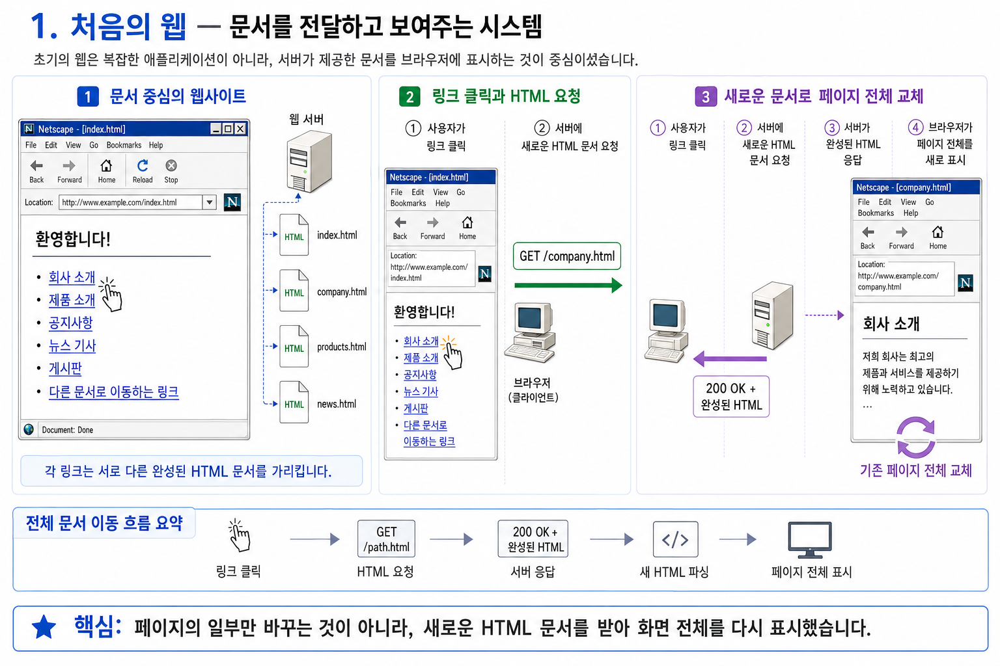
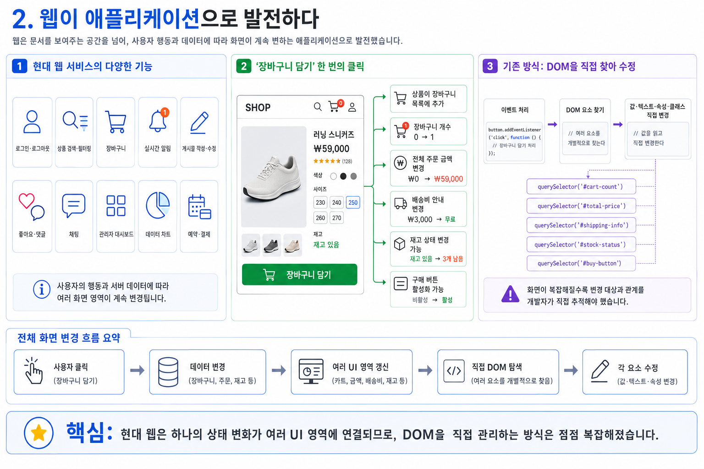
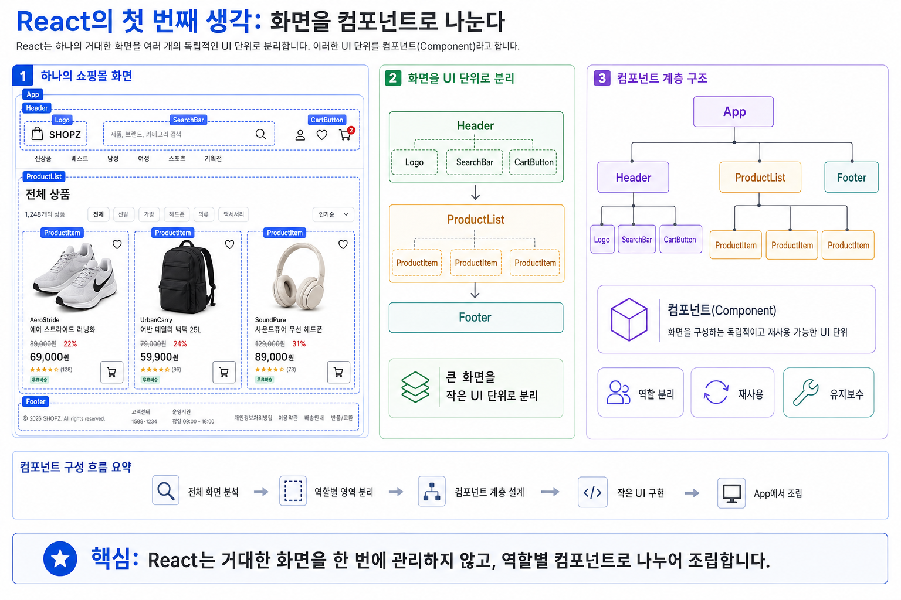
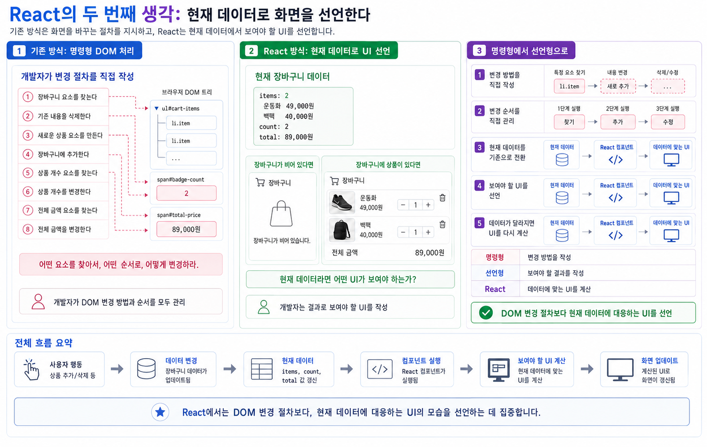

# React는 왜 등장했을까?
> facebook에서 만들었음.

React를 배우기 전에 먼저 이해해야 할 것은 문법이나 사용 방법이 아닙니다.

먼저 다음 질문에 답할 수 있어야 합니다.

> React는 어떤 문제를 해결하기 위해 등장했으며, 어떤 목적으로 사용하는가?

React는 단순히 HTML을 편하게 작성하기 위해 만들어진 도구가 아닙니다. 웹 애플리케이션의 규모가 커지면서 발생한 복잡한 사용자 인터페이스 관리 문제를 해결하기 위해 등장했습니다.

---


## 1. 처음의 웹

초기의 웹은 지금처럼 복잡한 애플리케이션이 아니었습니다.

주요 목적은 서버가 제공한 문서를 브라우저에 보여주는 것이었습니다.

대표적인 화면은 다음과 같았습니다.

* 회사 소개
* 제품 소개
* 공지사항
* 뉴스 기사
* 게시판
* 다른 문서로 이동하는 링크




화면의 변화가 많지 않았기 때문에 HTML과 CSS를 사용하여 문서의 구조와 디자인을 만들고, 필요한 부분에만 JavaScript를 추가하면 충분했습니다.

```html
<button id="messageButton">메시지 변경</button>
<p id="message">안녕하세요.</p>
```

```javascript
const button = document.querySelector("#messageButton");
const message = document.querySelector("#message");

button.addEventListener("click", () => {
  message.textContent = "반갑습니다.";
});
```

이 정도의 간단한 화면에서는 JavaScript가 직접 DOM 요소를 찾아 변경해도 코드가 크게 복잡하지 않습니다.

---

## 2. 웹이 애플리케이션으로 발전하다

시간이 지나면서 웹은 단순히 문서를 보여주는 공간을 넘어 애플리케이션으로 발전했습니다.

현대의 웹 서비스에는 다음과 같은 기능이 포함됩니다.

* 로그인과 로그아웃
* 상품 검색과 필터링
* 장바구니
* 실시간 알림
* 게시물 작성과 수정
* 좋아요와 댓글
* 채팅
* 관리자 대시보드
* 데이터 차트
* 예약과 결제

이러한 화면에서는 사용자의 행동과 서버에서 받은 데이터에 따라 화면의 여러 부분이 계속 변경됩니다.


예를 들어 쇼핑몰에서 장바구니 버튼을 클릭하면 다음 부분들이 함께 변경될 수 있습니다.

* 선택한 상품이 장바구니 목록에 추가된다.
* 장바구니 상품 개수가 증가한다.
* 전체 주문 금액이 변경된다.
* 배송비 안내가 변경된다.
* 재고 상태가 변경될 수 있다.
* 구매 버튼의 활성화 상태가 변경될 수 있다.





기존 방식에서는 데이터가 변경될 때마다 개발자가 관련된 DOM 요소를 직접 찾아 수정해야 했습니다.

```javascript
cart.push(product);

cartCount.textContent = cart.length;
cartList.innerHTML = createCartList(cart);
totalPrice.textContent = calculateTotal(cart);
orderButton.disabled = cart.length === 0;
```

기능이 적을 때는 이런 방식도 충분히 사용할 수 있습니다. 그러나 화면의 규모가 커지고 상태가 많아지면 다음과 같은 문제가 발생합니다.

### 어떤 DOM을 변경해야 하는가?

하나의 데이터가 변경되었을 때 화면의 여러 부분이 영향을 받을 수 있습니다.

개발자는 변경된 데이터와 관련된 모든 DOM 요소를 직접 찾아야 합니다.

### 어떤 순서로 변경해야 하는가?

화면 요소 사이에 의존 관계가 있다면 변경 순서도 고려해야 합니다.

상품 목록을 먼저 변경해야 할지, 전체 금액을 먼저 계산해야 할지, 버튼 상태를 언제 변경해야 할지 개발자가 직접 관리해야 합니다.

### 데이터와 화면이 일치하는가?

데이터는 변경되었지만 관련 DOM 하나를 변경하지 않았다면 데이터와 화면이 서로 다른 상태가 됩니다.

```text
실제 장바구니 데이터: 상품 3개
화면의 장바구니 표시: 상품 2개
```

이것은 사용자 인터페이스에서 매우 위험한 오류입니다.

### 같은 UI를 어떻게 재사용하는가?

상품 카드, 사용자 프로필, 알림 메시지처럼 반복되는 UI를 여러 화면에서 일관되게 사용하기도 어려워집니다.

### 커진 화면을 어떻게 관리하는가?

수많은 DOM 선택과 이벤트 처리 코드가 하나의 파일에 모이면 코드의 책임과 변경 범위를 파악하기 어려워집니다.

중요한 점은 JavaScript로 이러한 애플리케이션을 만들 수 없다는 뜻이 아니라는 것입니다.

> 순수 JavaScript로도 복잡한 웹 애플리케이션을 만들 수 있지만, 규모가 커질수록 UI 상태를 직접 관리하는 코드의 복잡성이 빠르게 증가합니다.

---

## 3. React가 해결하려는 핵심 문제

React가 해결하려는 핵심 문제는 다음과 같이 정리할 수 있습니다.

> 변화가 많은 복잡한 사용자 인터페이스를 어떻게 예측 가능하고 체계적으로 관리할 것인가?

React는 이 문제를 해결하기 위해 두 가지 중요한 생각을 사용합니다.

1. 화면을 컴포넌트 단위로 나눈다.
2. 현재 데이터로부터 화면의 모습을 선언한다.

---

# React의 첫 번째 생각: 화면을 컴포넌트로 나눈다

React는 하나의 거대한 화면을 여러 개의 독립적인 UI 단위로 분리합니다.

이러한 UI 단위를 컴포넌트(Component)라고 합니다.

예를 들어 쇼핑몰 화면은 다음과 같이 나눌 수 있습니다.




각 컴포넌트는 화면에서 담당하는 역할을 가집니다.

| 컴포넌트          | 역할          |
| ------------- | ----------- |
| `Header`      | 화면 상단 영역    |
| `SearchBar`   | 상품 검색       |
| `CartButton`  | 장바구니 상태 표시  |
| `ProductList` | 여러 상품 표시    |
| `ProductItem` | 개별 상품 정보 표시 |
| `Footer`      | 화면 하단 정보    |

컴포넌트를 사용하면 복잡한 화면을 작은 단위로 나누어 생각할 수 있습니다.

또한 같은 컴포넌트를 서로 다른 데이터와 함께 반복해서 사용할 수 있습니다.

```jsx
<ProductItem product={product1} />
<ProductItem product={product2} />
<ProductItem product={product3} />
```

세 개의 상품을 표시하지만 상품 화면을 만드는 코드는 `ProductItem` 컴포넌트 하나로 관리할 수 있습니다.

컴포넌트 기반 설계의 목적은 단순히 파일을 여러 개로 나누는 것이 아닙니다.

> 화면을 책임과 역할에 따라 독립적이고 재사용 가능한 단위로 구성하는 것이 목적입니다.

---

# React의 두 번째 생각: 현재 데이터로 화면을 선언한다

기존의 명령형 DOM 처리에서는 개발자가 화면을 변경하는 절차를 직접 작성합니다.

```text
장바구니 요소를 찾는다.
→ 기존 내용을 삭제한다.
→ 새로운 상품 요소를 만든다.
→ 장바구니에 추가한다.
→ 상품 개수 요소를 찾는다.
→ 상품 개수를 변경한다.
→ 전체 금액 요소를 찾는다.
→ 전체 금액을 변경한다.
```

즉, 개발자가 브라우저에 다음과 같이 지시합니다.

> 어떤 요소를 찾아서 어떤 순서로 어떻게 변경하라.

React에서는 접근 방식이 달라집니다.

개발자는 현재 데이터에서 어떤 UI가 보여야 하는지를 작성합니다.




이를 개념적으로 다음과 같이 표현할 수 있습니다.

[
UI = f(state)
]

이 식의 의미는 다음과 같습니다.

* `state`: 현재 애플리케이션의 데이터 상태
* `f`: 컴포넌트가 UI를 계산하는 과정
* `UI`: 현재 상태에 대응하여 보여야 하는 화면

즉, 사용자 인터페이스는 현재 상태로부터 계산된 결과라고 볼 수 있습니다.

```text
현재 State
    ↓
컴포넌트 실행
    ↓
현재 State에 맞는 UI 계산
```

---

## State가 변경되면 어떻게 되는가?


사용자가 버튼을 클릭하거나 서버에서 새로운 데이터를 받으면 State가 변경될 수 있습니다.

```text
State 변경
    ↓
React가 다음 UI 계산
    ↓
이전 결과와 다음 결과 비교
    ↓
필요한 DOM 변경 적용
    ↓
브라우저가 화면 표시
```

개발자는 DOM의 여러 부분을 일일이 찾아 직접 수정하기보다 State를 변경하고, 현재 State에 어떤 UI가 보여야 하는지를 정의하는 데 집중합니다.

예를 들어 로그인 상태에 따라 화면을 다르게 보여준다고 가정하겠습니다.

```jsx
function Header() {
  if (isLoggedIn) {
    return <UserMenu />;
  }

  return <LoginButton />;
}
```

개발자는 로그인 버튼을 찾아 제거하고 사용자 메뉴를 생성하는 절차를 직접 작성하지 않습니다.

현재 로그인 상태에 따라 무엇을 보여줄지만 선언합니다.

```text
isLoggedIn이 false
→ LoginButton 표시

isLoggedIn이 true
→ UserMenu 표시
```

이러한 방식을 선언적 UI라고 합니다.

---

# React의 목적

React의 목적을 단순히 “화면을 만드는 것”이라고 설명하면 충분하지 않습니다.

React는 특히 상태 변화가 많고 사용자와의 상호작용이 복잡한 UI를 체계적으로 만들기 위해 사용합니다.

## 데이터와 화면을 일관되게 유지한다

현재 데이터로부터 UI를 계산하므로 데이터와 화면 사이의 관계를 명확하게 표현할 수 있습니다.

```text
같은 State
→ 같은 UI 결과
```

개발자가 DOM의 여러 부분을 개별적으로 관리할 때보다 데이터와 화면이 어긋날 가능성을 줄일 수 있습니다.

## 복잡한 화면을 컴포넌트로 관리한다

전체 화면을 역할별 컴포넌트로 분리하여 각 부분의 책임과 변경 범위를 명확하게 만들 수 있습니다.

## UI를 재사용할 수 있다

상품 카드, 버튼, 입력 폼, 모달, 알림과 같은 UI를 컴포넌트로 만들어 여러 화면에서 재사용할 수 있습니다.

## 상태 변화에 따른 갱신을 체계화한다

데이터가 변경되었을 때 어떤 DOM을 어떤 순서로 직접 수정할지 관리하는 대신, React가 다음 UI를 계산하고 필요한 변경을 적용하도록 합니다.

## 대규모 UI를 일관된 방식으로 개발한다

여러 개발자가 함께 작업하는 프로젝트에서도 컴포넌트와 데이터 흐름을 기준으로 화면을 나누고 관리할 수 있습니다.


---

# React는 어디에 사용되는가?

React는 화면 변화와 사용자 상호작용이 많은 웹 애플리케이션에 적합합니다.

대표적인 사용 분야는 다음과 같습니다.

* 쇼핑몰
* 관리자 화면
* 데이터 대시보드
* SNS
* 예약 시스템
* 게시판
* 채팅 서비스
* 협업 도구
* 온라인 교육 서비스
* 다양한 웹 기반 업무 시스템

하지만 모든 웹사이트에 반드시 React가 필요한 것은 아닙니다.

내용이 거의 변경되지 않는 단순한 소개 페이지나 정적인 문서 사이트라면 HTML, CSS, JavaScript만으로도 충분할 수 있습니다.

React는 다음 조건에서 특히 유용합니다.

* 화면의 상태가 자주 변경된다.
* 사용자와의 상호작용이 많다.
* 동일한 UI를 여러 곳에서 재사용한다.
* 화면이 여러 기능과 영역으로 구성된다.
* 데이터에 따라 화면 구조가 달라진다.
* 프로젝트 규모가 크거나 여러 개발자가 함께 작업한다.


---

# React가 담당하는 범위

React의 핵심 책임은 다음과 같습니다.

> 사용자 인터페이스를 컴포넌트로 구성하고, 데이터 변화에 맞춰 UI를 갱신하는 것

React는 웹 애플리케이션에 필요한 모든 기능을 자체적으로 제공하지는 않습니다.

| 필요한 기능        | 사용할 수 있는 도구의 예                      |
| ------------- | ----------------------------------- |
| 프로젝트 개발 환경    | Vite                                |
| 화면 이동과 URL 관리 | React Router                        |
| 서버 API 통신     | Fetch API, Axios, RTK Query           |
| 서버 데이터 관리     | TanStack Query                      |
| 전역 상태 관리      | Context API, Redux Toolkit, Zustand |
| 스타일 작성        | CSS, CSS Modules, Tailwind CSS      |
| 테스트           | Vitest, React Testing Library       |

따라서 React를 완전한 웹 애플리케이션 프레임워크라고 부르기보다는 JavaScript UI 라이브러리라고 설명하는 것이 정확합니다.

React는 사용자 인터페이스에 집중하고, 나머지 기능은 프로젝트의 필요에 따라 다른 도구와 조합합니다.


---

# React를 오해하면 안 되는 부분

## React가 없으면 복잡한 웹을 만들 수 없는 것은 아니다

순수 JavaScript만으로도 복잡한 웹 애플리케이션을 만들 수 있습니다.

React의 가치는 불가능한 일을 가능하게 만드는 데 있는 것이 아니라, 복잡한 UI를 더 체계적이고 예측 가능한 구조로 관리하게 해주는 데 있습니다.

## React가 DOM을 없애는 것은 아니다

React로 만든 웹 애플리케이션도 최종적으로는 브라우저의 실제 DOM을 사용합니다.

React는 개발자가 실제 DOM을 일일이 직접 관리해야 하는 부담을 줄여줍니다.

## State가 변경될 때마다 반드시 DOM이 변경되는 것은 아니다

State가 변경되면 React는 컴포넌트를 다시 실행하여 다음 UI를 계산합니다.

그러나 계산 결과가 이전과 같다면 실제 DOM에 적용할 변경이 없을 수도 있습니다.

```text
State 변경
→ 다음 UI 계산
→ 이전 결과와 비교
→ 필요한 경우에만 DOM 변경 적용
```

## React가 웹 애플리케이션 전체를 책임지는 것은 아니다

React의 중심 관심사는 UI입니다.

라우팅, 서버 통신, 인증, 데이터 저장, 전역 상태 관리 등은 별도의 기술과 함께 구성합니다.

---

# 핵심 정리


React가 등장한 배경은 웹이 단순한 문서에서 복잡한 애플리케이션으로 발전한 것과 관련이 있습니다.

사용자와의 상호작용과 데이터 변화가 많아지면서 개발자가 DOM을 직접 찾아 수정하는 방식은 점점 관리하기 어려워졌습니다.

React는 이러한 문제를 해결하기 위해 다음과 같은 접근 방식을 사용합니다.

1. 복잡한 화면을 독립적인 컴포넌트로 나눈다.
2. 컴포넌트를 조합하여 전체 화면을 구성한다.
3. 현재 State로부터 보여야 할 UI를 선언한다.
4. State가 변경되면 다음 UI를 다시 계산한다.
5. 비교 결과에 따라 필요한 DOM 변경을 적용한다.

React를 한 문장으로 정리하면 다음과 같습니다.

> React는 복잡하고 변화가 많은 사용자 인터페이스를 컴포넌트 단위로 구성하고, 현재 데이터에 맞는 화면을 선언적으로 표현하기 위한 JavaScript UI 라이브러리입니다.
