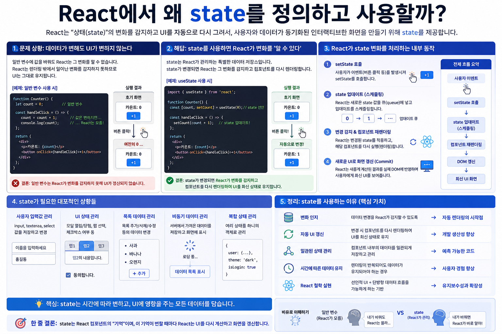

# React `useState`




## state는 어디에 저장되고, `setState`는 어떻게 다시 렌더링을 만드는가?

React의 `useState`는 함수 컴포넌트에 **상태(State)를 연결하는 가장 기본적인 Hook**입니다.

```jsx
const [count, setCount] = useState(0);
```

코드 자체는 단순합니다.

하지만 이 한 줄을 제대로 이해하려면 다음 개념들이 서로 어떻게 연결되는지 알아야 합니다.

```text
State
  ↓
useState
  ↓
Render Snapshot
  ↓
setState
  ↓
Update Queue
  ↓
Re-render
  ↓
Fiber
  ↓
Hook
  ↓
새로운 UI
```

특히 가장 중요한 질문은 이것입니다.

> 함수 컴포넌트는 렌더링할 때마다 다시 실행되는데,
> React는 어떻게 이전의 `state`를 기억할 수 있을까?

이 질문에 답할 수 있다면 `useState`의 핵심을 이해한 것입니다.

---

# 1. State란 무엇인가?

React 컴포넌트가 사용하는 데이터는 크게 다음처럼 생각할 수 있습니다.

| 구분      | 의미                  | 렌더링 사이에 유지 |
| ------- | ------------------- | ---------: |
| `props` | 부모로부터 전달받은 데이터      |          O |
| `state` | 컴포넌트가 소유하고 관리하는 데이터 |          O |
| 지역 변수   | 함수 실행 중 사용하는 일반 변수  |          X |

`props`는 부모 컴포넌트가 전달합니다.

```jsx
<User name="Tom" />
```

자식 컴포넌트 입장에서 `props`는 읽기 전용입니다.

반면 `state`는 컴포넌트가 자신의 UI를 표현하기 위해 관리하는 데이터입니다.

```jsx
const [count, setCount] = useState(0);
```

컴포넌트는 `setCount`를 통해 새로운 상태로의 업데이트를 React에 요청할 수 있습니다.

---

# 2. 왜 일반 변수로는 안 되는가?

다음 코드를 생각해 봅시다.

```jsx
function Counter() {
  let count = 0;

  const handleClick = () => {
    count++;
  };

  return (
    <button onClick={handleClick}>
      {count}
    </button>
  );
}
```

일반 JavaScript 관점에서는 `count++`로 값이 변경됩니다.

하지만 React의 UI 상태로 사용하기에는 두 가지 문제가 있습니다.

## 문제 1. React에게 UI가 변경되어야 한다고 알려주지 않는다

```jsx
count++;
```

는 단순한 JavaScript 변수 변경입니다.

React는 이것을 상태 업데이트로 취급하지 않습니다.

따라서 이것만으로 새로운 렌더링이 예약되지 않습니다.

## 문제 2. 컴포넌트가 다시 실행되면 지역 변수도 다시 만들어진다

함수 컴포넌트는 렌더링할 때 다시 호출됩니다.

```text
Counter()
   ↓
let count = 0
```

다시 렌더링하면:

```text
Counter()
   ↓
let count = 0
```

지역 변수는 이전 렌더의 값을 기억하기 위한 저장 공간이 아닙니다.

그래서 React에는 다음 두 가지 기능이 필요합니다.

```text
1. 렌더링 사이에 값을 기억한다.
2. 값이 변경되면 새로운 렌더링을 요청한다.
```

이 역할을 `useState`가 제공합니다.

---

# 3. `useState` 기본 사용법

가장 기본적인 형태입니다.

```jsx
import { useState } from 'react';

function Counter() {
  const [count, setCount] = useState(0);

  const handleClick = () => {
    setCount(count + 1);
  };

  return (
    <button onClick={handleClick}>
      You clicked {count} times
    </button>
  );
}
```

`useState`는 두 값을 가진 배열을 반환합니다.

```jsx
const [count, setCount] = useState(0);
```

개념적으로:

```text
useState(0)
     │
     ▼
[count, setCount]
   │       │
   │       └── 상태 업데이트를 요청하는 함수
   │
   └────────── 현재 렌더에서 사용할 상태
```

첫 번째 값은 현재 상태입니다.

```jsx
count
```

두 번째 값은 상태 업데이트 함수입니다.

```jsx
setCount
```

그리고 `0`은 초기 상태입니다.

```jsx
useState(0);
         ↑
     initial state
```

---

# 4. `useState` 함수는 개념적으로 어떻게 생겼을까?

우리가 사용하는 `useState`는 함수입니다.

```jsx
const [count, setCount] = useState(0);
```

JavaScript 함수의 관점에서 보면:

```text
입력
 ↓
useState(initialState)
 ↓
출력
[state, setState]
```

형태라고 볼 수 있습니다.

즉 개념적인 함수 시그니처는 다음과 같습니다.

```js
function useState(initialState) {
  // ...

  return [state, setState];
}
```

여기서 중요한 것은 `useState`가 두 가지를 반환한다는 것입니다.

```text
useState(initialState)
        │
        ▼
┌─────────────────────────────┐
│ [ state, setState ]         │
│      │       │              │
│      │       └─ 업데이트 함수 │
│      │                      │
│      └─ 현재 렌더의 상태 값   │
└─────────────────────────────┘
```

하지만 여기서 주의해야 합니다.

> 아래에서 작성하는 코드는 **React의 실제 `useState` 구현 코드가 아닙니다.**
>
> `useState`의 입력과 출력, 초기화 함수, updater 함수의 역할을 이해하기 위한 **개념적 수도 코드(Pseudocode)**입니다.
>
> 실제 React에서는 상태가 `useState` 함수의 지역 변수에 저장되어 유지되는 것이 아니라 **Fiber에 연결된 Hook 객체와 Update Queue를 통해 관리됩니다.**

---

## 4-1. useState 의사 코드

먼저 내부 구조를 모두 제외하고 API의 형태만 표현하면 다음과 같이 생각할 수 있습니다.

```js
function useState(initialState) {

  const state = getCurrentState(initialState);

  function setState(nextState) {
    requestStateUpdate(nextState);
  }

  return [state, setState];
}
```

개념적으로는:

```text
useState(0)
    │
    ├── 현재 상태를 가져온다
    │
    ├── 상태 업데이트 함수를 만든다
    │
    └── [state, setState] 반환
```

입니다.

즉:

```jsx
const [count, setCount] = useState(0);
```

를 다음처럼 생각할 수 있습니다.

```js
const result = useState(0);

const count = result[0];
const setCount = result[1];
```

배열 구조 분해 할당을 사용했기 때문에 우리가 평소에 보는 형태가 된 것입니다.

```jsx
const [count, setCount] = useState(0);
```


# 4-2. `initialState`는 값 또는 함수가 될 수 있다

`useState`의 첫 번째 아규먼트는 일반적인 값이 될 수 있습니다.

```jsx
useState(0);
useState('');
useState(false);
useState([]);
useState({});
```

하지만 함수도 전달할 수 있습니다.

```jsx
useState(() => expensiveComputation());
```

따라서 수도 코드에 이를 반영하면 다음처럼 표현할 수 있습니다.

```js
function useState(initialState) {

  let state;

  if (isFirstRender()) {
    state =
      typeof initialState === 'function'
        ? initialState()
        : initialState;
  } else {
    state = getStoredState();
  }

  // ...

  return [state, setState];
}
```

핵심은 다음입니다.

```text
최초 렌더
   │
   ▼
initialState 확인
   │
   ├── 일반 값
   │      ↓
   │    그대로 초기 상태로 사용
   │
   └── 함수
          ↓
       함수 호출
          ↓
       반환값을 초기 상태로 사용
```

하지만 리렌더링에서는:

```text
Re-render
   │
   ▼
useState(initialState)
   │
   ▼
initialState로 다시 초기화 X
   │
   ▼
React에 저장되어 있던 기존 state 사용
```

합니다.

이것이 다음 코드가 매 렌더마다 `0`으로 돌아가지 않는 이유입니다.

```jsx
const [count, setCount] = useState(0);
```

`0`은 매번 새로운 state로 사용하는 값이 아니라 **초기 상태를 만들 때 사용하는 값**입니다.


# 4-3. `setState`도 값 또는 함수를 받을 수 있다

`setState` 역시 두 가지 형태의 아규먼트를 받을 수 있습니다.

## 값을 직접 전달

```jsx
setCount(10);
```

개념적으로:

```text
setCount(10)
     │
     ▼
다음 state를 10으로 만드는
업데이트 요청
```

입니다.

## updater 함수 전달

```jsx
setCount(prev => prev + 1);
```

이번에는 새로운 state 값 자체가 아니라 **계산 방법**을 전달합니다.

```text
setCount(prev => prev + 1)
          │
          ▼
"이전 state를 받아
 1 증가시켜라"
라는 updater 등록
```

따라서 조금 더 확장한 수도 코드는 다음처럼 생각할 수 있습니다.

```js
function useState(initialState) {

  const state = getCurrentState(initialState);

  function setState(action) {

    if (typeof action === 'function') {
      enqueueUpdate({
        type: 'updater',
        action
      });
    } else {
      enqueueUpdate({
        type: 'value',
        value: action
      });
    }

    scheduleRender();
  }

  return [state, setState];
}
```

이 코드는 이전보다 실제 React의 개념에 조금 더 가깝습니다.

특히 중요한 부분은 이것입니다.

```js
enqueueUpdate(...)
```

`setState`가 현재 `state` 변수를 즉시 변경하는 것이 아니라 **업데이트를 Queue에 등록한다**는 것입니다.


# 4-4. 잘못 이해하기 쉬운 의사 코드

다음처럼 구현했다고 생각하면 안 됩니다.

```js
function useState(initialState) {

  let state = initialState;

  function setState(nextState) {
    state = nextState;
  }

  return [state, setState];
}
```

왜냐하면 이렇게 구현하면 `state`는 단순히 `useState` 함수 내부의 지역 변수이기 때문입니다.

함수 호출이 끝나면 React가 다음 렌더에서 동일한 상태를 찾아 사용할 방법을 설명할 수 없습니다.

또한 다음 코드의 실제 동작도 설명할 수 없습니다.

```jsx
function Counter() {
  const [count, setCount] = useState(0);

  // 컴포넌트 함수는 다시 실행된다.
}
```

실제 핵심은:

```text
Component Function
        │
        │ useState()
        ▼
React Hook System
        │
        ▼
Fiber
        │
        ▼
Hook
   ├── memoizedState
   └── update queue
```

입니다.

즉:

> `state`가 `useState` 함수의 지역 변수에 저장되는 것이 아니라, `useState` 호출이 현재 렌더링 중인 Fiber의 Hook 구조와 연결되어 있기 때문에 렌더링 사이에서도 상태가 유지됩니다.


# 4-5. Fiber까지 포함한 개념적 의사 코드

이제 조금 더 깊이 들어가 보겠습니다.

실제 React 소스 코드를 그대로 재현하는 것은 아니지만, 내부 구조를 이해하기 위한 수도 코드는 다음처럼 표현할 수 있습니다.

```js
function useState(initialState) {

  const hook = getCurrentHook();

  // 최초 마운트
  if (hook.isMount) {

    const initialValue =
      typeof initialState === 'function'
        ? initialState()
        : initialState;

    hook.memoizedState = initialValue;
    hook.queue = createUpdateQueue();
  }

  // 이전에 예약된 state update 처리
  const newState =
    processUpdateQueue(
      hook.memoizedState,
      hook.queue
    );

  hook.memoizedState = newState;

  function setState(action) {

    const update = {
      action
    };

    enqueueUpdate(
      hook.queue,
      update
    );

    scheduleRender();
  }

  return [
    hook.memoizedState,
    setState
  ];
}
```

이 수도 코드는 실제 React 구현을 그대로 복사한 것이 아니라 다음 핵심 원리를 설명하기 위한 것입니다.

```text
useState()
   │
   ▼
현재 Hook 찾기
   │
   ├── Mount?
   │      │
   │      └── initialState로 초기화
   │
   ▼
Update Queue 처리
   │
   ▼
새 state 계산
   │
   ▼
Hook.memoizedState 갱신
   │
   ▼
[state, setState] 반환
```


# 4-6. `setState`의 역할을 다시 보면

이제 다음 코드를:

```jsx
setCount(count + 1);
```

단순히:

```text
count = count + 1
```

로 생각하면 안 된다는 것을 알 수 있습니다.

개념적으로는:

```text
setCount(count + 1)
       │
       ▼
Update 객체 생성
       │
       ▼
Hook의 Update Queue에 등록
       │
       ▼
React Rendering 예약
       │
       ▼
다음 Render
       │
       ▼
Update Queue 처리
       │
       ▼
새로운 state 계산
       │
       ▼
새 count를 컴포넌트에 제공
```

입니다.

따라서:

```jsx
const [count, setCount] = useState(0);
```

의 `count`와 실제 state 저장 위치를 구분해야 합니다.

```text
React 내부

Fiber
  │
  ▼
Hook
  │
  ├── memoizedState = 0
  └── Update Queue
            │
            ▼
       state 업데이트들


Render #1

const count = 0
      ↑
Hook에서 가져온
이번 렌더의 Snapshot
```

상태 업데이트 후에는:

```text
Fiber / Hook
     │
     ▼
Update 처리
     │
     ▼
memoizedState = 1
     │
     ▼
Render #2
     │
     ▼
const count = 1
```

이 됩니다.


### 정리

`useState`를 의사 코드로 이해할 때 가장 중요한 것은 다음 세 단계입니다.

```text
              useState(initialState)
                       │
                       ▼
               현재 Hook 확인
                       │
                       ▼
               현재 state 얻기
                       │
                       ▼
              [state, setState]
```

그리고 `setState`를 호출하면:

```text
setState(action)
       │
       ▼
Update 생성
       │
       ▼
Update Queue 등록
       │
       ▼
Rendering 예약
       │
       ▼
다음 Render에서
Queue 처리
       │
       ▼
새로운 State
```

가 됩니다.

따라서 `useState`를 가장 압축된 수도 코드로 표현하면 다음과 같이 볼 수 있습니다.

```js
function useState(initialState) {

  const hook = getCurrentHook();

  initializeIfNeeded(hook, initialState);

  hook.memoizedState =
    processUpdateQueue(
      hook.memoizedState,
      hook.queue
    );

  function setState(action) {
    enqueueUpdate(hook.queue, action);
    scheduleRender();
  }

  return [
    hook.memoizedState,
    setState
  ];
}
```

> 이 코드는 React의 실제 소스 코드가 아니라 **`useState → Hook → memoizedState → Update Queue → Re-render`의 관계를 이해하기 위한 수도 코드**입니다.

이 의사 코드를 중심으로 보면 `useState`의 본질은 훨씬 명확해집니다.

```text
useState
   │
   ├── state를 함수 안에 보관하는 것이 아니다
   │
   ├── 현재 Fiber의 Hook을 찾는다
   │
   ├── Hook에 연결된 state를 읽는다
   │
   ├── Update Queue를 처리한다
   │
   └── setState를 통해 다음 업데이트를 Queue에 등록한다
```


---

# 5. State는 Render의 Snapshot이다

React에서 state를 이해하는 가장 중요한 개념 중 하나가 **Render Snapshot**입니다.

첫 번째 렌더를 생각해 봅시다.

```text
Render #1

count = 0
```

이 렌더에서 만들어진 이벤트 핸들러 역시 `count = 0`을 보고 있습니다.

```jsx
const handleClick = () => {
  setCount(count + 1);
  console.log(count);
};
```

즉 이 함수가 보는 `count`는 Render #1의 값입니다.

버튼을 클릭합니다.

```text
Render #1

count = 0
   │
   │ click
   ▼
setCount(1)
   │
   ▼
React에 state update 요청
```

그러나 현재 함수 안의:

```jsx
count
```

가 `1`로 변경되는 것은 아닙니다.

`count`는 이미 이번 렌더에서 만들어진 지역 변수입니다.

이후 React가 새로운 렌더링을 수행합니다.

```text
Render #2

count = 1
```

새로운 컴포넌트 함수 실행에서 새로운 `count`가 만들어지는 것입니다.

따라서 전체 흐름은:

```text
Render #1
count = 0
    │
    ▼
setCount(1)
    │
    ▼
State Update 요청
    │
    ▼
React schedules rendering
    │
    ▼
Render #2
count = 1
    │
    ▼
UI = 1
```

입니다.

---

# 6. `await`하면 새로운 state를 읽을 수 있을까?

아닙니다.

예를 들어:

```jsx
const handleClick = async () => {
  setCount(count + 1);

  await Promise.resolve();

  console.log(count);
};
```

기다렸다고 해서 이 함수가 가지고 있던 `count`가 변경되는 것은 아닙니다.

이 함수는 여전히 자신이 만들어졌던 렌더의 `count`를 보고 있습니다.

```text
Render #1

count = 0
   │
   └── handleClick closure
          │
          └── count = 0
```

시간이 지나도 해당 클로저가 캡처한 값 자체가 자동으로 새로운 렌더의 지역 변수로 교체되는 것은 아닙니다.

이 개념이 뒤에서 살펴볼 **stale closure**와 연결됩니다.

---

# 7. 여러 번 `setState`하면 어떻게 되는가?

다음 코드는 `count`를 몇 증가시킬까요?

```jsx
setCount(count + 1);
setCount(count + 1);
setCount(count + 1);
```

처음 `count`가 `0`이었다면 최종 결과는:

```text
1
```

입니다.

왜 그럴까요?

현재 렌더에서 `count`는 계속 `0`이기 때문입니다.

따라서 JavaScript 관점에서 세 코드는 모두:

```jsx
setCount(1);
setCount(1);
setCount(1);
```

과 같습니다.

여기서 중요한 것은 React가 state update를 단순히 그 자리에서 지역 변수에 대입하는 것이 아니라는 점입니다.

업데이트는 React가 관리하는 **Update Queue**를 통해 처리됩니다.

개념적으로:

```text
Current Render

count = 0

      │
      ├── setCount(1)
      ├── setCount(1)
      └── setCount(1)
              │
              ▼
        Update Queue
        ┌──────────────┐
        │ set → 1      │
        │ set → 1      │
        │ set → 1      │
        └──────────────┘
              │
              ▼
        Next State = 1
```

따라서 단순히

> 앞의 업데이트를 덮어쓴다

라고 이해하기보다는,

> 동일한 렌더의 state snapshot을 이용해 만들어진 여러 업데이트가 queue에 들어가고 React가 이를 처리한다.

라고 이해하는 것이 더 정확합니다.

---

# 8. 함수형 업데이트

이전 상태를 기준으로 새로운 상태를 계산해야 한다면 **함수형 업데이트(Functional Update)**를 사용합니다.

```jsx
setCount(prev => prev + 1);
```

다음처럼 세 번 호출하면:

```jsx
setCount(prev => prev + 1);
setCount(prev => prev + 1);
setCount(prev => prev + 1);
```

React는 updater 함수들을 queue에 넣습니다.

```text
Update Queue

┌───────────────────┐
│ prev => prev + 1  │
├───────────────────┤
│ prev => prev + 1  │
├───────────────────┤
│ prev => prev + 1  │
└───────────────────┘
```

그리고 이전 updater의 결과를 다음 updater에 전달합니다.

```text
initial state
     0
     │
     ▼
prev => prev + 1
     │
     1
     ▼
prev => prev + 1
     │
     2
     ▼
prev => prev + 1
     │
     3
     ▼
Next State = 3
```

따라서:

```jsx
setCount(prev => prev + 1);
```

는 단순히 값을 전달하는 것이 아니라,

> **이전 상태를 받아 다음 상태를 계산하는 방법을 React에게 전달하는 것**

이라고 이해하면 좋습니다.

---

# 9. Automatic Batching

React는 여러 state update를 가능한 경우 하나의 렌더링으로 묶습니다.

이것을 **Batching**이라고 합니다.

```jsx
function handleClick() {
  setCount(c => c + 1);
  setFlag(f => !f);
}
```

React는 각각의 `setState`마다 화면을 다시 만드는 대신 여러 업데이트를 처리하고 렌더링 횟수를 줄일 수 있습니다.

```text
setCount(...)
      │
setFlag(...)
      │
      ▼
Batch Updates
      │
      ▼
Render
```

React 18에서는 `createRoot`를 사용하는 현대적인 React 애플리케이션에서 자동 배칭의 범위가 확대되었습니다.

예를 들어 Promise나 timer 등의 비동기 콜백에서 발생한 업데이트도 자동으로 batching될 수 있습니다.

```jsx
setTimeout(() => {
  setCount(c => c + 1);
  setFlag(f => !f);
}, 1000);
```

따라서 `setState`를:

> 호출 즉시 DOM을 변경하는 명령

으로 이해하면 안 됩니다.

React는 업데이트를 수집하고 스케줄링한 뒤 필요한 렌더링과 커밋을 수행합니다.

---

# 10. 그런데 React는 state를 어디에 기억하는가?

여기까지 이해하면 자연스럽게 다음 질문이 생깁니다.

```text
Counter() 함수는
렌더링할 때마다 다시 실행된다.

그런데...

count는 어떻게 이전 값을 기억하는가?
```

예를 들어:

```jsx
function Counter() {
  const [count, setCount] = useState(0);

  return <button>{count}</button>;
}
```

컴포넌트 함수가 다시 실행된다면 일반적으로 함수 내부의 값은 사라져야 합니다.

그런데 `count`는 유지됩니다.

그 이유는:

> state가 컴포넌트 함수의 지역 변수 안에 영구적으로 저장되는 것이 아니기 때문입니다.

React가 관리하는 **Fiber와 Hook 데이터 구조**에 연결되어 유지됩니다.

---

# 11. Fiber와 Hook

React는 렌더링 작업을 관리하기 위해 Fiber 구조를 사용합니다.

함수 컴포넌트에 대응하는 Fiber가 있고, 그 Fiber에는 해당 컴포넌트에서 사용하는 Hook 정보가 연결됩니다.

예를 들어:

```jsx
function MyComponent() {
  const [name, setName] = useState('');
  const [age, setAge] = useState(0);

  useEffect(() => {
    // ...
  }, []);
}
```

개념적으로:

```text
MyComponent Fiber
        │
        │ memoizedState
        ▼
┌──────────────────┐
│ Hook #1          │
│ useState(name)   │
└────────┬─────────┘
         │ next
         ▼
┌──────────────────┐
│ Hook #2          │
│ useState(age)    │
└────────┬─────────┘
         │ next
         ▼
┌──────────────────┐
│ Hook #3          │
│ useEffect        │
└──────────────────┘
```

여기서 Hook들은 개념적으로 **linked list** 형태로 연결됩니다.

---

# 12. `Fiber.memoizedState`와 `Hook.memoizedState`

여기서는 같은 이름 때문에 특히 주의해야 합니다.

Fiber에도:

```text
memoizedState
```

가 있고 Hook 객체에도:

```text
memoizedState
```

가 있습니다.

역할은 다릅니다.

개념적으로:

```text
Function Component Fiber
        │
        │ memoizedState
        ▼
      Hook #1
        │
        ├── memoizedState
        ├── baseState
        ├── queue
        │
        └── next
             │
             ▼
           Hook #2
```

함수 컴포넌트 Fiber의:

```text
Fiber.memoizedState
```

는 Hook linked list의 시작점을 가리킵니다.

반면 `useState`에 대응하는 Hook 객체의:

```text
Hook.memoizedState
```

에는 해당 Hook이 사용하는 현재 state가 저장됩니다.

따라서 단순화하면:

```text
Fiber
 │
 └── Hook #1
      │
      ├── memoizedState = 10
      ├── queue
      └── next
           │
           ▼
         Hook #2
           │
           ├── memoizedState = "Tom"
           └── ...
```

라고 이해할 수 있습니다.

---

# 13. 왜 Hook을 조건문 안에서 호출하면 안 되는가?

다음 코드를 보겠습니다.

```jsx
function MyComponent({ loggedIn }) {
  const [name, setName] = useState('');

  if (loggedIn) {
    const [token, setToken] = useState('');
  }

  const [age, setAge] = useState(0);
}
```

Hook은 렌더링 과정에서 일정한 호출 순서를 유지해야 합니다.

첫 번째 렌더:

```text
Hook #1 → name
Hook #2 → token
Hook #3 → age
```

다음 렌더에서 `loggedIn === false`라면:

```text
Hook #1 → name
Hook #2 → age
```

호출 순서가 달라집니다.

React가 이전 렌더의 Hook 구조와 현재 렌더의 Hook 호출을 일관되게 대응시킬 수 없게 됩니다.

그래서 Hook은 컴포넌트 최상위에서 일관된 순서로 호출해야 합니다.

---

# 14. 전체 `useState` 내부 흐름

이제 지금까지의 내용을 하나로 연결할 수 있습니다.

```text
사용자 Click
     │
     ▼
Event Handler
     │
     ▼
setCount(...)
     │
     ▼
State Update 생성
     │
     ▼
Hook의 Update Queue
     │
     ▼
React가 Rendering 예약
     │
     ▼
Render Phase
     │
     ├── Counter() 다시 실행
     │
     ├── useState() 다시 호출
     │
     └── Hook 상태 계산
     │
     ▼
새 React 결과 계산
     │
     ▼
Commit Phase
     │
     ▼
필요한 DOM 변경
     │
     ▼
Browser Paint
```

즉:

> `setState`가 직접 DOM을 변경하는 것이 아닙니다.

`setState`는 상태 업데이트를 React에 전달하고, React가 새로운 렌더링 결과를 계산한 뒤 필요한 DOM 변경을 Commit Phase에서 적용합니다.

---

# 15. Lazy Initialization

초기 상태를 계산하는 비용이 크다면 lazy initialization을 사용할 수 있습니다.

다음 코드를 보겠습니다.

```jsx
const [value] = useState(expensiveComputation());
```

JavaScript는 `useState`를 호출하기 전에 아규먼트를 먼저 평가해야 합니다.

따라서:

```jsx
expensiveComputation()
```

은 컴포넌트 함수가 실행될 때마다 실행됩니다.

React가 이후 렌더에서 그 결과를 초기값으로 사용하지 않더라도 계산 자체는 이미 수행되었습니다.

따라서:

```jsx
const [value] = useState(() => expensiveComputation());
```

처럼 초기화 함수를 전달할 수 있습니다.

개념적으로:

```text
Mount

useState(() => expensive())
            │
            ▼
       expensive()
            │
            ▼
      Initial State


Re-render

useState(() => expensive())
            │
            ▼
React already has state
            │
            ▼
initializer 호출하지 않음
```

정상적인 production 실행에서는 초기화 함수가 초기 마운트 과정에서 사용됩니다.

개발 모드의 Strict Mode에서는 순수성 검사를 위해 initializer가 추가로 호출될 수 있으므로 초기화 함수에는 Side Effect를 넣으면 안 됩니다.

---

# 16. 함수를 state로 저장하고 싶다면?

주의해야 할 경우가 있습니다.

```jsx
useState(fn);
```

React는 함수 아규먼트를 initializer로 해석합니다.

따라서 함수 자체를 state로 저장하려면:

```jsx
useState(() => fn);
```

처럼 한 번 감싸야 합니다.

업데이트할 때도 마찬가지입니다.

함수를 값으로 저장하려면:

```jsx
setState(() => fn);
```

처럼 처리해야 합니다.

---

# 17. 객체와 배열 State

`useState`는 클래스 컴포넌트의 `this.setState`와 다르게 객체를 자동으로 merge하지 않습니다.

예를 들어:

```jsx
const [user, setUser] = useState({
  name: 'Tom',
  age: 20
});
```

다음 업데이트는:

```jsx
setUser({
  name: 'Jerry'
});
```

기존 객체에 `name`만 합치는 것이 아닙니다.

새로운 state 자체가:

```js
{
  name: 'Jerry'
}
```

가 됩니다.

따라서 기존 값을 유지해야 한다면:

```jsx
setUser(prev => ({
  ...prev,
  name: 'Jerry'
}));
```

처럼 새로운 객체를 만들어야 합니다.

---

# 18. 왜 불변성을 유지해야 하는가?

다음 코드는 피해야 합니다.

```jsx
todos.push(newTodo);

setTodos(todos);
```

`push()`는 기존 배열을 직접 변경합니다.

그러나 배열의 참조 자체는 그대로입니다.

```text
Before

todos ──────► Array A


push()

todos ──────► Array A
                 │
                 └── 내부 내용만 변경
```

React state 업데이트에서는 이전 상태와 다음 상태의 identity 비교가 중요합니다.

동일한 객체 참조를 다시 전달하면:

```jsx
Object.is(previousTodos, nextTodos);
```

가 `true`가 됩니다.

따라서 React가 동일한 state로 판단하고 업데이트를 bailout할 수 있습니다.

올바른 방식은:

```jsx
setTodos(prev => [
  ...prev,
  newTodo
]);
```

입니다.

이 경우:

```text
Previous State

todos ──────► Array A


Next State

newTodos ───► Array B
```

새로운 참조가 만들어집니다.

---

# 19. State를 직접 mutate하지 않는다

객체 역시 마찬가지입니다.

잘못된 예:

```jsx
user.name = 'Jerry';

setUser(user);
```

올바른 예:

```jsx
setUser(prev => ({
  ...prev,
  name: 'Jerry'
}));
```

배열도:

```jsx
setTodos(prev => [...prev, newTodo]);

setTodos(prev =>
  prev.filter(todo => todo.id !== id)
);
```

처럼 새로운 배열을 만들어야 합니다.

핵심 원칙은:

> React state를 직접 mutate하지 말고 새로운 값을 만들어 state update로 전달한다.

입니다.

---

# 20. Props를 State로 복사하지 않는다

다음 패턴은 주의해야 합니다.

```jsx
function Profile({ user }) {
  const [name, setName] = useState(user.name);

  return <h1>{name}</h1>;
}
```

`useState(user.name)`의 초기값은 초기 state를 만드는 데 사용됩니다.

이후 부모가 새로운 `user`를 전달한다고 해서 `name` state가 자동으로 동기화되는 것은 아닙니다.

계산할 수 있는 값이라면 state를 만들 필요가 없습니다.

```jsx
function Profile({ user }) {
  const displayName =
    user.name.trim() || '이름 없음';

  return <h1>{displayName}</h1>;
}
```

중요한 원칙은:

> **하나의 사실(Source of Truth)은 가능한 한 한 곳에서 관리한다.**

입니다.

---

# 21. `key`로 State를 초기화할 수 있다

사용자가 변경되었을 때 Form의 모든 state를 초기화하고 싶다고 생각해 봅시다.

```jsx
<ProfileForm
  key={userId}
  userId={userId}
/>
```

`key`가 변경되면 React는 기존 컴포넌트 인스턴스의 identity와 다른 것으로 판단합니다.

개념적으로:

```text
key = 1

ProfileForm Fiber
      │
      ├── state #1
      └── state #2


userId 변경


key = 2

NEW ProfileForm Fiber
      │
      ├── new state #1
      └── new state #2
```

따라서 내부 state도 초기값부터 다시 시작합니다.

`key`는 리스트의 항목 식별에만 사용되는 것이 아니라 React에게:

> **이 위치의 컴포넌트 identity가 달라졌다.**

고 알려 의도적으로 state를 reset하는 데에도 사용할 수 있습니다.

---

# 22. Stale Closure

다음 코드를 보겠습니다.

```jsx
function Timer() {
  const [count, setCount] = useState(0);

  useEffect(() => {
    const id = setInterval(() => {
      setCount(count + 1);
    }, 1000);

    return () => clearInterval(id);
  }, []);

  return <h1>{count}</h1>;
}
```

첫 번째 렌더에서:

```text
count = 0
```

입니다.

`setInterval` callback은 그 렌더에서 만들어졌습니다.

```text
Render #1

count = 0
   │
   ▼
setInterval callback
   │
   └── captured count = 0
```

따라서 callback은 반복해서:

```jsx
setCount(0 + 1);
```

을 호출하게 됩니다.

이런 상황에서는 이전 state를 직접 closure에서 읽지 않고 updater를 사용할 수 있습니다.

```jsx
setCount(c => c + 1);
```

updater는 React가 처리 중인 상태 값을 전달받아 계산합니다.

```text
React State
    │
    ▼
 updater
c => c + 1
    │
    ▼
Next State
```

따라서 이전 state를 기준으로 새로운 state를 계산해야 하는 경우 함수형 업데이트가 매우 중요합니다.

단, 함수형 업데이트가 모든 stale closure 문제를 해결하는 것은 아닙니다.

오래된 props나 다른 외부 값을 캡처하는 문제는 별도로 고려해야 합니다.

---

# 23. 여러 개의 `useState` vs 하나의 객체

다음 두 가지 방식이 모두 가능합니다.

```jsx
const [name, setName] = useState('');
const [age, setAge] = useState(0);
const [address, setAddress] = useState('');
```

또는:

```jsx
const [user, setUser] = useState({
  name: '',
  age: 0,
  address: ''
});
```

어느 하나가 항상 정답인 것은 아닙니다.

서로 독립적인 상태라면 분리하는 것이 읽기 쉬운 경우가 많습니다.

반대로 여러 값이 하나의 개념으로 강하게 연결되어 있다면 객체로 묶는 것이 자연스러울 수 있습니다.

상태 전이 로직 자체가 복잡해진다면 `useReducer`도 고려할 수 있습니다.

---

# 24. `useState` vs `useReducer`

`useState`는 단순한 상태에 적합합니다.

```text
number
string
boolean
간단한 object
간단한 array
```

반면 다음과 같은 상황에서는 `useReducer`가 유리할 수 있습니다.

```text
상태가 복잡하다
       +
상태 전이 종류가 많다
       +
여러 이벤트가 상태를 변경한다
       ↓
useReducer 고려
```

하지만 둘의 근본적인 목적은 같습니다.

> 컴포넌트가 렌더링 사이에서 상태를 유지하고, 상태 변화에 따라 새로운 UI를 계산하도록 만드는 것

입니다.

---

# 25. Advanced — 렌더 중 자신의 State 조정

일반적인 React 코드에서는 이벤트 핸들러나 다른 적절한 경계에서 state를 업데이트하는 것이 기본입니다.

하지만 React에는 매우 제한적으로 렌더 중 자신의 state를 조정하는 패턴도 존재합니다.

```jsx
function List({ items }) {
  const [selection, setSelection] = useState(null);
  const [prevItems, setPrevItems] = useState(items);

  if (items !== prevItems) {
    setPrevItems(items);
    setSelection(null);
  }

  // ...
}
```

이것은 일반적인 상태 업데이트 방법으로 사용해서는 안 됩니다.

반드시 조건이 필요하며, 조건이 계속 참이면 무한 렌더링이 발생합니다.

우선순위는 일반적으로:

```text
1. 렌더링 중 계산할 수 있는가?
          ↓ No

2. key로 state를 reset할 수 있는가?
          ↓ No

3. 정말 일부 state 조정이 필요한가?
          ↓
   고급 패턴 검토
```

정도로 생각하는 것이 좋습니다.

---

# 26. Advanced — `flushSync`

React는 일반적으로 업데이트를 스케줄링하고 batching합니다.

하지만 아주 드물게 DOM 업데이트가 완료된 직후 DOM을 측정해야 하는 경우가 있습니다.

```jsx
import { flushSync } from 'react-dom';

flushSync(() => {
  setMessages(prev => [
    ...prev,
    newMessage
  ]);
});

listRef.current.scrollTop =
  listRef.current.scrollHeight;
```

`flushSync`는 React의 일반적인 batching 및 scheduling 흐름을 강제로 끊는 탈출구입니다.

따라서 일반적인 상태 업데이트에 사용해서는 안 됩니다.

---

# 27. `useState` 전체 흐름 최종 정리

`useState`를 한 줄의 API가 아니라 React 내부 흐름으로 보면 다음과 같습니다.

```text
┌──────────────────────────────┐
│          User Event          │
└──────────────┬───────────────┘
               │
               ▼
┌──────────────────────────────┐
│        Event Handler         │
│                              │
│ setCount(prev => prev + 1)   │
└──────────────┬───────────────┘
               │
               ▼
┌──────────────────────────────┐
│       State Update 생성       │
└──────────────┬───────────────┘
               │
               ▼
┌──────────────────────────────┐
│         Update Queue         │
│                              │
│ Hook에 연결된 업데이트 관리 │
└──────────────┬───────────────┘
               │
               ▼
┌──────────────────────────────┐
│     React schedules work     │
└──────────────┬───────────────┘
               │
               ▼
┌──────────────────────────────┐
│         Render Phase         │
│                              │
│ Component() 다시 실행        │
│ useState() 다시 호출         │
│ Update Queue 처리            │
│ 새로운 state 계산           │
│ 새로운 React 결과 계산      │
└──────────────┬───────────────┘
               │
               ▼
┌──────────────────────────────┐
│         Commit Phase         │
│                              │
│ 필요한 실제 DOM 변경 적용   │
└──────────────┬───────────────┘
               │
               ▼
┌──────────────────────────────┐
│        Browser Paint         │
└──────────────────────────────┘
```

그리고 상태를 기억하는 구조는 개념적으로:

```text
Component
    │
    ▼
Fiber
    │
    │ memoizedState
    ▼
Hook #1
    │
    ├── memoizedState
    ├── queue
    └── next
         │
         ▼
       Hook #2
         │
         ├── memoizedState
         ├── queue
         └── next
```

로 연결됩니다.

---

# 28. 핵심 요약

1. `useState`는 함수 컴포넌트에 **상태를 연결하는 Hook**입니다.

2. 일반 지역 변수는 React의 상태 저장소가 아니며, 변경해도 React에 새로운 렌더링을 요청하지 않습니다.

3. 컴포넌트 함수는 렌더링할 때 다시 실행되지만 state는 React가 관리하는 Fiber/Hook 구조와 연결되어 유지됩니다.

4. 함수 컴포넌트 Fiber의 `memoizedState`는 Hook linked list의 시작점과 연결되고, 각 state Hook의 `memoizedState`에는 해당 Hook의 상태가 저장됩니다.

5. Hook 호출 순서가 중요하기 때문에 Hook은 조건문이나 반복문 안에서 임의로 호출하면 안 됩니다.

6. 현재 렌더의 state는 **그 렌더의 Snapshot**입니다.

7. `setState`는 현재 렌더의 지역 변수를 즉시 수정하는 함수가 아니라 **state update를 React에 요청하는 함수**입니다.

8. state update는 React가 관리하는 queue를 통해 처리됩니다.

9. 이전 state를 이용하여 새로운 state를 계산한다면:

```jsx
setState(prev => ...)
```

형태의 함수형 업데이트를 사용하는 것이 안전합니다.

10. 여러 업데이트는 batching되어 불필요한 렌더링을 줄일 수 있습니다.

11. 초기화 비용이 크다면:

```jsx
useState(() => expensiveInitialization())
```

형태의 Lazy Initialization을 사용할 수 있습니다.

12. 객체와 배열 state는 직접 mutate하지 않고 새로운 객체/배열을 만들어 업데이트합니다.

13. props나 다른 state로부터 계산 가능한 값은 불필요하게 별도의 state로 복제하지 않는 것이 좋습니다.

14. 컴포넌트의 `key`를 변경하면 React의 identity가 변경되어 해당 컴포넌트의 state를 초기화할 수 있습니다.

15. 함수형 updater는 stale state closure를 피하는 데 매우 유용하지만 모든 종류의 stale closure를 자동으로 해결하는 것은 아닙니다.

16. 상태 전이 로직이 복잡해지면 `useReducer`를 고려할 수 있습니다.

---

# 한 문장으로 정리

> **`useState`는 React가 함수 컴포넌트의 Fiber에 연결된 Hook 구조를 통해 렌더링 사이의 상태를 기억하고, 상태 업데이트를 queue에 등록하여 새로운 렌더링을 수행하도록 만드는 Hook이다.**

더 직관적으로 표현하면:

> **`useState`는 매번 다시 실행되는 함수 컴포넌트가 이전 상태를 기억하게 하고, 그 상태가 바뀌었을 때 React가 새로운 UI를 다시 계산하도록 연결해 주는 Hook이다.**
