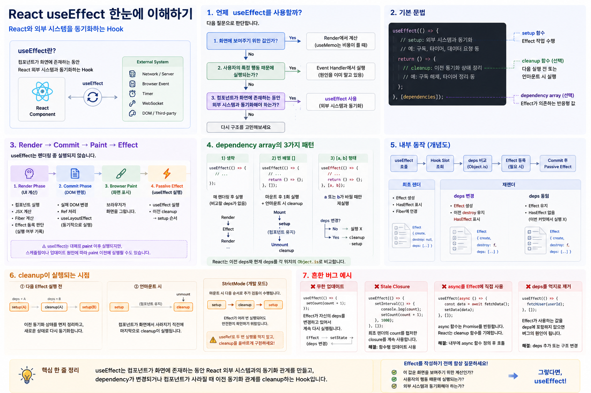

# React `useEffect`



<br>

## 렌더링 이후의 작업이 아니라, 외부 시스템과의 동기화로 이해한다

React의 `useEffect`를 처음 배우면 흔히 다음과 같이 외웁니다.

```text
useState  → 상태 관리
useEffect → API 호출
```

하지만 이것은 `useEffect`의 일부 사용 사례만 설명할 뿐, 본질적인 정의는 아닙니다.

`useEffect`를 제대로 이해하려면 먼저 다음 질문에서 시작해야 합니다.

> **왜 React는 `useEffect`라는 별도의 Hook을 만들었을까?**

핵심은 **렌더링(Rendering)**과 **외부 시스템과의 동기화(Synchronization)**를 분리하기 위해서입니다.

---

# 1. `useEffect`란?

> **`useEffect`는 React 컴포넌트의 상태와 렌더링 결과를 React 외부의 시스템과 동기화하기 위해 사용하는 Hook입니다.**

여기서 말하는 **외부 시스템(External System)**에는 다음과 같은 것들이 포함됩니다.

```text
React Component
      │
      │ useEffect
      ▼
┌─────────────────────────────┐
│       External System       │
├─────────────────────────────┤
│ Network / Server            │
│ Browser Event System        │
│ Timer                       │
│ WebSocket                   │
│ DOM API                     │
│ localStorage                │
│ Third-party Library         │
└─────────────────────────────┘
```

예를 들면 다음과 같습니다.

* 서버와 데이터 동기화
* WebSocket 연결 및 해제
* 브라우저 이벤트 리스너 등록 및 제거
* `setInterval`, `setTimeout` 관리
* 외부 UI 라이브러리와 DOM 동기화
* 브라우저 API와 상태 동기화

따라서 `useEffect`를 단순히

> "렌더링 후 실행되는 함수"

라고 이해하는 것보다

> **"React와 React 외부 시스템의 상태를 맞추기 위한 Hook"**

이라고 이해하는 것이 훨씬 중요합니다.

---

# 2. 왜 `useEffect`가 필요한가?

React 함수 컴포넌트는 기본적으로 **순수한 렌더링 계산**처럼 동작해야 합니다.

```jsx
function Profile({ user }) {
  const fullName = `${user.firstName} ${user.lastName}`;

  return <h1>{fullName}</h1>;
}
```

컴포넌트가 실행되면 React는

```text
props + state
      │
      ▼
Component Function
      │
      ▼
React Element
```

를 계산합니다.

같은 `props`와 `state`가 주어졌다면 렌더링 과정은 외부 환경을 임의로 변경해서는 안 됩니다.

따라서 렌더링 중 다음과 같은 코드는 문제가 됩니다.

```jsx
function MyComponent() {

  // 렌더링 중 외부 시스템을 변경
  window.addEventListener('resize', handleResize);

  setInterval(() => {
    console.log('tick');
  }, 1000);

  return <div>Hello</div>;
}
```

컴포넌트 함수는 여러 번 실행될 수 있기 때문에 렌더링할 때마다 이벤트 리스너와 타이머가 계속 추가될 수 있습니다.

React는 그래서 다음 두 종류의 작업을 분리합니다.

```text
┌───────────────────────────────────┐
│           Render Phase            │
│                                   │
│ props + state → UI 계산            │
│                                   │
│ 순수한 계산                         │
└─────────────────┬─────────────────┘
                  │
                  ▼
             Commit
                  │
                  ▼
┌───────────────────────────────────┐
│             Effect                │
│                                   │
│ React ↔ External System           │
│          Synchronization          │
└───────────────────────────────────┘
```

`useEffect`는 바로 두 번째 영역을 담당합니다.

---

# 3. 먼저 판단하자: 정말 `useEffect`가 필요한가?

`useEffect`를 배우기 전에 가장 먼저 익혀야 하는 판단 기준입니다.

어떤 코드가 실행되어야 할 때 다음 질문을 합니다.

```text
이 작업은 왜 실행되어야 하는가?
          │
          ▼
 ┌────────┴─────────┐
 │                  │
 ▼                  ▼
화면을 만들기      사용자가 행동함
위한 계산          click / input / submit
 │                  │
 ▼                  ▼
Render에서          Event Handler에서
계산                실행

          또는

컴포넌트가 화면에 존재하기 때문에
외부 시스템과 동기화해야 하는가?
          │
          ▼
       useEffect
```

## 3-1. 화면에 보여주기 위한 값이라면

렌더링 중 계산합니다.

```jsx
function User({ firstName, lastName }) {
  const fullName = `${firstName} ${lastName}`;

  return <h1>{fullName}</h1>;
}
```

이런 코드는 필요하지 않습니다.

```jsx
const [fullName, setFullName] = useState('');

useEffect(() => {
  setFullName(`${firstName} ${lastName}`);
}, [firstName, lastName]);
```

`fullName`은 `firstName`, `lastName`으로부터 바로 계산할 수 있기 때문입니다.

---

## 3-2. 사용자의 행동 때문에 실행된다면

이벤트 핸들러에서 처리합니다.

```jsx
function handleClick() {
  sendOrder();
}
```

굳이 다음처럼 만들 필요가 없습니다.

```jsx
useEffect(() => {
  if (clicked) {
    sendOrder();
  }
}, [clicked]);
```

실행 원인이 이미 **사용자의 클릭**이라는 것을 알고 있기 때문입니다.

---

## 3-3. 외부 시스템과 동기화해야 한다면

이때 `useEffect`를 고려합니다.

```jsx
useEffect(() => {
  const connection = createConnection(roomId);

  connection.connect();

  return () => {
    connection.disconnect();
  };
}, [roomId]);
```

컴포넌트가 특정 `roomId`를 나타내고 있는 동안 외부 연결 역시 같은 `roomId`와 연결되어 있어야 합니다.

이것이 `useEffect`의 핵심입니다.

---

# 4. `useEffect` 기본 문법

기본 형태는 다음과 같습니다.

```jsx
useEffect(() => {

  // setup
  // 외부 시스템과 동기화

  return () => {

    // cleanup
    // 이전 동기화 상태 정리

  };

}, [dependencies]);
```

크게 세 부분으로 나눌 수 있습니다.

```text
useEffect(
    setup,
    dependencies
)

setup()
 ├─ Effect 작업
 └─ cleanup 반환 가능

dependencies
 └─ Effect가 의존하는 반응형 값
```

### 첫 번째 아규먼트

Effect의 **setup 함수**입니다.

```jsx
() => {
  // effect
}
```

### 두 번째 아규먼트

dependency array입니다.

```jsx
[userId, page]
```

React가 이전 렌더링의 dependency와 현재 dependency를 비교하는 데 사용합니다.

### 반환값

필요하다면 cleanup 함수를 반환합니다.

```jsx
return () => {
  // cleanup
};
```

---

# 5. `useEffect` 내부에서는 무슨 일이 일어나는가?

여기서부터 React 내부 관점으로 들어가 보겠습니다.

`useEffect`도 다른 Hook과 마찬가지로 현재 컴포넌트의 Fiber에 연결된 **Hook Slot**을 사용합니다.

개념적으로:

```text
Fiber
 │
 └─ memoizedState
       │
       ▼
    Hook #1
       │
       ▼
    Hook #2  ← useEffect
       │
       ▼
    Hook #3
```

`useEffect`의 Hook Slot에는 Effect와 관련된 정보가 저장됩니다.

개념적으로 다음과 같은 정보가 필요합니다.

```js
Effect {
  create,
  destroy,
  deps,
  tag
}
```

* `create` : setup 함수
* `destroy` : 이전 setup이 반환한 cleanup
* `deps` : dependency array
* `tag` : 이번 commit에서 실행할 필요가 있는지 등의 정보

> 다음 코드는 실제 React 소스코드를 그대로 복사한 것이 아닙니다.
>
> **`useEffect`의 핵심 동작을 이해하기 위해 단순화한 교육용 의사 코드입니다.**
>
> 실제 React 내부의 Hook 및 Effect 연결 구조와 플래그 체계는 더 복잡합니다.

```js
function useEffect(create, deps) {

  const hook = getNextHook();
  const fiber = currentlyRenderingFiber;

  const nextDeps =
    deps === undefined ? null : deps;

  // 최초 렌더
  if (hook.memoizedState === null) {

    const effect = createEffect(
      create,
      nextDeps
    );

    // 이번 commit 이후 실행 대상
    effect.tag |= HasEffect;

    hook.memoizedState = effect;

    attachEffectToFiber(
      fiber,
      effect
    );

    return;
  }

  // 재렌더
  const prevEffect =
    hook.memoizedState;

  const prevDeps =
    prevEffect.deps;

  const changed =
    nextDeps === null ||
    !areHookInputsEqual(
      nextDeps,
      prevDeps
    );

  if (changed) {

    const effect =
      createEffect(
        create,
        nextDeps
      );

    effect.tag |= HasEffect;

    // 이전 cleanup 정보 유지
    effect.destroy =
      prevEffect.destroy;

    hook.memoizedState =
      effect;

    attachEffectToFiber(
      fiber,
      effect
    );

  } else {

    // dependency가 같음
    const effect =
      createEffect(
        create,
        prevDeps
      );

    effect.destroy =
      prevEffect.destroy;

    hook.memoizedState =
      effect;

    // 이번 commit에서
    // Effect를 다시 실행할 필요 없음
  }
}
```

핵심 흐름만 정리하면 다음과 같습니다.

```text
useEffect(create, deps)
          │
          ▼
     Hook Slot 조회
          │
          ▼
      최초 렌더인가?
       /          \
     YES          NO
      │            │
      ▼            ▼
Effect 생성     이전 deps 조회
      │            │
      │            ▼
      │      현재 deps와 비교
      │         /       \
      │      변경       동일
      │        │          │
      ▼        ▼          ▼
 HasEffect  HasEffect   실행 대상 X
      │        │
      └────┬───┘
           ▼
       Fiber에
    Effect 정보 연결
```

즉 `useEffect`를 호출했다고 그 자리에서 Effect 함수가 실행되는 것이 아닙니다.

렌더링 중에는 React가

> **"이 Effect를 나중에 실행해야 하는가?"**

를 계산하고 관련 정보를 기록합니다.

---

# 6. dependency array는 무엇인가?

다음 코드가 있다고 해보겠습니다.

```jsx
useEffect(() => {
  fetchItems(searchTerm, page);
}, [searchTerm, page]);
```

dependency array는

> "`searchTerm`이나 `page`가 바뀌면 실행하고 싶다."

라는 단순한 실행 옵션이 아닙니다.

더 정확하게는:

> **"이 Effect는 `searchTerm`과 `page`에 의존하고 있다."**

라는 선언입니다.

React는 이전 렌더링과 현재 렌더링의 dependency를 비교합니다.

```text
Previous Render
[searchTerm, page]
       │
       │ Object.is
       ▼
Current Render
[searchTerm, page]
```

각 요소를 같은 위치끼리 `Object.is`로 비교합니다.

---

# 7. dependency array의 세 가지 형태

## 7-1. dependency array를 생략

```jsx
useEffect(() => {
  console.log('effect');
});
```

dependency array 자체를 제공하지 않았으므로 Effect는 매 렌더링 이후 실행 대상이 됩니다.

```text
Render #1 → Effect
Render #2 → Effect
Render #3 → Effect
Render #4 → Effect
```

따라서 Effect 안에서 무조건 state를 변경하면 위험합니다.

```jsx
useEffect(() => {
  setCount(count + 1);
});
```

흐름:

```text
Render
  ↓
Effect
  ↓
setCount()
  ↓
Render
  ↓
Effect
  ↓
setCount()
  ↓
...
```

무한 업데이트가 발생합니다.

---

# 8. 빈 dependency array `[]`

```jsx
useEffect(() => {

  console.log('setup');

  return () => {
    console.log('cleanup');
  };

}, []);
```

Effect가 참조해야 할 반응형 dependency가 없다는 의미입니다.

일반적인 production 동작을 단순화하면:

```text
Mount
  │
  ▼
setup()
  │
  │
  │ 컴포넌트 유지
  │
  ▼
Unmount
  │
  ▼
cleanup()
```

다만 개발 환경의 StrictMode에서는 추가적인 검증 사이클이 수행될 수 있습니다.

이 부분은 뒤에서 다시 설명합니다.

---

# 9. 특정 dependency `[a, b]`

```jsx
useEffect(() => {

  fetchItems(
    searchTerm,
    page
  );

}, [searchTerm, page]);
```

React는 이전 dependency와 현재 dependency를 비교합니다.

```text
Previous
["react", 1]

      │
      │ Object.is
      ▼

Current
["react", 2]
```

`page`가 달라졌으므로 Effect가 다시 실행되어야 합니다.

```text
deps 비교
   │
   ├─ 모두 동일
   │      ↓
   │   Effect 실행 X
   │
   └─ 하나라도 변경
          ↓
      cleanup
          ↓
        setup
```

---

# 10. dependency 비교는 Deep Equal이 아니다

React는 객체 내부를 재귀적으로 비교하지 않습니다.

```jsx
const options = {
  page,
  size: 20
};

useEffect(() => {
  fetchItems(options);
}, [options]);
```

문제는 렌더링할 때마다 새로운 객체가 생성된다는 것입니다.

```text
Render #1

options
   │
   ▼
{ page: 1, size: 20 }
Memory A


Render #2

options
   │
   ▼
{ page: 1, size: 20 }
Memory B
```

내용은 같아 보여도:

```js
Object.is(objectA, objectB)
```

는 `false`입니다.

따라서 가능하다면 Effect 내부에서 객체를 만들거나 primitive dependency로 분해합니다.

```jsx
useEffect(() => {

  const options = {
    page,
    size: 20
  };

  fetchItems(options);

}, [page]);
```

필요하다면 `useMemo`, `useCallback` 등을 이용해 참조 안정성을 확보할 수도 있습니다.

하지만 단순히 Effect 실행을 막기 위해 무조건 메모이제이션부터 사용하는 것은 좋은 접근이 아닙니다.

먼저 **불필요한 dependency 자체를 제거할 수 있는 구조인지** 확인해야 합니다.

---

# 11. dependency는 실행 스위치가 아니다

이 부분이 매우 중요합니다.

```jsx
useEffect(() => {

  fetchUser(userId);

}, []);
```

Effect 내부에서 `userId`를 사용하는데 dependency에는 없습니다.

이것을

> "나는 처음에 한 번만 실행하고 싶으니까 `[]`"

라고 생각하면 안 됩니다.

dependency array는

> **"언제 실행하고 싶은가?"**

를 임의로 선택하는 옵션이 아니라

> **"이 Effect가 어떤 반응형 값에 의존하고 있는가?"**

를 React에게 알려주는 선언입니다.

따라서 원칙적으로 Effect에서 사용하는 반응형 값은 dependency에 포함되어야 합니다.

```jsx
useEffect(() => {

  fetchUser(userId);

}, [userId]);
```

dependency를 없애고 싶다면 dependency array에서 억지로 삭제하는 것이 아니라 **Effect의 코드를 변경하여 실제 의존성을 제거해야 합니다.**

---

# 12. Render Cycle에서 `useEffect`는 어디에 있는가?

단순화하면 React의 흐름은 다음과 같습니다.

```text
State / Props 변경
        │
        ▼
┌──────────────────────┐
│     Render Phase     │
│                      │
│ Component 실행       │
│ JSX 계산             │
│ Fiber 계산           │
│ Effect 등록 판단     │
│                      │
│ 실제 DOM 변경 X      │
└──────────┬───────────┘
           │
           ▼
┌──────────────────────┐
│     Commit Phase     │
│                      │
│ 실제 DOM 변경        │
│ Ref 처리             │
│ Layout Effect 처리   │
└──────────┬───────────┘
           │
           ▼
     Browser Paint
           │
           ▼
┌──────────────────────┐
│   Passive Effects    │
│                      │
│ useEffect 처리       │
└──────────────────────┘
```

중요한 것은:

```jsx
useEffect(() => {
  console.log('effect');
}, []);
```

컴포넌트 함수가 실행되면서 `useEffect()`를 만났다고 해서 그 자리에서

```js
console.log('effect');
```

가 실행되는 것이 아니라는 점입니다.

Render Phase에서는 Effect 정보를 기록합니다.

그리고 Commit과 스케줄링을 거쳐 React가 Passive Effect를 처리합니다.

---

# 13. `useEffect`는 항상 Paint 이후인가?

보통 다음처럼 설명합니다.

```text
Render
  ↓
Commit
  ↓
Paint
  ↓
useEffect
```

입문 단계의 정신 모델로는 유용합니다.

하지만 이것을 절대적인 실행 보장으로 이해하면 안 됩니다.

`useEffect`는 **일반적으로 브라우저의 화면 표시를 막지 않는 passive effect**로 처리됩니다.

그러나 업데이트의 원인과 React의 스케줄링에 따라 Effect가 paint보다 앞서 처리되는 경우도 존재합니다.

따라서:

> **`useEffect`는 무조건 paint 이후에 실행된다**

라는 실행 순서에 의존해서 프로그램을 작성해서는 안 됩니다.

화면이 그려지기 전에 반드시 DOM을 측정하거나 수정해야 하는 경우에는 `useLayoutEffect`를 검토합니다.

---

# 14. cleanup은 왜 필요한가?

다음 Effect를 보겠습니다.

```jsx
useEffect(() => {

  const connection =
    connect(roomId);

  return () => {
    connection.disconnect();
  };

}, [roomId]);
```

여기서 cleanup은 단순히

> "컴포넌트가 사라질 때 실행되는 함수"

가 아닙니다.

cleanup의 핵심 역할은:

> **이전 Effect가 만들어 놓은 외부 시스템과의 동기화 상태를 해제하는 것**

입니다.

---

# 15. cleanup이 실행되는 시점

크게 두 가지입니다.

### 1. Effect가 다시 실행되기 전

```text
roomId = 1
     │
     ▼
connect(1)
     │
     │
roomId = 2
     │
     ▼
disconnect(1)
     │
     ▼
connect(2)
```

즉:

```text
Previous Effect
      │
      ▼
   cleanup
      │
      ▼
 New Effect setup
```

### 2. 컴포넌트가 unmount될 때

```text
Component
   │
   ▼
setup
   │
   │
   ▼
Unmount
   │
   ▼
cleanup
```

---

# 16. 이벤트 리스너와 cleanup

```jsx
useEffect(() => {

  function handleScroll() {
    console.log(window.scrollY);
  }

  window.addEventListener(
    'scroll',
    handleScroll
  );

  return () => {

    window.removeEventListener(
      'scroll',
      handleScroll
    );

  };

}, []);
```

setup과 cleanup은 서로 대칭입니다.

```text
setup
window.addEventListener()
          │
          ▼
      Event 연결
          │
          ▼
cleanup
window.removeEventListener()
```

이러한 **setup ↔ cleanup의 대칭 관계**를 이해하는 것이 중요합니다.

---

# 17. StrictMode에서는 왜 Effect가 두 번 실행되는가?

개발 환경에서 `<StrictMode>`를 사용하면 React는 Effect가 올바르게 정리되는지 검사하기 위해 추가적인 setup/cleanup 사이클을 수행할 수 있습니다.

개념적으로:

```text
setup
  ↓
cleanup
  ↓
setup
```

따라서:

```jsx
useEffect(() => {

  console.log('connect');

  return () => {
    console.log('disconnect');
  };

}, []);
```

개발 환경에서는 다음과 같은 흐름을 볼 수 있습니다.

```text
connect
disconnect
connect
```

이것은 버그가 아닙니다.

React가 확인하고 싶은 것은:

> **"이 Effect가 다시 실행되어도 외부 시스템의 상태가 망가지지 않는가?"**

입니다.

---

# 18. StrictMode를 `useRef`로 막으면 안 되는 이유

다음 코드는 흔히 볼 수 있지만 좋은 해결 방법이 아닙니다.

```jsx
const didRun = useRef(false);

useEffect(() => {

  if (didRun.current)
    return;

  didRun.current = true;

  connect();

}, []);
```

이 코드는 Effect가 두 번 실행되는 현상을 숨길 뿐입니다.

외부 연결을 실제로 정리하지 않았기 때문입니다.

올바른 방향은:

```jsx
useEffect(() => {

  const connection =
    connect();

  return () => {
    connection.disconnect();
  };

}, []);
```

입니다.

판단 기준은 간단합니다.

> **setup → cleanup → setup을 수행해도 올바르게 동작하는가?**

그렇다면 Effect의 lifecycle이 제대로 설계된 것입니다.

---

# 19. 실전 패턴 1 — Timer

```jsx
useEffect(() => {

  const id = setInterval(() => {
    console.log('tick');
  }, 1000);

  return () => {
    clearInterval(id);
  };

}, []);
```

관계는 명확합니다.

```text
setup
setInterval()
     │
     ▼
Timer 실행
     │
     ▼
cleanup
clearInterval()
```

---

# 20. 실전 패턴 2 — Browser Event

```jsx
useEffect(() => {

  const handleResize = () => {
    console.log(
      window.innerWidth
    );
  };

  window.addEventListener(
    'resize',
    handleResize
  );

  return () => {

    window.removeEventListener(
      'resize',
      handleResize
    );

  };

}, []);
```

---

# 21. 실전 패턴 3 — 데이터 패칭

데이터 패칭 역시 외부 시스템과의 동기화라는 관점에서 `useEffect`로 구현할 수 있습니다.

```jsx
function UserList({ search }) {

  const [users, setUsers] =
    useState([]);

  const [loading, setLoading] =
    useState(false);

  useEffect(() => {

    let ignore = false;

    const controller =
      new AbortController();

    async function load() {

      setLoading(true);

      try {

        const response =
          await fetch(
            `/api/users?search=${
              encodeURIComponent(search)
            }`,
            {
              signal:
                controller.signal
            }
          );

        const data =
          await response.json();

        if (!ignore) {
          setUsers(data);
        }

      } catch (error) {

        if (!ignore) {
          console.error(error);
        }

      } finally {

        if (!ignore) {
          setLoading(false);
        }

      }
    }

    load();

    return () => {

      ignore = true;

      controller.abort();

    };

  }, [search]);

  // ...
}
```

---

# 22. 왜 `ignore`가 필요한가? — Race Condition

사용자가 검색창에 빠르게 입력한다고 해보겠습니다.

```text
"a"
 │
 └──── Request A ───────────────────────▶ Response A

"ab"
 │
 └──── Request B ───────▶ Response B
```

Request A가 먼저 출발했다고 Response A가 먼저 도착한다는 보장은 없습니다.

실제로:

```text
Request A
──────────────────────────────▶
                               Response A

Request B
──────────────▶
               Response B
```

가 될 수 있습니다.

사용자의 현재 검색어는 `"ab"`인데 늦게 도착한 `"a"` 결과가 화면을 덮어쓸 수 있습니다.

```text
search = "a"
     │
     ▼
Request A
     │
search = "ab"
     │
     ▼
cleanup A
ignore = true
     │
     ▼
Request B
     │
     ▼
Response B
setUsers()
     │
     ▼
Response A
     │
     ▼
ignore === true
     │
     ▼
무시
```

cleanup은 단순히 unmount 처리를 위한 것이 아닙니다.

**이전 Effect가 더 이상 현재 상태를 대표하지 않을 때 그 Effect의 작업을 정리하는 역할**도 합니다.

---

# 23. Effect 콜백에 `async`를 직접 붙이면 안 되는 이유

다음 코드는 잘못된 형태입니다.

```jsx
useEffect(async () => {

  const data =
    await fetchData();

  setData(data);

}, []);
```

이유는 `async` 함수의 반환값 때문입니다.

```js
async function test() {
}
```

`async` 함수는 항상 Promise를 반환합니다.

그런데 React는 Effect 함수의 반환값을 cleanup으로 사용합니다.

React가 기대하는 구조는:

```text
Effect Function
     │
     ├─ undefined
     │
     └─ cleanup function
```

입니다.

하지만 `async`를 붙이면:

```text
Effect Function
     │
     ▼
   Promise
```

가 됩니다.

따라서 Effect 안에 async 함수를 정의하고 호출합니다.

```jsx
useEffect(() => {

  let ignore = false;

  async function load() {

    const data =
      await fetchData();

    if (!ignore) {
      setData(data);
    }
  }

  load();

  return () => {
    ignore = true;
  };

}, []);
```

---

# 24. 중요한 점: `useEffect`는 데이터 패칭 Hook이 아니다

다시 강조하면:

```text
useState  = State
useEffect = Fetch
```

가 아닙니다.

데이터 패칭은 `useEffect`가 처리할 수 있는 **외부 시스템 동기화의 한 사례**일 뿐입니다.

현대 React 애플리케이션에서는 데이터 패칭을 다음과 같은 방법으로 Effect 바깥에서 처리하는 경우가 많습니다.

```text
Framework Data Loading
Server Components
Suspense 기반 구조
Data Fetching Library
```

`useEffect + fetch`는 여전히 사용할 수 있지만 다음 문제들을 직접 해결해야 합니다.

* 캐싱
* 중복 요청
* race condition
* loading
* error
* 요청 취소

따라서:

> "`useEffect`를 배웠으니 모든 API 요청을 `useEffect`에 넣는다."

라고 이해하면 안 됩니다.

---

# 25. 흔한 버그 1 — 무한 업데이트

```jsx
const [count, setCount] =
  useState(0);

useEffect(() => {

  setCount(count + 1);

});
```

흐름:

```text
Render
  │
  ▼
Effect
  │
  ▼
setCount()
  │
  ▼
Render
  │
  ▼
Effect
  │
  ▼
setCount()
  │
  ▼
...
```

`[count]`를 넣어도 해결되지 않습니다.

```jsx
useEffect(() => {

  setCount(count + 1);

}, [count]);
```

왜냐하면 Effect가 자신의 dependency를 변경하고 있기 때문입니다.

```text
count 변경
    ↓
Effect
    ↓
setCount
    ↓
count 변경
    ↓
Effect
    ↓
...
```

따라서 무한 루프가 발생하면 가장 먼저:

> **이 Effect가 자기 dependency를 다시 변경하고 있지 않은가?**

를 확인합니다.

그보다 먼저 물어야 할 질문은:

> **이 Effect가 정말 필요한가?**

입니다.

---

# 26. 흔한 버그 2 — Stale Closure

다음 코드를 보겠습니다.

```jsx
const [count, setCount] =
  useState(0);

useEffect(() => {

  const id =
    setInterval(() => {

      console.log(count);

      setCount(count + 1);

    }, 1000);

}, []);
```

Effect는 최초 렌더링에서 만들어진 closure를 사용합니다.

```text
First Render

count = 0
   │
   ▼
Effect Closure
   │
   ├─ count = 0
   └─ setCount(count + 1)
```

나중에 화면의 `count`가 변경되더라도 이 closure가 캡처한 `count`는 자동으로 새로운 값으로 교체되는 것이 아닙니다.

따라서 이 경우에는 함수형 업데이트가 적합합니다.

```jsx
useEffect(() => {

  const id =
    setInterval(() => {

      setCount(
        previous =>
          previous + 1
      );

    }, 1000);

  return () =>
    clearInterval(id);

}, []);
```

이제 Effect는 바깥의 `count` 값을 읽지 않습니다.

```text
setCount(
  previous => previous + 1
)
```

React가 최신 state를 updater 함수에 전달합니다.

---

# 27. dependency를 억지로 지우지 말자

ESLint가 다음 코드를 경고한다고 해보겠습니다.

```jsx
useEffect(() => {

  fetchData(userId);

}, []);
```

Effect가 `userId`를 읽고 있으므로:

```jsx
useEffect(() => {

  fetchData(userId);

}, [userId]);
```

가 자연스럽습니다.

경고를 없애기 위해 dependency를 무시하는 것이 아니라:

```text
Effect가 정말 userId에 의존하는가?
          │
          ├─ YES → dependency에 추가
          │
          └─ NO
              ↓
         Effect 구조 변경
```

이라는 식으로 접근해야 합니다.

---

# 28. `useEffect`를 사용하지 말아야 하는 경우

`useEffect`를 잘 사용하는 것만큼 중요한 것이 **사용하지 않아야 할 곳에서 사용하지 않는 것**입니다.

---

## 28-1. Derived Value

나쁜 예:

```jsx
const [fullName, setFullName] =
  useState('');

useEffect(() => {

  setFullName(
    `${firstName} ${lastName}`
  );

}, [firstName, lastName]);
```

좋은 예:

```jsx
const fullName =
  `${firstName} ${lastName}`;
```

흐름 자체가 다릅니다.

나쁜 구조:

```text
props 변경
   ↓
Render
   ↓
Commit
   ↓
Effect
   ↓
setState
   ↓
Render
```

좋은 구조:

```text
props 변경
   ↓
Render
   ↓
값 계산
```

---

# 29. 사용자 이벤트를 Effect로 처리하지 말자

나쁜 예:

```jsx
useEffect(() => {

  if (clicked) {
    buyProduct();
  }

}, [clicked]);
```

좋은 예:

```jsx
function handleClick() {

  buyProduct();

}
```

왜냐하면 실행 원인을 이미 알고 있기 때문입니다.

```text
User Click
    │
    ▼
handleClick()
    │
    ▼
buyProduct()
```

Effect를 거칠 이유가 없습니다.

---

# 30. Props가 변경될 때 전체 State를 초기화하고 싶다면

다음과 같은 Effect를 생각할 수 있습니다.

```jsx
useEffect(() => {

  setComment('');

}, [userId]);
```

하지만 Effect는 렌더링 이후 처리되므로 이전 state를 사용한 렌더가 먼저 발생할 수 있습니다.

컴포넌트 전체 state를 새로운 사용자 기준으로 초기화하려는 목적이라면 `key`를 이용할 수 있습니다.

```jsx
<ProfilePage
  key={userId}
  userId={userId}
/>
```

`key`가 변경되면 React는 서로 다른 컴포넌트 identity로 판단할 수 있으므로 내부 state 역시 새롭게 시작할 수 있습니다.

---

# 31. 부모에게 변경 사실을 알리기 위해 Effect를 쓰지 말자

다음 구조를 생각해봅시다.

```jsx
useEffect(() => {

  onChange(isOn);

}, [isOn]);
```

사용자의 클릭 때문에 `isOn`이 바뀌었다면 원인을 이미 알고 있습니다.

```jsx
function handleClick() {

  const next =
    !isOn;

  setIsOn(next);

  onChange(next);
}
```

즉:

```text
User Event
    │
    ▼
handleClick
   /     \
  ▼       ▼
setState  onChange
```

로 한 번에 처리할 수 있습니다.

---

# 32. `useEffect`와 클래스 Lifecycle의 관계

클래스 컴포넌트를 경험한 개발자는 다음과 같이 비교하면 이해하기 쉽습니다.

```text
Class Component

componentDidMount
componentDidUpdate
componentWillUnmount
        │
        ▼
Function Component

useEffect
```

예를 들어:

```jsx
useEffect(() => {

  // setup

  return () => {
    // cleanup
  };

}, [value]);
```

는 기존 lifecycle의 여러 역할을 포함할 수 있습니다.

하지만 이것을 완벽한 1:1 대응 관계로 이해하면 안 됩니다.

`useEffect`의 핵심 정신 모델은:

```text
Lifecycle Callback
```

보다는

```text
External System
       ⇅
Synchronization
       ⇅
React Component
```

입니다.

따라서 현대 React에서는

> "`componentDidMount`를 Hook으로 어떻게 바꾸지?"

보다

> **"이 컴포넌트가 어떤 외부 시스템과 동기화되어야 하지?"**

라고 생각하는 편이 좋습니다.

---

# 33. `useEffect`와 `useLayoutEffect`

둘의 가장 중요한 차이는 실행 타이밍과 목적입니다.

|         | `useEffect`     | `useLayoutEffect`        |
| ------- | --------------- | ------------------------ |
| 성격      | Passive Effect  | Layout Effect            |
| 일반적인 목적 | 외부 시스템 동기화      | DOM 측정 및 paint 전 동기 수정   |
| Paint   | 보통 화면 표시를 막지 않음 | 완료될 때까지 paint를 지연시킬 수 있음 |
| 사용 빈도   | 기본 선택           | 특수한 경우                   |

예를 들어 DOM의 크기를 측정한 뒤 사용자가 보기 전에 위치를 수정해야 한다면 `useLayoutEffect`가 필요할 수 있습니다.

```jsx
useLayoutEffect(() => {

  const rect =
    ref.current
      .getBoundingClientRect();

  // 측정 결과를 기반으로
  // paint 전에 필요한 작업

}, []);
```

하지만 일반적인 Effect는 `useEffect`가 기본 선택입니다.

---

# 34. SSR과 `useEffect`

SSR 환경에서는 서버가 HTML을 생성합니다.

```text
Server
  │
  ▼
Render HTML
  │
  ▼
Browser
  │
  ▼
Hydration
  │
  ▼
Effects
```

`useEffect`는 서버 렌더링 중 실행되지 않습니다.

따라서 렌더 이후 브라우저 환경과 동기화해야 하는 로직에서는 브라우저 API를 Effect 안에서 사용할 수 있습니다.

```jsx
useEffect(() => {

  const stored =
    localStorage.getItem(
      'theme'
    );

  // ...

}, []);
```

다만:

> **`window`, `document`, `localStorage`를 사용한다는 이유만으로 무조건 `useEffect`가 필요한 것은 아닙니다.**

핵심은 여전히:

> **렌더링 이후 브라우저의 외부 상태와 동기화해야 하는가?**

입니다.

---

# 35. `useEffect`의 전체 내부 흐름

지금까지의 내용을 하나로 연결하면 다음과 같습니다.

```text
Component Render
       │
       ▼
useEffect(create, deps)
       │
       ▼
현재 Hook Slot 조회
       │
       ▼
이전 Effect 존재?
    /        \
   NO        YES
   │          │
   │          ▼
   │      이전 deps
   │          │
   │          ▼
   │      현재 deps와
   │      Object.is 비교
   │       /       \
   │    변경       동일
   │      │          │
   ▼      ▼          ▼
Effect  Effect     실행 대상 X
생성    생성
 │       │
 └───┬───┘
     ▼
실행 필요 표시
     │
     ▼
Render Phase 종료
     │
     ▼
Commit Phase
     │
     ├─ 실제 DOM 반영
     ├─ Ref 처리
     └─ Layout Effects
     │
     ▼
Browser Rendering
     │
     ▼
Passive Effects 처리
     │
     ▼
이전 cleanup 필요?
   /        \
 YES        NO
  │          │
  ▼          │
cleanup()    │
  │          │
  └────┬─────┘
       ▼
    setup()
       │
       ▼
cleanup 함수 저장
       │
       ▼
다음 Effect 또는
Unmount까지 유지
```

이 흐름을 이해하면 `useEffect`의 많은 규칙들이 암기 사항이 아니게 됩니다.

---

# 36. `useEffect`를 이해하는 가장 중요한 세 가지 질문

Effect를 작성하려고 할 때 먼저 다음 세 가지를 물어봅니다.

```text
1. 화면에 보여주기 위한 값인가?
              │
              ▼
        Render에서 계산
        비싸다면 useMemo 검토


2. 사용자의 특정 행동 때문에 실행되는가?
              │
              ▼
         Event Handler


3. 컴포넌트가 화면에 존재하는 동안
   외부 시스템과 동기화해야 하는가?
              │
              ▼
           useEffect
```

이 세 질문만 제대로 이해해도 불필요한 `useEffect`의 상당수를 제거할 수 있습니다.

---

# 37. 최종 정리

`useEffect`를 다음처럼 외우지 마세요.

```text
useEffect
=
렌더링 후 실행되는 함수
```

또는:

```text
useEffect
=
API 호출하는 Hook
```

보다 정확한 정신 모델은 다음과 같습니다.

```text
        React
          │
          │
          │ Synchronization
          │
          ▼
    External System
```

즉:

> **`useEffect`는 React 컴포넌트가 화면에 존재하는 동안 React 외부 시스템과 동기화 관계를 만들고, dependency가 변경되거나 컴포넌트가 사라질 때 이전 동기화 관계를 cleanup하는 Hook입니다.**

그리고 내부적으로는:

```text
Render
  ↓
Hook Slot
  ↓
dependency 비교
  ↓
Effect 실행 필요 여부 기록
  ↓
Commit
  ↓
Passive Effect 처리
  ↓
cleanup
  ↓
setup
```

이라는 흐름으로 이해할 수 있습니다.

마지막으로 `useEffect`를 작성하기 전에 항상 한 번 더 질문합니다.

> **"이 코드는 정말 외부 시스템과 동기화하기 위한 코드인가?"**

아니라면 `useEffect`보다 렌더링 계산이나 이벤트 핸들러가 더 적절할 가능성이 높습니다.
