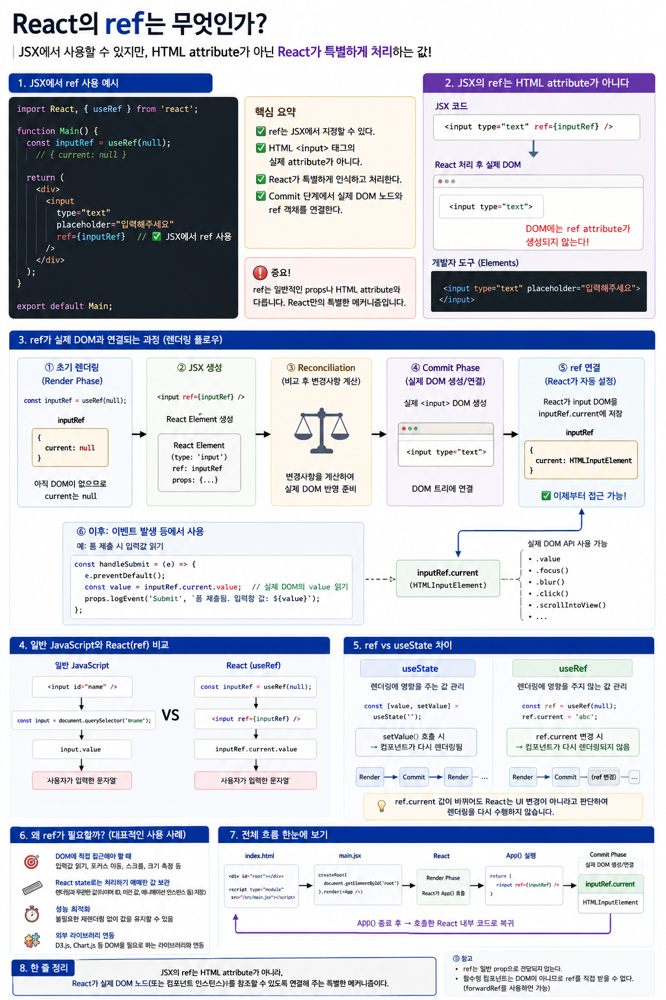
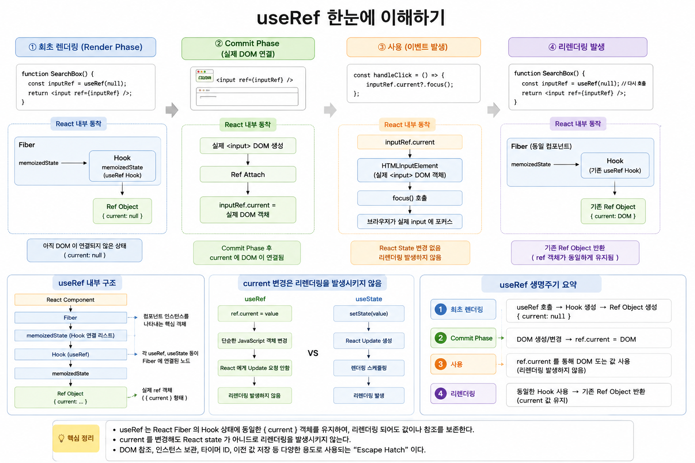

# React `useRef`







## 브라우저 DOM 참조부터 Fiber Hook 슬롯까지 내부 구조로 이해하기 

`useRef`를 단순히 **"브라우저 DOM을 가져오는 Hook"**이라고 알고 있다면 `useRef`의 절반 정도만 이해한 것입니다.

`useRef`의 본질은 DOM 자체가 아닙니다.

> **`useRef`는 컴포넌트가 리렌더링되어도 동일한 객체를 계속 유지하면서, 그 객체 내부의 `current` 값을 변경해도 리렌더링을 요청하지 않는 Hook입니다.**

쉽게 표현하면 다음과 같습니다.

> **`useRef` = 리렌더링과 독립적으로 기억되는 한 칸짜리 메모리 박스**

이 특성 때문에 `useRef`는 DOM 참조뿐만 아니라 타이머 ID, 외부 라이브러리 인스턴스, 이전 값 등 다양한 데이터를 저장하는 데 사용됩니다.

---

# 1. `useRef`는 왜 필요한가?

React 함수 컴포넌트는 리렌더링될 때마다 **함수 전체가 다시 실행**됩니다.

```jsx
function Counter() {
  let value = 0;

  const handleClick = () => {
    value++;
    console.log(value);
  };

  return <button onClick={handleClick}>증가</button>;
}
```

컴포넌트가 다시 렌더링되면:

```text
Counter() 다시 실행
        ↓
let value = 0
        ↓
새로운 지역 변수 생성
```

일반적인 지역 변수는 이전 렌더링에서 사용하던 값을 React가 보존해주지 않습니다.

그런데 실제 애플리케이션에서는 다음과 같은 값이 필요합니다.

```text
타이머 ID
DOM 노드
이전 값
WebSocket 객체
ResizeObserver
외부 라이브러리 인스턴스
렌더링과 직접 관계없는 플래그
```

이 값들은 **렌더 사이에서 유지되어야 하지만**, 값이 변경됐다고 화면을 다시 그릴 필요는 없습니다.

이 문제를 해결하는 Hook이 `useRef`입니다.

---

# 2. `useRef` 한 줄 정의

기본 형태는 다음과 같습니다.

```jsx
const ref = useRef(initialValue);
```

개념적으로 반환되는 값은 다음과 같은 객체입니다.

```js
{
  current: initialValue
}
```

예를 들어:

```jsx
const countRef = useRef(0);
```

개념적으로:

```text
countRef
   │
   ▼
┌─────────────┐
│ current: 0  │
└─────────────┘
```

그리고:

```js
countRef.current = 10;
```

을 실행하면:

```text
countRef
   │
   ▼
┌──────────────┐
│ current: 10  │
└──────────────┘
```

이 됩니다.

중요한 것은 **상자 자체는 그대로이고 내부 값만 바뀐다는 것**입니다.

```js
const ref1 = ref;

// ref.current 변경

console.log(ref1 === ref); // true
```

즉:

```text
ref 객체의 identity
        ↓
      유지

ref.current
        ↓
      변경 가능
```

입니다.

---

# 3. `useState`와 `useRef`의 결정적인 차이

`useState`와 `useRef` 모두 **렌더 사이에 값을 기억할 수 있습니다.**

하지만 가장 중요한 차이가 있습니다.

## `useState`

```jsx
const [count, setCount] = useState(0);

setCount(1);
```

`setCount()`를 호출하면 React에 상태 변경을 알립니다.

```text
setCount()
    ↓
React에 업데이트 요청
    ↓
컴포넌트 리렌더링
    ↓
새로운 JSX 계산
```

---

## `useRef`

```jsx
const countRef = useRef(0);

countRef.current = 1;
```

`current` 변경은 단순한 JavaScript 객체 속성 변경입니다.

```text
ref.current = 1
      ↓
JavaScript 객체 속성 변경
      ↓
React에 렌더 요청 없음
      ↓
리렌더링 없음
```

따라서 가장 중요한 판단 기준은 다음과 같습니다.

> **이 값이 변경됐을 때 화면도 변경되어야 하는가?**

그렇다면 일반적으로:

```text
YES → useState
NO  → useRef 후보
```

입니다.

---

# 4. `useRef`는 어떻게 값을 기억하는가?

여기서 `useRef`의 내부 구조를 이해할 필요가 있습니다.

React는 함수 컴포넌트를 실행하고 끝내버리는 것만으로 관리하지 않습니다.

각 컴포넌트 인스턴스에 대응하는 **Fiber 노드**를 유지합니다.

개념적으로:

```text
<App />
   │
   ▼
App Fiber
   │
   ├── props
   ├── state
   ├── child
   ├── sibling
   └── memoizedState
           │
           ▼
        Hook List
```

함수 컴포넌트에서 사용한 Hook 정보는 Fiber와 연결되어 관리됩니다.

---

# 5. Hook은 연결 리스트 형태로 관리된다

예를 들어:

```jsx
function Counter() {
  const [count, setCount] = useState(0);
  const inputRef = useRef(null);

  useEffect(() => {
    // ...
  }, []);

  return <div />;
}
```

React 내부에서는 개념적으로 다음과 같은 구조가 만들어집니다.

```text
Counter Fiber
      │
      │ memoizedState
      ▼
┌──────────────┐
│ Hook #1      │
│ useState     │
└──────┬───────┘
       │ next
       ▼
┌──────────────┐
│ Hook #2      │
│ useRef       │
└──────┬───────┘
       │ next
       ▼
┌──────────────┐
│ Hook #3      │
│ useEffect    │
└──────────────┘
```

매우 단순화하면 Hook 구조는 다음과 같이 생각할 수 있습니다.

```ts
type Hook = {
  memoizedState: any;
  next: Hook | null;
};

type Fiber = {
  memoizedState: Hook | null;
};
```

따라서 Hook은 단순한 지역 변수가 아니라 **Fiber에 연결된 상태 정보**입니다.

이 구조 때문에 함수 컴포넌트가 다시 실행되어도 Hook이 이전 값을 찾을 수 있습니다.

---

# 6. `useRef`의 내부 동작

`useRef`의 핵심을 이해하려면 **최초 렌더링(Mount)**과 **리렌더링(Update)**을 나누어 보는 것이 좋습니다.

실제 React 구현을 교육용으로 매우 단순화하면 다음과 같은 개념입니다.

## 최초 렌더링

```js
function mountRef(initialValue) {
  const hook = mountWorkInProgressHook();

  const ref = {
    current: initialValue
  };

  hook.memoizedState = ref;

  return ref;
}
```

예를 들어:

```jsx
const inputRef = useRef(null);
```

처음 실행되면:

```text
useRef(null)
      ↓
새 Hook 생성
      ↓
ref 객체 생성

{ current: null }

      ↓
Hook.memoizedState에 저장
```

개념적으로:

```text
Fiber
 │
 └─ Hook
      │
      └─ memoizedState
              │
              ▼
       ┌──────────────┐
       │ current:null │
       └──────────────┘
```

---

## 리렌더링

리렌더링에서는 새로운 ref 객체를 만들 필요가 없습니다.

개념적으로:

```js
function updateRef() {
  const hook = updateWorkInProgressHook();

  return hook.memoizedState;
}
```

즉:

```text
컴포넌트 리렌더
      ↓
useRef(null) 다시 호출
      ↓
같은 순서의 Hook 찾기
      ↓
Hook.memoizedState 읽기
      ↓
기존 ref 객체 반환
```

따라서:

```jsx
const ref = useRef(null);
```

이라는 코드가 렌더링할 때마다 다시 실행되더라도 React는 매번 새로운 ref 객체를 만들어 반환하는 것이 아닙니다.

**기존 Hook에 저장된 ref 객체를 다시 반환합니다.**

---

# 7. 그래서 Hook 호출 순서가 중요하다

React가 Hook을 호출 순서에 따라 연결하기 때문에 다음 코드는 허용되지 않습니다.

```jsx
function Component({ condition }) {
  const [count, setCount] = useState(0);

  if (condition) {
    const ref = useRef(null); // 잘못된 사용
  }

  useEffect(() => {
    // ...
  }, []);
}
```

첫 번째 렌더가:

```text
Hook #1 → useState
Hook #2 → useRef
Hook #3 → useEffect
```

였다가 다음 렌더에서 `condition === false`가 되면:

```text
Hook #1 → useState
Hook #2 → useEffect
```

가 됩니다.

React 입장에서는 Hook의 대응 관계가 깨집니다.

그래서 Hook은 조건문, 반복문 등에서 임의로 호출하면 안 됩니다.

---

# 8. `ref.current`를 바꿔도 왜 리렌더링되지 않는가?

이제 내부 구조를 알았으므로 이유가 명확합니다.

```js
ref.current = 100;
```

은 React의 특별한 업데이트 API를 호출하는 것이 아닙니다.

그냥:

```js
someObject.current = 100;
```

과 같은 **일반 JavaScript 객체 속성 변경**입니다.

반면:

```js
setCount(100);
```

은 React의 state 업데이트 메커니즘을 사용합니다.

따라서:

```text
useState

setCount()
   ↓
React Update 등록
   ↓
렌더링 스케줄링
   ↓
리렌더


useRef

ref.current = value
   ↓
JS 객체 변경
   ↓
React Update 등록 X
   ↓
리렌더 X
```

이 차이가 `useState`와 `useRef`를 구분하는 핵심입니다.

---

# 9. 가장 대표적인 사용법: DOM 접근

`useRef`가 가장 많이 사용되는 곳은 실제 DOM 노드를 참조하는 경우입니다.

예:

```jsx
import { useEffect, useRef } from "react";

function AutoFocusInput() {
  const inputRef = useRef(null);

  useEffect(() => {
    inputRef.current?.focus();
  }, []);

  return (
    <input
      ref={inputRef}
      placeholder="자동 포커스"
    />
  );
}
```

여기서 중요한 부분은:

```jsx
ref={inputRef}
```

입니다.

`ref`는 일반 HTML attribute가 아닙니다.

JSX에서 React가 특별하게 처리하는 값입니다.

---

# 10. 브라우저의 DOM 노드(HTMLXXXElement)는 언제 `ref.current`에 대입되는가?

Render Phase에서 React가 컴포넌트를 실행할 때:

```jsx
const inputRef = useRef(null);
```

이므로 처음에는:

```text
inputRef
    │
    ▼
{ current: null }
```

입니다.

그리고 JSX를 반환합니다.

```jsx
return <input ref={inputRef} />;
```

Render Phase에서는 React가 **무엇을 변경해야 하는지 계산**합니다.

이 단계에서는 실제 DOM 변경을 수행하지 않습니다.

```text
Render Phase

Component()
     ↓
JSX 계산
     ↓
Fiber 작업
     ↓
변경 사항 계산

실제 DOM Mutation X
```

그 다음 Commit Phase가 시작됩니다.

React가 실제 DOM을 생성하거나 변경하고 ref를 연결합니다.

```text
Commit Phase

DOM 생성/변경
      ↓
ref 연결
      ↓
inputRef.current
      ↓
HTMLInputElement
```

결과적으로:

```text
inputRef
   │
   ▼
┌─────────────────────────────┐
│ current                     │
│     ↓                       │
│ HTMLInputElement            │
│ 실제 <input> DOM 객체       │
└─────────────────────────────┘
```

가 됩니다.

---

# 11. DOM ref의 정확한 타이밍

전체 흐름을 단순화하면:

```text
Component Render
        ↓
Render Phase
        ↓
Commit Phase
        ↓
DOM Mutation
        ↓
ref 연결
ref.current = DOM Node
        ↓
useLayoutEffect
        ↓
Browser Paint
        ↓
useEffect
```

따라서 DOM을 이용한 작업은 일반적으로:

```text
이벤트 핸들러
useEffect
useLayoutEffect
```

등에서 수행합니다.

---

# 12. 포커스 제어

가장 대표적인 예입니다.

```jsx
function SearchBox() {
  const inputRef = useRef(null);

  const handleClick = () => {
    inputRef.current?.focus();
  };

  return (
    <>
      <input ref={inputRef} />
      <button onClick={handleClick}>
        검색창 포커스
      </button>
    </>
  );
}
```

사용자가 버튼을 클릭하면:

```text
Click
  ↓
handleClick()
  ↓
inputRef.current
  ↓
HTMLInputElement
  ↓
focus()
  ↓
브라우저가 input에 포커스
```

React state를 변경할 필요가 없습니다.

---

# 13. 스크롤 제어

```jsx
function ChatMessages({ messages }) {
  const bottomRef = useRef(null);

  useEffect(() => {
    bottomRef.current?.scrollIntoView({
      behavior: "smooth"
    });
  }, [messages.length]);

  return (
    <div>
      {messages.map(message => (
        <div key={message.id}>
          {message.text}
        </div>
      ))}

      <div ref={bottomRef} />
    </div>
  );
}
```

새 메시지가 추가되면:

```text
messages 변경
      ↓
리렌더
      ↓
Commit
      ↓
useEffect
      ↓
bottomRef.current
      ↓
scrollIntoView()
```

DOM을 직접 제어하지만 **DOM 노드를 찾기 위해 `querySelector()`를 직접 사용할 필요가 없습니다.**

React가 ref를 통해 해당 DOM과 연결해 줍니다.

---

# 14. 렌더링 없이 기억해야 하는 값 저장

`useRef`의 두 번째 중요한 용도입니다.

예를 들어 타이머 ID는 화면에 표시할 상태가 아닙니다.

```jsx
function Timer() {
  const intervalRef = useRef(null);

  const start = () => {
    if (intervalRef.current !== null) {
      return;
    }

    intervalRef.current = setInterval(() => {
      console.log("tick");
    }, 1000);
  };

  const stop = () => {
    if (intervalRef.current !== null) {
      clearInterval(intervalRef.current);
      intervalRef.current = null;
    }
  };

  return (
    <>
      <button onClick={start}>시작</button>
      <button onClick={stop}>정지</button>
    </>
  );
}
```

`intervalRef.current`가 바뀌어도 화면을 다시 그릴 이유가 없습니다.

따라서 `useState`보다 `useRef`가 적합합니다.

---

# 15. 외부 객체의 인스턴스 저장

예를 들어:

```jsx
const socketRef = useRef(null);
```

또는:

```jsx
const observerRef = useRef(null);
```

처럼 사용할 수 있습니다.

```text
WebSocket
ResizeObserver
IntersectionObserver
Canvas Context
외부 UI 라이브러리 객체
타이머
미디어 객체
```

등은 React UI 상태라기보다는 **외부 시스템과 연결된 객체**입니다.

이러한 객체를 렌더 사이에서 유지해야 할 때 `useRef`가 유용합니다.

---

# 16. 이전 값 기억하기

`useRef`는 이전 렌더의 값을 기억하는 용도로도 사용할 수 있습니다.

```jsx
function Counter() {
  const [count, setCount] = useState(0);
  const previousCountRef = useRef(null);

  useEffect(() => {
    console.log(
      "이전 값:",
      previousCountRef.current
    );

    console.log(
      "현재 값:",
      count
    );

    previousCountRef.current = count;
  }, [count]);

  return (
    <button onClick={() => setCount(c => c + 1)}>
      {count}
    </button>
  );
}
```

흐름을 보면:

```text
count = 0
previousCountRef.current = null

        ↓

버튼 클릭

        ↓

count = 1

        ↓

리렌더 + Commit

        ↓

useEffect

현재 count = 1
previousCountRef.current = 0

        ↓

previousCountRef.current = 1
```

여기서 ref는 **다음 렌더까지 값을 보존하기 위한 저장 공간** 역할을 합니다.

주의할 점은 `ref.current`를 화면의 렌더링 결과를 결정하는 주요 상태로 사용하지 않는 것입니다.

화면에 반드시 반영되어야 하는 값이라면 `useState`가 적합합니다.

---

# 17. 렌더링 중 `ref.current`를 함부로 읽거나 쓰지 않는다

React 컴포넌트의 렌더링은 가능한 한 순수해야 합니다.

예를 들어 다음 코드는 좋지 않습니다.

```jsx
function Bad() {
  const ref = useRef(0);

  ref.current++;

  return <div>{ref.current}</div>;
}
```

렌더링 자체가 외부에 유지되는 값을 변경하고 있습니다.

```text
Render
  ↓
ref.current 변경
  ↓
Render가 Side Effect 발생
```

React는 렌더링 작업을 다시 실행하거나 중간에 버릴 수 있기 때문에 이러한 코드는 예측하기 어려워집니다.

따라서 일반적으로 ref를 변경하는 작업은:

```text
이벤트 핸들러
Effect
외부 시스템과의 동기화 코드
```

등에서 수행합니다.

---

# 18. Lazy Initialization 예외

비싼 객체를 한 번만 생성해야 하는 경우 다음과 같은 패턴이 사용될 수 있습니다.

```jsx
function Component() {
  const objectRef = useRef(null);

  if (objectRef.current === null) {
    objectRef.current = new ExpensiveObject();
  }

  // ...
}
```

중요한 것은 초기화 결과가 항상 동일하고 해당 초기화가 렌더링의 예측 가능성을 깨뜨리지 않아야 한다는 것입니다.

일반적인 ref 변경을 렌더 중에 해도 된다는 의미는 아닙니다.

---

# 19. `createRef`와 `useRef`

`createRef()`와 `useRef()`는 모두 ref 객체를 만들 수 있지만 사용 목적이 다릅니다.

## `createRef`

```jsx
const ref = createRef();
```

호출할 때마다 새로운 객체가 생성됩니다.

따라서 함수 컴포넌트 안에서:

```jsx
function Component() {
  const inputRef = createRef();

  return <input ref={inputRef} />;
}
```

라고 하면 컴포넌트 함수가 다시 실행될 때마다 새로운 ref 객체가 만들어집니다.

```text
Render #1

createRef()
   ↓
Ref Object A


Render #2

createRef()
   ↓
Ref Object B
```

---

## `useRef`

```jsx
function Component() {
  const inputRef = useRef(null);

  return <input ref={inputRef} />;
}
```

에서는:

```text
Render #1
   ↓
Ref Object A 생성
   ↓
Hook.memoizedState 저장


Render #2
   ↓
Hook.memoizedState
   ↓
Ref Object A 재사용
```

이 됩니다.

따라서 함수 컴포넌트에서는 일반적으로 `useRef`를 사용합니다.

---

# 20. 자식 컴포넌트로 ref 전달하기

React 19에서는 함수 컴포넌트가 `ref`를 prop으로 받을 수 있습니다.

```jsx
function MyInput({ ref, ...props }) {
  return (
    <input
      {...props}
      ref={ref}
    />
  );
}
```

부모에서는:

```jsx
function Form() {
  const inputRef = useRef(null);

  return (
    <MyInput ref={inputRef} />
  );
}
```

처럼 사용할 수 있습니다.

개념적으로:

```text
Parent

inputRef
   │
   ▼
<MyInput ref={inputRef}>
   │
   ▼
Child
   │
   ▼
<input ref={ref}>
   │
   ▼
Actual DOM
```

React 18 이하의 코드에서는 이러한 전달을 위해 `forwardRef`를 사용합니다.

```jsx
const MyInput = forwardRef(function MyInput(props, ref) {
  return <input {...props} ref={ref} />;
});
```

---

# 21. `useImperativeHandle`

때로는 부모에게 실제 DOM 전체를 노출하고 싶지 않을 수 있습니다.

예를 들어 부모에게 다음 기능만 제공하고 싶다고 해봅시다.

```text
focus()
clear()
```

React 19에서는:

```jsx
function FancyInput({ ref, ...props }) {
  const inputRef = useRef(null);

  useImperativeHandle(ref, () => ({
    focus() {
      inputRef.current?.focus();
    },

    clear() {
      if (inputRef.current) {
        inputRef.current.value = "";
      }
    }
  }), []);

  return (
    <input
      ref={inputRef}
      {...props}
    />
  );
}
```

부모는:

```jsx
function Parent() {
  const fancyRef = useRef(null);

  return (
    <>
      <FancyInput ref={fancyRef} />

      <button
        onClick={() => fancyRef.current?.focus()}
      >
        포커스
      </button>

      <button
        onClick={() => fancyRef.current?.clear()}
      >
        지우기
      </button>
    </>
  );
}
```

처럼 사용할 수 있습니다.

부모에게 노출되는 것은 실제 DOM 전체가 아니라:

```js
{
  focus() {},
  clear() {}
}
```

라는 **명령형 API**입니다.

---

# 22. Callback Ref

React의 `ref`에는 객체뿐 아니라 함수도 전달할 수 있습니다.

```jsx
function Component() {
  const handleRef = node => {
    if (node) {
      console.log("DOM 연결:", node);
    } else {
      console.log("DOM 해제");
    }
  };

  return <div ref={handleRef} />;
}
```

이것을 **Callback Ref**라고 합니다.

일반적인 object ref:

```jsx
const divRef = useRef(null);

<div ref={divRef} />
```

와 비교하면:

```text
Object Ref

DOM
 ↓
ref.current


Callback Ref

DOM 연결/해제
 ↓
Callback 호출
```

이라는 차이가 있습니다.

DOM 연결 자체가 발생한 시점에 어떤 처리를 수행해야 할 경우 Callback Ref가 유용합니다.

---

# 23. React 19 Callback Ref Cleanup

React 19에서는 Callback Ref가 cleanup 함수를 반환할 수 있습니다.

```jsx
<div
  ref={node => {
    const observer = new ResizeObserver(() => {
      // ...
    });

    observer.observe(node);

    return () => {
      observer.disconnect();
    };
  }}
/>
```

개념적으로:

```text
DOM Attach
    ↓
Callback Ref 실행
    ↓
ResizeObserver 생성
    ↓
cleanup 함수 반환


DOM Detach
    ↓
cleanup 실행
    ↓
observer.disconnect()
```

React 19에서 추가된 중요한 ref 기능 중 하나입니다.

---

# 24. Callback Ref의 암묵적 반환 주의

다음 코드는 피해야 합니다.

```jsx
<div
  ref={element => (myRef.current = element)}
/>
```

화살표 함수의 concise body는 대입 결과를 반환합니다.

즉 개념적으로:

```js
element => {
  myRef.current = element;

  return element;
}
```

와 비슷합니다.

React 19에서는 callback ref의 반환값을 cleanup 함수로 사용할 수 있기 때문에 이러한 형태가 문제가 될 수 있습니다.

따라서 다음처럼 명시적으로 아무것도 반환하지 않는 것이 좋습니다.

```jsx
<div
  ref={element => {
    myRef.current = element;
  }}
/>
```

---

# 25. `useState` vs `useRef` vs `useMemo` vs `useCallback`

각 Hook의 목적은 서로 다릅니다.

| Hook          | 핵심 목적            | 자체적으로 렌더 요청?   |
| ------------- | ---------------- | -------------- |
| `useState`    | UI 상태 저장         | `setState` 시 O |
| `useRef`      | 렌더와 독립적인 값/참조 유지 | X              |
| `useMemo`     | 계산 결과 재사용        | X              |
| `useCallback` | 함수 identity 재사용  | X              |

특히 `useMemo`와 `useCallback`은 dependency가 변경됐다고 **컴포넌트를 리렌더링시키는 Hook이 아닙니다.**

컴포넌트가 다른 이유로 렌더링되는 과정에서 dependency를 확인하여:

```text
dependency 동일
       ↓
기존 값/함수 재사용

dependency 변경
       ↓
새로운 값 계산
또는 새로운 함수 저장
```

을 결정합니다.

---

# 26. `useState`와 `useRef` 선택 기준

가장 중요한 질문은 하나입니다.

> **이 값이 변경되면 화면도 다시 계산되어야 하는가?**

### 화면이 변경되어야 한다

```text
count
username
selectedItem
isOpen
loading
error
```

등이라면:

```jsx
useState
```

를 우선 고려합니다.

### 화면과 직접 관계없이 기억만 하면 된다

```text
Timer ID
DOM Node
WebSocket
Observer
외부 라이브러리 Instance
렌더링과 무관한 mutable value
```

라면:

```jsx
useRef
```

를 고려할 수 있습니다.

---

# 27. `useRef`는 단순한 성능 최적화 Hook이 아니다

`useRef`를 단순히:

> "리렌더를 줄이기 위해 사용하는 Hook"

이라고 이해하면 안 됩니다.

`useRef`의 핵심 목적은 **React의 선언적 렌더링 상태와 별도로 유지해야 하는 값을 보관하거나 외부 시스템에 접근하는 것**입니다.

특히 DOM 접근은 대표적인 예입니다.

React는 기본적으로 선언적입니다.

```jsx
return <input />;
```

하지만 가끔:

```js
input.focus();
video.play();
element.scrollIntoView();
```

처럼 브라우저 객체를 명령형으로 제어해야 합니다.

이때 ref가 React와 외부 명령형 API 사이의 연결점 역할을 합니다.

그래서 `ref`는 React의 **Escape Hatch** 중 하나로 이해할 수 있습니다.

---

# 28. 자주 하는 실수

## 실수 1. `ref.current`를 바꾸면 화면도 바뀐다고 생각한다

```jsx
const countRef = useRef(0);

const handleClick = () => {
  countRef.current++;
};
```

`current`가 변경되어도 리렌더링은 발생하지 않습니다.

화면에 표시해야 하는 값이라면 state를 사용해야 합니다.

---

## 실수 2. DOM ref가 Render Phase에서 이미 연결되어 있다고 생각한다

```jsx
function Component() {
  const inputRef = useRef(null);

  console.log(inputRef.current);

  return <input ref={inputRef} />;
}
```

새로운 DOM 연결은 Commit Phase에서 처리됩니다.

따라서 DOM을 이용한 작업은 이벤트 핸들러, `useLayoutEffect`, `useEffect` 등의 적절한 시점에서 수행해야 합니다.

---

## 실수 3. ref를 state 대신 사용한다

```jsx
const usernameRef = useRef("");

usernameRef.current = "Kim";
```

그리고 이것을 UI의 핵심 상태처럼 사용하기 시작하면 React의 선언적 데이터 흐름에서 벗어나기 쉽습니다.

UI를 결정하는 값은 state가 기본입니다.

---

## 실수 4. Controlled와 직접 DOM 조작을 섞는다

```jsx
<input
  ref={inputRef}
  value={text}
  onChange={e => {
    setText(e.target.value);

    inputRef.current.value = "직접 변경";
  }}
/>
```

`value={text}`를 통해 React가 관리하는 값과 직접 DOM을 수정하는 방식을 동시에 사용하면 데이터의 주인이 누구인지 불분명해집니다.

일반적으로 하나의 명확한 전략을 사용하는 것이 좋습니다.

---

# 29. StrictMode에서 주의할 점

개발 모드의 `StrictMode`에서는 React가 컴포넌트의 순수성과 Effect cleanup 문제 등을 찾기 위해 **추가적인 렌더링과 Effect setup/cleanup 사이클을 수행할 수 있습니다.**

따라서 다음과 같은 외부 자원을 사용할 때는 cleanup이 중요합니다.

```text
setInterval
setTimeout
WebSocket
Event Listener
Observer
외부 라이브러리 Instance
```

예:

```jsx
useEffect(() => {
  const id = setInterval(() => {
    // ...
  }, 1000);

  return () => {
    clearInterval(id);
  };
}, []);
```

StrictMode의 개발 동작을 보고:

> "React는 production에서도 항상 두 번 렌더링한다."

라고 이해하면 안 됩니다.

---

# 30. React 19의 `useRef` 관련 변화

React 19 환경에서는 ref 관련 몇 가지 변화도 알아둘 필요가 있습니다.

## `ref`를 prop으로 전달 가능

React 19에서는 함수 컴포넌트가 `ref`를 prop으로 받을 수 있습니다.

```jsx
function MyInput({ ref }) {
  return <input ref={ref} />;
}
```

React 18 이하의 기존 코드에서는 `forwardRef`가 사용됩니다.

---

## Callback Ref Cleanup

React 19에서는 callback ref가 cleanup 함수를 반환할 수 있습니다.

```jsx
ref={node => {
  // attach

  return () => {
    // detach cleanup
  };
}}
```

---

## TypeScript

React 19 타입 정의에서는 초기값을 명시하는 형태를 사용하는 것이 좋습니다.

```tsx
const inputRef =
  useRef<HTMLInputElement | null>(null);
```

이렇게 하면:

```text
inputRef.current

HTMLInputElement | null
```

이라는 사실이 명확하게 표현됩니다.

---

# 31. `useRef` 전체 내부 흐름

이제 전체 과정을 하나로 연결해 보겠습니다.

```jsx
function Component() {
  const inputRef = useRef(null);

  return <input ref={inputRef} />;
}
```

최초 렌더링:

```text
Component()
      ↓
useRef(null)
      ↓
mountRef()
      ↓
Hook 생성
      ↓
{ current: null } 생성
      ↓
Hook.memoizedState에 저장
      ↓
inputRef 반환
      ↓
JSX 생성
<input ref={inputRef}>
      ↓
Render Phase 완료
      ↓
Commit Phase
      ↓
실제 input DOM 생성/연결
      ↓
inputRef.current = HTMLInputElement
```

리렌더링:

```text
Component() 다시 실행
      ↓
useRef(null) 다시 호출
      ↓
updateRef()
      ↓
같은 순서의 Hook 찾기
      ↓
Hook.memoizedState
      ↓
기존 Ref 객체 반환
      ↓
동일한 inputRef 유지
```

따라서:

```text
Render #1

inputRef ───────┐
                │
                ▼
        ┌────────────────┐
        │ current        │
        │      ↓         │
        │ HTMLInputElement│
        └────────────────┘


Render #2

inputRef ───────┘

같은 Ref Object
```

가 됩니다.

---

# 32. 핵심 정리

`useRef`를 이해할 때 다음 다섯 가지를 기억하면 됩니다.

### 1. `useRef`는 객체를 반환한다

```js
{
  current: value
}
```

### 2. 그 객체의 identity는 렌더 사이에서 유지된다

React가 Fiber의 Hook 상태에 ref 객체를 저장하기 때문입니다.

```text
Fiber
 ↓
Hook
 ↓
memoizedState
 ↓
Ref Object
```

### 3. `ref.current` 변경은 리렌더링을 요청하지 않는다

```js
ref.current = value;
```

은 기본적으로 JavaScript 객체 속성 변경입니다.

### 4. DOM ref는 Commit Phase에서 연결된다

```text
Render
  ↓
Commit
  ↓
DOM Mutation
  ↓
Ref Attach
```

### 5. 화면을 결정하는 값은 기본적으로 state다

```text
UI를 변경해야 하는 값
        ↓
     useState


UI와 관계없이 유지해야 하는 값
        ↓
     useRef 후보
```

---

# 최종 정의

입문자 관점에서는:

> **`useRef`는 컴포넌트가 리렌더링되어도 값을 잃지 않으면서, 그 값의 변경 자체로는 리렌더링을 발생시키지 않는 한 칸짜리 메모리 박스를 만드는 Hook입니다.**

React 내부 구조까지 포함해서 정의하면:

> **`useRef`는 컴포넌트 Fiber의 Hook 상태에 동일한 identity를 유지하는 `{ current }` 객체를 저장하고, 리렌더링 시 그 객체를 다시 반환하는 Hook입니다. `current`의 변경은 React의 state update를 발생시키지 않으므로 그 변경 자체로는 새로운 렌더링이 요청되지 않습니다.**

그리고 DOM과 연결해서 보면:

```text
                  useRef
                     │
        ┌────────────┴────────────┐
        │                         │
        ▼                         ▼

  값 기억하기                 외부 시스템 접근

Timer ID                     DOM Node
Previous Value               focus()
Instance                     scroll()
Observer                     measure()
WebSocket                    video.play()

        │                         │
        └────────────┬────────────┘
                     ▼

             Fiber Hook State
                     │
                     ▼
              { current: ... }
                     │
                     ▼
           리렌더 사이에서 유지
                     │
                     ▼
      current 변경 자체는 리렌더 X
```

이 구조가 `useRef`의 핵심입니다.
