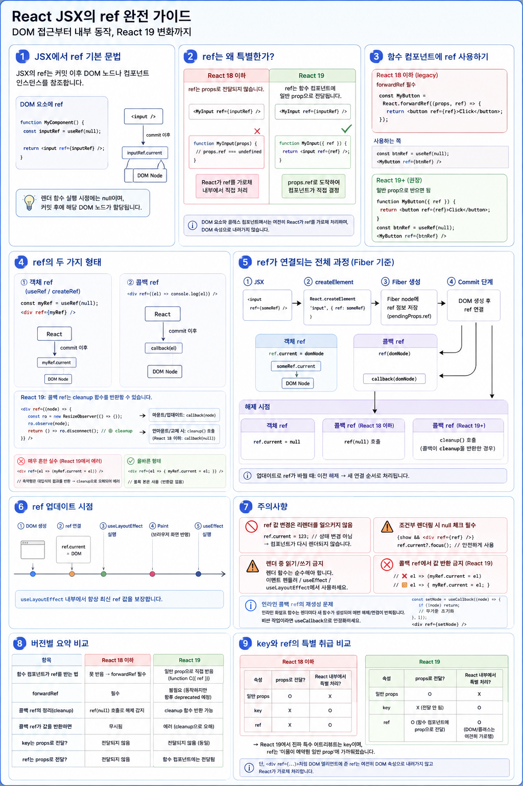

# JSX의 `ref` : DOM 접근부터 React 내부 연결 과정까지





React에서 `ref`는 컴포넌트가 렌더링한 **DOM 노드나 명령형(Imperative) 대상을 직접 참조하기 위한 공식적인 escape hatch**입니다.

React는 기본적으로 다음과 같은 **선언적(Declarative) 방식**을 권장합니다.

```jsx
function Modal({ isOpen }) {
  return isOpen ? <div>Modal</div> : null;
}
```

즉,

```text
State / Props
      ↓
    Render
      ↓
     UI
```

처럼 **`state`를 변경하면 React가 UI를 변경하도록 만드는 것**이 기본 철학입니다.

하지만 실제 애플리케이션에서는 다음과 같이 DOM 자체에 직접 명령을 내려야 하는 경우가 있습니다.

```js
input.focus();
element.scrollIntoView();
video.play();
canvas.getContext("2d");
```

이처럼 **React의 선언적 데이터 흐름만으로 표현하기 어려운 명령형 작업**을 위해 제공되는 대표적인 기능이 `ref`입니다.

---

# 1. 가장 먼저 이해해야 할 핵심 구조

다음 코드를 보겠습니다.

```jsx
function App() {
  const inputRef = useRef(null);

  return <input ref={inputRef} />;
}
```

여기에는 서로 다른 두 개념이 등장합니다.

```text
useRef(null)
    │
    │ ref 객체 생성
    ▼
{ current: null }
    │
    │ JSX의 ref에 전달
    ▼
<input ref={inputRef} />
    │
    │ React가 렌더링
    ▼
실제 HTMLInputElement 생성
    │
    │ Commit 과정에서 연결
    ▼
inputRef.current
    │
    ▼
HTMLInputElement
```

따라서 다음 두 가지를 구분해야 합니다.

### `useRef`

ref 객체를 만들어주는 React Hook입니다.

```js
const inputRef = useRef(null);
```

개념적으로 다음과 같은 객체를 얻습니다.

```js
{
  current: null
}
```

### JSX의 `ref`

React에게

> "이 엘리먼트에 대응하는 실제 대상을 이 ref에 연결해 줘."

라고 알려주는 특별한 JSX 속성입니다.

```jsx
<input ref={inputRef} />
```

React가 DOM 노드를 생성하고 커밋하면 결과적으로 다음과 비슷한 상태가 됩니다.

```js
inputRef.current = HTMLInputElement;
```

중요한 것은 **개발자가 직접 이 연결 작업을 수행하는 것이 아니라 React가 수행한다는 것**입니다.

---

# 2. JSX의 `ref`는 실제 HTML 속성이 아니다

다음 JSX를 생각해봅시다.

```jsx
<input
  id="username"
  className="input"
  ref={inputRef}
/>
```

브라우저 DOM에는 대략 다음과 같은 정보가 반영됩니다.

```html
<input id="username" class="input">
```

하지만 다음과 같은 HTML이 만들어지는 것은 아닙니다.

```html
<input ref="...">
```

`ref`는 브라우저에게 전달하기 위한 HTML 속성이 아니라 **React가 처리하기 위한 JSX 수준의 특별한 정보**입니다.

즉:

```text
id
className
title
value
   │
   └── DOM 속성/프로퍼티 등에 반영

ref
   │
   └── React가 직접 처리
```

---

# 3. JSX에서 DOM ref 사용하기

가장 기본적인 형태입니다.

```jsx
import { useRef } from "react";

function MyComponent() {
  const inputRef = useRef(null);

  return (
    <input ref={inputRef} />
  );
}
```

최초 렌더링 중에는:

```js
inputRef.current === null
```

입니다.

왜냐하면 렌더링 중에는 React가 아직 실제 DOM 노드를 커밋하지 않았기 때문입니다.

이후 React가 DOM 노드를 생성하고 화면 트리에 반영하는 Commit 과정에서 ref를 연결합니다.

개념적으로:

```js
inputRef.current = 실제InputDOM;
```

따라서 이후에는:

```js
inputRef.current.focus();
```

같은 DOM API를 사용할 수 있습니다.

---

# 4. `ref.current`에는 정확히 무엇이 들어가는가?

다음 코드에서는:

```jsx
const inputRef = useRef(null);

<input ref={inputRef} />
```

React가 실제 `<input>` DOM 노드를 연결합니다.

브라우저 관점에서 그 객체의 타입은:

```text
HTMLInputElement
```

입니다.

마찬가지로:

```jsx
const buttonRef = useRef(null);
const divRef = useRef(null);
const formRef = useRef(null);

<button ref={buttonRef}>Button</button>
<div ref={divRef}>Box</div>
<form ref={formRef}>...</form>
```

각 ref는 개념적으로 다음 객체를 가리킵니다.

| JSX        | `ref.current`       |
| ---------- | ------------------- |
| `<input>`  | `HTMLInputElement`  |
| `<button>` | `HTMLButtonElement` |
| `<div>`    | `HTMLDivElement`    |
| `<form>`   | `HTMLFormElement`   |
| ``    | `HTMLImageElement`  |

즉 `ref.current`에 저장되는 것은 React Element가 아니라 **브라우저가 생성한 실제 DOM 객체**입니다.

---

# 5. JSX에서 사용할 수 있는 두 종류의 ref

React에서 DOM에 ref를 연결하는 대표적인 방식은 두 가지입니다.

## 5.1 객체 ref

`useRef()`로 만든 객체를 전달합니다.

```jsx
const myRef = useRef(null);

<div ref={myRef} />
```

React가 연결하면:

```js
myRef.current = domNode;
```

와 같은 상태가 됩니다.

가장 일반적으로 사용하는 방식입니다.

---

## 5.2 콜백 ref

함수를 직접 전달할 수도 있습니다.

```jsx
<div
  ref={(node) => {
    console.log(node);
  }}
/>
```

DOM 노드가 연결되면 React가 개념적으로 다음과 같이 호출합니다.

```js
callback(domNode);
```

콜백 ref는 다음과 같은 상황에서 특히 유용합니다.

* DOM 노드 연결 시점에 작업해야 할 때
* 외부 라이브러리와 연결할 때
* 여러 DOM 노드를 `Map` 등에 관리할 때
* 연결과 해제를 직접 제어해야 할 때

---

# 6. React 19의 콜백 ref cleanup
> ref가 더 이상 해당 DOM을 가리키지 않게 될 때, 이전에 해두었던 작업을 정리하기 위해 React가 호출해 주는 함수입니다.

React 19에서는 ref 콜백이 **cleanup 함수**를 반환할 수 있습니다.

```jsx
<div
  ref={(node) => {
    const observer = new ResizeObserver(() => {
      // ...
    });

    observer.observe(node);

    return () => {
      observer.disconnect();
    };
  }}
/>
```

구조적으로 보면:

```text
DOM 연결
   ↓
ref(node)
   ↓
초기화 작업
   ↓
cleanup 함수 반환
   ↓
...
   ↓
DOM 연결 해제
   ↓
cleanup()
```

React 19에서 cleanup 함수를 반환한 경우 React는 ref가 detach될 때 해당 cleanup을 실행합니다.

cleanup 함수를 반환하지 않는 기존 callback ref 방식도 하위 호환성을 위해 지원되며, 이 경우 detach 시 callback에 `null`을 전달하는 방식이 사용될 수 있습니다.

따라서 React 19 이후에는 callback ref를 작성할 때 **의도하지 않은 값을 반환하지 않도록 주의해야 합니다.**

특히 다음 코드는 피하는 것이 좋습니다.

```jsx
<div ref={node => (myRef.current = node)} />
```

화살표 함수가 대입식의 결과를 암묵적으로 반환하기 때문입니다.

다음처럼 작성합니다.

```jsx
<div
  ref={node => {
    myRef.current = node;
  }}
/>
```

---

# 7. React 내부에서는 ref가 어떻게 연결되는가?

이제 가장 중요한 내부 흐름을 살펴보겠습니다.

```jsx
function App() {
  const inputRef = useRef(null);

  return <input ref={inputRef} />;
}
```

전체 흐름을 단순화하면:

```text
JSX
<input ref={inputRef} />
        │
        ▼
React Element 생성
        │
        ▼
Render Phase
        │
        ├─ Fiber 생성 / 재조정
        │
        └─ ref 정보 보존
        │
        ▼
Commit Phase
        │
        ├─ 실제 DOM 생성/갱신
        │
        └─ ref 연결
        │
        ▼
inputRef.current
        │
        ▼
HTMLInputElement
```

하나씩 살펴보겠습니다.

---

# 8. 1단계 — JSX에서 React Element 생성

다음 JSX:

```jsx
<input ref={inputRef} />
```

는 빌드 과정에서 React가 이해할 수 있는 **React Element 생성 코드**로 변환됩니다.

과거의 classic JSX transform에서는 개념적으로:

```js
React.createElement(
  "input",
  {
    ref: inputRef
  }
);
```

형태로 이해할 수 있습니다.

최신 JSX transform에서는 내부적으로 `jsx()` / `jsxs()` 런타임을 사용할 수도 있습니다.

따라서 핵심은 함수 이름 자체가 아니라:

```text
JSX
 ↓
React Element
```

라는 변환입니다.

React Element에는 해당 엘리먼트를 구성하기 위한 정보가 들어 있습니다.

```text
type
props
key
ref 관련 정보
...
```

React 19에서는 `ref`가 React Element의 `props.ref`를 통해 접근되는 방향으로 변경되었습니다.

---

# 9. 2단계 — Render Phase에서 Fiber에 ref 정보 보존

React는 React Element를 기반으로 Fiber Tree를 생성하거나 기존 Fiber Tree와 재조정합니다.

개념적으로:

```text
React Element

<input ref={inputRef} />
        │
        ▼
Fiber
┌─────────────────────┐
│ tag                 │
│ type = "input"      │
│ pendingProps        │
│ memoizedProps       │
│ stateNode           │
│ ref                 │
│ child               │
│ sibling             │
│ return              │
│ ...                 │
└─────────────────────┘
```

이 과정에서 React는 해당 엘리먼트에 ref가 존재한다는 정보를 Fiber에 보존합니다.

여기서 중요한 것은:

> Render Phase에서는 실제 DOM에 ref를 연결하는 것이 아니다.

라는 점입니다.

Render Phase는 기본적으로 **무엇을 변경해야 하는지 계산하는 단계**입니다.

---

# 10. 3단계 — Commit Phase에서 실제 DOM과 ref 연결

Render Phase가 끝나면 React는 계산 결과를 실제 환경에 반영하는 Commit Phase로 넘어갑니다.

이 과정에서 DOM 변경이 적용되고 ref가 실제 대상과 연결됩니다.

객체 ref라면 개념적으로:

```js
ref.current = domNode;
```

콜백 ref라면:

```js
ref(domNode);
```

가 수행되는 것으로 이해할 수 있습니다.

따라서:

```jsx
const inputRef = useRef(null);

<input ref={inputRef} />
```

의 전체 흐름은:

```text
useRef(null)
    │
    ▼
{ current: null }
    │
    ▼
<input ref={inputRef} />
    │
    ▼
React Element
    │
    ▼
Fiber
ref 정보 보존
    │
    ▼
Commit
    │
    ├── 실제 <input> DOM 준비
    │
    └── ref 연결
            │
            ▼
inputRef.current
            │
            ▼
HTMLInputElement
```

가 됩니다.

---

# 11. ref는 언제 사용할 수 있는가?

다음 코드는 잘못된 접근입니다.

```jsx
function App() {
  const inputRef = useRef(null);

  console.log(inputRef.current);

  return <input ref={inputRef} />;
}
```

최초 렌더링에서는 아직 DOM이 연결되지 않았기 때문에:

```text
inputRef.current
       ↓
      null
```

입니다.

그리고 더 중요한 원칙은 **렌더링 중에 DOM ref를 읽거나 변경하는 로직에 의존하지 않는 것**입니다.

렌더 함수는 순수해야 하기 때문입니다.

ref는 보통 다음 위치에서 사용합니다.

### 이벤트 핸들러

```jsx
function handleClick() {
  inputRef.current?.focus();
}
```

### `useLayoutEffect`

```jsx
useLayoutEffect(() => {
  console.log(inputRef.current);
}, []);
```

### `useEffect`

```jsx
useEffect(() => {
  console.log(inputRef.current);
}, []);
```

---

# 12. Commit과 ref 연결 시점

교육용으로 단순화하면 다음과 같이 이해할 수 있습니다.

```text
Render Phase
     │
     ▼
Commit Phase
     │
     ├── DOM 변경 반영
     │
     ├── ref 연결
     │
     ▼
useLayoutEffect
     │
     ▼
브라우저 Paint
     │
     ▼
useEffect
```

핵심은:

> `useLayoutEffect`가 실행되는 시점에는 Commit 과정에서 ref 연결이 완료되어 있으므로 DOM ref를 사용할 수 있다.

입니다.

단, 실제 React 스케줄링과 브라우저 paint의 관계는 상황에 따라 더 복잡할 수 있으므로 `useEffect`를 무조건 "paint가 완전히 끝난 뒤 실행되는 함수"라고 정의하는 것은 피하는 것이 좋습니다.

---

# 13. ref가 해제되는 경우

DOM 노드가 사라지면 React는 연결되어 있던 ref도 해제합니다.

예를 들어:

```jsx
function App() {
  const boxRef = useRef(null);
  const [show, setShow] = useState(true);

  return (
    <>
      {show && <div ref={boxRef}>Box</div>}
    </>
  );
}
```

`show === true`이면:

```text
boxRef.current
      ↓
HTMLDivElement
```

이지만 해당 DOM이 제거되면:

```text
boxRef.current
      ↓
null
```

이 됩니다.

객체 ref의 경우 개념적으로:

```js
ref.current = null;
```

이 수행됩니다.

콜백 ref의 경우 React 19에서는:

```text
cleanup 반환 O
      ↓
cleanup 실행

cleanup 반환 X
      ↓
callback(null)
```

방식으로 이해할 수 있습니다.

---

# 14. ref가 변경되는 경우

다음과 같이 ref 자체가 변경될 수도 있습니다.

```jsx
<div ref={someCallback} />
```

다음 렌더링에서:

```jsx
<div ref={anotherCallback} />
```

으로 변경되면 React는 기존 연결을 정리하고 새로운 ref를 연결합니다.

```text
기존 ref
   │
   ▼
detach / cleanup
   │
   ▼
새 ref
   │
   ▼
attach
   │
   ▼
DOM node 전달
```

---

# 15. 인라인 callback ref가 매 렌더마다 실행될 수 있는 이유

다음 코드를 보겠습니다.

```jsx
<div
  ref={(node) => {
    console.log(node);
  }}
/>
```

화살표 함수는 컴포넌트가 렌더링될 때마다 새로운 함수 객체가 만들어집니다.

즉:

```text
Render #1
callback A

Render #2
callback B

A !== B
```

React 입장에서는 ref가 변경된 것입니다.

따라서 기존 ref를 정리하고 새 ref를 연결해야 할 수 있습니다.

필요하다면 `useCallback`으로 함수 참조를 안정화할 수 있습니다.

```jsx
const setNode = useCallback((node) => {
  if (node) {
    // 초기화
  }
}, []);

return <div ref={setNode} />;
```

특히 ref 연결 시 무거운 초기화 작업을 수행한다면 고려할 수 있습니다.

---

# 16. 함수 컴포넌트와 ref — React 18과 19의 중요한 차이

여기서 React 18 이하와 React 19를 반드시 구분해야 합니다.

## React 18 이하

다음과 같이 일반 함수 컴포넌트에 직접 ref를 전달할 수 없었습니다.

```jsx
function MyInput() {
  return <input />;
}

<MyInput ref={inputRef} />
```

함수 컴포넌트에는 클래스 컴포넌트처럼 React가 ref로 연결할 **컴포넌트 인스턴스가 없기 때문**입니다.

그래서 `forwardRef()`가 필요했습니다.

```jsx
const MyInput = React.forwardRef((props, ref) => {
  return <input ref={ref} />;
});
```

흐름은:

```text
Parent
  │
  │ ref
  ▼
forwardRef
  │
  │ 전달
  ▼
MyInput
  │
  ▼
<input ref={ref}>
  │
  ▼
HTMLInputElement
```

였습니다.

---

# 17. React 19 — ref를 prop으로 직접 받는다

React 19에서는 함수 컴포넌트가 `ref`를 prop으로 직접 받을 수 있습니다.

```jsx
function MyInput({ ref, ...props }) {
  return (
    <input
      ref={ref}
      {...props}
    />
  );
}
```

사용하는 쪽에서는:

```jsx
const inputRef = useRef(null);

<MyInput ref={inputRef} />
```

라고 하면 됩니다.

흐름은:

```text
Parent
  │
  │ ref={inputRef}
  ▼
MyInput
  │
  │ props.ref
  ▼
<input ref={ref}>
  │
  ▼
Commit
  │
  ▼
inputRef.current
  │
  ▼
HTMLInputElement
```

입니다.

여기서 매우 중요한 점이 있습니다.

React가:

```jsx
<MyInput ref={inputRef} />
```

을 보고 `inputRef.current`에 자동으로 `MyInput`이라는 함수 컴포넌트의 인스턴스를 넣는 것이 아닙니다.

함수 컴포넌트에는 여전히 클래스와 같은 인스턴스가 없습니다.

대신 React 19에서는 `ref`가 컴포넌트에게 전달되고:

```jsx
function MyInput({ ref }) {
```

컴포넌트 작성자가 그 ref를 **어디에 연결할지 직접 결정**합니다.

---

# 18. `forwardRef`는 어떻게 되는가?

React 18 이하에서는:

```jsx
forwardRef(...)
```

가 함수 컴포넌트에서 ref를 전달하기 위한 표준 방식이었습니다.

React 19에서는 새로운 함수 컴포넌트가 `ref`를 prop으로 직접 받을 수 있으므로 `forwardRef`가 더 이상 필요하지 않습니다.

따라서 새 코드는:

```jsx
function MyInput({ ref }) {
  return <input ref={ref} />;
}
```

형태가 권장됩니다.

기존:

```jsx
const MyInput = forwardRef((props, ref) => {
  return <input ref={ref} />;
});
```

코드는 React 19에서도 동작하지만, React 공식 문서는 `forwardRef`가 향후 deprecated될 예정이라고 안내하고 있습니다.

---

# 19. class 컴포넌트의 ref는 완전히 다른 의미다

클래스 컴포넌트는 실제 컴포넌트 인스턴스가 존재합니다.

```jsx
class Modal extends React.Component {
  open() {
    console.log("open");
  }

  render() {
    return <div>Modal</div>;
  }
}
```

다음처럼 사용할 수 있습니다.

```jsx
const modalRef = React.createRef();

<Modal ref={modalRef} />
```

그러면:

```text
modalRef.current
      │
      ▼
Modal 인스턴스
```

가 됩니다.

따라서:

```js
modalRef.current.open();
```

같은 호출도 가능합니다.

즉:

```text
DOM Element ref
      ↓
DOM 객체

<input ref={ref}>
      ↓
HTMLInputElement
```

반면:

```text
Class Component ref
      ↓
컴포넌트 인스턴스

<Modal ref={ref}>
      ↓
Modal instance
```

입니다.

React 19에서도 클래스 컴포넌트에 전달된 `ref`는 일반 prop으로 전달되는 것이 아니라 **컴포넌트 인스턴스를 참조하기 위해 React가 처리합니다.**

---

# 20. `useImperativeHandle` — DOM 전체를 노출하지 않고 기능만 노출하기

ref를 통해 반드시 DOM 노드 전체를 부모에게 노출할 필요는 없습니다.

예를 들어 부모에게:

```js
inputRef.current.focus()
```

정도만 허용하고 싶을 수 있습니다.

React 19에서는 다음처럼 작성할 수 있습니다.

```jsx
import {
  useRef,
  useImperativeHandle
} from "react";

function MyInput({ ref }) {
  const realInputRef = useRef(null);

  useImperativeHandle(ref, () => ({
    focus() {
      realInputRef.current?.focus();
    }
  }));

  return <input ref={realInputRef} />;
}
```

부모:

```jsx
const ref = useRef(null);

<MyInput ref={ref} />
```

그리고:

```js
ref.current.focus();
```

를 호출할 수 있습니다.

이때 부모가 받는 것은:

```text
HTMLInputElement
```

자체가 아니라:

```js
{
  focus() {
    ...
  }
}
```

라는 **명령형 핸들(Imperative Handle)** 입니다.

이것은 컴포넌트의 내부 DOM 구조를 외부에 직접 노출하지 않으면서 필요한 기능만 공개할 수 있게 해줍니다.

---

# 21. `key`와 `ref` — React 18과 19

React 18 이하에서는 `key`와 `ref` 모두 일반 props와 다르게 취급되었습니다.

| 속성      | 일반 props로 전달 | React 특별 처리 |
| ------- | -----------: | ----------: |
| 일반 prop |            O |           X |
| `key`   |            X |           O |
| `ref`   |            X |           O |

하지만 React 19에서는 함수 컴포넌트에 대해 `ref`가 prop으로 전달될 수 있습니다.

| 속성      | 함수 컴포넌트의 props | React 특별 처리 |
| ------- | -------------: | ----------: |
| 일반 prop |              O |           X |
| `key`   |              X |           O |
| `ref`   |              O |    대상에 따라 O |

따라서 React 19에서는 `key`와 `ref`를 완전히 같은 종류의 "special prop"이라고 설명하면 부정확합니다.

특히:

```jsx
function MyComponent(props) {
  console.log(props.ref);
}
```

처럼 함수 컴포넌트에서 `ref`에 접근할 수 있습니다.

반면:

```jsx
function MyComponent(props) {
  console.log(props.key);
}
```

에서 `key`는 여전히 일반 prop으로 전달되지 않습니다.

---

# 22. `element.ref`도 React 19에서 변경되었다

React 19에서는 React Element에서 직접:

```js
element.ref
```

를 읽는 방식이 deprecated되었습니다.

대신:

```js
element.props.ref
```

형태를 사용합니다.

이는 React 19에서 `ref`가 함수 컴포넌트 관점에서 prop으로 취급되는 변화와 연결되어 있습니다.

---

# 23. ref 값 변경은 리렌더링을 발생시키지 않는다

이것은 `ref`를 이해할 때 매우 중요합니다.

```js
ref.current = 100;
```

을 실행해도 React 컴포넌트는 다시 렌더링되지 않습니다.

비교하면:

```text
setState(...)
    │
    ▼
리렌더링 요청

ref.current = ...
    │
    ▼
리렌더링 없음
```

따라서 화면을 다시 그려야 하는 데이터는 일반적으로 `state`를 사용해야 합니다.

```jsx
const [count, setCount] = useState(0);
```

반면 렌더링과 직접 관계없이 유지해야 하는 값에는 ref가 적합합니다.

```jsx
const timerId = useRef(null);
const previousValue = useRef(null);
const domRef = useRef(null);
```

---

# 24. 렌더링 중 DOM ref를 읽거나 쓰지 않는 이유

다음과 같은 코드는 피해야 합니다.

```jsx
function App() {
  const inputRef = useRef(null);

  inputRef.current?.focus();

  return <input ref={inputRef} />;
}
```

React의 Render Phase는 순수해야 합니다.

또한 Concurrent Rendering 환경에서는 렌더 결과가 실제 화면에 커밋되지 않을 수도 있습니다.

따라서 DOM 조작은:

```text
Render
  X

Event Handler
  O

useLayoutEffect
  O

useEffect
  O
```

처럼 생각하는 것이 좋습니다.

---

# 25. 실제 예제

```jsx
import { useRef } from "react";

export default function App() {
  const inputRef = useRef(null);

  const handleFocus = () => {
    inputRef.current?.focus();
  };

  return (
    <div>
      <input
        ref={inputRef}
        placeholder="이름을 입력하세요"
      />

      <button onClick={handleFocus}>
        Input Focus
      </button>
    </div>
  );
}
```

사용자가 버튼을 클릭하면:

```text
Click
  │
  ▼
handleFocus()
  │
  ▼
inputRef.current
  │
  ▼
HTMLInputElement
  │
  ▼
.focus()
  │
  ▼
Browser DOM API
  │
  ▼
input에 Focus
```

가 수행됩니다.

---

# 26. 전체 내부 흐름

지금까지 내용을 하나의 흐름으로 합치면 다음과 같습니다.

```text
const inputRef = useRef(null)
          │
          ▼
┌─────────────────────┐
│ { current: null }   │
└─────────────────────┘
          │
          ▼
<input ref={inputRef} />
          │
          ▼
      JSX Transform
          │
          ▼
     React Element
          │
          ▼
┌─────────────────────────┐
│      Render Phase       │
│                         │
│ Fiber 생성 / 재조정     │
│ ref 정보 보존           │
│ DOM 직접 변경 X         │
└─────────────────────────┘
          │
          ▼
┌─────────────────────────┐
│       Commit Phase      │
│                         │
│ DOM 변경 적용           │
│ ref 연결                │
└─────────────────────────┘
          │
          ▼
inputRef.current
          │
          ▼
┌─────────────────────────┐
│   HTMLInputElement      │
│                         │
│ focus()                 │
│ select()                │
│ value                   │
│ getBoundingClientRect() │
│ ...                     │
└─────────────────────────┘
```

---

# 27. React 18 → React 19 핵심 변화

| 항목                      | React 18 이하 | React 19    |
| ----------------------- | ----------- | ----------- |
| DOM ref                 | 지원          | 지원          |
| 객체 ref                  | 지원          | 지원          |
| callback ref            | 지원          | 지원          |
| 함수 컴포넌트의 `ref` prop     | 직접 받을 수 없음  | 직접 받을 수 있음  |
| `forwardRef`            | 필요          | 새 코드에서는 불필요 |
| callback ref cleanup 반환 | 지원 안 함      | 지원          |
| `element.ref`           | 사용 가능       | deprecated  |
| class component ref     | 인스턴스 참조     | 동일          |
| `key`가 props로 전달        | X           | X           |

---

# 28. 핵심 정리

`ref`를 단순히 **"DOM을 가져오는 기능"**이라고만 이해하면 부족합니다.

더 정확하게는:

> **`ref`는 React의 선언적 렌더링 흐름 밖에서 DOM 노드나 명령형 대상을 직접 참조해야 할 때 사용하는 escape hatch이며, React가 Commit 과정에서 실제 대상과 연결하고 생명주기에 맞춰 연결과 해제를 관리한다.**

전체 구조는 다음 다섯 단계로 기억하면 됩니다.

```text
1. useRef()
      ↓
   ref 객체 생성

2. JSX
      ↓
   ref={refObject}

3. Render Phase
      ↓
   Fiber에 ref 정보 보존

4. Commit Phase
      ↓
   실제 대상과 ref 연결

5. Event / Effect
      ↓
   ref.current를 통해 대상 사용
```

그리고 React 19의 가장 중요한 변화는:

```text
React 18 이하

Parent
   ↓ ref
forwardRef
   ↓
Child
   ↓
DOM
```

에서:

```text
React 19

Parent
   ↓ ref prop
Child
   ↓
DOM 또는 Imperative Handle
```

로 단순해졌다는 것입니다.

따라서 현대 React에서 `ref`를 이해할 때는 **`useRef` 자체보다 "React가 ref를 언제 실제 대상과 연결하는가"를 이해하는 것이 핵심**입니다.

공식 React 19 문서와 대조해 보면, 위 리팩토링에서 강조한 **함수 컴포넌트의 `ref` prop 지원**, **`forwardRef`의 향후 deprecation**, **callback ref cleanup**, **`element.ref` deprecation**은 현재 공식 설명과 일치합니다. ([React][1])

특히 기존 문서보다 **`useRef 객체 생성 → JSX ref 지정 → Fiber가 ref 정보 보존 → Commit에서 DOM 연결 → 이벤트/Effect에서 사용`**이라는 하나의 흐름으로 가르치는 편이 입문자가 훨씬 이해하기 쉽습니다.

[1]: https://react.dev/blog/2024/12/05/react-19?utm_source=chatgpt.com "React v19 – React"
