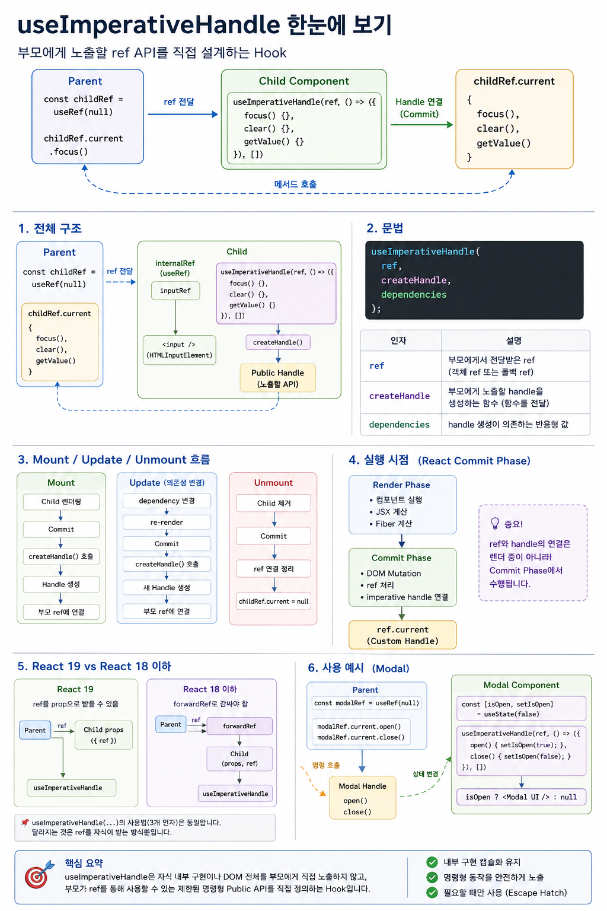

# React `useImperativeHandle`




## 부모에게 노출할 `ref` API를 직접 설계하는 Hook

React에서 `useImperativeHandle`은 자주 사용하는 Hook은 아닙니다.

오히려 React가 기본적으로 지향하는 **선언형(Declarative) 방식으로 해결하기 어려운 경우에 사용하는 Escape Hatch**에 가깝습니다.

핵심부터 정의하면 다음과 같습니다.

> `useImperativeHandle`은 부모가 전달한 `ref`에 **어떤 값을 노출할 것인지 직접 정의하는 Hook**입니다.

일반적으로는 자식 컴포넌트의 DOM 전체를 부모에게 노출하는 대신,

```text
focus()
clear()
open()
close()
scrollToBottom()
```

같은 **제한된 명령형 API(Imperative API)**만 부모에게 제공하기 위해 사용합니다.

---

# 1. 먼저 `ref`부터 생각해 보자

일반적인 DOM `ref`는 다음과 같이 사용합니다.

```jsx
function App() {
  const inputRef = useRef(null);

  return <input ref={inputRef} />;
}
```

Commit Phase에서 React가 `<input>` DOM 노드를 생성하고 `ref`를 연결하면 개념적으로 다음과 같은 관계가 만들어집니다.

```text
inputRef
   │
   ▼
{
  current: HTMLInputElement
}
```

따라서 다음과 같이 실제 DOM API를 사용할 수 있습니다.

```jsx
inputRef.current.focus();
```

즉 일반적인 DOM ref에서는

```text
ref.current
     │
     ▼
실제 DOM Node
```

라는 관계가 만들어집니다.

---

# 2. 그런데 부모가 자식 컴포넌트를 제어해야 한다면?

다음과 같은 컴포넌트가 있다고 생각해 봅시다.

```jsx
function ChildInput() {
  return <input />;
}
```

부모가 다음처럼 사용하고 싶다고 가정해 보겠습니다.

```jsx
function Parent() {
  const childRef = useRef(null);

  return (
    <>
      <ChildInput ref={childRef} />

      <button
        onClick={() => childRef.current?.focus()}
      >
        포커스
      </button>
    </>
  );
}
```

부모가 원하는 것은 단순합니다.

```text
Parent

childRef.current.focus()
          │
          ▼
      ChildInput
          │
          ▼
       <input>
```

그런데 여기에는 설계 문제가 있습니다.

부모에게 자식의 실제 `<input>` DOM 노드를 그대로 노출해야 할까요?

그렇게 하면 부모가 다음과 같은 것까지 모두 접근할 수 있습니다.

```js
childRef.current.value
childRef.current.style
childRef.current.className
childRef.current.remove()
childRef.current.parentNode
...
```

부모가 자식 컴포넌트의 내부 DOM 구현을 너무 많이 알게 됩니다.

이것은 컴포넌트의 **캡슐화(Encapsulation)**를 약하게 만듭니다.

---

# 3. `useImperativeHandle`의 등장

우리가 정말 부모에게 허용하고 싶은 것이 다음 세 가지뿐이라고 해보겠습니다.

```text
focus()
clear()
getValue()
```

이때 `useImperativeHandle`을 사용할 수 있습니다.

React 19 기준:

```jsx
import { useImperativeHandle, useRef } from 'react';

function ChildInput({ ref }) {
  const inputRef = useRef(null);

  useImperativeHandle(ref, () => ({
    focus() {
      inputRef.current?.focus();
    },

    clear() {
      if (inputRef.current) {
        inputRef.current.value = '';
      }
    },

    getValue() {
      return inputRef.current?.value ?? '';
    }
  }), []);

  return <input ref={inputRef} />;
}
```

이제 중요한 변화가 발생합니다.

부모의 `ref.current`가 실제 DOM 노드를 직접 가리키는 것이 아니라,

```text
{
  focus(),
  clear(),
  getValue()
}
```

라는 **커스텀 Handle 객체**를 가리키게 됩니다.

---

# 4. 전체 구조

전체 관계를 그림으로 표현하면 다음과 같습니다.

```text
Parent
│
│ const childRef = useRef(null)
│
▼
<ChildInput ref={childRef} />
             │
             │ ref 전달
             ▼
        ChildInput
             │
             │
             ├── inputRef
             │      │
             │      ▼
             │  HTMLInputElement
             │
             └── useImperativeHandle()
                       │
                       │ 공개 API 생성
                       ▼
                 {
                   focus(),
                   clear(),
                   getValue()
                 }
                       │
                       ▼
              childRef.current
```

여기서 가장 중요한 것은 **두 개의 ref를 구분하는 것**입니다.

```text
부모
childRef
   │
   │ useImperativeHandle
   ▼
Custom Handle

        VS

자식
inputRef
   │
   ▼
HTMLInputElement
```

`inputRef`는 자식 내부의 실제 DOM을 참조합니다.

반면 `childRef`는 부모에게 공개되는 **컴포넌트의 명령형 API**를 참조합니다.

---

# 5. `useImperativeHandle`의 문법

기본 형태는 다음과 같습니다.

```jsx
useImperativeHandle(
  ref,
  createHandle,
  dependencies
);
```

각 인자의 역할은 다음과 같습니다.

| 인자             | 역할                       |
| -------------- | ------------------------ |
| `ref`          | 부모에게서 전달받은 ref           |
| `createHandle` | 부모에게 노출할 handle을 생성하는 함수 |
| `dependencies` | handle 생성이 의존하는 반응형 값    |

예를 들어:

```jsx
useImperativeHandle(ref, () => ({
  focus() {
    inputRef.current?.focus();
  },

  clear() {
    if (inputRef.current) {
      inputRef.current.value = '';
    }
  }
}), []);
```

두 번째 인자는 객체 자체가 아니라 **함수**라는 점이 중요합니다.

잘못된 코드:

```jsx
useImperativeHandle(ref, {
  focus() {}
});
```

올바른 코드:

```jsx
useImperativeHandle(ref, () => ({
  focus() {}
}));
```

즉,

```text
createHandle()
     │
     ▼
Custom Handle
     │
     ▼
부모에게 노출
```

되는 구조입니다.

---

# 6. 부모에서는 어떻게 보이는가?

부모 코드는 다음과 같습니다.

```jsx
function Parent() {
  const childRef = useRef(null);

  const handleFocus = () => {
    childRef.current?.focus();
  };

  const handleClear = () => {
    childRef.current?.clear();
  };

  return (
    <>
      <ChildInput ref={childRef} />

      <button onClick={handleFocus}>
        포커스
      </button>

      <button onClick={handleClear}>
        지우기
      </button>
    </>
  );
}
```

부모 입장에서는 자식 내부가 어떻게 구현되어 있는지 알 필요가 없습니다.

부모가 아는 것은 이것뿐입니다.

```text
childRef.current
        │
        ├── focus()
        ├── clear()
        └── getValue()
```

즉 `ChildInput`이 부모에게 하나의 **공개 API(Public API)**를 제공하는 것처럼 볼 수 있습니다.

---

# 7. 왜 그냥 DOM을 넘겨주지 않는가?

DOM 자체를 노출한다면:

```text
Parent
   │
   ▼
HTMLInputElement
```

부모가 자식의 내부 구현을 직접 알게 됩니다.

하지만 `useImperativeHandle`을 사용하면:

```text
Parent
   │
   ▼
Public Handle
   │
   ├── focus()
   ├── clear()
   └── getValue()
         │
         ▼
    Child 내부 구현
         │
         ▼
 HTMLInputElement
```

가 됩니다.

따라서 자식 내부 구현을 변경해도 공개 API만 유지하면 부모 코드는 변경하지 않아도 됩니다.

이것이 `useImperativeHandle`의 중요한 설계적 의미입니다.

> DOM을 노출하는 것이 아니라 **기능을 노출한다.**

---

# 8. React 내부에서는 언제 연결되는가?

`useImperativeHandle`의 handle 연결은 렌더 중에 수행되는 작업이 아닙니다.

큰 흐름으로 보면:

```text
Render Phase
     │
     │ 컴포넌트 실행
     │ JSX 계산
     │ Fiber 계산
     ▼
Commit Phase
     │
     ├── DOM Mutation
     │
     ├── ref 처리
     │
     └── imperative handle 연결
              │
              ▼
        ref.current
              │
              ▼
        Custom Handle
```

즉 Render Phase에서 다음과 같이 생각하면 안 됩니다.

```text
컴포넌트 함수 실행
      ↓
즉시 ref.current 설정
```

`ref`와 imperative handle의 실제 연결은 **Commit Phase와 관련된 작업**입니다.

따라서 렌더링 로직에서 `ref.current`를 읽어 UI를 계산하는 방식은 피해야 합니다.

---

# 9. Mount / Update / Unmount

개념적으로는 다음과 같이 이해할 수 있습니다.

## Mount

```text
Child 렌더링
    ↓
Commit
    ↓
createHandle()
    ↓
Handle 생성
    ↓
부모 ref에 연결
```

결과:

```text
childRef.current
        │
        ▼
{
  focus(),
  clear()
}
```

## Update

의존성이 변경되면 새로운 handle을 생성하여 ref에 연결합니다.

```text
dependency 변경
      ↓
re-render
      ↓
Commit
      ↓
createHandle()
      ↓
새 Handle
      ↓
ref에 연결
```

## Unmount

컴포넌트가 제거되면 React가 ref 연결도 정리합니다.

개념적으로 객체 ref의 경우:

```text
childRef.current
      │
      ▼
     null
```

이 됩니다.

주의할 점은 이것이 **이해를 위한 개념 모델**이라는 것입니다.

`ref`에는 객체 ref뿐 아니라 callback ref도 사용할 수 있기 때문에 React 내부 구현을 단순히

```js
ref.current = ...
```

라는 대입문 하나로 이해해서는 안 됩니다.

---

# 10. dependencies가 중요한 이유

다음 코드를 보겠습니다.

```jsx
const [count, setCount] = useState(0);

useImperativeHandle(ref, () => ({
  printCount() {
    console.log(count);
  }
}), []);
```

여기에는 문제가 있습니다.

handle을 생성한 함수가 최초 렌더링의 `count`를 closure로 캡처할 수 있기 때문입니다.

예를 들어 최초 값이:

```text
count = 0
```

이었다면 이후 `count`가 증가하더라도 오래된 값을 참조할 수 있습니다.

이것이 **stale closure** 문제입니다.

따라서:

```jsx
useImperativeHandle(ref, () => ({
  printCount() {
    console.log(count);
  }
}), [count]);
```

처럼 실제로 handle 생성이 의존하는 반응형 값을 dependencies에 포함해야 합니다.

반대로 다음처럼 DOM ref만 사용하는 경우:

```jsx
useImperativeHandle(ref, () => ({
  focus() {
    inputRef.current?.focus();
  }
}), []);
```

`inputRef` 객체 자체는 안정적으로 유지되므로 이러한 형태에서는 `[]`를 사용할 수 있습니다.

---

# 11. 실전 예제 — Modal

`useImperativeHandle`이 직관적으로 이해되는 대표적인 예가 Modal입니다.

부모는 다음처럼 사용하고 싶습니다.

```jsx
modalRef.current.open();
modalRef.current.close();
```

자식:

```jsx
function Modal({ ref, title, children }) {
  const [isOpen, setIsOpen] = useState(false);

  useImperativeHandle(ref, () => ({
    open() {
      setIsOpen(true);
    },

    close() {
      setIsOpen(false);
    }
  }), []);

  if (!isOpen) {
    return null;
  }

  return (
    <div>
      <h2>{title}</h2>

      {children}

      <button onClick={() => setIsOpen(false)}>
        닫기
      </button>
    </div>
  );
}
```

부모:

```jsx
function Parent() {
  const modalRef = useRef(null);

  return (
    <>
      <button
        onClick={() => modalRef.current?.open()}
      >
        모달 열기
      </button>

      <Modal ref={modalRef} title="알림">
        내용
      </Modal>
    </>
  );
}
```

구조는 다음과 같습니다.

```text
Parent
   │
   │ modalRef.current.open()
   ▼
Modal Handle
   │
   └── open()
          │
          ▼
     setIsOpen(true)
          │
          ▼
      Re-render
          │
          ▼
       Modal 표시
```

---

# 12. `useRef`와 `useImperativeHandle`의 관계

두 Hook은 역할이 다릅니다.

## `useRef`

```jsx
const ref = useRef(null);
```

렌더링 사이에 유지되는 **ref 객체를 생성**합니다.

```text
useRef
   │
   ▼
{
  current: ...
}
```

## `useImperativeHandle`

```jsx
useImperativeHandle(ref, () => ({
  focus() {}
}));
```

부모에게 전달된 ref에 **어떤 handle을 노출할지 결정**합니다.

따라서:

```text
useRef
  =
ref 객체를 만든다

useImperativeHandle
  =
부모 ref에 노출할 값을 커스터마이징한다
```

라고 구분하면 됩니다.

---

# 13. React 19와 React 18 이하의 차이

`useImperativeHandle` 자체가 React 19에서 새로 바뀐 것은 아닙니다.

바뀐 핵심은 **함수 컴포넌트가 `ref`를 전달받는 방법**입니다.

## React 19

`ref`를 prop으로 받을 수 있습니다.

```jsx
function Child({ ref }) {
  useImperativeHandle(ref, () => ({
    focus() {}
  }));

  return ...;
}
```

## React 18 이하

함수 컴포넌트가 `ref`를 전달받으려면 `forwardRef`가 필요합니다.

```jsx
const Child = forwardRef(function Child(props, ref) {
  useImperativeHandle(ref, () => ({
    focus() {}
  }));

  return ...;
});
```

따라서 버전 차이를 다음처럼 기억하면 쉽습니다.

```text
React 18 이하

Parent
   │
   │ ref
   ▼
forwardRef
   │
   ▼
Child
   │
   ▼
useImperativeHandle


React 19

Parent
   │
   │ ref
   ▼
Child props
   │
   ▼
useImperativeHandle
```

`forwardRef`라는 전달 단계가 필요 없어졌을 뿐,

```jsx
useImperativeHandle(...)
```

의 핵심 역할은 동일합니다.

---

# 14. 언제 사용해야 하는가?

`useImperativeHandle`은 일반적인 부모 → 자식 데이터 전달 방법이 아닙니다.

React의 기본적인 데이터 흐름은:

```text
Parent
   │
   │ props
   ▼
Child
```

입니다.

가능하다면 `props`, `state`, `context`를 이용해 **선언형으로 표현하는 것이 우선**입니다.

`useImperativeHandle`은 다음과 같은 명령형 동작에 적합합니다.

```text
focus()
scrollTo()
play()
pause()
open()
close()
reset()
```

대표적으로:

* 입력창 focus
* 특정 위치로 scroll
* 비디오 play / pause
* animation 제어
* canvas 제어
* 외부 DOM 라이브러리 제어
* 제한된 form API 제공

등입니다.

---

# 15. 피해야 할 사용법

다음과 같은 코드가 계속 늘어나기 시작한다면 설계를 다시 검토해야 합니다.

```jsx
childRef.current.setName(...)
childRef.current.setAge(...)
childRef.current.updateUser(...)
childRef.current.changeMode(...)
childRef.current.setData(...)
```

이것은 사실상 부모가 자식의 상태를 명령형으로 조작하는 구조입니다.

이런 경우 대부분:

```text
props
state
context
```

를 이용한 선언형 구조가 더 적절합니다.

반면:

```jsx
inputRef.current.focus();
modalRef.current.open();
videoRef.current.play();
```

같은 것은 본질적으로 명령형인 UI 동작이기 때문에 ref 기반 API가 자연스러울 수 있습니다.

---

# 16. 핵심 구조 최종 정리

`useImperativeHandle`의 핵심을 하나의 그림으로 정리하면 다음과 같습니다.

```text
                 Parent
                    │
                    │
          const ref = useRef(null)
                    │
                    ▼
              <Child ref={ref}>
                    │
                    │ ref 전달
                    ▼
                 Child
                    │
        ┌───────────┴───────────┐
        │                       │
        ▼                       ▼
    internalRef        useImperativeHandle
        │                       │
        ▼                       │
 Actual DOM Node               │
                                │
                         createHandle()
                                │
                                ▼
                        ┌──────────────┐
                        │   Public API │
                        │              │
                        │ focus()      │
                        │ clear()      │
                        │ getValue()   │
                        └──────┬───────┘
                               │
                               ▼
                       Parent's ref.current
```

핵심은 이것입니다.

```text
자식 내부

DOM
 │
 ▼
internalRef


부모에게 공개

Custom Handle
 │
 ▼
parentRef.current
```

`useImperativeHandle`은 이 둘 사이에 위치하여 **자식 내부 구현과 부모에게 공개할 API를 분리**합니다.

---

# 17. 한 문장 정의

> **`useImperativeHandle`은 자식 컴포넌트의 내부 구현이나 DOM 전체를 부모에게 직접 노출하지 않고, 부모가 `ref`를 통해 사용할 수 있는 제한된 명령형 Public API를 직접 정의하는 React Hook이다.**

조금 더 내부 동작 관점에서 표현하면:

> **부모가 전달한 `ref`에 실제 DOM 노드를 그대로 연결하는 대신, `createHandle`이 생성한 커스텀 handle을 Commit 과정에서 연결함으로써 부모에게 노출되는 명령형 인터페이스를 제어하는 Hook이다.**

---

# 핵심 요약

```text
useRef
   ↓
ref 객체 생성

ref 전달
   ↓
Parent → Child

useImperativeHandle
   ↓
부모에게 무엇을 노출할지 결정

createHandle()
   ↓
Custom Handle 생성

Commit
   ↓
부모 ref에 Handle 연결

Parent
   ↓
ref.current.focus()
ref.current.clear()
ref.current.open()
```

따라서 `useImperativeHandle`을 단순히

> "부모가 자식 함수를 호출하게 해주는 Hook"

이라고만 이해하면 부족합니다.

더 정확한 핵심은:

> **부모에게 노출되는 `ref`의 인터페이스 자체를 자식이 설계하게 해주는 Hook**

입니다.


