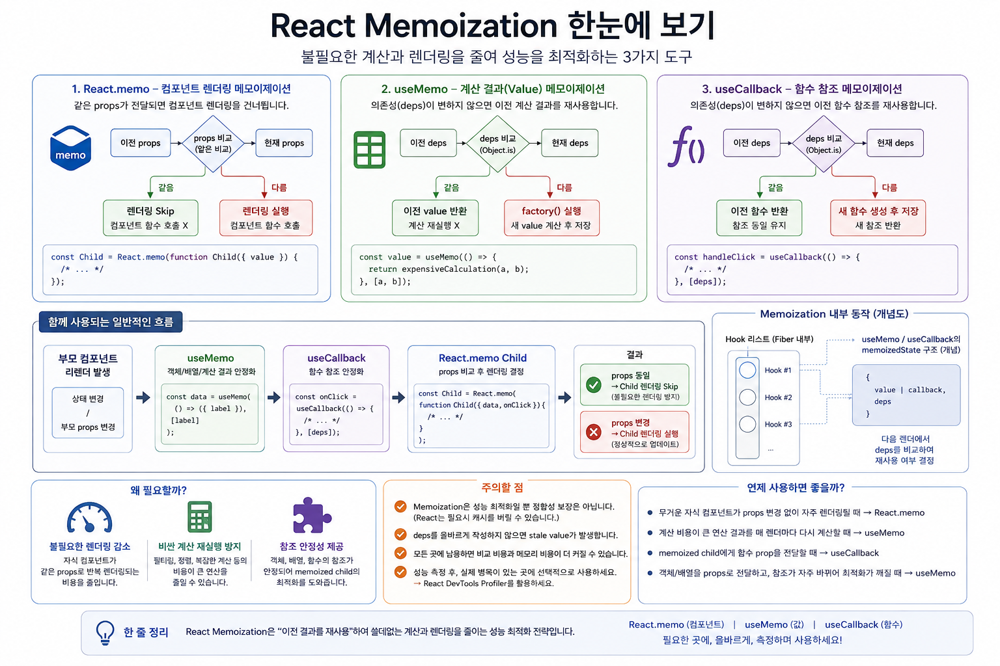

# React Memoization

React에서 **메모이제이션(Memoization)** 은 이전에 계산하거나 생성한 결과를 재사용하여 **불필요한 계산과 렌더링을 줄이는 성능 최적화 기법**입니다.





함수 컴포넌트는 리렌더링될 때 컴포넌트 함수가 다시 실행됩니다.

```jsx
function Counter({ count }) {
  console.log('render');

  return <div>{count}</div>;
}
```

따라서 렌더링 과정에서 다음과 같은 작업이 반복될 수 있습니다.

```text
컴포넌트 리렌더링
        │
        ├─ 컴포넌트 함수 실행
        │
        ├─ 계산 다시 실행
        │
        ├─ 객체/배열 다시 생성
        │
        ├─ 함수 다시 생성
        │
        └─ 자식 컴포넌트 렌더링
```

이 중 **입력이 변하지 않았는데도 반복되는 비용이 큰 작업**이 있다면 이전 결과를 재사용하는 것을 고려할 수 있습니다.

React에서 대표적으로 사용하는 도구는 다음 세 가지입니다.

| 도구            | 메모이제이션 대상   | 주요 목적                 |
| ------------- | ----------- | --------------------- |
| `React.memo`  | 컴포넌트 렌더링 결과 | 불필요한 자식 렌더링 감소        |
| `useMemo`     | 계산 결과       | 비싼 계산 재실행 방지 / 참조 안정화 |
| `useCallback` | 함수 참조       | 함수 prop의 참조 안정화       |

---

# 1. 메모이제이션의 기본 원리

일반적인 프로그래밍에서 메모이제이션은 다음 아이디어입니다.

> 같은 입력에 대해 같은 계산을 반복해야 한다면 이전 계산 결과를 저장해 두었다가 재사용한다.

예를 들어:

```js
const cache = {};

function memoFib(n) {
  if (cache[n] !== undefined) {
    return cache[n];
  }

  if (n <= 1) {
    return n;
  }

  const result = memoFib(n - 1) + memoFib(n - 2);

  cache[n] = result;

  return result;
}
```

핵심은 단순합니다.

```text
입력
 │
 ▼
이전에 계산했는가?
 │
 ├─ YES ──→ 이전 결과 재사용
 │
 └─ NO ───→ 계산 → 저장 → 반환
```

React의 메모이제이션도 기본 원리는 같습니다.

다만 React에서는 단순 계산뿐 아니라 다음과 같은 것들이 대상이 됩니다.

```text
계산 결과
객체 / 배열
함수 참조
컴포넌트 렌더링
```

---

# 2. React에서 왜 메모이제이션이 필요한가?

React 함수 컴포넌트는 리렌더링되면 다시 호출됩니다.

```jsx
function Parent() {
  const [count, setCount] = useState(0);

  return (
    <>
      <button onClick={() => setCount(count + 1)}>
        {count}
      </button>

      <Child />
    </>
  );
}
```

`count`가 변경되면 `Parent`가 다시 렌더링됩니다.

기본적으로 부모가 렌더링되면 그 렌더 과정에서 자식 엘리먼트도 다시 평가됩니다.

```text
setCount()
    │
    ▼
Parent 리렌더
    │
    ▼
Parent() 다시 실행
    │
    ▼
새 React Element 계산
    │
    ▼
Child 렌더링 검토
```

대부분의 경우 이것은 문제가 아닙니다.

React 컴포넌트의 렌더링은 보통 충분히 빠르기 때문입니다.

문제가 되는 것은 다음과 같은 경우입니다.

```text
수백~수천 개의 컴포넌트
        +
비싼 계산
        +
부모의 잦은 리렌더링
        +
실제로는 변하지 않는 자식
```

이때 메모이제이션을 고려합니다.

---

# 3. React.memo — 컴포넌트 렌더링 최적화

`React.memo`는 컴포넌트를 메모이제이션하는 API입니다.

```jsx
const Child = React.memo(function Child({ value }) {
  console.log('Child render');

  return <div>{value}</div>;
});
```

부모가 다시 렌더링되더라도 `Child`가 받는 props가 이전과 같다면 React는 `Child` 렌더링을 건너뛸 수 있습니다.

개념적으로:

```text
Parent 리렌더
      │
      ▼
Memoized Child
      │
      ▼
이전 props와 현재 props 비교
      │
   ┌──┴──┐
   │     │
 같음   다름
   │     │
   ▼     ▼
Skip   Render
```

## Props 비교

기본적으로 props의 각 값을 비교합니다.

```js
Object.is(prevProp, nextProp)
```

따라서 원시값은 비교하기 쉽습니다.

```jsx
<Child count={10} />
```

하지만 객체, 배열, 함수는 참조값이 중요합니다.

```js
Object.is(
  { name: 'Kim' },
  { name: 'Kim' }
);

// false
```

내용이 같아 보여도 서로 다른 객체입니다.

---

# 4. React.memo가 쉽게 깨지는 이유

다음 코드를 보겠습니다.

```jsx
const Child = React.memo(function Child({ options }) {
  return <div>{options.name}</div>;
});

function Parent() {
  const options = {
    name: 'React'
  };

  return <Child options={options} />;
}
```

`Parent`가 렌더링될 때마다:

```js
{
  name: 'React'
}
```

라는 **새 객체**가 만들어집니다.

따라서:

```text
이전 options ──→ 객체 A

다음 렌더

새 options ────→ 객체 B
```

내용은 같지만:

```js
Object.is(A, B) === false
```

이므로 `React.memo`의 최적화를 방해합니다.

여기에서 `useMemo`가 필요해질 수 있습니다.

---

# 5. useMemo — 계산 결과를 재사용한다

기본 형태는 다음과 같습니다.

```jsx
const value = useMemo(() => {
  return expensiveCalculation(a, b);
}, [a, b]);
```

개념적으로:

```text
렌더
 │
 ▼
현재 deps
 │
 ▼
이전 deps와 비교
 │
 ├─ 동일
 │    │
 │    └─ 이전 value 반환
 │
 └─ 변경
      │
      └─ factory 실행
            │
            ▼
         새 value
            │
            ▼
           저장
```

예를 들어:

```jsx
function ProductList({ products, query }) {
  const filteredProducts = useMemo(() => {
    return products
      .filter(product => product.name.includes(query))
      .sort((a, b) =>
        a.name.localeCompare(b.name)
      );
  }, [products, query]);

  return (
    <ul>
      {filteredProducts.map(product => (
        <li key={product.id}>
          {product.name}
        </li>
      ))}
    </ul>
  );
}
```

`products`와 `query`가 변하지 않았다면 이전 계산 결과를 재사용할 수 있습니다.

## 중요한 점

`useMemo`는 컴포넌트의 리렌더링 자체를 막지 않습니다.

```text
Component 리렌더
        │
        ▼
Component() 실행
        │
        ▼
useMemo 호출
        │
        ▼
deps 비교
        │
   ┌────┴────┐
 동일       변경
   │          │
기존 값     재계산
```

즉:

> `useMemo`는 렌더링을 막는 것이 아니라 렌더링 과정에서 특정 계산의 재실행을 줄이기 위한 도구입니다.

---

# 6. useMemo를 이용한 참조 안정화

`useMemo`는 비싼 계산뿐 아니라 객체나 배열의 참조를 안정적으로 유지하는 데도 사용할 수 있습니다.

```jsx
function Parent({ label }) {
  const options = useMemo(() => {
    return { label };
  }, [label]);

  return <Child options={options} />;
}
```

`label`이 변하지 않는 동안에는 이전 `options` 객체를 재사용할 수 있습니다.

따라서:

```text
Parent
 │
 ├─ useMemo
 │     │
 │     └─ 같은 options reference
 │
 ▼
React.memo(Child)
 │
 ▼
props 동일
 │
 ▼
렌더링 Skip 가능
```

`React.memo`와 `useMemo`가 서로 협력하는 대표적인 사례입니다.

---

# 7. useCallback — 함수 참조를 재사용한다

함수 역시 객체와 마찬가지로 참조값을 가집니다.

```js
const a = () => {};
const b = () => {};

a === b; // false
```

컴포넌트 내부에서 함수 표현식을 사용하면 렌더 과정에서 새로운 함수 값이 만들어집니다.

```jsx
function Parent() {
  const handleClick = () => {
    console.log('click');
  };

  return <Child onClick={handleClick} />;
}
```

따라서 memoized child에게 함수를 prop으로 전달하면 참조가 달라져 메모이제이션이 깨질 수 있습니다.

```text
Render #1
handleClick ──→ Function A

Render #2
handleClick ──→ Function B
```

`useCallback`은 이 문제를 해결하기 위한 도구입니다.

```jsx
const handleClick = useCallback(() => {
  console.log('click');
}, []);
```

deps가 변하지 않았다면 React는 이전에 캐시한 함수 참조를 반환합니다.

```text
Render #1
       │
       ▼
Function A
       │
       ▼
useCallback에 의해 캐시

Render #2
       │
       ▼
deps 동일
       │
       ▼
Function A 반환
```

중요한 점은 `useCallback`을 **함수 생성을 막는 문법**으로 이해하면 안 된다는 것입니다.

정확한 의미는:

> `useCallback`은 렌더 사이에서 React가 반환하는 함수 참조를 캐싱하는 Hook이다.

---

# 8. React.memo + useMemo + useCallback

세 가지가 함께 사용되는 전형적인 구조를 보겠습니다.

```jsx
const Child = React.memo(function Child({
  data,
  onClick
}) {
  console.log('Child render');

  return (
    <button onClick={onClick}>
      {data.label}
    </button>
  );
});

function Parent({ label }) {
  const data = useMemo(
    () => ({ label }),
    [label]
  );

  const handleClick = useCallback(() => {
    console.log('clicked');
  }, []);

  return (
    <Child
      data={data}
      onClick={handleClick}
    />
  );
}
```

관계를 정리하면:

```text
                    Parent
                       │
          ┌────────────┴────────────┐
          │                         │
       useMemo                 useCallback
          │                         │
          ▼                         ▼
   data 참조 안정화          함수 참조 안정화
          │                         │
          └────────────┬────────────┘
                       ▼
                React.memo Child
                       │
                       ▼
                  props 비교
                       │
                ┌──────┴──────┐
                │             │
              동일           변경
                │             │
                ▼             ▼
              Skip          Render
```

---

# 9. Hook 내부에서는 어떻게 기억하는가?

`useMemo`와 `useCallback`은 Hook입니다.

따라서 React는 해당 Hook의 정보를 컴포넌트 Fiber와 연결된 Hook 상태에 보관합니다.

개념적으로:

```text
Fiber
 │
 ▼
Hook #1
memoizedState
 │
 ▼
Hook #2
memoizedState
 │
 ▼
Hook #3
memoizedState
```

`useMemo`를 교육용 의사 코드로 단순화하면 다음과 같이 이해할 수 있습니다.

```js
function useMemo(factory, deps) {
  const hook = getCurrentHook();

  const previous = hook.memoizedState;

  if (
    previous &&
    areHookInputsEqual(
      previous.deps,
      deps
    )
  ) {
    return previous.value;
  }

  const value = factory();

  hook.memoizedState = {
    value,
    deps
  };

  return value;
}
```

실제 React 내부 자료구조를 그대로 표현한 코드는 아니며, **동작 원리를 설명하기 위한 의사 코드**입니다.

핵심은 다음입니다.

```text
이전 값 + 이전 deps 저장
          │
          ▼
다음 렌더에서 deps 비교
          │
     ┌────┴────┐
     │         │
   같음       다름
     │         │
     ▼         ▼
  재사용      재계산
```

---

# 10. 메모이제이션은 공짜가 아니다

메모이제이션에는 비용도 존재합니다.

```text
Memoization

얻는 것
 ├─ 계산 감소
 ├─ 렌더링 감소
 └─ 참조 안정성

지불하는 것
 ├─ dependency 비교
 ├─ 캐시 유지
 ├─ 코드 복잡도
 └─ dependency 관리
```

따라서:

```jsx
const value = useMemo(
  () => count * 2,
  [count]
);
```

처럼 매우 가벼운 계산까지 습관적으로 `useMemo`로 감쌀 필요는 없습니다.

메모이제이션은 **성능 문제가 실제로 존재하는 곳에서 선택적으로 적용하는 최적화 기법**으로 이해하는 것이 좋습니다.

---

# 11. 의존성 배열과 stale value

다음 코드는 문제가 있습니다.

```jsx
const value = useMemo(() => {
  return count * 2;
}, []);
```

계산에서 `count`를 사용하지만 dependency에 포함하지 않았습니다.

따라서:

```text
첫 렌더
count = 1
value = 2

       ↓

count = 10

       ↓

deps = []

       ↓

기존 value 재사용

       ↓

value = 2
```

잘못된 이전 값을 계속 사용할 수 있습니다.

따라서 Hook 내부에서 사용하는 reactive value는 올바르게 dependency에 포함해야 합니다.

---

# 12. 언제 사용해야 하는가?

다음과 같은 경우 메모이제이션을 고려할 가치가 있습니다.

### 비싼 계산

```jsx
useMemo(() => {
  return expensiveCalculation(data);
}, [data]);
```

### 무거운 memoized child

```jsx
const Child = React.memo(...);
```

### memoized child에게 객체 전달

```jsx
const options = useMemo(
  () => ({ theme, size }),
  [theme, size]
);
```

### memoized child에게 함수 전달

```jsx
const handleClick = useCallback(() => {
  ...
}, [deps]);
```

반대로 단순한 컴포넌트에 무조건 적용하는 것은 피하는 편이 좋습니다.

---

# 13. 최적화의 올바른 순서

메모이제이션부터 적용하기보다는 다음 순서가 좋습니다.

```text
1. 성능 문제 측정
        │
        ▼
2. 왜 렌더링되는지 확인
        │
        ▼
3. 컴포넌트 구조 / State 위치 확인
        │
        ▼
4. 불필요한 Effect 확인
        │
        ▼
5. 필요한 부분만 Memoization
        │
        ▼
6. 다시 측정
```

React DevTools Profiler를 사용하면 어떤 컴포넌트가 자주 또는 오래 렌더링되는지 확인할 수 있습니다.

특히 다음 구조적 개선을 먼저 검토하는 것이 좋습니다.

```text
State를 필요한 위치에 가깝게 배치
        +
불필요한 Effect 제거
        +
Context 범위 조절
        +
children을 이용한 컴포지션
        +
큰 리스트라면 virtualization 검토
```

그 이후에도 병목이 남아 있다면 `React.memo`, `useMemo`, `useCallback`을 적용합니다.

---

# 14. React Compiler 시대의 메모이제이션

최근 React에서는 **React Compiler**가 중요한 변화입니다.

React Compiler는 빌드 시 React 코드를 분석하여 필요한 메모이제이션을 자동으로 적용할 수 있습니다.

개념적으로:

```text
작성한 React 코드
       │
       ▼
React Compiler
       │
       ├─ dependency 분석
       ├─ 값 분석
       ├─ 함수 분석
       └─ 컴포넌트 분석
       │
       ▼
자동 최적화된 코드
```

따라서 Compiler를 사용하는 프로젝트에서는 수동으로 작성해야 하는:

```jsx
React.memo(...)
useMemo(...)
useCallback(...)
```

의 필요성이 크게 줄어들 수 있습니다.

중요한 것은:

> React Compiler와 React 버전 자체를 같은 개념으로 보면 안 됩니다.

React Compiler는 React 애플리케이션을 **빌드 시점에 분석하고 최적화하는 별도의 컴파일러**입니다.

Compiler를 사용하는 새 코드에서는 자동 메모이제이션을 기본으로 활용하고, 개발자가 메모이제이션 동작을 세밀하게 제어해야 하는 경우 등에 `useMemo`나 `useCallback`을 사용할 수 있습니다.

기존 코드의 수동 메모이제이션 역시 무조건 제거할 필요는 없습니다.

---

# 15. 최종 정리

React의 메모이제이션을 한 문장으로 정의하면 다음과 같습니다.

> **React Memoization은 이전 렌더에서 계산하거나 생성한 결과와 참조를 재사용하여, 동일한 작업의 반복을 줄이는 성능 최적화 전략이다.**

세 가지 도구의 차이는 반드시 구분해야 합니다.

```text
React.memo
│
└─ 컴포넌트 렌더링 최적화


useMemo
│
└─ 계산 결과(Value) 캐싱


useCallback
│
└─ 함수 Reference 캐싱
```

그리고 가장 중요한 원칙은:

```text
Memoization
    ≠
무조건 사용해야 하는 React 문법

Memoization
    =
필요할 때 선택적으로 사용하는
성능 최적화 기법
```

따라서 실무에서는 다음 순서를 기억하는 것이 좋습니다.

```text
측정
 ↓
원인 파악
 ↓
구조 개선
 ↓
필요한 부분만 Memoization
 ↓
다시 측정
```

React Compiler를 사용하는 환경에서는 이 과정의 상당 부분을 Compiler가 자동화할 수 있지만, **참조 동일성, 렌더링 전파, dependency, memoization의 원리를 이해하는 것은 여전히 중요합니다.**
