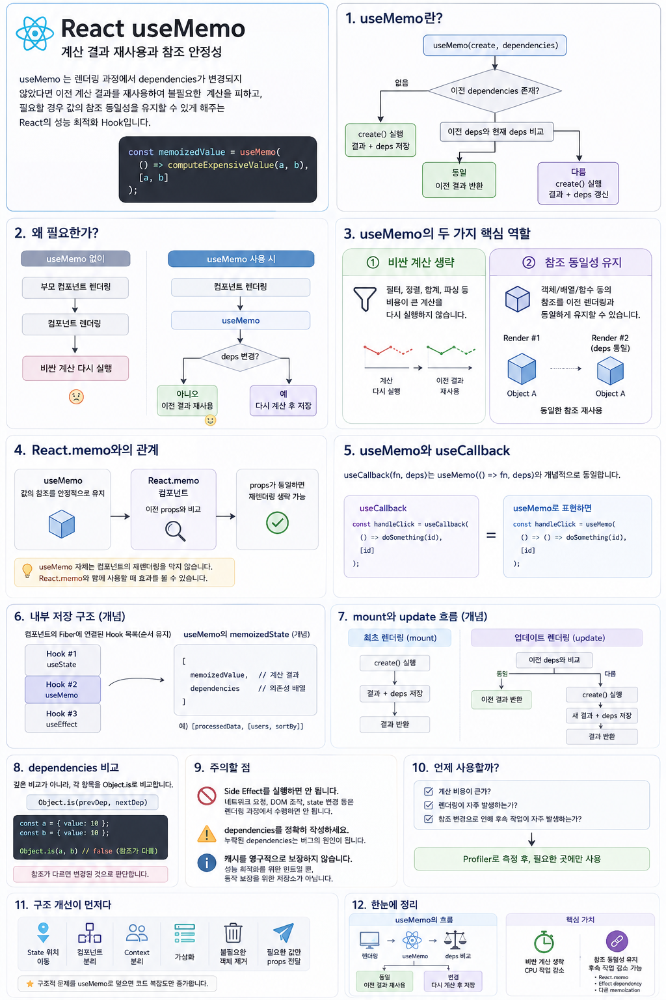

# React `useMemo`

`useMemo`는 React에서 가장 쉽게 **과도하게 사용되는 최적화 Hook** 중 하나입니다.

단순히

> "`useMemo`를 사용하면 성능이 좋아진다."

라고 이해하면 정확하지 않습니다.

`useMemo`의 핵심은 다음 두 가지입니다.

1. **비싼 계산을 다시 실행하지 않고 이전 계산 결과를 재사용한다.**
2. **객체·배열과 같은 값의 참조를 이전 렌더링과 동일하게 유지할 수 있다.**

하지만 이것은 어디까지나 **성능 최적화**입니다.

> `useMemo`를 제거했을 때 성능은 달라질 수 있지만
> 프로그램의 동작 자체가 달라져서는 안 됩니다.




---

# 1. `useMemo`란?

```tsx
const memoizedValue = useMemo(
  () => computeExpensiveValue(a, b),
  [a, b]
);
```

개념적으로는 다음과 같이 동작합니다.

```text
Component Render
       │
       ▼
useMemo(create, [a, b])
       │
       ▼
이전 dependencies 존재?
       │
       ├── 없음 ────────────────┐
       │                        │
       ▼                        ▼
이전 deps와 현재 deps 비교     create() 실행
       │                        │
       │                        ▼
       │                  결과 + deps 저장
       │                        │
       ├── 동일 ────────────────┤
       │                        │
       │                        ▼
       │                  계산 결과 반환
       │
       └── 다름
              │
              ▼
          create() 실행
              │
              ▼
        결과 + deps 갱신
              │
              ▼
            반환
```

즉,

```text
dependencies 동일
        ↓
이전 계산 결과 재사용

dependencies 변경
        ↓
다시 계산
        ↓
새 결과 저장
```

입니다.

---

# 2. 왜 필요한가?

React 함수 컴포넌트는 렌더링될 때 함수가 다시 실행됩니다.

```tsx
function Report({ data }) {
  const summary = heavySummaryCalculation(data);

  return <SummaryView summary={summary} />;
}
```

`Report`가 다시 렌더링되면

```tsx
heavySummaryCalculation(data)
```

도 다시 실행됩니다.

문제는 `data`가 변하지 않았는데 다른 이유로 컴포넌트가 렌더링되는 경우입니다.

```text
부모 컴포넌트 렌더링
        ↓
Report 렌더링
        ↓
heavySummaryCalculation(data)
        ↓
다시 계산
```

계산 비용이 매우 크다면 불필요한 작업이 됩니다.

이때 `useMemo`를 사용할 수 있습니다.

```tsx
function Report({ data }) {
  const summary = useMemo(
    () => heavySummaryCalculation(data),
    [data]
  );

  return <SummaryView summary={summary} />;
}
```

이제 `data`가 변하지 않았다면 이전 계산 결과를 재사용할 수 있습니다.

```text
Report 다시 렌더링
        ↓
useMemo
        ↓
data가 이전과 같은가?
   ┌────┴────┐
  YES       NO
   │         │
   ▼         ▼
이전 결과    다시 계산
재사용       후 저장
```

---

# 3. 기본 문법

```tsx
const memoizedValue = useMemo(
  create,
  dependencies
);
```

타입 관점에서는 개념적으로 다음과 같습니다.

```ts
const memoizedValue = useMemo<T>(
  () => T,
  dependencies
);
```

첫 번째 아규먼트는 **계산 함수**입니다.

```tsx
() => {
  return expensiveCalculation();
}
```

이 함수의 반환값이 메모이제이션 대상입니다.

두 번째 아규먼트는 **의존성 배열(dependencies)** 입니다.

```tsx
[a, b]
```

React는 이전 dependencies와 현재 dependencies의 각 항목을 비교합니다.

개념적으로:

```js
Object.is(previousDependency, nextDependency)
```

를 사용한다고 이해하면 됩니다.

---

# 4. `useMemo`의 첫 번째 역할 — 비싼 계산 생략

가장 대표적인 사용 목적입니다.

```tsx
function UserList({ users, onlyActive, sortBy }) {
  const result = useMemo(() => {
    let filtered = users;

    if (onlyActive) {
      filtered = filtered.filter(
        user => user.isActive
      );
    }

    if (sortBy === "name") {
      filtered = [...filtered].sort(
        (a, b) => a.name.localeCompare(b.name)
      );
    }

    return filtered;
  }, [users, onlyActive, sortBy]);

  return (
    <ul>
      {result.map(user => (
        <li key={user.id}>{user.name}</li>
      ))}
    </ul>
  );
}
```

dependencies 중 하나라도 변경되면 다시 계산합니다.

```text
users
onlyActive
sortBy
    │
    ▼
하나라도 변경?
 ┌──┴──┐
NO    YES
│      │
▼      ▼
이전    filter / sort
결과    다시 실행
사용
```

데이터가 크고 계산 비용이 높으며 컴포넌트가 자주 렌더링된다면 효과가 있을 수 있습니다.

---

# 5. 두 번째 역할 — 참조 동일성 유지

실무에서 중요한 또 하나의 역할입니다.

JavaScript의 객체와 배열은 **참조 타입**입니다.

```js
{} === {}           // false
[1, 2] === [1, 2]   // false
```

내용이 같아도 새로 생성된 객체라면 다른 참조입니다.

예를 들어:

```tsx
function Parent({ theme }) {
  const style = {
    color: theme === "dark"
      ? "white"
      : "black"
  };

  return <Child style={style} />;
}
```

`Parent`가 렌더링될 때마다

```tsx
{
  color: ...
}
```

라는 새로운 객체가 만들어집니다.

```text
Render #1

style ──────▶ Object A


Render #2

style ──────▶ Object B
```

내용이 같더라도

```js
ObjectA === ObjectB
// false
```

입니다.

따라서 `Child`가 다음처럼 메모이제이션되어 있어도

```tsx
const Child = React.memo(function Child({ style }) {
  return <div style={style}>Hello</div>;
});
```

`style` prop의 참조가 계속 바뀐다면 props가 변경된 것으로 판단될 수 있습니다.

이때:

```tsx
const style = useMemo(
  () => ({
    color: theme === "dark"
      ? "white"
      : "black"
  }),
  [theme]
);
```

로 만들 수 있습니다.

`theme`이 변하지 않았다면:

```text
Render #1
style ──────┐
            ▼
          Object A

Render #2
style ──────┘
```

동일한 객체 참조를 재사용할 수 있습니다.

---

# 6. 중요한 관계 — `useMemo`와 `React.memo`

두 기능은 역할이 다릅니다.

| 기능           | 대상   | 목적                                  |
| ------------ | ---- | ----------------------------------- |
| `useMemo`    | 값    | 계산 결과 또는 참조 재사용                     |
| `React.memo` | 컴포넌트 | props가 이전과 같을 때 재렌더링을 건너뛸 수 있도록 최적화 |

예를 들어:

```tsx
const Child = React.memo(function Child({ data }) {
  return <Chart data={data} />;
});

function Parent({ items }) {
  const processed = useMemo(
    () => heavyProcess(items),
    [items]
  );

  return <Child data={processed} />;
}
```

여기서는 두 최적화가 서로 연결됩니다.

```text
useMemo
   │
   │ processed 참조 유지
   ▼
React.memo Child
   │
   │ props 비교
   ▼
같다면 Child 재렌더링 생략 가능
```

중요한 것은:

> `useMemo` 자체는 컴포넌트의 재렌더링을 막지 않습니다.

`Parent`는 여전히 렌더링됩니다.

`useMemo`는 렌더링 과정에서 **특정 계산을 생략하거나 이전 값의 참조를 재사용**할 뿐입니다.

---

# 7. `useMemo`와 `useCallback`

두 Hook은 매우 밀접한 관계가 있습니다.

```tsx
useMemo(() => value, deps)
```

는 **값**을 메모이제이션합니다.

반면

```tsx
useCallback(fn, deps)
```

는 **함수 참조**를 메모이제이션합니다.

개념적으로 다음 관계로 이해할 수 있습니다.

```js
useCallback(fn, deps)
```

≈

```js
useMemo(() => fn, deps)
```

예를 들어:

```tsx
const handleClick = useCallback(
  () => doSomething(id),
  [id]
);
```

은 `id`가 변하지 않았다면 이전에 반환했던 함수 참조를 다시 사용할 수 있게 합니다.

---

# 8. `useMemo`가 함수 생성을 막아주는 것은 아니다

다음 코드를 보겠습니다.

```tsx
const value = useMemo(
  () => heavy(a),
  [a]
);
```

렌더링될 때마다

```tsx
() => heavy(a)
```

라는 화살표 함수 표현식 자체는 평가됩니다.

`useMemo`의 핵심은 이 함수 객체의 생성을 막는 것이 아닙니다.

dependencies가 같다면 **이 함수의 계산 로직을 실행하지 않고 이전 결과를 반환하는 것**이 핵심입니다.

마찬가지로:

```tsx
const handle = useCallback(
  () => doSomething(a),
  [a]
);
```

에서도 화살표 함수 표현식은 렌더링 과정에서 평가됩니다.

`useCallback`은 이전에 선택된 함수 참조를 다시 반환할 수 있게 합니다.

따라서 메모이제이션의 진짜 목적은 단순한 함수 객체 생성 비용을 줄이는 것이 아니라,

```text
참조 변경
   ↓
자식 컴포넌트 재렌더링
effect 재실행
리스너 재등록
비싼 후속 계산
...
```

같은 **후속 작업을 줄이는 것**에 있습니다.

---

# 9. 참조 안정화가 필요하다고 무조건 `useMemo`를 쓰지 않는다

다음 객체를 보겠습니다.

```tsx
const options = {
  debounce: 300,
  minLength: 2
};
```

이 값이 컴포넌트의 props나 state에 전혀 의존하지 않는 상수라면:

```tsx
const options = useMemo(
  () => ({
    debounce: 300,
    minLength: 2
  }),
  []
);
```

보다 더 간단한 방법이 있습니다.

```tsx
const SEARCH_OPTIONS = {
  debounce: 300,
  minLength: 2
};

function SearchBox() {
  // ...
}
```

즉 컴포넌트 밖으로 이동합니다.

참조 안정화가 필요할 때는 다음 순서로 생각하는 것이 좋습니다.

```text
값이 컴포넌트 상태와 무관한 상수인가?
        │
       YES
        ▼
모듈 스코프로 이동
        │
       NO
        ▼
객체 자체를 전달해야 하는가?
        │
       NO
        ▼
필요한 원시값만 전달
        │
       YES
        ▼
useMemo 검토
```

`useMemo`부터 사용하는 것이 아니라 **더 단순한 구조로 해결할 수 있는지 먼저 확인**하는 것이 좋습니다.

---

# 10. 내부에서는 어떻게 저장되는가?

React 함수 컴포넌트의 Hook 정보는 해당 컴포넌트의 Fiber와 연결된 Hook 데이터 구조에 저장됩니다.

개념적으로:

```text
Component Fiber
      │
      ▼
Hook #1
      │
      ▼
Hook #2
      │
      ▼
Hook #3
```

처럼 Hook 호출 순서에 대응되는 정보가 유지됩니다.

`useMemo`의 경우 개념적으로 Hook의 `memoizedState`에 다음과 같은 정보가 저장된다고 이해할 수 있습니다.

```js
[
  memoizedValue,
  dependencies
]
```

예:

```js
[
  processedData,
  [users, sortBy]
]
```

---

# 11. 최초 렌더링과 업데이트 렌더링

실제 React 내부 구현은 mount와 update 경로를 구분합니다.

개념적으로 단순화하면 다음과 같습니다.

## 최초 렌더링

```js
function mountMemo(create, deps) {
  const hook = createHook();

  const value = create();

  hook.memoizedState = [
    value,
    deps
  ];

  return value;
}
```

처음에는 비교할 이전 dependencies가 없으므로 계산 함수를 실행합니다.

```text
create()
   ↓
value
   ↓
[value, deps] 저장
```

## 업데이트 렌더링

```js
function updateMemo(create, deps) {
  const hook = getCurrentHook();

  const [prevValue, prevDeps]
    = hook.memoizedState;

  if (areHookInputsEqual(deps, prevDeps)) {
    return prevValue;
  }

  const nextValue = create();

  hook.memoizedState = [
    nextValue,
    deps
  ];

  return nextValue;
}
```

즉:

```text
현재 deps
   │
   ▼
이전 deps와 비교
   │
 ┌─┴─┐
 │   │
같음 다름
 │   │
 ▼   ▼
이전  create()
값     실행
반환    │
        ▼
      새 값 저장
```

입니다.

---

# 12. dependencies 비교

dependencies 비교는 깊은 객체 비교가 아닙니다.

```tsx
useMemo(
  () => calculate(data),
  [data]
);
```

React가 `data` 객체 내부의 모든 프로퍼티를 재귀적으로 검사하는 것이 아닙니다.

개념적으로:

```js
Object.is(previousData, currentData)
```

와 같이 **dependency 자체의 동일성**을 비교합니다.

따라서:

```js
const a = { value: 10 };
const b = { value: 10 };

Object.is(a, b);
// false
```

입니다.

이것이 React에서 **참조 동일성(referential equality)**이 중요한 이유입니다.

---

# 13. `useMemo` 안에서는 Side Effect를 실행하면 안 된다

잘못된 예:

```tsx
const value = useMemo(() => {
  fetch("/api/user");

  return calculate();
}, []);
```

`useMemo`의 계산 함수는 **렌더링 과정에서 실행될 수 있습니다.**

따라서 여기서는 외부 시스템을 변경하는 작업이 아니라 **순수한 계산**을 수행해야 합니다.

예를 들어 다음과 같은 작업은 `useMemo`의 목적이 아닙니다.

```text
네트워크 요청
DOM 조작
state 변경
외부 시스템 연결
subscription 등록
```

이런 작업은 실행 이유에 따라 이벤트 핸들러나 Effect 등 적절한 위치에서 처리해야 합니다.

---

# 14. dependencies를 잘못 작성하면 버그가 발생한다

```tsx
const doubled = useMemo(
  () => count * 2,
  []
);
```

이 코드는 잘못되었습니다.

`count`를 사용하고 있는데 dependencies에 `count`가 없습니다.

따라서 `count`가 변경되어도 이전 결과가 재사용될 수 있습니다.

올바른 형태:

```tsx
const doubled = useMemo(
  () => count * 2,
  [count]
);
```

물론 이 계산은 너무 간단하기 때문에 실제로는:

```tsx
const doubled = count * 2;
```

라고 작성하는 편이 낫습니다.

이 예제는 `useMemo`의 중요한 원칙을 보여줍니다.

> `useMemo`를 사용할 수 있다고 해서 반드시 사용해야 하는 것은 아닙니다.

---

# 15. `useMemo`는 캐시를 영구적으로 보장하는 저장소가 아니다

이 부분은 매우 중요합니다.

`useMemo`는 프로그램의 의미를 유지하기 위한 저장 장치가 아니라 **성능 최적화 수단**입니다.

따라서 다음처럼 생각하면 안 됩니다.

```tsx
const id = useMemo(
  () => crypto.randomUUID(),
  []
);
```

의 의미를

```text
"이 값은 컴포넌트 생명 동안 반드시 한 번만 생성된다."
```

라고 해석해서는 안 됩니다.

`useMemo`의 캐시는 프로그램의 의미론적 보장을 위한 저장소가 아닙니다.

따라서:

> `useMemo`를 제거해도 프로그램은 동일하게 동작해야 합니다.

다만 계산량이 증가하여 성능이 나빠질 수는 있습니다.

이것을 한 문장으로 표현하면:

> **`useMemo`는 상태 저장 장치가 아니라 성능 최적화를 위한 캐시 힌트다.**

---

# 16. `useMemo`의 비용

`useMemo`도 공짜가 아닙니다.

React는 렌더링마다 최소한 다음 작업을 해야 합니다.

```text
Hook 탐색
   ↓
dependencies 접근
   ↓
이전 dependencies와 비교
   ↓
이전 memoized value 관리
```

그리고 메모이제이션한 값을 메모리에 유지해야 합니다.

따라서 다음처럼 가벼운 계산을 무조건 감싸는 것은 일반적으로 의미가 없습니다.

```tsx
const doubled = useMemo(
  () => count * 2,
  [count]
);
```

그냥:

```tsx
const doubled = count * 2;
```

가 더 단순합니다.

---

# 17. 언제 사용해야 하는가?

`useMemo` 사용 여부는 계산 복잡도의 표기만 보고 결정하면 안 됩니다.

예를 들어:

```text
10개 데이터의 O(n²)
```

보다

```text
100,000개 데이터의 O(n)
```

이 실제로 더 비쌀 수 있습니다.

따라서 중요한 것은 **실제 실행 비용과 렌더링 빈도**입니다.

권장 흐름은 다음과 같습니다.

```text
성능 문제 발생
     ↓
Profiler로 측정
     ↓
왜 렌더링되는지 확인
     ↓
컴포넌트 구조 개선 가능?
     │
   YES ──▶ 구조 개선
     │
    NO
     ▼
비싼 계산 / 참조 변경 확인
     ↓
useMemo 적용
     ↓
다시 측정
```

즉:

> **측정 → 원인 파악 → 구조 개선 → 필요한 곳만 메모이제이션**

순서가 좋습니다.

---

# 18. 구조 개선이 `useMemo`보다 먼저다

성능 문제가 있다고 모든 곳에 `useMemo`를 붙이는 것은 좋은 해결책이 아닙니다.

먼저 다음을 검토합니다.

* 자주 변경되는 state를 실제 사용하는 하위 컴포넌트로 이동
* 무거운 UI 영역을 별도 컴포넌트로 분리
* Context를 변경 빈도에 따라 분리
* 큰 리스트라면 가상화 검토
* 불필요하게 생성되는 객체 구조 제거
* 필요한 값만 props로 전달

구조적인 문제를 `useMemo`로 덮으면 코드 복잡도는 증가하지만 근본 원인은 그대로 남을 수 있습니다.

---

# 19. React Compiler와 `useMemo`

최근 React에서는 **React Compiler**도 함께 알아둘 필요가 있습니다.

React Compiler는 컴포넌트와 Hook 코드의 분석을 통해 일부 수동 메모이제이션을 자동화할 수 있습니다.

즉 기존에 개발자가 직접 작성하던:

```tsx
useMemo(...)
useCallback(...)
React.memo(...)
```

와 같은 최적화의 필요성을 일부 줄일 수 있습니다.

하지만 중요한 것은:

> React Compiler를 사용한다고 해서 `useMemo`의 개념 자체를 몰라도 된다는 뜻은 아닙니다.

참조 동일성, 렌더링, 순수성, dependencies와 같은 개념은 React의 렌더링 모델을 이해하는 데 여전히 중요합니다.

또한 React Compiler 사용 여부와 프로젝트 설정에 따라 수동 메모이제이션을 판단해야 합니다.

---

# 20. 최종 정리

`useMemo`를 가장 정확하게 이해하려면 다음 흐름을 기억하면 됩니다.

```text
컴포넌트 렌더링
      │
      ▼
useMemo 실행
      │
      ▼
dependencies 비교
      │
   ┌──┴──┐
   │     │
 동일    변경
   │     │
   ▼     ▼
이전 값  계산 함수 실행
재사용       │
            ▼
        새 결과 저장
```

그리고 `useMemo`가 해결하는 핵심 문제는 크게 두 가지입니다.

```text
                useMemo
                   │
          ┌────────┴────────┐
          │                 │
          ▼                 ▼
     비싼 계산 생략      참조 동일성 유지
          │                 │
          ▼                 ▼
     CPU 작업 감소     후속 작업 감소 가능
                         │
                         ├─ React.memo
                         ├─ Effect dependency
                         └─ 다른 memoization
```

따라서 `useMemo`를 한 문장으로 정의하면:

> **`useMemo`는 렌더링 과정에서 dependencies가 변경되지 않았다면 이전 계산 결과를 재사용하여 불필요한 계산을 피하고, 필요할 경우 값의 참조 동일성을 유지할 수 있게 해주는 React의 성능 최적화 Hook이다.**

그리고 가장 중요한 원칙은 이것입니다.

> **`useMemo`는 프로그램을 올바르게 동작시키기 위해 사용하는 Hook이 아니라, 이미 올바르게 동작하는 프로그램의 불필요한 작업을 줄이기 위해 사용하는 Hook이다.**
