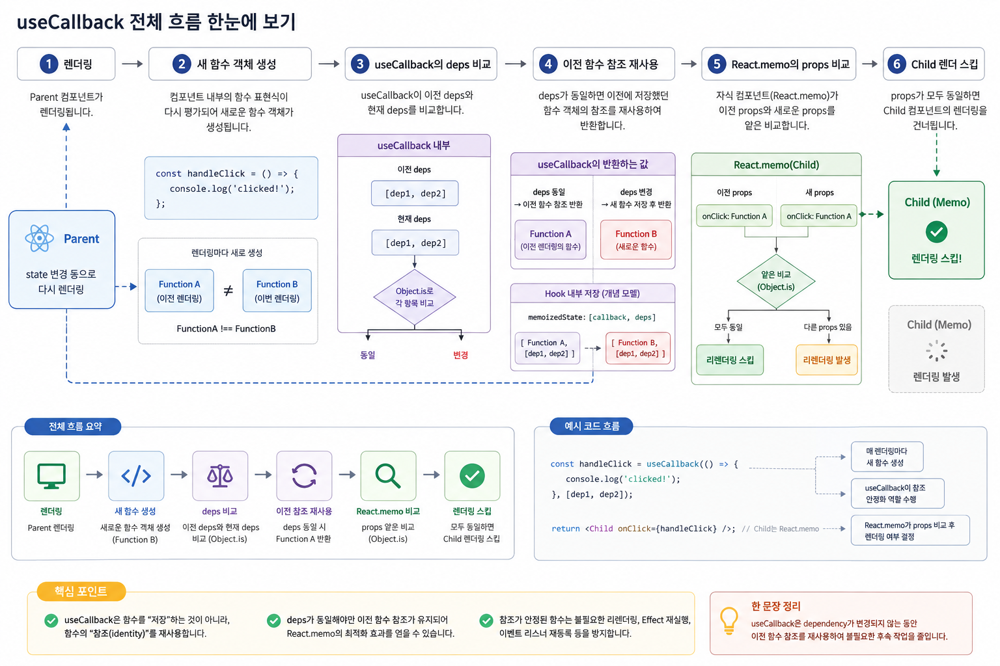

# React `useCallback`

`useCallback`을 이해하려면 먼저 한 가지 사실을 알아야 합니다.

> JavaScript에서 **함수는 값(value)이자 객체(object)**이며,
> 함수 표현식이 다시 평가되면 새로운 함수 객체가 만들어집니다.

React 함수 컴포넌트는 렌더링될 때마다 다시 실행됩니다.

따라서 컴포넌트 내부에서 선언한 함수도 렌더링할 때마다 새로운 함수 객체가 만들어질 수 있습니다.

```jsx
function Parent() {
  const [count, setCount] = useState(0);

  const handleClick = () => {
    console.log('clicked!');
  };

  // ...
}
```

첫 번째 렌더링의 `handleClick`과 두 번째 렌더링의 `handleClick`은 코드가 같더라도 서로 다른 함수 객체입니다.

```js
const fn1 = () => {};
const fn2 = () => {};

console.log(fn1 === fn2); // false
```

바로 이 **함수의 참조 동일성(reference identity)** 문제가 `useCallback`을 이해하는 출발점입니다.





---

# 1. 왜 `useCallback`이 필요한가?

다음 코드를 살펴보겠습니다.

```jsx
import React, { useState } from 'react';

const Child = React.memo(function Child({ onClick }) {
  console.log('Child render');

  return (
    <button onClick={onClick}>
      Child Button
    </button>
  );
});

function Parent() {
  const [count, setCount] = useState(0);

  const handleClick = () => {
    console.log('clicked!');
  };

  return (
    <div>
      <p>{count}</p>

      <button onClick={() => setCount(c => c + 1)}>
        +
      </button>

      <Child onClick={handleClick} />
    </div>
  );
}
```

`Child`는 `React.memo`로 감싸져 있습니다.

따라서 이전 props와 새로운 props가 같다면 React는 `Child`의 리렌더링을 건너뛸 수 있습니다.

그런데 `Parent`가 다시 렌더링되면 다음 코드도 다시 실행됩니다.

```jsx
const handleClick = () => {
  console.log('clicked!');
};
```

개념적으로 보면:

```text
첫 번째 Parent 렌더링

handleClick ──────► Function A
                       │
                       ▼
              Child.onClick


두 번째 Parent 렌더링

handleClick ──────► Function B
                       │
                       ▼
              Child.onClick
```

`Function A`와 `Function B`는 서로 다른 객체입니다.

```js
FunctionA !== FunctionB
```

따라서 `React.memo`가 props를 비교하면:

```text
previousProps.onClick !== nextProps.onClick
```

이 되고 `Child`는 다시 렌더링됩니다.

즉 문제의 핵심은 **함수의 코드가 변경되었느냐가 아니라 함수 객체의 참조가 변경되었다는 것**입니다.

---

# 2. `useCallback` 한 문장 정의

> `useCallback`은 dependency가 변경되지 않는 동안 **이전에 반환했던 함수 객체의 참조를 재사용하도록 하는 React Hook**입니다.

기본 형태는 다음과 같습니다.

```jsx
const memoizedCallback = useCallback(
  () => {
    // callback
  },
  [dep1, dep2]
);
```

첫 번째 아규먼트는 사용할 함수이고, 두 번째 아규먼트는 dependency 배열입니다.

---

# 3. `useCallback`을 적용하면 무엇이 달라지는가?

앞의 코드를 다음과 같이 변경해 보겠습니다.

```jsx
function Parent() {
  const [count, setCount] = useState(0);

  const handleClick = useCallback(() => {
    console.log('clicked!');
  }, []);

  return (
    <div>
      <p>{count}</p>

      <button onClick={() => setCount(c => c + 1)}>
        +
      </button>

      <Child onClick={handleClick} />
    </div>
  );
}
```

dependency가 변경되지 않았다면 React는 이전 렌더링에서 반환했던 함수 객체를 다시 반환합니다.

```text
첫 번째 렌더링

useCallback
     │
     ▼
 Function A
     │
     ▼
handleClick


두 번째 렌더링

새로운 함수가 useCallback의
아규먼트로 전달됨
     │
     ▼
 useCallback
     │
     │ deps 동일
     ▼
 Function A 재사용
     │
     ▼
handleClick
```

결과적으로:

```text
previousProps.onClick === nextProps.onClick
```

이 될 수 있습니다.

다른 props도 변경되지 않았다면 `React.memo`는 `Child`의 렌더링을 건너뜁니다.

---

# 4. 가장 중요한 오해

다음 표현은 정확하지 않습니다.

> "`useCallback`을 사용하면 함수가 다시 생성되지 않는다."

실제로는 다음 코드가 렌더링될 때:

```jsx
const handleClick = useCallback(() => {
  doSomething();
}, []);
```

`() => { doSomething(); }`이라는 함수 표현식 자체는 다시 평가됩니다.

즉 새로운 함수가 `useCallback`의 아규먼트로 전달될 수 있습니다.

`useCallback`의 역할은 **함수 생성을 막는 것**이 아닙니다.

React가 dependency를 비교한 뒤:

```text
deps 동일
    ↓
이전에 저장했던 함수 반환

deps 변경
    ↓
이번에 전달받은 함수 저장 및 반환
```

하는 것입니다.

따라서 `useCallback`의 핵심 목적은:

> 함수 생성 비용을 줄이는 것이 아니라 **함수의 참조가 변경되면서 발생하는 후속 작업을 줄이는 것**입니다.

대표적인 후속 작업은 다음과 같습니다.

* `React.memo` 자식의 불필요한 리렌더링
* Effect의 불필요한 재실행
* 이벤트 리스너의 불필요한 재등록
* stable callback을 요구하는 API와의 상호작용

---

# 5. `useCallback`과 `React.memo`

`useCallback`이 가장 대표적으로 사용되는 경우입니다.

```jsx
const Child = React.memo(function Child({ onClick }) {
  return <button onClick={onClick}>Click</button>;
});

function Parent() {
  const [count, setCount] = useState(0);

  const handleClick = useCallback(() => {
    console.log('clicked');
  }, []);

  return (
    <>
      <button onClick={() => setCount(c => c + 1)}>
        {count}
      </button>

      <Child onClick={handleClick} />
    </>
  );
}
```

전체 관계는 다음과 같습니다.

```text
Parent 리렌더링
      │
      ▼
useCallback 호출
      │
      ▼
deps 비교
      │
      ├── 동일 ──► 이전 함수 참조 반환
      │
      └── 변경 ──► 새로운 함수 참조 반환
                         │
                         ▼
                  Child props 전달
                         │
                         ▼
                    React.memo
                         │
                         ▼
                   props 얕은 비교
```

여기서 중요한 점은:

> `useCallback` 혼자서는 자식의 리렌더링을 막지 못합니다.

일반적인 자식 컴포넌트라면:

```jsx
function Child({ onClick }) {
  return <button onClick={onClick}>Click</button>;
}
```

부모가 렌더링되면 자식도 일반적으로 다시 렌더링됩니다.

따라서 다음 코드는 대부분 의미가 없습니다.

```jsx
function Parent() {
  const handleClick = useCallback(() => {}, []);

  return <Child onClick={handleClick} />;
}
```

`Child`가 memoization되어 있지 않기 때문입니다.

---

# 6. `React.memo`가 있어도 `useCallback`이 무의미할 수 있다

다음 코드를 보겠습니다.

```jsx
<MemoChild
  onClick={handleClick}
  style={{ padding: 8 }}
  data={rows.map(toView)}
/>
```

`handleClick`을 `useCallback`으로 안정화했다고 하더라도:

```jsx
style={{ padding: 8 }}
```

은 렌더링마다 새로운 객체이고,

```jsx
rows.map(toView)
```

도 렌더링마다 새로운 배열을 만들 수 있습니다.

따라서:

```text
onClick  → 동일
style    → 새로운 객체
data     → 새로운 배열
```

이라면 `React.memo`의 props 비교는 실패합니다.

즉:

> memoization은 특정 함수 하나만 보는 문제가 아니라 **전체 props의 참조 안정성**을 함께 살펴봐야 합니다.

---

# 7. `useCallback`과 dependency

다음 코드를 살펴보겠습니다.

```jsx
function Counter() {
  const [count, setCount] = useState(0);

  const logCount = useCallback(() => {
    console.log(count);
  }, [count]);

  // ...
}
```

`logCount`는 `count`를 사용합니다.

따라서 dependency에 `count`가 들어갑니다.

```jsx
[count]
```

렌더링 흐름은:

```text
count = 0
   ↓
callback A 저장


count = 0
   ↓
deps 동일
   ↓
callback A 재사용


count = 1
   ↓
deps 변경
   ↓
callback B 저장
```

즉 `useCallback`은 함수를 영구적으로 고정하는 기능이 아닙니다.

dependency가 변경되면 새로운 함수 참조가 반환됩니다.

---

# 8. Dependency 비교는 어떻게 이루어지는가?

개념적으로 React는 이전 dependency와 새로운 dependency를 비교합니다.

```text
Previous deps
[a, b]

Current deps
[a, b]
```

각 dependency는 React의 dependency 비교 규칙에 따라 비교됩니다.

개념적으로:

```js
Object.is(prevDep, nextDep)
```

를 각 항목에 적용한다고 이해하면 됩니다.

따라서 객체나 배열 같은 참조 타입은 주의해야 합니다.

```jsx
const options = {
  pageSize: 10
};

const callback = useCallback(() => {
  doSomething(options);
}, [options]);
```

`options`가 렌더링마다 새 객체라면:

```text
Render 1 → Object A
Render 2 → Object B

Object.is(A, B)
→ false
```

이므로 callback 역시 다시 변경됩니다.

---

# 9. Stale Closure

dependency를 잘못 생략하면 더 심각한 문제가 발생할 수 있습니다.

```jsx
function Counter() {
  const [count, setCount] = useState(0);

  const log = useCallback(() => {
    console.log(count);
  }, []);

  return (
    <button onClick={log}>
      Log
    </button>
  );
}
```

`log` 함수는 최초 렌더링 당시의 `count`를 closure로 기억합니다.

```text
Mount

count = 0
   │
   ▼
callback 생성
   │
   └──── closure ────► count = 0
```

dependency가 `[]`이므로 React는 이전 callback을 계속 반환합니다.

그 사이 state가:

```text
0 → 1 → 2 → 3
```

으로 변경되어도 callback이 바라보는 closure는 최초 렌더링의 값을 유지할 수 있습니다.

이것이 **stale closure**입니다.

따라서:

```jsx
const log = useCallback(() => {
  console.log(count);
}, [count]);
```

처럼 callback에서 사용하는 reactive value를 올바르게 dependency에 포함해야 합니다.

---

# 10. `useEffect`와 함께 사용할 때

다음 코드는 문제가 될 수 있습니다.

```jsx
function SearchBox({ query }) {
  const fetchData = () => {
    console.log(query);
  };

  useEffect(() => {
    fetchData();
  }, [fetchData]);
}
```

컴포넌트가 렌더링될 때마다 `fetchData`가 새로운 함수가 되므로 Effect 역시 다시 실행될 수 있습니다.

한 가지 방법은:

```jsx
const fetchData = useCallback(() => {
  console.log(query);
}, [query]);

useEffect(() => {
  fetchData();
}, [fetchData]);
```

입니다.

하지만 `fetchData`를 Effect에서만 사용한다면 더 단순한 방법이 있습니다.

```jsx
useEffect(() => {
  const fetchData = () => {
    console.log(query);
  };

  fetchData();
}, [query]);
```

이렇게 하면 `fetchData` 자체를 dependency로 관리할 필요가 없습니다.

따라서:

> Effect dependency 문제를 해결하기 위해 무조건 `useCallback`을 사용하는 것은 좋은 패턴이 아닙니다.

Effect에서만 사용하는 함수라면 Effect 내부로 이동할 수 있는지 먼저 확인하는 것이 좋습니다.

---

# 11. `useCallback` 내부 동작

이제 Fiber와 Hook 관점에서 살펴보겠습니다.

React는 함수 컴포넌트의 Hook 상태를 Fiber와 연결하여 관리합니다.

개념적으로:

```text
Fiber
 │
 ▼
Hook #1
 │
 ▼
Hook #2
 │
 ▼
Hook #3
```

`useCallback` 역시 이 Hook 상태에 이전 callback과 dependency 정보를 보관합니다.

실제 React 내부 표현을 그대로 옮긴 것이 아니라 **학습을 위한 개념 모델**로 보면 다음과 같습니다.

```js
Hook {
  memoizedState: [callback, deps]
}
```

Mount에서는:

```text
useCallback(fn, deps)
        │
        ▼
새 Hook 생성
        │
        ▼
[fn, deps] 저장
        │
        ▼
fn 반환
```

Update에서는:

```text
useCallback(newFn, newDeps)
           │
           ▼
이전 Hook 조회
           │
           ▼
prevDeps와 newDeps 비교
           │
      ┌────┴────┐
      │         │
    동일       변경
      │         │
      ▼         ▼
previousFn    newFn 저장
 반환          및 반환
```

---

# 12. 개념적인 의사 코드

학습 목적으로 단순화하면 다음과 같이 생각할 수 있습니다.

```js
function useCallback(callback, deps) {
  const hook = getCurrentHook();

  if (isMount(hook)) {
    hook.memoizedState = [callback, deps];

    return callback;
  }

  const [previousCallback, previousDeps] =
    hook.memoizedState;

  if (areHookInputsEqual(deps, previousDeps)) {
    return previousCallback;
  }

  hook.memoizedState = [callback, deps];

  return callback;
}
```

핵심은 단순합니다.

```text
deps 동일
   ↓
이전 callback 반환


deps 변경
   ↓
새 callback 저장
   ↓
새 callback 반환
```

---

# 13. `useCallback`과 `useMemo`

두 Hook은 매우 비슷합니다.

### `useMemo`

계산된 **값**을 재사용합니다.

```jsx
const value = useMemo(() => {
  return expensiveCalculation(a, b);
}, [a, b]);
```

### `useCallback`

**함수 참조**를 재사용합니다.

```jsx
const callback = useCallback(() => {
  doSomething(a, b);
}, [a, b]);
```

개념적으로 다음 관계로 이해할 수 있습니다.

```jsx
useCallback(fn, deps)

≈

useMemo(() => fn, deps)
```

차이를 한 문장으로 표현하면:

> `useMemo`는 함수 실행의 **결과 값**을 memoize하고, `useCallback`은 **함수 자체의 참조**를 memoize합니다.

---

# 14. `useCallback`을 남용하면 안 되는 이유

모든 이벤트 핸들러를 다음처럼 만들 필요는 없습니다.

```jsx
const handleClick = useCallback(() => {
  setCount(c => c + 1);
}, []);
```

`useCallback` 역시 공짜가 아닙니다.

React는:

```text
Hook 상태 관리
+
dependency 비교
+
이전 callback 보관
```

등의 작업을 해야 합니다.

따라서:

```text
useCallback 사용 비용

vs

함수 참조 변경으로 발생하는 후속 비용
```

을 비교해야 합니다.

후속 비용이 거의 없다면 memoization의 이점도 거의 없습니다.

---

# 15. 언제 사용하는가?

대표적인 판단 기준은 다음과 같습니다.

```text
함수를 만들었다
      │
      ▼
다른 곳에서 함수의 참조 동일성이 중요한가?
      │
   ┌──┴──┐
   │     │
  NO    YES
   │     │
   ▼     ▼
그냥 사용   React.memo 자식 props인가?
             │
          ┌──┴──┐
          │     │
         YES    NO
          │     │
          ▼     ▼
   useCallback 고려   Effect/API 등이
                     stable reference를
                     요구하는가?
                         │
                      ┌──┴──┐
                      │     │
                     YES    NO
                      │     │
                      ▼     ▼
               useCallback 고려  대부분 불필요
```

---

# 16. 실전 예제

```jsx
import React, {
  useCallback,
  useState
} from 'react';

const TodoItem = React.memo(function TodoItem({
  todo,
  onToggle
}) {
  console.log('TodoItem render:', todo.id);

  return (
    <li>
      <label>
        <input
          type="checkbox"
          checked={todo.done}
          onChange={() => onToggle(todo.id)}
        />

        {todo.text}
      </label>
    </li>
  );
});

function TodoList() {
  const [todos, setTodos] = useState([
    {
      id: 1,
      text: 'React 공부',
      done: false
    },
    {
      id: 2,
      text: 'useCallback 이해하기',
      done: false
    }
  ]);

  const handleToggle = useCallback((id) => {
    setTodos(prev =>
      prev.map(todo =>
        todo.id === id
          ? { ...todo, done: !todo.done }
          : todo
      )
    );
  }, []);

  return (
    <ul>
      {todos.map(todo => (
        <TodoItem
          key={todo.id}
          todo={todo}
          onToggle={handleToggle}
        />
      ))}
    </ul>
  );
}
```

여기서는 `handleToggle`이 이전 `todos` 값을 직접 읽지 않고 functional update를 사용합니다.

```jsx
setTodos(prev => ...)
```

따라서 callback이 `todos`를 closure로 캡처할 필요가 없습니다.

결과적으로:

```jsx
useCallback(..., [])
```

형태로 함수 참조를 안정적으로 유지할 수 있습니다.

---

# 17. 최적화 순서

`useCallback`을 처음부터 모든 함수에 적용하는 것보다 다음 순서가 중요합니다.

```text
1. 실제 렌더링 비용 측정
        ↓
2. 불필요한 렌더링 원인 확인
        ↓
3. state 위치 / component 구조 개선
        ↓
4. props 참조 안정성 확인
        ↓
5. 필요한 지점에만
   React.memo / useMemo / useCallback
        ↓
6. 다시 측정
```

즉 `useCallback`은 기본 코딩 규칙이 아니라 **필요한 곳에 적용하는 최적화 도구**입니다.

---

# 18. React Compiler와 `useCallback`

최근 React에서는 React Compiler를 이용한 자동 memoization도 중요해지고 있습니다.

여기서 구분해야 할 것은:

> React 버전 자체와 React Compiler는 같은 개념이 아닙니다.

React Compiler를 사용하는 환경에서는 사람이 직접 작성하던 `useMemo`, `useCallback`, `React.memo` 기반 최적화의 상당 부분을 컴파일러가 자동으로 처리할 수 있습니다.

하지만 이것이 `useCallback`의 개념을 배울 필요가 없다는 뜻은 아닙니다.

오히려 다음 관계를 이해하는 것이 중요합니다.

```text
JavaScript
함수 객체 생성
      ↓
Reference Identity
      ↓
Props / Dependency 비교
      ↓
React.memo / Effect
      ↓
불필요한 작업 발생 가능
      ↓
Memoization
```

React Compiler 역시 결국 이러한 React의 렌더링 특성과 참조 동일성 문제를 바탕으로 최적화를 수행하기 때문입니다.

---

# 19. 최종 정리

`useCallback`을 단순히:

> "함수를 저장하는 Hook"

이라고 외우는 것보다 다음과 같이 이해하는 것이 정확합니다.

> **`useCallback`은 dependency가 변경되지 않는 동안 이전 렌더링에서 반환했던 함수 객체의 참조를 재사용하여, 함수 참조 변경으로 인해 발생할 수 있는 불필요한 후속 작업을 줄이기 위한 memoization Hook이다.**

전체 흐름을 압축하면:

```text
Component Render
       │
       ▼
새 callback 전달
       │
       ▼
useCallback
       │
       ▼
dependency 비교
       │
   ┌───┴────┐
   │        │
 동일      변경
   │        │
   ▼        ▼
이전 함수   새로운 함수
참조 반환   저장 및 반환
   │
   ▼
Stable Reference
   │
   ├──► React.memo 비교 최적화
   ├──► Effect dependency 안정화
   └──► stable callback이 필요한 API
```

따라서 `useCallback`에서 가장 중요한 단어는 **"함수 생성 방지"가 아니라 "Reference Identity의 안정화"**입니다.
