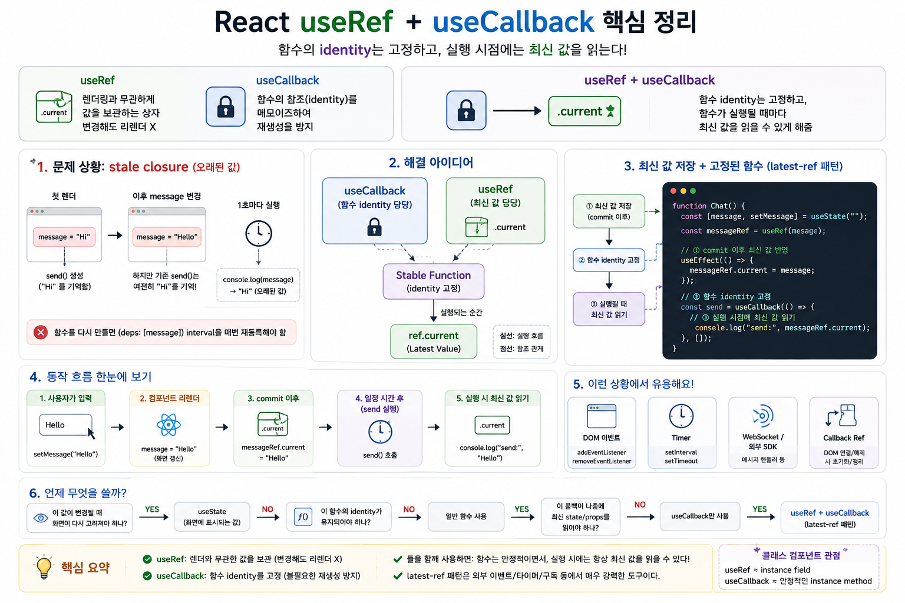

# React `useRef + useCallback`




## 최신 값은 유지하면서 콜백의 참조(identity)는 고정하기

React에서 `useRef`와 `useCallback`은 서로 다른 문제를 해결하는 Hook입니다.

```text
useRef
→ 렌더링과 무관하게 유지해야 하는 값을 저장

useCallback
→ 함수의 참조(identity)를 메모이즈

useRef + useCallback
→ 함수의 identity는 유지하면서
   함수가 실행되는 시점에는 최신 값을 읽게 만들 수 있음
```

이 조합은 특히 다음과 같은 상황에서 유용합니다.

* `setInterval`, `setTimeout`
* `addEventListener`
* WebSocket
* 외부 SDK / 라이브러리 이벤트
* callback ref
* 오래 유지되는 외부 콜백이 최신 state/props를 읽어야 하는 경우

다만 모든 컴포넌트에서 사용해야 하는 일반적인 패턴은 아닙니다.

---

# 1. 먼저 각각의 역할을 이해하자

## `useRef`

```jsx
const ref = useRef(initialValue);
```

`useRef()`는 렌더링 사이에서도 동일한 ref 객체를 유지합니다.

```text
ref
└── current
```

예를 들어:

```jsx
const timerRef = useRef(null);
```

이후 다음과 같이 값을 저장할 수 있습니다.

```jsx
timerRef.current = timerId;
```

중요한 특징은 다음과 같습니다.

> `ref.current`의 변경은 리렌더링을 발생시키지 않습니다.

따라서 `useRef`는 주로 **화면을 다시 그리는 데 직접 사용되지 않는 값**을 저장하는 데 적합합니다.

대표적으로:

```text
DOM node
timer ID
WebSocket instance
외부 라이브러리 instance
이전 값
최신 state/props를 보관하는 참조
```

등이 있습니다.

---

# 2. `useCallback`

```jsx
const callback = useCallback(() => {
  // ...
}, [deps]);
```

`useCallback()`의 핵심 목적은 **함수의 identity를 메모이즈하는 것**입니다.

일반적으로 컴포넌트가 다시 렌더링되면 함수도 다시 생성됩니다.

```jsx
function Counter() {
  const handleClick = () => {
    console.log("click");
  };
}
```

개념적으로:

```text
Render #1
handleClick → Function A

Render #2
handleClick → Function B

Render #3
handleClick → Function C
```

함수의 코드가 같더라도 각각 다른 함수 객체입니다.

반면:

```jsx
const handleClick = useCallback(() => {
  console.log("click");
}, []);
```

이라면 의존성이 변경되지 않는 동안:

```text
Render #1 ─┐
Render #2 ─┼──→ Function A
Render #3 ─┘
```

동일한 함수 참조를 재사용할 수 있습니다.

---

# 3. 그런데 왜 `useRef`와 `useCallback`을 같이 사용하는가?

핵심은 다음 두 요구사항이 동시에 필요한 경우입니다.

```text
요구사항 1
함수 identity는 바뀌지 않았으면 좋겠다.

요구사항 2
함수를 실제 실행할 때는 최신 state/props가 필요하다.
```

이 두 가지 요구사항 사이에서 문제가 발생합니다.

---

# 4. stale closure 문제

다음 컴포넌트를 생각해봅시다.

```jsx
function Chat() {
  const [message, setMessage] = useState("");

  const send = useCallback(() => {
    console.log("send:", message);
  }, [message]);

  useEffect(() => {
    const id = setInterval(() => {
      send();
    }, 1000);

    return () => clearInterval(id);
  }, [send]);

  return (
    <input
      value={message}
      onChange={(e) => setMessage(e.target.value)}
    />
  );
}
```

`send`가 `message`를 사용하므로 dependency에 `message`가 필요합니다.

```jsx
useCallback(() => {
  console.log(message);
}, [message]);
```

따라서 `message`가 바뀌면:

```text
message 변경
     ↓
컴포넌트 리렌더
     ↓
send 함수 변경
     ↓
Effect dependency 변경
     ↓
기존 interval cleanup
     ↓
새 interval 등록
```

정확한 코드이기는 하지만, 외부 이벤트나 구독을 다루는 경우에는 이런 재등록이 불필요할 수 있습니다.

그렇다고 다음처럼 하면 안 됩니다.

```jsx
const send = useCallback(() => {
  console.log(message);
}, []);
```

`send`가 처음 생성될 당시의 `message`를 closure가 잡고 있기 때문입니다.

```text
첫 렌더

message = ""
     │
     └── closure
           │
           ▼
         send()
```

이후 `message`가 `"Hello"`로 변경되어도 기존 `send`가 처음의 값을 계속 참조할 수 있습니다.

이것이 흔히 말하는 **stale closure** 문제입니다.

---

# 5. 해결 아이디어: 함수와 값을 분리한다

여기서 `useRef + useCallback` 조합이 등장합니다.

핵심 아이디어는 간단합니다.

```text
useCallback
    ↓
함수 identity 담당

useRef
    ↓
최신 값 담당
```

즉:

```text
Stable Function
      │
      │ 실행되는 순간
      ▼
ref.current
      │
      ▼
Latest Value
```

함수 자체는 고정하지만, 함수가 실행될 때 참조하는 값은 ref를 통해 최신 값을 가져오는 방식입니다.

---

# 6. latest-ref 패턴

```jsx
function Chat() {
  const [message, setMessage] = useState("");

  const messageRef = useRef(message);

  useEffect(() => {
    messageRef.current = message;
  });

  const send = useCallback(() => {
    console.log("send:", messageRef.current);
  }, []);

  // ...
}
```

여기에는 서로 다른 두 저장 구조가 존재합니다.

```text
React State
message
   │
   │ 렌더링에 사용
   ▼
UI

그리고

message
   │
   │ commit 이후
   ▼
messageRef.current
   │
   │ 나중에 callback 실행
   ▼
send()
```

`send`의 identity는 고정되어 있습니다.

```jsx
const send = useCallback(() => {
  console.log(messageRef.current);
}, []);
```

하지만 실행되는 순간:

```jsx
messageRef.current
```

를 읽기 때문에 최신 값을 사용할 수 있습니다.

---

# 7. 왜 렌더 중에 ref를 무조건 갱신하면 안 되는가?

다음과 같은 코드를 종종 볼 수 있습니다.

```jsx
function Chat() {
  const [message, setMessage] = useState("");

  const messageRef = useRef(message);

  messageRef.current = message;

  // ...
}
```

간단한 코드에서는 동작하는 것처럼 보일 수 있지만, 일반적으로 렌더 중 `ref.current`를 읽거나 쓰는 패턴에 의존하지 않는 것이 좋습니다.

React의 렌더는 순수해야 하며, 특히 동시성 렌더링에서는 계산 중인 렌더 결과가 실제 Commit으로 이어지지 않고 버려질 수도 있습니다.

개념적으로:

```text
Render A
message = "A"
      │
      ├── ref.current = "A"
      │
      └── 렌더 중단 / 폐기
                X

Render B
message = "B"
      │
      ▼
Commit
```

렌더 과정에서 외부의 mutable object를 변경해버리면 **Commit된 UI와 mutable 값의 시점이 어긋날 가능성**을 만들게 됩니다.

따라서 최신 값을 외부 콜백에서 사용하기 위한 ref라면 다음과 같이 Commit 이후 Effect에서 동기화하는 구조가 이해하기 쉽습니다.

```jsx
useEffect(() => {
  messageRef.current = message;
});
```

---

# 8. 중요한 원칙: ref는 화면 렌더링용 state가 아니다

다음 코드는 피해야 합니다.

```jsx
return <div>{messageRef.current}</div>;
```

왜냐하면:

```jsx
messageRef.current = "Hello";
```

를 실행해도 React에게 리렌더링을 요청하지 않기 때문입니다.

따라서 역할을 구분해야 합니다.

| 목적                       | 도구            |
| ------------------------ | ------------- |
| 화면에 표시되어야 하는 값           | `useState`    |
| 렌더와 무관한 mutable 값        | `useRef`      |
| 계산 결과 메모이제이션             | `useMemo`     |
| 함수 identity 메모이제이션       | `useCallback` |
| 오래 유지되는 콜백이 나중에 최신 값을 읽기 | latest-ref 패턴 |

latest-ref는 결국:

> **렌더링에 직접 관여하지 않는 최신 값을 안정적인 콜백이 나중에 읽을 수 있도록 연결하는 통로**

라고 볼 수 있습니다.

---

# 9. 실전 패턴 1 — DOM 이벤트

브라우저 이벤트 리스너는 등록할 때 사용한 함수와 제거할 때 사용하는 함수가 동일해야 합니다.

```jsx
window.addEventListener("resize", callback);

window.removeEventListener("resize", callback);
```

이를 위한 커스텀 Hook을 생각해봅시다.

```jsx
function useWindowResize(handler) {
  const handlerRef = useRef(handler);

  useEffect(() => {
    handlerRef.current = handler;
  }, [handler]);

  const stableCallback = useCallback((event) => {
    handlerRef.current(event);
  }, []);

  useEffect(() => {
    window.addEventListener("resize", stableCallback);

    return () => {
      window.removeEventListener("resize", stableCallback);
    };
  }, [stableCallback]);
}
```

구조는 다음과 같습니다.

```text
최신 handler
     │
     ▼
handlerRef.current
     ▲
     │ 실행 시 참조
     │
stableCallback
     │
     ▼
window.addEventListener()
```

`stableCallback`은 동일한 함수이므로 이벤트 등록/해제가 안정적입니다.

동시에 실제 실행할 handler는:

```jsx
handlerRef.current(event);
```

를 통해 최신 버전을 호출합니다.

---

# 10. 실전 패턴 2 — Timer

클래스 컴포넌트에서는 다음과 같은 값을 인스턴스 필드에 저장할 수 있었습니다.

```jsx
this.timerId
```

함수 컴포넌트에서는 `useRef`가 비슷한 역할을 할 수 있습니다.

```jsx
const timeoutIdRef = useRef(null);
```

예를 들어 자동 저장 기능을 만들어보겠습니다.

```jsx
function AutoSaveEditor() {
  const [text, setText] = useState("");

  const textRef = useRef(text);
  const timeoutIdRef = useRef(null);

  useEffect(() => {
    textRef.current = text;
  });

  const scheduleSave = useCallback(() => {
    if (timeoutIdRef.current) {
      clearTimeout(timeoutIdRef.current);
    }

    timeoutIdRef.current = setTimeout(() => {
      console.log("Auto save:", textRef.current);
    }, 1000);
  }, []);

  useEffect(() => {
    return () => {
      if (timeoutIdRef.current) {
        clearTimeout(timeoutIdRef.current);
      }
    };
  }, []);

  return (
    <textarea
      value={text}
      onChange={(e) => {
        setText(e.target.value);
        scheduleSave();
      }}
    />
  );
}
```

여기서는 두 종류의 ref가 사용됩니다.

```text
textRef
→ callback이 나중에 읽을 최신 text

timeoutIdRef
→ 현재 실행 대기 중인 timer ID
```

그리고:

```text
scheduleSave
→ 안정적인 함수 identity
```

를 갖습니다.

---

# 11. 클래스 컴포넌트 관점으로 보면 더 쉽게 이해할 수 있다

과거 클래스 컴포넌트에서는:

```jsx
class Editor extends Component {
  timerId = null;

  scheduleSave() {
    // ...
  }
}
```

와 같이 작성할 수 있었습니다.

함수 컴포넌트에서는 개념적으로:

```text
Class Component
─────────────────────────
instance field
this.timerId

instance method
this.scheduleSave()
```

를 다음처럼 생각할 수 있습니다.

```text
Function Component
─────────────────────────
useRef
timerIdRef.current

useCallback
scheduleSave()
```

즉 교육적으로는:

> `useRef`는 **인스턴스 필드와 비슷한 역할**

> `useCallback`은 **identity가 안정적인 메서드와 비슷한 역할**

이라고 생각하면 이해하기 쉽습니다.

단, 이것은 **개념을 이해하기 위한 비유**이지 React가 실제로 클래스 인스턴스를 만드는 것은 아닙니다.

---

# 12. 실전 패턴 3 — DOM ref + callback

```jsx
function Parent() {
  const buttonRef = useRef(null);

  const focusChildButton = useCallback(() => {
    buttonRef.current?.focus();
  }, []);

  return (
    <>
      <ChildButton ref={buttonRef} />
      <button onClick={focusChildButton}>
        자식 버튼 포커스
      </button>
    </>
  );
}
```

React 19에서는 함수 컴포넌트가 `ref`를 prop으로 받을 수 있습니다.

```jsx
function ChildButton({ ref }) {
  return <button ref={ref}>Child</button>;
}
```

따라서 새로운 React 19 코드에서는 기존처럼 반드시 `forwardRef`로 감쌀 필요가 없습니다.

React 18 이하에서는 일반적으로:

```jsx
const ChildButton = React.forwardRef(
  function ChildButton(props, ref) {
    return <button ref={ref}>Child</button>;
  }
);
```

형태를 사용했습니다.

---

# 13. 실전 패턴 4 — callback ref

`ref`에는 객체뿐 아니라 함수도 전달할 수 있습니다.

```jsx
function CanvasContainer() {
  const canvasRef = useRef(null);

  const setCanvasRef = useCallback((node) => {
    if (node) {
      canvasRef.current = node;

      console.log("Canvas mounted", node);
    } else {
      canvasRef.current = null;

      console.log("Canvas unmounted");
    }
  }, []);

  return <canvas ref={setCanvasRef} />;
}
```

이것을 **callback ref**라고 합니다.

callback ref의 함수 identity가 계속 변경되면 React가 ref 연결을 다시 처리할 수 있기 때문에, callback ref 자체를 안정적으로 유지할 필요가 있는 상황에서 `useCallback`이 유용합니다.

```text
DOM <canvas>
      │
      ▼
setCanvasRef(node)
      │
      ▼
canvasRef.current
```

---

# 14. React 19 — callback ref cleanup

React 19에서는 callback ref가 **cleanup 함수를 반환할 수 있습니다.**

```jsx
function CanvasContainer() {
  const setCanvasRef = useCallback((node) => {
    const chart = new Chart(node);

    return () => {
      chart.destroy();
    };
  }, []);

  return <canvas ref={setCanvasRef} />;
}
```

흐름은 다음과 같습니다.

```text
DOM 연결
   │
   ▼
callbackRef(node)
   │
   ├── Chart 생성
   │
   └── cleanup 반환
             │
             ▼
       DOM 제거 / ref 교체
             │
             ▼
         cleanup()
             │
             ▼
       chart.destroy()
```

이 방식은 외부 라이브러리 초기화와 정리를 하나의 callback ref 안에 묶을 수 있다는 장점이 있습니다.

### 암묵적 반환 주의

React 19에서는 callback ref가 반환한 함수를 cleanup으로 해석할 수 있으므로 다음처럼 대입 표현식을 암묵적으로 반환하는 코드는 피하는 것이 좋습니다.

```jsx
// 피해야 할 형태
<div ref={node => (myRef.current = node)} />
```

대신 블록 본문을 사용합니다.

```jsx
<div
  ref={node => {
    myRef.current = node;
  }}
/>
```

---

# 15. 반복되는 패턴을 Custom Hook으로 추출하기

latest-ref 패턴이 반복된다면 다음과 같이 추상화할 수 있습니다.

```jsx
function useStableCallback(fn) {
  const fnRef = useRef(fn);

  useEffect(() => {
    fnRef.current = fn;
  });

  return useCallback((...args) => {
    return fnRef.current(...args);
  }, []);
}
```

사용:

```jsx
function Timer({ onTick }) {
  const handleTick = useStableCallback(onTick);

  useEffect(() => {
    const id = setInterval(() => {
      handleTick();
    }, 1000);

    return () => clearInterval(id);
  }, [handleTick]);

  return <div>Ticking...</div>;
}
```

구조는 매우 단순합니다.

```text
새로운 onTick
     │
     ▼
fnRef.current
     ▲
     │
     │ 실행 시 읽음
     │
handleTick
(identity 고정)
```

즉:

```text
함수의 identity
      ↓
useCallback

함수의 최신 implementation
      ↓
useRef
```

로 역할을 분리한 것입니다.

---

# 16. `useEffectEvent`와의 관계

여기서 혼동하기 쉬운 API가 있습니다.

`useEvent`라는 정식 React Hook이 있는 것이 아니라, 과거 제안되었던 `useEvent` 개념이 이후 `useEffectEvent`라는 API로 발전했습니다.

`useEffectEvent`를 사용할 수 있는 React 버전에서는 Effect 내부에서 최신 state/props를 읽어야 하는 문제를 보다 직접적으로 표현할 수 있습니다.

개념적으로:

```jsx
const onTickEvent = useEffectEvent(() => {
  onTick();
});

useEffect(() => {
  const id = setInterval(() => {
    onTickEvent();
  }, 1000);

  return () => clearInterval(id);
}, []);
```

이 패턴의 의미는:

```text
Effect 자체는
onTick 변경에 반응하지 않는다.

하지만

Effect 내부에서 실행되는 onTickEvent는
최신 onTick을 읽을 수 있다.
```

입니다.

다만 `useEffectEvent`는 **Effect와 관련된 로직을 위한 API**입니다.

자식에게 넘기는 일반적인 이벤트 핸들러를 안정화하기 위한 만능 `useCallback` 대체제가 아닙니다.

---

# 17. `useRef + useCallback`이 필요 없는 경우

이 조합을 모든 곳에 적용하면 오히려 코드가 복잡해집니다.

예를 들어:

```jsx
const [count, setCount] = useState(0);

const countRef = useRef(count);

const handleClick = useCallback(() => {
  setCount(countRef.current + 1);
}, []);
```

처럼 만들 필요가 없습니다.

다음이면 충분합니다.

```jsx
const handleClick = () => {
  setCount((count) => count + 1);
};
```

특히 state 업데이트가 이전 state에 의존한다면 **함수형 업데이트**가 가장 간단합니다.

```jsx
setCount((count) => count + 1);
```

---

# 18. 모든 함수에 `useCallback`을 사용할 필요도 없다

다음과 같은 코드가 있다고 해서:

```jsx
function Component() {
  const handleClick = () => {
    console.log("click");
  };

  return <button onClick={handleClick}>Click</button>;
}
```

무조건:

```jsx
const handleClick = useCallback(() => {
  console.log("click");
}, []);
```

으로 변경할 필요는 없습니다.

`useCallback` 자체도 dependency 비교와 Hook 관리가 필요합니다.

따라서:

> **함수가 새로 생성된다는 이유만으로 `useCallback`을 사용하지 않습니다.**

함수 identity를 안정적으로 유지하는 것이 실제로 의미가 있는 상황에서 사용하는 것이 좋습니다.

---

# 19. 언제 `useRef + useCallback`을 고려해야 하는가?

다음 질문으로 판단하면 쉽습니다.

```text
Q1.
이 값이 변경될 때 화면이 다시 그려져야 하는가?

YES
 └── useState

NO
 └── useRef
```

그리고:

```text
Q2.
이 함수의 identity가 유지되어야 하는 이유가 있는가?

NO
 └── 일반 함수

YES
 └── useCallback 고려
```

마지막으로:

```text
Q3.
고정된 callback이 나중에 실행될 때
최신 state/props를 읽어야 하는가?

YES
 └── latest-ref 패턴 고려
     또는 상황에 따라 useEffectEvent 검토
```

---

# 20. 전체 구조

```text
                 React Component
                       │
          ┌────────────┴────────────┐
          │                         │
       useState                   useRef
          │                         │
          │                         ├── DOM
          │                         ├── Timer ID
          │                         ├── 외부 Instance
          │                         └── Latest Value
          │
          ▼
      UI Rendering


                  useCallback
                       │
                       ▼
               Stable Function
                       │
                       │ 실행 시
                       ▼
                  ref.current
                       │
                       ▼
                  Latest Value
```

이 구조가 `useRef + useCallback` 조합을 이해하는 핵심입니다.

---

# 21. 핵심 정리

`useRef`와 `useCallback`은 각각 다른 역할을 합니다.

```text
useRef
→ 렌더링과 직접 관계없는 mutable 값을
  렌더 사이에서 유지한다.

useCallback
→ dependency가 변경되지 않는 동안
  함수 identity를 유지한다.
```

그리고 둘을 조합하면:

```text
             useCallback
                  │
                  ▼
        Stable Function Identity
                  │
                  │ 실행되는 순간
                  ▼
             ref.current
                  │
                  ▼
            Latest Value
```

라는 구조를 만들 수 있습니다.

따라서 이 패턴의 핵심을 한 문장으로 정의하면 다음과 같습니다.

> **`useRef + useCallback`은 콜백의 함수 참조는 안정적으로 유지하면서, 그 콜백이 실제 실행되는 시점에는 최신 값을 참조할 수 있도록 함수의 identity와 데이터의 최신성을 분리하는 패턴이다.**

클래스 컴포넌트에 익숙하다면 다음 비유도 도움이 됩니다.

```text
useRef
≈ instance field

useCallback
≈ stable instance method
```

다만 이 패턴은 최적화를 위해 무조건 사용하는 것이 아니라,

**외부 이벤트, 타이머, 구독, 외부 라이브러리처럼 React의 렌더링 주기보다 오래 살아 있는 콜백을 다룰 때 특히 가치가 있습니다.**
