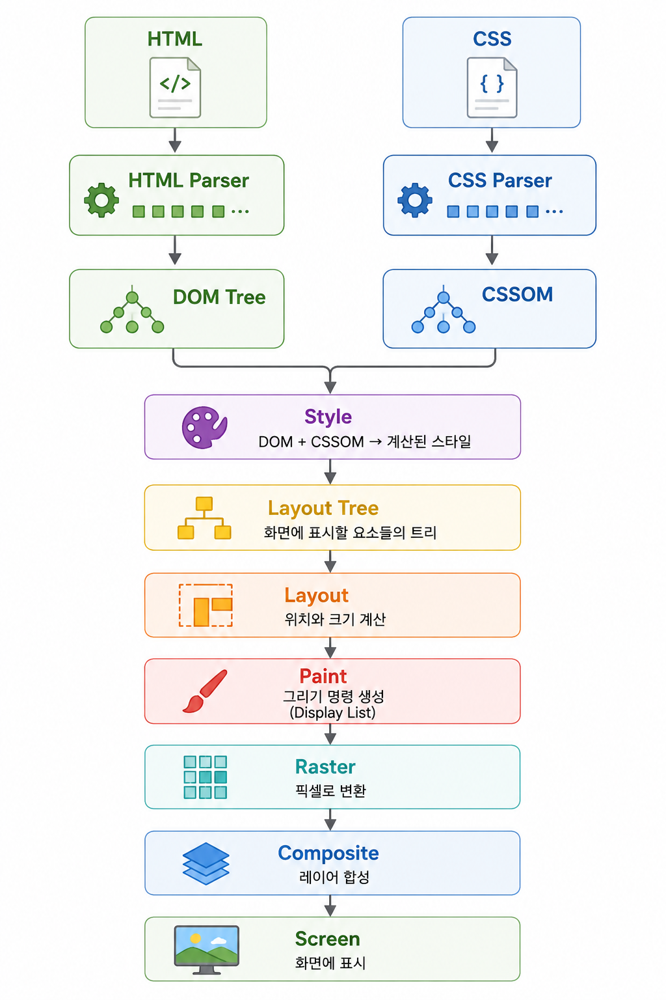
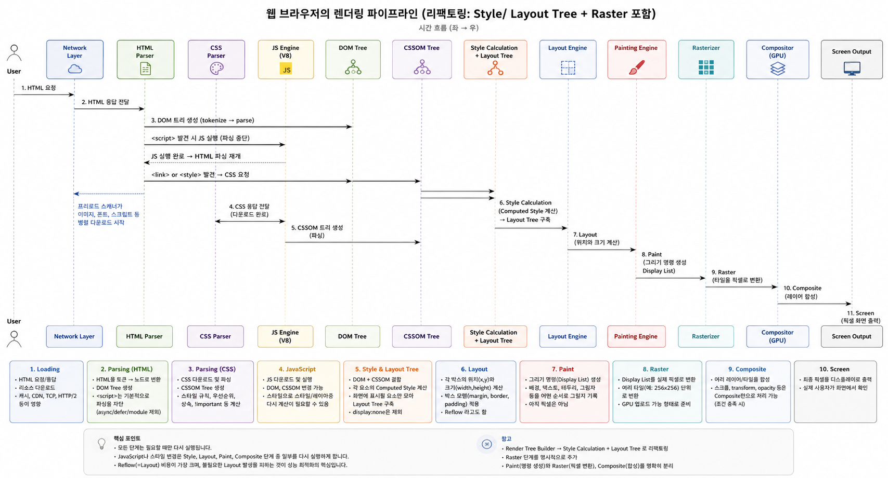

# 웹 브라우저의 렌더링 과정(Rendering Pipeline & CRP)

> HTML과 CSS, JavaScript가 어떻게 브라우저에서 픽셀로 변환되어 사용자에게 보여지는가?

프론트엔드 개발자로서 **렌더링 파이프라인(Rendering Pipeline)** 에 대한 이해는 퍼포먼스 최적화의 핵심입니다.
이 글에서는 **렌더링의 내부 구조와 흐름을 전문가 관점에서** 설명하고,
JavaScript 실행이 **Critical Rendering Path**에 어떻게 영향을 미치는지까지 정리합니다.

---

## 렌더링 파이프라인 개요

웹 브라우저는 다음과 같은 **단계적 처리 파이프라인**을 통해 웹 페이지를 화면에 표시합니다.


<br>

---

## 1 Loading: 리소스 수신

* 브라우저는 HTML 요청을 시작으로 모든 리소스를 **네트워크 계층**을 통해 가져옵니다.
* 이 과정에서 **HTTP/2, 캐시, CDN, TCP 연결** 등이 영향을 미칩니다.
* HTML 문서가 도착하면 브라우저의 **렌더링 엔진(Rendering Engine)** 이 본격적으로 작동합니다.

### 렌더링 차단 리소스

* CSS: 렌더링 전 스타일 계산 필요 → 반드시 먼저 처리되어야 함.
* JavaScript:

  * **아무 속성 없는 `<script>`(classic script)** 만 HTML 파싱을 **블로킹**합니다.
  * `async`, `defer`, `type="module"`로 이 문제를 해결할 수 있습니다.

| 형태                        | 다운로드      | 실행 시점                          | 파싱 차단          | 순서 보장          |
| ------------------------- | --------- | ------------------------------ | -------------- | -------------- |
| `<script>` | 만난 즉시(동기) | 즉시 | O 차단 | O |
| `<script async>` | 병렬 | **다운로드가 끝나는 즉시** | 실행 순간만 차단 | X (먼저 받은 순) |
| `<script defer>` | 병렬 | **HTML 파싱 완료 후**, DOMContentLoaded 직전 | X | O (문서 순서) |
| `<script type="module">` | 병렬 | `defer`와 동일 (파싱 완료 후) | X | O |

> 자주 놓치는 두 가지
>
> 1. **CSS도 JS 실행을 막습니다(“CSSOM 블로킹”).** 스크립트는 `getComputedStyle()`로 스타일을 읽을 수 있으므로, 브라우저는 **앞선 스타일시트 로딩이 끝날 때까지 스크립트 실행을 보류**합니다. 즉 `<link rel="stylesheet">` 뒤에 오는 동기 스크립트는 CSS를 기다리고, 그동안 파싱도 함께 멈춥니다. `<head>`의 스크립트 위치가 성능에 민감한 이유입니다.
> 2. 파싱이 멈춰도 **프리로드 스캐너(preload scanner)** 가 앞쪽 HTML을 미리 훑어 이미지·CSS·JS 다운로드를 병렬로 시작합니다. "파싱 차단 = 네트워크까지 멈춤"은 아닙니다.
>
> Vite로 만든 React 앱의 진입점 `<script type="module" src="/src/main.jsx">`는 **defer와 동일한 타이밍**이라 파싱을 차단하지 않고, 실행 시점에는 `#root`가 이미 존재합니다.

---

## 2 HTML 파싱 → DOM Tree 생성

* HTML은 **토큰 → 노드 → 트리 구조**로 파싱됩니다.
* 생성된 트리는 \*\*DOM (Document Object Model)\*\*이라고 불리며, 메모리에 구조화됩니다.

### 예시: 중첩 DOM 트리

```html
<!DOCTYPE html>
<html>
  <head>
    <meta charset="UTF-8">
    <title>Demo</title>
  </head>
  <body>
    <div id="container">
      <h1>Welcome</h1>
      <section>
        <p>This is a paragraph.</p>
        <a href="#">Click here</a>
      </section>
    </div>
  </body>
</html>
```

### ▶ DOM 트리 구조

<br>

> `<script>` 태그를 만나면 **HTML 파싱은 중단**되고, JS 엔진이 해당 스크립트를 먼저 실행합니다.

---

## 3 CSS 파싱 → CSSOM 생성

* CSS 파일이 로딩되면 브라우저는 이를 **CSSOM (CSS Object Model)** 트리로 파싱합니다.
* 계산에는 다음 요소들이 고려됩니다:

  * 선택자 우선순위(Specificity)
  * 상속
  * `!important`
  * 캐스케이딩 규칙

> CSS가 준비되지 않으면 **렌더 트리 생성이 불가능하므로 페이지는 비어 있게 됩니다.**

---

## 4 Style: DOM + CSSOM → 계산된 스타일 → Layout Tree

* 브라우저는 DOM의 각 요소에 CSSOM의 규칙을 매칭해 **계산된 스타일(computed style)** 을 확정합니다. 이 단계가 **Style(스타일 재계산)** 입니다.
* 그 결과로 **화면에 실제로 배치될 대상만 모은 트리**가 만들어집니다.

  * `display: none`은 제외
  * `visibility: hidden`은 자리를 차지하므로 포함(다만 그려지지 않음)
  * `::before` / `::after` 처럼 **DOM에는 없던 노드가 새로 추가**되고, 한 요소가 줄바꿈되면 **박스가 여러 개**가 되기도 합니다 → DOM 노드와 1:1이 아닙니다.

> **용어 주의: Render Tree = Layout Tree (같은 것의 다른 이름)**
> "Render Tree"는 WebKit 시절 명칭이 굳어진 것이고, 현재 Chromium(Blink)의 공식 명칭은 **Layout Tree**, Gecko는 **Frame Tree**라고 부릅니다.
> 파이프라인 단계 이름도 오늘날 기준으로는 **Parse → Style → Layout → Paint → Composite** 입니다.
> 자료마다 용어가 섞여 있으니, "Render Tree 생성"이라는 말을 보면 **Style 계산 + Layout Tree 구축**을 뭉뚱그린 표현이라고 이해하면 됩니다.

---

## 5 Layout (또는 Reflow)

* Layout Tree의 각 박스에 대해 **좌표(x, y)** 와 **크기(width, height)**, 박스 모델(margin/border/padding)을 계산합니다.
* 부모의 크기, 형제의 흐름, 폰트 메트릭 등에 의존하므로 **한 요소의 변경이 트리의 넓은 범위로 전파**될 수 있습니다.

> **정정: `transform`은 Layout에 반영되지 않습니다.**
> `transform`은 레이아웃이 끝난 뒤 그 결과를 **시각적으로만 변형**하는 속성이라, 요소가 차지하는 자리(레이아웃 박스)를 바꾸지 않습니다.
> 그래서 `transform: translateX(100px)`로 옮긴 요소는 **주변 요소를 밀어내지 않고**, Layout·Paint를 건너뛴 채 **Composite만으로** 처리될 수 있습니다. 애니메이션에 `left`/`top` 대신 `transform`을 쓰는 이유가 바로 이것입니다.
> (`transform`이 Layout에 영향을 준다고 적힌 자료가 많은데, 영향을 주는 것은 `width`, `height`, `margin`, `padding`, `left`, `font-size`, `display` 같은 **기하 속성**입니다.)

> 이 작업은 **연산 비용이 매우 높기 때문에 자주 발생하면 성능 저하**를 유발합니다.

---

## 6 Paint → Raster (그리기 명령 기록 → 픽셀 변환)

> **정정: Paint와 Rasterization은 같은 단계가 아닙니다.**

* **Paint**: 아직 픽셀을 만들지 않습니다. "이 좌표에 이 배경을, 그 위에 이 텍스트를…" 같은 **그리기 명령 목록(display list / paint op)** 을 **순서(페인트 순서, z-index·스태킹 컨텍스트)** 와 함께 기록하는 단계입니다. 메인 스레드에서 수행됩니다.
* **Raster**: 기록된 명령 목록을 실제 **비트맵 픽셀로 굽는** 단계입니다. Chromium에서는 **컴포지터 스레드/GPU 프로세스**가 **타일(tile) 단위로** 수행하므로 메인 스레드를 막지 않고, 화면 밖 영역은 나중에 굽는 것도 가능합니다.
* 색상, 배경, 테두리, 그림자, 텍스트, 이미지가 이 과정의 대상입니다.

> 이렇게 나뉘어 있기 때문에 **스크롤이 메인 스레드와 무관하게 부드럽게 동작**할 수 있습니다. 이미 구워 둔 타일을 옮겨 합성하기만 하면 되기 때문입니다.

---

## 7 Compositing (합성 단계)

* 래스터된 **레이어(layer)** 들을 GPU에서 **합성(Compositing)** 하여 최종 프레임을 만듭니다.
* 일부 요소는 별도의 **합성 레이어**로 **승격(promotion)** 되어 독립적으로 관리됩니다. 대표적인 승격 조건:

  * `will-change: transform` / `will-change: opacity` → **명시적이고 가장 권장되는 방법**
  * `transform`, `opacity`, `filter`를 대상으로 하는 **진행 중인 애니메이션**
  * `position: fixed` / `sticky`(스크롤 상황에 따라), `<video>`, `<canvas>`, 3D transform, `backdrop-filter`

> 흔한 오해 2가지
>
> 1. **`transform`이나 `opacity`를 "쓰기만" 해도 레이어가 생기는 것은 아닙니다.** 정적인 `transform: translateX(10px)`은 승격을 보장하지 않습니다. 승격은 **애니메이션 중이거나 `will-change`로 명시**했을 때 일어납니다.
> 2. **레이어는 공짜가 아닙니다.** 레이어마다 GPU 메모리를 차지하고 합성 비용이 늘어나므로, `will-change`를 모든 요소에 상시로 붙이면 오히려 느려집니다. **애니메이션 직전에 붙이고 끝나면 제거**하는 것이 원칙입니다.
>
> ```css
> /* 애니메이션 대상에만, 필요한 순간에 */
> .modal.is-animating { will-change: transform, opacity; }
> ```
>
> 승격된 레이어의 `transform`/`opacity` 변경은 **Style·Layout·Paint를 모두 건너뛰고 Composite만** 수행되며, 이 합성은 **컴포지터 스레드**가 담당하므로 **메인 스레드가 JS로 바빠도 애니메이션이 끊기지 않습니다.**

---


## Reflow vs Repaint: 성능에 민감한 변화

| 구분                       | 발생 조건                                                | 다시 도는 단계                    | 비용     |
| ------------------------ | ---------------------------------------------------- | --------------------------- | ------ |
| **Composite only**       | 승격된 레이어의 `transform`, `opacity`, `filter`            | Composite                   | 가장 낮음  |
| **Repaint**              | 기하에 영향 없는 시각 속성 (`color`, `background`, `box-shadow`, `visibility`) | Style → Paint → Composite   | 낮음~중간  |
| **Reflow (Layout)**      | 기하 속성 (`width`, `height`, `padding`, `margin`, `left`, `font-size`, `display`) / DOM 노드 추가·삭제 / 창 리사이즈 | Style → Layout → Paint → Composite | **높음** |

> **파이프라인은 건너뛸 수는 있어도 되돌아가지 않습니다.** Layout이 돌면 Paint·Composite는 반드시 뒤따릅니다.
> 반대로 Composite 단계만 쓰는 속성은 `transform`, `opacity`(그리고 승격된 레이어) 뿐이라고 기억하면 됩니다.

### 강제 동기 레이아웃(Forced Synchronous Layout)과 레이아웃 스래싱

브라우저는 스타일 변경을 모아 두었다가 다음 프레임에 한 번에 계산합니다.
그런데 **레이아웃 값을 "읽는" API를 호출하면**, 브라우저는 정확한 값을 돌려주기 위해 **예약을 깨고 그 자리에서 즉시 Layout을 실행**합니다.

* 읽으면 레이아웃이 강제되는 대표 API: `offsetTop/Left/Width/Height`, `clientWidth/Height`, `scrollTop/Height`, `getBoundingClientRect()`, `getComputedStyle()`, `focus()`

```js
// ❌ 레이아웃 스래싱: 쓰기 → 읽기 → 쓰기 → 읽기… 반복마다 동기 Layout 발생 (O(n)번 Layout)
for (const el of items) {
  el.style.width = '500px';           // 쓰기 → 레이아웃 무효화
  console.log(el.offsetHeight);       // 읽기 → 즉시 Layout 강제!
}

// ✅ 읽기를 먼저 몰아서 하고, 쓰기를 나중에 몰아서 한다 (Layout 1번)
const heights = items.map(el => el.offsetHeight);   // 읽기 단계
items.forEach((el, i) => {                          // 쓰기 단계
  el.style.width = '500px';
  el.style.height = heights[i] + 'px';
});
```

> React에서 `useLayoutEffect`가 무거우면 위험한 이유가 이것입니다. `useLayoutEffect`는 DOM 변경 직후·페인트 직전에 **동기로** 실행되므로, 그 안에서 `getBoundingClientRect()`를 반복 호출하면 프레임을 그대로 지연시킵니다.

---

## JavaScript의 이벤트 루프와 렌더링의 관계

JavaScript는 **싱글 스레드 기반**으로, 렌더링과 같은 **브라우저 UI 작업과 같은 Main Thread를 공유**합니다.

### 주요 지점에서 JS가 끼어드는 시점

* HTML 파싱 중 `<script>` 태그 발견 → HTML 파서 중단 → JS 실행
* JS가 DOM을 조작할 경우 → Reflow or Repaint 유발
* `setTimeout`, `requestAnimationFrame`, `Promise` 등의 비동기 작업 → 이벤트 루프 처리

### 한 프레임 안에서의 정확한 실행 순서

렌더링은 "DOM을 바꿀 때마다"가 아니라 **이벤트 루프가 정한 프레임 경계**에서만 일어납니다. 한 바퀴는 다음 순서입니다.

```plaintext
① 태스크(매크로태스크) 1개 실행
     예: 클릭 핸들러, setTimeout 콜백, fetch 응답 처리, <script> 최초 실행
        ↓
② 마이크로태스크 큐를 "완전히 빌 때까지" 전부 실행
     예: Promise.then / await 이후 / queueMicrotask / MutationObserver
     ※ 마이크로태스크 안에서 또 마이크로태스크를 넣으면 그것까지 다 처리한다
        ↓
   ── 여기서 "지금 화면을 갱신할 차례인가?" 판단 (주사율 기준: 60Hz면 약 16.7ms마다) ──
   갱신할 차례가 아니면 ①로 돌아간다  ← 렌더링은 매 태스크마다 일어나지 않는다!
        ↓
③ resize / scroll 이벤트 발송, 미디어 쿼리 재평가, CSS 애니메이션 진행
        ↓
④ requestAnimationFrame 콜백 실행   ← 여기서 바꾼 DOM은 "이번 프레임"에 반영된다
        ↓
⑤ ResizeObserver → IntersectionObserver 콜백
        ↓
⑥ Style → Layout → Paint → (Raster/Composite) → 화면 출력
```

> **마이크로태스크와 렌더링에 대한 결정적 사실: ②가 끝나기 전에는 화면이 절대 갱신되지 않습니다.**
> 마이크로태스크 큐는 "빌 때까지" 처리되므로, 아래 코드는 **탭 전체를 얼려 버립니다.** (`setTimeout`으로 같은 짓을 하면 프레임 사이사이에 렌더링 기회가 있어 화면은 계속 갱신됩니다.)
>
> ```js
> function loop() { Promise.resolve().then(loop); }
> loop(); // 무한 마이크로태스크 → 렌더링 기아(starvation), 화면 완전 정지
> ```

> 여기서 따라오는 실전 결론
>
> * **`setTimeout(fn, 0)`으로 애니메이션을 만들면 안 됩니다.** 중첩 호출은 4ms로 클램프되고 프레임 경계와도 무관해서, 한 프레임에 두 번 실행되거나 아예 건너뛰어 떨림이 생깁니다. → `requestAnimationFrame`
> * `await` 이후의 코드는 **마이크로태스크**입니다. 따라서 `await` 앞뒤에서 DOM을 바꿔도 그 중간 상태는 **화면에 그려지지 않습니다.**
> * "스타일 적용 → 다음 프레임에 트랜지션 시작" 패턴이 `requestAnimationFrame` 이중 중첩(`rAF(() => rAF(fn))`)으로 쓰이는 이유도 여기 있습니다. 첫 rAF는 아직 이번 프레임의 스타일 계산 **이전**이라 같은 프레임으로 합쳐지기 때문입니다.
> * **React 19의 자동 배칭도 같은 원리 위에 있습니다.** 한 태스크 안에서 `setState`를 여러 번 호출해도 리렌더는 1회로 묶이며, 커밋된 DOM 변경은 위 ⑥에서 한 번에 그려집니다. `useLayoutEffect`는 ⑥의 Paint **직전**, `useEffect`는 Paint **이후**에 실행된다고 보면 위 순서와 정확히 맞물립니다.

---


## 최적화 팁

| 항목         | 전략                             |
| ---------- | ------------------------------ |
| JS 로딩      | `defer`로 HTML 파싱 병렬화           |
| CSS 최적화    | 크리티컬 CSS 분리 & 최소화              |
| 이미지        | lazy-loading, WebP             |
| DOM 구조     | 깊이 최소화, 레이아웃 단순화               |
| 레이아웃 연산    | `getBoundingClientRect` 호출 최소화 |
| GPU 레이어 분리 | `will-change: transform` 활용    |

---

## 브라우저 엔진별 특징

| 브라우저         | 엔진     | 특징                        |
| ------------ | ------ | ------------------------- |
| Chrome, Edge | Blink  | WebKit 기반, V8 탑재, GPU 최적화 |
| Safari       | WebKit | Apple 전용, 퍼포먼스 좋음         |
| Firefox      | Gecko  | 독립 엔진, 렌더링 전략이 상이함        |

---

## 마무리

렌더링 파이프라인을 정확히 이해하면 다음과 같은 영역에서 큰 장점을 가집니다:

* 성능 최적화 (CLS, LCP 등 Core Web Vitals 개선)
* 애니메이션, 스크롤, 인터랙션 최적화
* 레이아웃 구조 설계에 대한 직관

<br>
