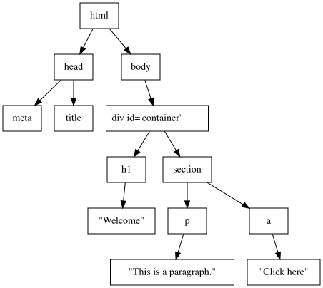

# O DOM(Document Object Model)

---

## 1⃣ DOM이란?

> DOM은 HTML, XML 문서를 브라우저가 **트리 구조의 객체로 메모리에 표현한 모델**입니다.

### 정의적으로는:

* **"문서(document)"를 위한 API 인터페이스 모델**
* 문서의 각 구성 요소(태그, 속성, 텍스트 등)를 \*\*노드(node)\*\*로 구성된 **트리 형태의 객체 모델**로 나타냄
* DOM은 현재 **WHATWG의 DOM Living Standard**가 유일한 규범 명세입니다. (W3C의 "DOM Level 1~4" 시리즈는 개발이 중단되어 역사적 문서로만 남아 있습니다.)

> 헷갈리기 쉬운 경계: **DOM 표준과 HTML 표준은 서로 다른 명세**입니다.
>
> | 무엇                                                          | 정의하는 표준                    |
> | ----------------------------------------------------------- | -------------------------- |
> | `Node`, `Element`, `Document`, `Attr`, `Text`, 트리 구조, 이벤트 전파 | **DOM Standard** (WHATWG)  |
> | `HTMLElement`, `HTMLInputElement.value`, `` 같은 태그의 의미   | **HTML Standard** (WHATWG) |
> | 태그를 실제 트리로 바꾸는 **HTML 파싱 알고리즘**                             | **HTML Standard** (WHATWG) |
> | `getComputedStyle`, `CSSStyleDeclaration`(=CSSOM)            | **CSS 관련 명세** (W3C/CSSWG)  |
>
> 즉 "DOM은 HTML 명세다"라는 말은 정확하지 않습니다. DOM은 **문서 종류와 무관한 범용 노드 트리 모델**이고,
> HTML 표준은 그 위에 "HTML 요소가 무엇을 의미하는가"를 얹은 것입니다. 그래서 XML·SVG도 같은 DOM 트리 모델을 씁니다.

---

## 2⃣ DOM의 내부 구조 (트리 모델)

HTML 문서는 다음과 같이 DOM 트리로 변환됩니다:

```html
<!DOCTYPE html>
<html>
  <head>
    <meta charset="UTF-8">
    <title>Demo</title>
  </head>
  <body>
    <div id="container">
      <h1>Welcome</h1>
      <section>
        <p>This is a paragraph.</p>
        <a href="#">Click here</a>
      </section>
    </div>
  </body>
</html>
```

### ▶ 메모리 상의 DOM 트리




---

## 3⃣ DOM 구성 요소 (Node Interface 계층 구조)

DOM은 다양한 **노드 타입**으로 이루어져 있으며, 모두 `Node` 인터페이스를 상속합니다.

### 주요 노드 타입

| 노드 인터페이스   | 설명                         |
| ---------- | -------------------------- |
| `Document` | 문서 전체, 최상위 노드              |
| `Element`  | HTML 요소 (`<div>`, `<p>` 등) |
| `Text`     | 텍스트 노드                     |
| `Attr`     | 속성 노드 (예: `id="greet"`)    |
| `Comment`  | 주석 노드                      |

> 즉, DOM은 단순한 트리가 아니라 **계층적 인터페이스를 가진 객체 트리**

---

## 4⃣ DOM은 “실시간 반영되는 객체 모델”

### 특징

* HTML 문서가 로드되면 파서가 DOM으로 구성
* **JavaScript가 DOM을 직접 조작 가능**
* DOM을 바꾸면 브라우저는 해당 부분을 **"더럽혀졌다(dirty)"고 표시**해 두고, **다음 렌더링 기회에 한꺼번에 반영**합니다.

> 정정: **"DOM 변경 → 화면에 즉시 반영"은 사실이 아닙니다.**
> DOM 변경은 동기적으로 **트리만** 갱신하고, 스타일 계산·레이아웃·페인트는 **지연·병합**됩니다.
> 브라우저는 현재 태스크와 마이크로태스크를 모두 끝낸 뒤, 화면 갱신 시점(보통 디스플레이 주사율에 맞춘 프레임 경계)에 가서야 파이프라인을 돌립니다.
> 그래서 아래 코드는 **중간 상태(0px)를 한 번도 그리지 않고** 최종값만 한 번 그립니다.
>
> ```js
> box.style.width = "0px";
> box.style.width = "500px";   // 화면에는 500px만 나타난다
> ```
>
> 이 "예약 후 일괄 처리" 덕분에 반복 조작이 저렴해지지만, 반대로 `offsetWidth` 같은 **레이아웃 값을 읽는 순간 브라우저는 예약을 깨고 그 자리에서 레이아웃을 강제 실행**합니다(= 강제 동기 레이아웃).

### 예:

```js
document.getElementById("greet").textContent = "Hello World";
```

* `Element` 노드의 자식 `Text` 노드 값을 변경
* 텍스트 길이가 달라지면 요소의 크기가 바뀔 수 있으므로, 이 변경은 **Style → Layout → Paint → Composite** 을 유발합니다.
  (텍스트 변경이라고 해서 Paint만 다시 하는 것이 아닙니다.)

---

## 5⃣ DOM API의 설계 철학

DOM은 **프로그래밍 언어 중립적인 구조**를 갖습니다.
(JavaScript 뿐만 아니라 Java, C#, Python 등에서도 조작 가능)

### 대표적인 DOM API

| 메서드                      | 설명            |
| ------------------------ | ------------- |
| `getElementById(id)`     | ID 기반 탐색      |
| `querySelector(sel)`     | CSS 선택자 기반 탐색 |
| `createElement(tag)`     | 요소 생성         |
| `appendChild(node)`      | 자식 노드 추가      |
| `setAttribute(key, val)` | 속성 설정         |

---

## 6⃣ DOM은 브라우저 엔진과 어떻게 연결되는가?

### 브라우저 렌더링 파이프라인에서의 DOM:

1. HTML 파싱 → **DOM Tree 생성**
2. CSS 파싱 → **CSSOM**
3. **Style(스타일 재계산)**: DOM의 각 요소에 CSS 규칙을 매칭해 **계산된 스타일(computed style)** 을 확정
4. **Layout(= Reflow)**: 화면에 나올 요소들로 **Layout Tree**를 만들고 각 박스의 위치·크기를 계산
5. **Paint**: 무엇을 어떤 순서로 그릴지 **그리기 명령 목록**을 기록
6. **Raster + Composite**: 명령 목록을 타일 단위 픽셀로 굽고, 레이어들을 GPU에서 합성해 화면에 출력

즉, DOM은 **렌더링의 핵심 데이터 구조**

> **용어 주의: "Render Tree"는 Layout Tree의 옛 이름입니다.**
> WebKit 시절 명칭이 널리 퍼져 지금도 자료마다 Render Tree / Layout Tree / Frame Tree(Gecko)로 제각각 불리지만, 오늘날 Chromium(Blink)의 공식 단계 이름은 **Style → Layout → Paint → Composite** 이고 그 산출물이 **Layout Tree**입니다.
> 또한 이 트리는 "DOM + CSSOM을 단순 합친 것"이 아닙니다.
>
> * `display: none` 요소는 **제외**되고, `visibility: hidden`은 자리를 차지하므로 **포함**됩니다.
> * `::before` / `::after` 처럼 **DOM에 없는 노드가 새로 생기고**, 하나의 요소가 줄바꿈으로 여러 박스가 되기도 해서 **DOM 노드와 1:1로 대응하지 않습니다.**

---

## 7⃣ DOM 변경이 렌더링에 미치는 영향

| 변경 유형                          | 다시 도는 단계                          | 비용    |
| ------------------------------ | --------------------------------- | ----- |
| `transform`, `opacity`, `filter` (승격된 레이어) | **Composite만**                    | 가장 낮음 |
| `color`, `background-color`, `box-shadow`  | Style → **Paint** → Composite     | 낮음~중간 |
| 텍스트 내용 변경, `font-size` 변경      | Style → **Layout** → Paint → Composite | 높음 |
| `width`/`height`/`margin`/`display`/`position` 변경 | Style → **Layout** → Paint → Composite | 높음 |
| DOM 노드 추가·삭제·이동                | Style → **Layout** → Paint → Composite | 가장 높음 |

> 자주 틀리는 두 가지
>
> * **텍스트 변경은 Paint만 하는 게 아닙니다.** 글자 수가 달라지면 줄바꿈과 요소 크기가 달라질 수 있어 **Layout이 먼저 다시 계산**됩니다.
> * **`font`는 Paint급이 아니라 Layout급**입니다. `color`는 글자 크기를 바꾸지 않아 Paint만 하지만, `font-size`/`font-family`는 글자 폭이 바뀌므로 레이아웃을 무효화합니다.
> * 파이프라인은 **건너뛸 수는 있어도 되돌아가지는 않습니다.** Layout이 돌면 그 뒤 Paint·Composite는 반드시 따라옵니다. 그래서 애니메이션은 Layout·Paint를 아예 건너뛰는 `transform`/`opacity`로 만드는 것이 원칙입니다.

---

## 8⃣ Shadow DOM, Virtual DOM, Custom Elements (고급 확장)

### Shadow DOM

* 캡슐화된 DOM 영역 (별도의 **shadow tree** 를 갖는다)
* 셀렉터가 경계를 넘지 못한다 → 바깥 `document.querySelector()`로 내부 요소를 찾을 수 없다

> "외부 CSS/JS에서 **접근 불가**"는 과장된 표현입니다. Shadow DOM의 캡슐화는 **보안 경계가 아니라 셀렉터/스타일 경계**입니다.
>
> * `mode: 'open'` 이면 **`element.shadowRoot`로 외부 JS가 그대로 들어갈 수 있습니다.** 막으려면 `mode: 'closed'`를 써야 하지만, 이것도 보안 장치는 아닙니다.
> * CSS도 완전히 차단되지 않습니다. `color`, `font` 같은 **상속되는 속성은 그대로 흘러 들어가고**, **CSS 커스텀 프로퍼티(`--x`)** 도 경계를 통과합니다. 바깥에서 내부를 겨냥할 때는 `::part()` / `::slotted()`를 씁니다.
> * 이벤트는 경계를 넘어 버블링되며, 이때 `event.target`은 **바깥에서 보이는 호스트 요소로 보정(retarget)** 됩니다. 원래 경로는 `event.composedPath()`로 확인합니다.

```js
const shadowRoot = element.attachShadow({ mode: 'open' });
shadowRoot.innerHTML = `<p>Shadow content</p>`;
```

### Virtual DOM

* 실제 DOM이 아님 → 메모리상의 가상 구조 (React 등에서 사용)
* diffing 알고리즘으로 실제 DOM 변경 최소화

### Custom Elements (Web Components)

* 사용자 정의 태그와 DOM 조작 가능

```js
class MyComponent extends HTMLElement {
  connectedCallback() {
    this.innerHTML = "<p>Hello</p>";
  }
}
customElements.define('my-comp', MyComponent);
```

---

## O DOM의 특징 요약

| 항목     | 설명                                             |
| ------ | ---------------------------------------------- |
| 데이터 구조 | 트리(Tree) 구조                                    |
| 표준화    | **WHATWG DOM Living Standard** (구 W3C DOM Level 시리즈는 중단) |
| 접근 방식  | JavaScript 기반 객체 조작                            |
| 실시간 반영 | DOM 변경 → 렌더링 자동 반영                             |
| 관련 기술  | CSSOM, Shadow DOM, Virtual DOM, Web Components |

---

## DOM에 강해지면 무엇이 좋아지나?

* 렌더링 최적화 가능 (Reflow/Paint 최소화)
* 애플리케이션 상태와 뷰의 일치 제어
* Web Components, Framework 내부 동작 이해
* 디버깅/성능 측정 능력 향상 (DevTools 활용)

---
<br/>


# O DOM은 왜 필요한가?

---

## 1. **문서를 “프로그래밍 가능하게” 만들기 위해**

### HTML은 “정적 문서”

HTML은 원래 **정적인 문서 구조**만 표현할 수 있었습니다:

```html
<p>오늘의 날짜: 2024-12-31</p>
```

이렇게 고정된 콘텐츠는 바꾸거나 반응형으로 처리할 수 없습니다.
→ 우리는 이것을 JavaScript로 조작하고 싶어졌습니다:

```js
document.querySelector("p").textContent = `오늘의 날짜: ${new Date().toLocaleDateString()}`;
```

### 그런데 문제: JS는 HTML 문서 구조를 이해하지 못함

→ 브라우저가 HTML을 **JS가 다룰 수 있는 형태로 가공**해야 했고
그 결과물이 \*\*DOM (Document Object Model)\*\*입니다.

> **DOM은 HTML을 객체(트리)로 표현한 것** → 즉, “프로그래밍 가능한 HTML”

---

## 2. **브라우저와 사용자 간의 인터랙션을 처리하려면 DOM이 필수**

HTML은 클릭, 입력 등 사용자 상호작용을 고려하지 않았지만,
현대 웹은 **동적 상호작용**이 필수입니다:

* 버튼 클릭 시 새 콘텐츠 출력
* 입력 필드에 따라 실시간 검색 결과 표시
* 드래그 앤 드롭, 마우스 이벤트 등 UI 반응

 이 모든 인터랙션은 결국 **HTML 요소를 읽고/수정하고/추적**해야 함
 즉, **“문서에 대한 구조적 접근과 변경”을 위한 API가 필요**
→ 이 역할을 DOM이 맡습니다.

---

## 3. **UI를 동적으로 조작할 수 있는 구조 기반 제공**

DOM은 다음과 같은 작업을 가능하게 합니다:

| 기능     | 설명                            |
| ------ | ----------------------------- |
| 요소 생성  | `createElement("div")`        |
| 속성 수정  | `setAttribute("id", "box")`   |
| 콘텐츠 변경 | `textContent = "Hello"`       |
| 삭제     | `removeChild(node)`           |
| 스타일 변경 | `element.style.color = "red"` |

이 모든 작업은 실제로는 **HTML 파일을 바꾸는 것이 아니라**,
**브라우저 메모리에 있는 DOM 객체를 조작**하는 것입니다.
→ 결과적으로 화면이 **즉시 반영**됨

---

## 4. **웹 표준 인터페이스로의 통합 필요성**

과거에는 브라우저마다 JavaScript에서 HTML을 조작하는 방식이 제각각이었습니다.

* Netscape: `document.layers`
* Internet Explorer: `document.all`

→ 혼란! 비표준! 유지보수 악몽!

 그래서 **W3C가 DOM을 웹 표준 API로 정립**
→ 이제는 어떤 브라우저든 `document.getElementById("id")`는 동작해야 함

---

## 5. **프론트엔드 생태계의 모든 기반**

DOM은 다음과 같은 기술들의 **전제 조건이자 기반**입니다:

| 기술                     | DOM 필요성                   |
| ---------------------- | ------------------------- |
| React / Vue / Svelte   | Virtual DOM, Template 바인딩 |
| CSS / JS 애니메이션         | DOM 노드 기반 트랜지션            |
| Accessibility (A11y)   | DOM 트리 구조에 기반한 스크린 리더     |
| 테스트 도구 (Jest, Cypress) | DOM 상태 확인 및 시뮬레이션         |
| SEO 크롤러                | DOM을 기준으로 콘텐츠 읽음          |

---

## O 요약: DOM이 필요한 이유 5가지

| 이유                | 설명                            |
| ----------------- | ----------------------------- |
| HTML을 JS로 조작하기 위해 | HTML을 객체로 만들어야 함              |
| 사용자 인터랙션 처리       | 클릭, 입력 등 모든 이벤트는 DOM을 통해      |
| 화면을 동적으로 바꾸기 위해   | 실시간 콘텐츠 조작이 가능                |
| 웹 표준 통합           | 브라우저 호환성과 유지보수                |
| 프론트엔드 기술 기반       | 현대 JS 프레임워크와 도구는 모두 DOM 위에 존재 |

---

## 핵심 한 줄 요약

> **DOM은 정적인 HTML을 "프로그래밍 가능한 웹 UI"로 만드는 연결 고리다.**


