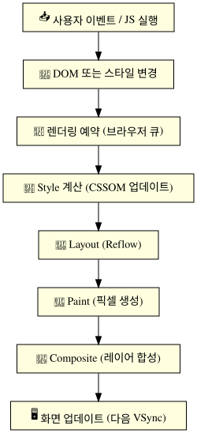

# 웹 페이지 업데이트

---

## O 전제 개념: 무엇이 업데이트인가?

> 웹 페이지가 “업데이트된다”는 것은
> 결국 \*\*화면에 보이는 픽셀(Render Output)\*\*이 바뀐다는 뜻입니다.

이 변화는 대부분 다음 세 가지 원인 중 하나로 시작됩니다:

1. 사용자 상호작용 (클릭, 입력 등)
2. 타이머(setTimeout, requestAnimationFrame)
3. 네트워크 응답 (AJAX, fetch)

---

## O 전체 업데이트 순서: Overview


<br>


---

## 1. 이벤트 발생 또는 JavaScript 실행

* 이벤트 핸들러에서 DOM 조작 (`.textContent`, `.classList`, `.style`)
* 또는 직접 스타일 변경 (`element.style.backgroundColor = "red"`)
* 또는 애니메이션 루프/타이머 (`setTimeout`, `setInterval`, `requestAnimationFrame`)

---

## 2. DOM 또는 CSSOM 변경

JS에 의해 다음 중 하나가 바뀝니다:

* **DOM 구조**: 요소 추가/삭제/속성변경
* **CSSOM**: 클래스 변경, 스타일 직접 수정
* 이 변화가 있으면 브라우저는 **렌더링 업데이트가 필요함을 인식**합니다

 브라우저는 즉시 다시 그리는 것이 아니라, **렌더링을 “예약”합니다**
→ 즉, 가능한 변경을 묶어서 처리하려고 합니다 (Batching)

```js
box.style.width = "0px";
box.style.width = "500px";   // 중간 상태(0px)는 화면에 한 번도 그려지지 않는다
```

> 그런데 이 **예약을 깨뜨리는 코드**가 있습니다. 레이아웃 값을 **읽는** API를 호출하면 브라우저는 정확한 값을 돌려주려고 **그 자리에서 즉시 Layout을 실행**합니다(= 강제 동기 레이아웃, Forced Synchronous Layout).
>
> * 대표적인 트리거: `offsetTop/Left/Width/Height`, `clientWidth/Height`, `scrollTop/Height`, `getBoundingClientRect()`, `getComputedStyle()`
>
> ```js
> // X 레이아웃 스래싱: 반복마다 동기 Layout 발생
> for (const el of items) {
>   el.style.width = "500px";     // 쓰기 → 레이아웃 무효화
>   console.log(el.offsetHeight); // 읽기 → 즉시 Layout 강제!
> }
>
> // O 읽기를 먼저 몰아서, 쓰기를 나중에 몰아서 (Layout 1회)
> const heights = items.map(el => el.offsetHeight);
> items.forEach((el, i) => { el.style.width = "500px"; el.style.height = heights[i] + "px"; });
> ```
>
> 아래 최적화 팁의 "DOM 접근은 읽기와 쓰기를 나눠서 처리"가 바로 이 이야기입니다.

---

## 3. Style 계산 (스타일 재계산)

### Style recalc 발생 조건:

* 클래스 변경
* 스타일 속성 변경
* 외부 CSS 규칙에 의한 영향

### 결과:

* 기존 CSSOM 트리를 기반으로 변경된 요소에 대한 **정확한 스타일 계산**이 다시 이루어짐
* `getComputedStyle()` 등이 이 과정 후 값 제공

---

## 4. Layout 단계 (Reflow)

> 요소의 **위치, 크기, 박스 모델(box-sizing)** 등을 다시 계산

발생 조건:

* `width`, `height`, `padding`, `margin`, `border`, `display`, `position`, `top`/`left`, `font-size` 등 **기하(geometry)에 영향을 주는 속성**의 변경
* 또는 DOM에 노드 추가/제거, 텍스트 내용 변경, 창 크기 변경

> **정정: `transform`은 Layout을 유발하지 않습니다.**
> `transform`은 레이아웃이 확정된 뒤 그 결과를 시각적으로만 변형하므로 요소가 차지하는 자리가 바뀌지 않고, 주변 요소를 밀어내지도 않습니다.
> 그래서 `transform`/`opacity` 변경은 **Layout과 Paint를 건너뛰고 Composite만** 수행될 수 있습니다.
> 같은 이동이라도 `left: 100px`는 Layout부터 전부 다시 돌지만, `transform: translateX(100px)`는 합성만 하면 됩니다. **애니메이션에 `transform`을 쓰라는 조언의 근거가 바로 이 차이입니다.**

 이 단계는 매우 비쌈. 성능 최적화에서 가장 중요한 단계 중 하나.

예:

```js
element.style.width = "500px";
element.offsetHeight; // 강제로 Layout 발생
```

---

## 5. Paint 단계 (Rasterization)

> 요소의 픽셀을 실제 그리기 위한 작업

* 배경색, 텍스트, 테두리, 그림자 등을 **어떤 순서로 그릴지 "그리기 명령 목록"으로 기록**하는 단계입니다(메인 스레드, CPU).
* 이 명령 목록을 실제 픽셀 비트맵으로 굽는 **Raster**는 별개 단계이며, 현재 Chromium에서는 **컴포지터 스레드/GPU 프로세스가 타일 단위로** 처리합니다.
* **Paint 영역이 넓을수록, 그리기 명령이 복잡할수록(그림자·필터·둥근 모서리 겹침) 비용이 큽니다.**

> 정정: "Paint = 픽셀 만들기", "Paint는 CPU가 한다"는 옛 설명입니다. **기록(Paint)과 굽기(Raster)는 분리**되어 있고, 굽기는 대체로 **GPU 가속**됩니다.

---

## 6. Composite 단계

> 여러 레이어를 GPU에서 조합하여 최종 화면을 완성

* 래스터된 레이어들을 컴포지터가 합성함 → 최종 프레임 버퍼로 출력
* 별도 **합성 레이어로 승격(promotion)** 되는 대표적인 경우:

  * `will-change: transform` / `will-change: opacity` (**명시적·권장**)
  * `transform` / `opacity` / `filter`를 대상으로 **진행 중인 애니메이션**
  * 3D transform, `<video>`, `<canvas>`, `backdrop-filter`, 스크롤 중인 `position: sticky`

> 흔한 오해 정리
>
> * **`position: fixed`라고 해서 자동으로 GPU 레이어가 되지는 않습니다.** 과거 브라우저의 동작이 일반화된 이야기이며, 현재 Chromium은 상황(합성 스크롤 여부 등)에 따라 판단합니다.
> * **`transform`을 "쓰기만" 해도 레이어가 생기는 것은 아닙니다.** 정적인 `transform`은 승격을 보장하지 않고, 애니메이션 중이거나 `will-change`가 있을 때 승격됩니다.
> * **레이어는 공짜가 아닙니다.** 레이어마다 GPU 메모리를 쓰므로 `will-change`를 상시로 남발하면 오히려 느려집니다. 애니메이션 직전에 켜고 끝나면 끄는 것이 원칙입니다.
>
> 승격된 레이어의 `transform`/`opacity` 변경은 **컴포지터 스레드**에서 처리되므로, **메인 스레드가 무거운 JS로 막혀 있어도 애니메이션이 60fps로 유지**됩니다. 이것이 `left`/`top` 애니메이션과의 결정적 차이입니다.

---

## 7. 화면 업데이트

* 합성이 끝난 프레임이 화면에 표시됩니다.
* **주사율은 60Hz(약 16.7ms)가 유일한 값이 아닙니다.** 120Hz 기기라면 약 8.3ms, 가변 주사율 디스플레이라면 그때그때 달라집니다. 코드에 `16`을 하드코딩하지 말고 `requestAnimationFrame`이 넘겨주는 타임스탬프의 **차이(delta)** 로 계산해야 하는 이유입니다.

> **정정: 순서가 반대입니다.**
> "모든 게 완료된 뒤 다음 vsync를 기다린다"가 아니라, **vsync에 맞춰 프레임이 시작되고 그 프레임 안에서 Style~Composite가 수행**됩니다.
> 그래서 이 작업들이 한 프레임 예산(60Hz면 약 16.7ms)을 넘기면 **그 프레임을 놓치고(frame drop) 화면이 끊겨 보입니다.**

---

## 전체 타이밍 흐름 (requestAnimationFrame 포함)

```plaintext
① 태스크 실행 (클릭 핸들러 / setTimeout / fetch 응답 / React의 setState 처리)
 ↓
② DOM·스타일 변경 → 즉시 그리지 않고 "더럽혀짐(dirty)"으로 표시만 해 둔다
 ↓
③ 마이크로태스크 큐를 전부 비운다 (Promise.then / await 이후 / MutationObserver)
    ※ 여기가 끝나기 전에는 화면이 절대 갱신되지 않는다
 ↓
   ── 지금이 프레임 경계인가? (주사율 기준: 60Hz면 ~16.7ms, 120Hz면 ~8.3ms) ──
      아니면 ①로 돌아간다  ← 렌더링은 매 태스크마다 일어나지 않는다
 ↓
④ resize / scroll 이벤트 발송, CSS 애니메이션 시간 진행
 ↓
⑤ requestAnimationFrame 콜백 실행  ← "다음 리페인트 직전". 여기서 바꾼 값은 이번 프레임에 반영된다
 ↓
⑥ ResizeObserver → IntersectionObserver 콜백
 ↓
⑦ Style → Layout → Paint → Raster/Composite
 ↓
🖥 프레임 표시 (이 전체가 한 프레임 예산 안에 끝나야 60fps 유지)
```

> **`requestAnimationFrame`은 "다음 프레임을 요청"하는 것이 아니라 "다음 리페인트 직전에 끼어들 콜백을 예약"하는 것**입니다.
> 콜백은 **1회용**이므로 애니메이션을 이어가려면 콜백 안에서 다시 호출해야 하고, 탭이 백그라운드가 되면 아예 호출되지 않습니다.

---

## 예제: DOM 조작으로 업데이트 발생

```html
<button onclick="change()">Update</button>
<p id="text">안녕하세요</p>

<script>
  function change() {
    const el = document.getElementById("text");
    el.textContent = "반가워요!";        // DOM 변경
    el.style.color = "blue";             // CSSOM 변경
    // offsetHeight로 강제 Layout 발생 가능
  }
</script>
```

---

## 브라우저 최적화 팁

| 구분                         | 설명                                        |
| -------------------------- | ----------------------------------------- |
| Layout 최소화                 | DOM 접근은 읽기와 쓰기를 나눠서 처리                    |
| GPU 레이어 분리                 | `will-change`, `transform: translateZ(0)` |
| Paint 최적화                  | 그림자, 둥근 모서리 등 스타일 최소화                     |
| `requestAnimationFrame` 사용 | 애니메이션 시 렌더링과 동기화                          |

---

## 최종 요약

| 단계              | 설명             | 비용     |
| --------------- | -------------- | ------ |
| JS 실행           | DOM/CSS 변경 유발  | 낮음\~중간 |
| Style 계산        | 속성 변경시 스타일 재계산 | 중간     |
| Layout (Reflow) | 위치/크기 변경 시     | **높음** |
| Paint           | 시각 요소 변경       | 중간     |
| Composite       | GPU 레이어 합성     | 낮음\~중간 |

