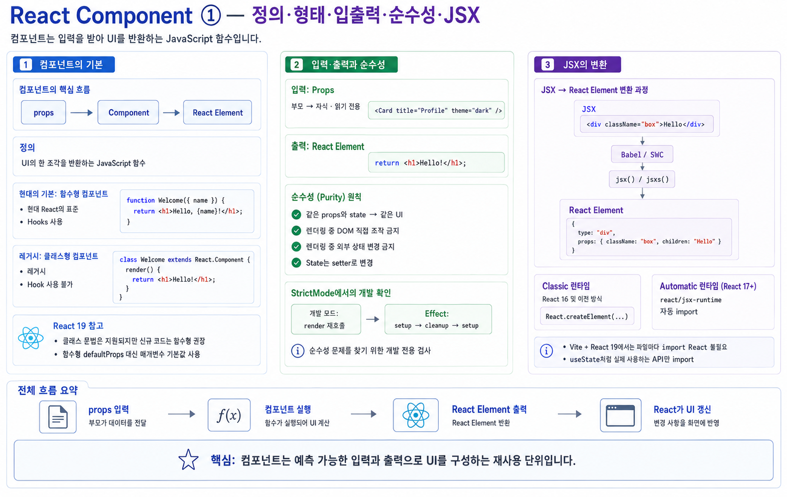
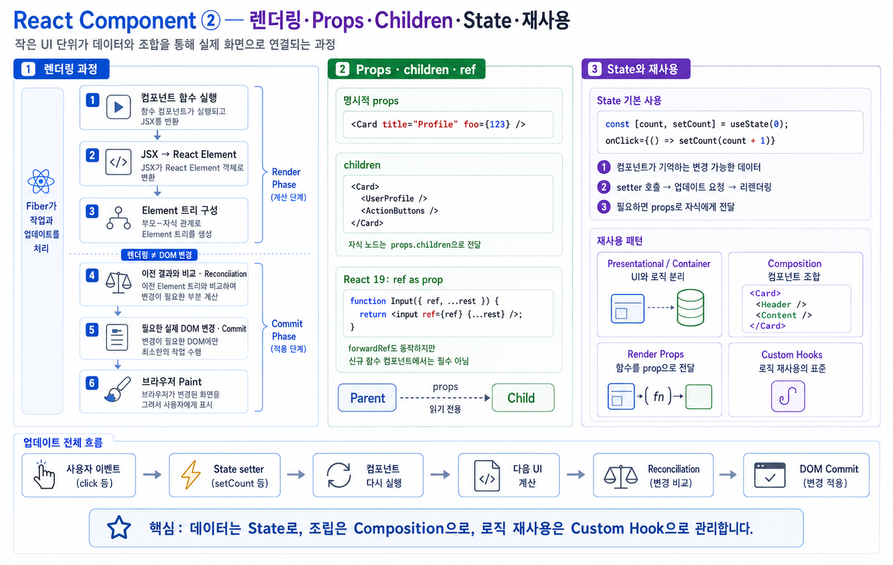
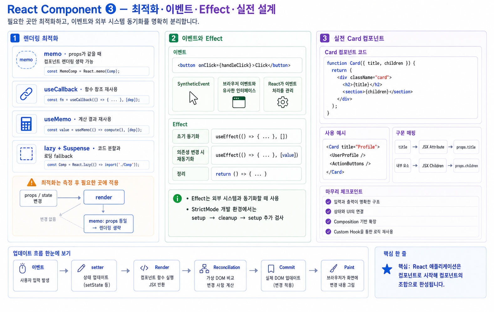

# React Component

---

# React 컴포넌트: 웹 UI를 구성하는 최소 단위의 모든 것

React 애플리케이션을 구성하는 가장 중요한 요소가 무엇인지 물으면, 단연 **컴포넌트(Component)** 입니다.
컴포넌트는 React 세계의 **원자(atom)** 이며, 모든 UI는 컴포넌트를 조합해 구성합니다.


---

# 1. 컴포넌트란 무엇인가?

## 컴포넌트(Component)의 핵심 정의

React 컴포넌트는 **UI의 한 조각을 리턴하는 자바스크립트 함수**입니다.

 한 문장으로 표현하면:

> **하나의 입력(props)를 받아서 React Element(=UI)를 리턴하는 순수 함수 같은 존재**

---

# 2. 컴포넌트의 기본 형태

React 컴포넌트는 두 가지 방식으로 정의할 수 있습니다.

## ① 함수형 컴포넌트(Function Component) – 현대 React의 표준

```jsx
function Welcome({ name }) {
  return <h1>Hello, {name}!</h1>;
}
```

* Hooks 사용 가능
* 상태(state), 사이드이펙트(useEffect), 메모이제이션(useMemo/useCallback) 가능
* 가장 널리 사용되는 형태

## ② 클래스형 컴포넌트(Class Component) – 레거시

```jsx
class Welcome extends React.Component {
  render() {
    return <h1>Hello, {this.props.name}!</h1>;
  }
}
```

* 과거에는 LifeCycle 메서드 중심
* 지금은 Hooks 등장 이후 거의 사용하지 않음
* **클래스 컴포넌트에서는 Hook을 사용할 수 없습니다** (Hook은 함수 컴포넌트 전용)

 **2024년 이후 React 공식 문서의 방향성은 함수형 컴포넌트가 Only Standard입니다.**

> React 19 기준으로 알아둘 것
>
> * 클래스 컴포넌트 문법 자체는 아직 제거되지 않았지만, **신규 코드에서는 쓰지 않습니다.**
> * `componentWillMount` / `componentWillReceiveProps` / `componentWillUpdate` 는 **deprecated**이고 `UNSAFE_` 접두사가 붙은 형태만 남아 있습니다.
> * React 19에서 **`propTypes` 와 `contextTypes` 는 제거**되었고, **함수 컴포넌트의 `defaultProps` 도 제거**되었습니다.
>
> ```jsx
> // X React 19의 함수 컴포넌트에서는 무시됨
> Welcome.defaultProps = { name: 'Guest' };
>
> // 파라미터 디폴트값으로 표현
> function Welcome({ name = 'Guest' }) {
>   return <h1>Hello, {name}!</h1>;
> }
> ```

---

# 3. React 컴포넌트는 입력과 출력이 명확하다

## 입력(Input): Props

Props는 부모 → 자식으로 전달하는 **읽기 전용 값**입니다.

```jsx

// 1. 자식 컴포넌트 (입력을 받는 곳)
function Card({ title, theme }) {
  return <div className={theme}>{title}</div>;
}


// 2. 부모 컴포넌트 (데이터를 넘겨주는 곳)
function App() {
  return (
    <main>
      // Props는 객체로 전달됩니다:
      <Card title="Profile" theme="dark" />
    </main>
  );
}

// React가 내부적으로 생성하여 넘겨주는 props 아규먼트 형태
const props = {
  title: "Profile",
  theme: "dark"
};


```

---

## 출력(Output): React Element

React 컴포넌트는 **JSX로 표현된 React Element를 반환**합니다.

```jsx
return <h1>Hello!</h1>;
```

React는 이 엘리먼트를 기반으로 **가상 DOM(Virtual DOM)** 을 생성하고 실제 DOM을 업데이트합니다.

---

# 4. React 컴포넌트는 순수함수를 지향한다

컴포넌트는 다음 조건을 지키는 것이 이상적입니다:

* 입력(props)이 같으면 같은 결과(UI)를 렌더링한다.
* 렌더링 과정에서 DOM을 직접 조작하지 않는다.
* 렌더링 중 외부 상태를 바꾸지 않는다.

그래서 상태 변경은 **Hook(예: useState)이 돌려주는 setter**로만 하고, 렌더링 함수 본문에서는 하지 않습니다.

> 이 “순수성”은 개발 모드에서 **StrictMode**가 대신 검사해 줍니다.
> `<StrictMode>` 안에서는 컴포넌트 함수가 **의도적으로 두 번 호출**되고, Effect도 `setup → cleanup → setup` 으로 **한 번 더 실행**됩니다.
> 두 번 실행했을 때 결과가 달라진다면(렌더 중 배열 push, 전역 변수 증가 등) 그 컴포넌트는 순수하지 않다는 신호입니다.
> 이 이중 실행은 **개발 모드 전용**이며, 프로덕션 빌드에서는 한 번만 실행됩니다.

---

# 5. JSX는 컴포넌트의 문법적 핵심

React 컴포넌트는 **JSX**로 작성됩니다.

JSX는 HTML처럼 보이지만 사실:

```
JSX → 컴파일러(Babel/SWC) → Element 생성 함수 호출 → React Element 생성
```

예:

```jsx
<div className="box">Hello</div>
```

컴파일 후 — ① React 16 이하에서 쓰이던 **Classic 런타임**:

```js
React.createElement("div", { className: "box" }, "Hello");
```

컴파일 후 — ② React 17+ 부터 디폴트 값인 **Automatic 런타임(새 JSX Transform)**:

```js
import { jsx as _jsx } from "react/jsx-runtime";

_jsx("div", { className: "box", children: "Hello" });
```

> 자주 하는 오해
> **“JSX를 쓰려면 파일마다 `import React from 'react'` 를 해야 한다”는 설명은 React 17 이전 기준입니다.**
> Vite + React 19 환경은 Automatic 런타임이 디폴트라, 컴파일러가 `react/jsx-runtime` 에서 `jsx`/`jsxs` 를 **자동으로 import** 합니다.
> 따라서 `useState` 처럼 실제로 쓰는 API만 import 하면 됩니다.
> (children이 여러 개인 경우에는 `jsx` 대신 `jsxs` 가 호출됩니다.)

---

# 6. 컴포넌트의 렌더링 과정 (VDOM 기반)

React 컴포넌트는 아래 흐름으로 렌더링됩니다:

1. 컴포넌트 함수 실행
2. JSX → React Element 생성
3. Virtual DOM 트리 구성
4. 이전 VDOM과 비교 (Reconciliation)
5. 변경된 부분만 실제 DOM 패치

 이 전 과정은 React의 **Fiber 엔진**이 처리합니다.

---

# 7. Props와 Children: 컴포넌트의 구성요소

**Props(Properties)** 는 부모 컴포넌트가 자식 컴포넌트로 전달하는 **단방향 읽기 전용(Read-only) 데이터**입니다. 컴포넌트는 전달받은 Props를 바탕으로 UI를 구성하며, 명시적 어트리뷰트뿐만 아니라 태그 사이에 위치한 자식 엘리먼트, DOM 참조를 위한 `ref`까지 모두 Props 객체를 통해 전달됩니다.


## 7.1 명시적 Props (Explicit Props)

부모 컴포넌트가 자식 컴포넌트의 JSX 어트리뷰트로 직접 지정하여 전달하는 데이터입니다.

### 1) 전달 및 수신 메커니즘
문자열, 숫자, 불리언, 객체, 함수(이벤트 핸들러) 등 모든 자바스크립트 표현식을 전달할 수 있습니다.

```jsx
// 부모 컴포넌트: 어트리뷰트 형태로 전달
function App() {
  const handleClick = () => console.log('클릭됨');

  return (
    <Card 'admin' '홍길동', count="{123}" isActive="{true}" name: onClick="{handleClick}" role: title="Profile" user="{{" }}/>
  );
}

```

### 2) React 내부의 Props 객체 생성

React는 전달된 어트리뷰트들을 모아 하나의 평범한 자바스크립트 객체(Plain Object)로 조립하여 자식 컴포넌트의 첫 번째 매개변수로 주입합니다.

```javascript
// React가 내부적으로 생성하는 객체 형태
const props = {
  title: "Profile",
  count: 123,
  isActive: true,
  user: { name: '홍길동', role: 'admin' },
  onClick: handleClick
};

```

### 3) 자식 컴포넌트에서의 수신 및 사용

실무에서는 주로 구조 분해 할당(Destructuring)과 기본값(Default Parameter)을 함께 사용합니다.

```jsx
// 구조 분해 할당 및 기본값 정의
function Card({ title, count = 0, isActive, user, onClick }) {
  return (
    <div className={`card ${isActive ? 'active' : ''}`} onClick={onClick}>
      <h2>{title} ({count})</h2>
      <p>작성자: {user.name}</p>
    </div>
  );
}

```

> **Props의 불변성(Immutability)**
> Props는 순수 함수(Pure Function)의 매개변수처럼 동작해야 하므로, 자식 컴포넌트 내부에서 `props.title = 'New'`와 같이 값을 직접 수정해서는 안 됩니다.


## 7.2 암묵적 Props: `children`

컴포넌트의 여는 태그와 닫는 태그 사이에 배치된 모든 중첩 요소(텍스트, 다른 JSX 엘리먼트, 컴포넌트 등)는 예약된 속성명인 `props.children`에 자동으로 담겨 전달됩니다.

### 1) 합성(Composition)을 위한 `children` 전달

UI 래퍼(Layout, Card, Modal 등) 역할을 하는 컴포넌트가 내부 콘텐츠를 유연하게 구성할 수 있도록 지원합니다.

```jsx
// 부모 컴포넌트
function App() {
  return (
    <Card>
      <UserProfile name="홍길동"/>
      <ActionButtons/>
    </Card>
  );
}

```

### 2) 자식 컴포넌트에서의 `children` 렌더링

`Card` 컴포넌트는 내부에 어떤 콘텐츠가 들어올지 사전에 알 필요 없이, 원하는 위치에 `{children}`을 배치하여 렌더링을 위임합니다.

```jsx
function Card({ children }) {
  return (
    <section className="card-container">
      <header className="card-header">공통 카드 레이아웃</header>
      <div className="card-body">
        {/* <UserProfile/>과 <ActionButtons/>가 이 위치에 렌더링됨 */}
        {children}
      </div>
    </section>
  );
}

```

### 3) `children`의 데이터 타입

전달되는 자식 요소의 개수에 따라 `props.children`의 타입이 유동적으로 변합니다:

* **자식 요소가 1개인 경우:** 단일 React Element 객체 또는 문자열
* **자식 요소가 2개 이상인 경우:** React Element 객체들의 배열(`Array`)
* **자식 요소가 없는 경우:** `undefined`


## 7.3 React 19: 일반 Prop으로 통합된 `ref`

React 18까지는 컴포넌트에 전달된 `ref`가 일반 `props`에 포함되지 않아 `React.forwardRef` 고차 함수(HOC)로 감싸야만 자식의 실제 DOM에 연결할 수 있었습니다. **React 19부터는 `ref`가 일반 Prop과 완전히 동일하게 취급**됩니다.

### 1) React 19 방식 (권장 표준)

별도의 래핑 함수 없이 매개변수의 `props` 객체에서 `ref`를 직접 꺼내어 사용할 수 있습니다.

```jsx
// 자식 컴포넌트: ref를 일반 prop처럼 직접 수신
function CustomInput({ label, ref, ...restProps }) {
  return (
    <label>
      {label}
      <input ref={ref} {...restProps} />
    </label>
  );
}

// 부모 컴포넌트: ref 전달
function Form() {
  const inputRef = useRef(null);

  const focusInput = () => {
    inputRef.current?.focus();
  };

  return (
    <div>
      <CustomInput label="사용자명" placeholder="이름 입력" ref="{inputRef}"/>
      <button onClick={focusInput}>입력창 포커스</button>
    </div>
  );
}

```

### 2) React 18 이전 vs React 19 비교

| 구분 | React 18 이하 | React 19+ |
| --- | --- | --- |
| **선언 방식** | `React.forwardRef((props, ref) => ...)` 필수 | 일반 함수 선언 `function Input({ ref, ...props })` |
| **타입스크립트 정의** | `React.ForwardRefRenderFunction` 등 복잡한 타입 필요 | 일반 Interface/Type의 속성으로 `ref` 정의 가능 |
| **호환성** | `forwardRef` 미사용 시 콘솔 경고 발생 | `forwardRef`는 점진적 폐기(Deprecated) 예정 (하위 호환은 유지) |


## 7.4 Props 전달 핵심 패턴 요약

| 패턴 | 구문 예시 | 주 사용 목적 |
| --- | --- | --- |
| **명시적 Props** | `<Button variant="primary" onClick={fn} />` | 정적/동적 데이터 및 이벤트 콜백 전달 |
| **Props 스프레드** | `<Input {...restProps} />` | 상위에서 전달받은 다수의 HTML 어트리뷰트 일괄 위임 |
| **Children Props** | `<Modal><p>내용</p></Modal>` | 레이아웃 및 컴포넌트 합성(Composition) |
| **Ref as Prop** | `<CustomInput ref={inputRef} />` | 부모가 자식 내부의 실제 DOM 노드에 직접 접근 (React 19) |


# 8. 컴포넌트는 “상태(state)”를 가질 수 있다

React에서 동적인 UI의 중심은 **state**입니다.

```jsx
function Counter() {
  const [count, setCount] = useState(0);
  return (
    <button onClick={() => setCount(count + 1)}>
      클릭: {count}
    </button>
  );
}
```

State의 특징:

* 컴포넌트 내부에서만 관리
* 값 변경 시 컴포넌트가 자동 리렌더링
* 부모 → 자식으로 전달해야 할 경우 props로 내려주기

---

# 9. 컴포넌트 재사용 패턴

컴포넌트를 잘 설계하면 재사용성과 유지보수성이 높아집니다.

## 1) Presentational & Container Component 패턴

UI(프레젠테이션)과 로직(컨테이너)을 분리

## 2) Composition (조합)

React의 가장 핵심 패턴

```jsx
<Card>
  <Header />
  <Content />
</Card>
```

## 3) Render Props

```jsx
<DataProvider render={data => <Chart data={data} />} />
```

## 4) Custom Hooks

로직 재사용의 표준 방식

```jsx
function useFetch(url) { ... }
```

---

# 10. 고급 렌더링 최적화

## memo

props가 같으면 렌더링 스킵

```jsx
export default React.memo(MyComponent);
```

## useCallback

함수 재생성 방지

## useMemo

비싼 계산 메모이제이션

## Suspense / Lazy Loading

코드 스플리팅 + 지연 렌더링

---

# 11. 이벤트 처리

React의 이벤트는 **SyntheticEvent(합성 이벤트)** 기반입니다.

```jsx
<button onClick={handleClick}>Click</button>
```

* React 내부에서 모든 이벤트는 최상위 레벨에서 관리
* 버블링 전략이 DOM과 99% 동일
* 이벤트 객체가 SyntheticEvent로 래핑됨

---

# 12. 컴포넌트의 라이프사이클 (Hooks 버전)

## Mount(초기 렌더링)

* useEffect(() => {...}, [])

## Update(변경 렌더링)

* useEffect(() => {...}, [의존성])

## Unmount(제거)

* useEffect(() => { return () => {...} }, [])

---

# 13. 실전 예제: 전문가 버전 Card 컴포넌트

```jsx
function Card({ title, children }) {
  return (
    <div className="card">
      <h2>{title}</h2>
      <section>{children}</section>
    </div>
  );
}
```

사용:

```jsx
<Card title="Profile">
  <UserProfile />
  <ActionButtons />
</Card>
```

### 문법적 의미

* `<Card title="Profile">` → **JSX Attribute 문법**
* `<UserProfile />` → React Element
* 내부 요소 전체 → **JSX Children 문법**
* children은 props의 일부로 자동 전달됨

---

# 14. 결론

React 컴포넌트는 단순한 UI 조각이 아니라:

* 입력과 출력이 분리된 순수함수적 구조
* Virtual DOM 기반 렌더링의 핵심
* 상태와 로직을 담는 핵심 단위
* 조합을 통한 무한 확장성의 기반
* Hooks를 통해 강력하게 재사용 가능한 단위

즉, **React 애플리케이션의 모든 것은 컴포넌트로 시작해 컴포넌트로 끝난다**고 할 수 있습니다.







