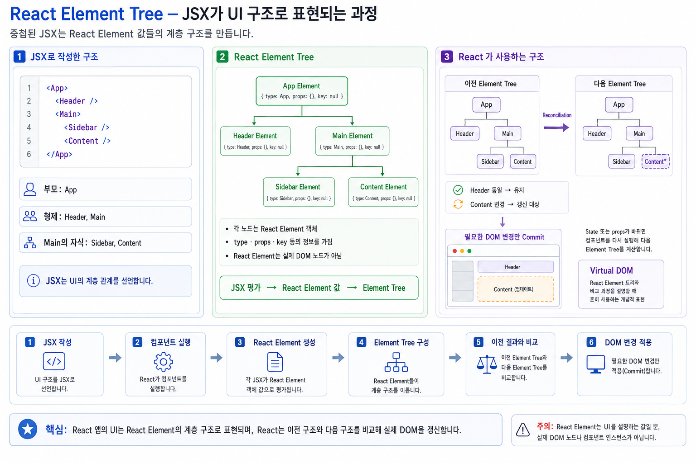
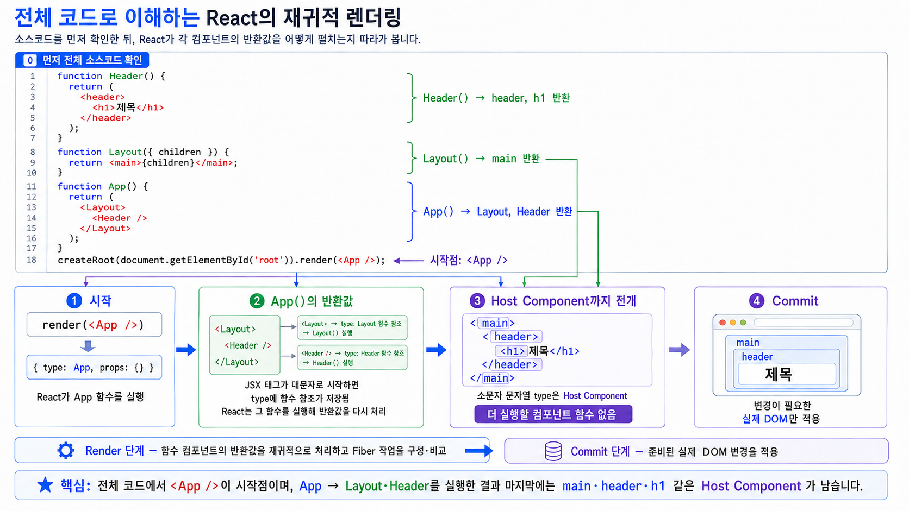

# 리액트 엘리먼트(React Element)

## JSX의 본질, Virtual DOM의 최소 단위, 렌더링의 핵심을 모두 파헤치기

리액트 앱을 구성하는 가장 작은 단위는 **컴포넌트(Component)** 가 아니라, 바로 **엘리먼트(Element)** 입니다.
리액트에서 **돔(DOM)을 설명하는 객체**, 그리고 **렌더링의 최소 단위**는 바로 엘리먼트입니다.

이 글에서는 다음 내용을 아주 깊이 있게 다룹니다:

* React Element란 무엇인가
* 일반 DOM 노드와의 차이
* JSX가 어떻게 Element로 변환되는가
* Element의 불변성(Immutable)
* Element 트리 구조
* Virtual DOM과 Element의 관계
* 렌더링 과정에서 Element가 어떤 역할을 하는가
* 컴포넌트와 Element의 본질적 차이
* createElement와 JSX 분석

---

# 1 React Element란 무엇인가?

## “화면에 어떻게 그려져야 할지”를 표현하는 **객체(Object)**

리액트 엘리먼트는 **UI를 어떻게 보여줄지 기술하는 ‘단순한 자바스크립트 객체’** 입니다.

예를 들어 JSX로 다음과 같이 작성한다고 합시다.

```jsx
const element = <h1 className="title">Hello World</h1>;
```

이 코드는 실제로 *다음과 같은 자바스크립트 객체*로 변환됩니다:

```js
const element = {
  type: 'h1',
  props: {
    className: 'title',
    children: 'Hello World'
  }
};
```

즉, 엘리먼트는:

* 실제 브라우저의 DOM 노드가 아니다 X
* 오직 “어떻게 생겼는지” 설명한 기록이다
* 렌더러(react-dom)가 이 객체를 이용해 브라우저의 DOM을 조작한다

 **결론:**
React Element = 화면 구조를 설명하는 *순수한 데이터 객체*

---

# 2 DOM Node와 React Element의 차이

| 구분    | 브라우저 DOM Node             | React Element                  |
| ----- | -------------------- | ------------------------------ |
| 정체    | 브라우저가 메모리에 만드는 진짜 노드 | UI 구조를 설명하는 POJO(Plain Object) |
| 변화    | mutable (수정 가능)      | immutable (불변)                 |
| 생성 비용 | 비쌈                   | 매우 저렴                          |
| 목적    | 실질적 렌더링              | 실질적 렌더링을 위한 설계도                    |

DOM 노드는 만들기만 해도 또는 변경이 발생하기만 하면  브라우저가 메모리와 렌더 트리를 갱신해야 해서 비용이 큽니다.
반면 React Element는 단순한 객체라 생성 비용이 거의 없습니다.

---

# 3 JSX → React Element 변환 과정

## JSX는 단지 Syntactic Sugar

```jsx
<h1 id="title">Hello</h1>
```

JSX는 결국 다음 함수 호출로 변환됩니다:

→ 변환 결과 ① **Classic 런타임** (React 16 이하에서 쓰던 방식):

```js
React.createElement("h1", { id: "title" }, "Hello");
```

→ 변환 결과 ② **Automatic 런타임** (React 17+ 의 기본값 = 새 JSX Transform):

```js
import { jsx as _jsx } from "react/jsx-runtime";

_jsx("h1", { id: "title", children: "Hello" });
```

두 방식 모두 **리턴값은 똑같은 React Element 객체**입니다. 다만 새 방식에서는

* children이 세 번째 아규먼트가 아니라 **props 안에** 들어가고,
* children이 여러 개면 `jsx` 대신 **`jsxs`** 가 호출되며,
* **`import React from 'react'` 가 필요 없습니다** (컴파일러가 `react/jsx-runtime` 을 자동으로 import).

### Element 객체의 구조 (React 19 기준)

```js
{
  $$typeof: Symbol(react.transitional.element),
  type: "h1",
  key: null,
  props: {
    id: "title",
    children: "Hello"
  },
  _owner: null,   // 개발 모드에서만 채워지는 디버그 정보
}
```

* `$$typeof` 는 “이 객체가 진짜 React Element인가”를 판별하는 표식입니다. Symbol은 JSON으로 표현할 수 없으므로, 서버에서 받은 JSON을 그대로 렌더링해 생기는 **XSS를 막는 안전장치** 역할도 합니다.
* **React 19에서 이 심볼이 `Symbol(react.element)` → `Symbol(react.transitional.element)` 로 바뀌었습니다.** 콘솔에 element를 찍어 보면 예전 자료와 다른 이름이 보이는 이유입니다. (그래서 `$$typeof` 값을 직접 비교하는 코드는 쓰면 안 됩니다.)
* React 19부터 **`ref` 는 별도 필드가 아니라 `props.ref` 로 전달**됩니다.

여기서 중요한 필드:

* **type**: 태그 이름(문자열) 또는 컴포넌트 함수/클래스
* **props**: 속성 + children (React 19에서는 `ref` 도 포함)
* **key**: 형제들 사이에서 element를 식별하는 값 — **props가 아니며**, 컴포넌트 안에서 `props.key` 로 읽을 수 없습니다

---

# 4 엘리먼트는 **불변(Immutable)** 이다

리액트 엘리먼트는 **절대 변경되지 않습니다.**

```js
element.props.title = "New Title"; // ❌ 하면 안 되는 코드
```

개발 모드에서 React는 element와 그 `props` 를 `Object.freeze` 로 얼려 둡니다.
그래서 위 코드는 조용히 무시되거나, ES 모듈처럼 strict mode가 적용되는 곳에서는 **TypeError** 가 발생합니다.
설령 값을 바꾸는 데 성공하더라도 **화면은 갱신되지 않습니다.** 리액트의 갱신은 오직 “새 element 트리를 만들어 이전 트리와 비교”하는 방식으로만 일어나기 때문입니다.

왜 이렇게 설계되었을까?

## 엘리먼트의 불변성 이유

1. **Virtual DOM 비교를 간단하게 만들기 위해**

   * 변경되면 새 객체를 다시 만들면 된다.
2. **렌더링 예측 가능성 증가**
3. **불필요한 DOM 업데이트 최소화**

결국 리액트에서 화면이 변경되려면:

* 새로운 엘리먼트를 생성해야 한다
* 현재 트리와 비교(diff) 후 필요한 DOM만 업데이트한다

---

# 5 엘리먼트 트리(Element Tree) 구조

리액트 앱은 거대한 **엘리먼트 트리**입니다.
예:

```jsx
<App>
  <Header />
  <Main>
    <Sidebar />
    <Content />
  </Main>
</App>
```

이는 내부적으로 다음과 같은 객체 트리가 됩니다:

```
App Element
 ┣ Header Element
 ┗ Main Element
     ┣ Sidebar Element
     ┗ Content Element
```

이 트리는 Virtual DOM의 기반이 됩니다.



---

# 6 React Element vs Component

리액트에서 JSX 구문은 컴포넌트 함수를 즉각 실행하는 코드가 아니며, UI의 구조와 호출 계획을 명세한 불변 객체(Plain Object)를 생성하는 문법입니다.


## 6.1 흔한 오해: Element는 함수의 실행 결과가 아니다

> **X** "`<Header/>`는 `Header()` 함수를 **실행한 결과**이다."
> **O** "`<Header/>`는 `type: Header`를 담은 **선언적 주문서(Element)** 이며, `Header()` 함수는 **React 렌더 엔진이 나중에 호출**한다."

```jsx
const element = <Header title="대시보드" />;

// 트랜스파일 및 평가 결과:
// element = {
//   $$typeof: Symbol.for('react.transitional.element'), // 또는 Symbol.for('react.element')
//   type: Header,                                     // 함수 참조값 자체를 보관 (호출 X)
//   key: null,
//   ref: null,
//   props: { title: "대시보드" }
// };

```

React는 Element 객체를 먼저 생성해 트리를 구성한 뒤, 렌더링 단계(Render Phase)에서 `type`에 등록된 함수(`Header`)를 **자신이 직접 제어하며 호출**합니다.


## 6.2 직접 호출 `{Header()}` vs 선언적 작성 `<Header/>`

JSX 내에서 `{Header()}`처럼 컴포넌트 함수를 일반 함수로 직접 호출하면 심각한 아키텍처 결함이 발생합니다.

```jsx
function Parent() {
  // 잘못된 방식: 일반 함수 호출
  // return <div>{Header()}</div>;

  // 올바른 방식: React Element 생성
  return <div><Header /></div>;
}

```

### 왜 `{Header()}`로 직접 호출하면 안 되는가?

* **독립된 Fiber 노드 미생성:** `<Header/>`는 독립된 Fiber 노드를 생성하지만, `{Header()}`는 단순히 `Parent` 렌더링 컨텍스트 안에서 실행됩니다.
* **Hook 및 State의 오염 (규칙 위반):** `Header` 내부의 `useState`, `useEffect`가 `Parent`의 Hook 체인에 그대로 등록됩니다. 이로 인해 부모의 Hook 순서가 어긋나거나 상태 분리가 불가능해집니다.
* **조정(Reconciliation) 및 최적화 불가:** React가 컴포넌트 경계를 인식하지 못하므로, `React.memo` 적용이나 개별 컴포넌트 단위의 리렌더링 최적화가 무력화됩니다.


## 6.3 핵심 개념 3단 구분: Component vs Element vs Instance (Fiber)

| 구분 | Component (컴포넌트) | Element (엘리먼트) | Instance / Fiber (인스턴스) |
| --- | --- | --- | --- |
| **개념** | UI를 만드는 **설계도** (함수/클래스) | UI를 구성하겠다는 **주문서** (불변 객체) | 메모리에 유지되는 **실제 상태 주체** |
| **실체** | `function Header(props) { ... }` | `{ type: Header, props: { ... } }` | React 내부의 **Fiber 노드 객체** |
| **생성 시점** | 코드 작성 및 모듈 로드 시 1회 | 매 렌더링마다 새로 생성 (가볍고 빠름) | 컴포넌트가 마운트될 때 React가 생성 |
| **상태 보유** | 상태 없음 (순수 로직 정의) | 상태 없음 (정적 명세서) | `memoizedState`, `updateQueue` 보관 |
| **역할** | Props를 받아 새 Element 반환 | 가상 DOM 비교(Diffing)의 재료 | 렌더 간 상태 유지 및 실제 DOM 연결 |

> **함수 컴포넌트와 인스턴스의 관계**
> 과거 클래스 컴포넌트는 `new Header()`를 통해 `this` 인스턴스를 직접 생성했으나, 현대의 함수 컴포넌트는 인스턴스가 존재하지 않습니다. 대신 React 내부의 **Fiber 노드**가 `state`, `effect`, 실제 DOM 노드에 대한 포인터를 메모리에 영속적으로 유지하며 인스턴스의 역할을 수행합니다.


## 6.4 재귀적 렌더링 파이프라인 (Recursive Unfolding)

React는 Element 트리의 최상단부터 시작하여, 모든 커스텀 컴포넌트가 기본 DOM 태그(Host Component: `div`, `span`, `h1` 등)로 완전히 분해될 때까지 함수 호출을 재귀적으로 반복합니다.

```text
[1] <App /> (Element: type=App)
     ↓ React가 App() 호출
[2] <Layout><Header /></Layout> (Element 트리)
     ↓ React가 Layout() 및 Header() 호출
[3] <header><h1>제목</h1></header> (Host Element 트리)
     ↓ 
[4] 실제 DOM 변환 및 브라우저 화면 커밋 (HTML DOM Nodes)

```

1. **Element 수집:** JSX 평가를 통해 Type과 Props가 기록된 Element 트리를 만듭니다.
2. **함수 실행:** `typeof element.type === 'function'`이면 해당 함수에 `element.props`를 전달해 실행합니다.
3. **호출 반복:** 반환값이 또 다른 컴포넌트 Element라면 Host Element(HTML 태그)가 나올 때까지 하위 조회를 반복합니다.
4. **Fiber 트리 동기화 & 렌더:** 최종 완성된 Host Element 구조를 Fiber 트리에 반영하고, 변경점만 실제 DOM에 일괄 반영(Commit)합니다.



---

# 7 렌더링 과정

ReactDOM.createRoot().render()는 엘리먼트를 받아 작업을 시작합니다.

예:

```jsx
const root = ReactDOM.createRoot(document.getElementById("root"));
root.render(<App />);
```

실제 수행:

1. `<App />` → App Component 실행
2. App이 반환한 Element Tree 생성
3. 이전 엘리먼트 트리(old tree)와 비교(diff)
4. 변화된 부분만 실제 DOM 업데이트
5. UI 변경 완료

결국 **렌더링의 핵심 단위는 Element**다.

---

# 8 React.createElement 깊이 이해하기

다음 코드를 보자:

```jsx
<Card title="Profile">
  <UserProfile />
  <ActionButtons />
</Card>
```

이는 다음 호출로 변환된다:

```js
// ① Classic 런타임
React.createElement(
  Card,
  { title: "Profile" },
  React.createElement(UserProfile, null),    // children[0]
  React.createElement(ActionButtons, null)   // children[1]
);
```

 children은 위처럼 **각각 별개의 아규먼트**로 넘어갑니다. 직접 배열 하나로 묶어서 넘기면 React가 그것을 “리스트”로 보고 `key` 경고를 냅니다.

```js
// ② Automatic 런타임 (React 17+ 기본) — children이 여러 개라 jsxs 사용
import { jsx as _jsx, jsxs as _jsxs } from "react/jsx-runtime";

_jsxs(Card, {
  title: "Profile",
  children: [_jsx(UserProfile, {}), _jsx(ActionButtons, {})],
});
```

여기서 중요한 포인트:

* `"Profile"` → 명시적 props
* `<UserProfile />`, `<ActionButtons />` → children props로 전달
* children은 **암묵적 props**임
* Card 컴포넌트는 다음처럼 children을 받는다:

```js
function Card({ title, children }) {
  ...
}
```

---

# 9 Virtual DOM과 React Element의 관계

Virtual DOM의 본질이 바로 **Element Tree**입니다.

* Virtual DOM: Element 객체들의 트리
* React는 매 렌더링 때 새로운 Element 트리를 생성
* 이전 트리와 비교하여 최소 변경만 DOM에 반영

즉, **Element = Virtual DOM 단위**.

---

# 정리: React Element 한 눈에 보기

| 요소        | 설명                                       |
| --------- | ---------------------------------------- |
| 정체        | UI 구조를 기술한 자바스크립트 객체                     |
| 생성 방식     | JSX → 컴파일러 → `jsx()`/`jsxs()` (구방식: `createElement()`) |
| 불변성       | Immutable                                |
| 역할        | Virtual DOM 구성                           |
| 렌더링       | ReactDOM이 Element 트리를 받아 diff 후 DOM 업데이트 |
| 컴포넌트와의 관계 | 컴포넌트 실행 결과물이 Element                     |

---

# 마무리: 왜 Element를 깊게 이해해야 하나?

리액트 렌더링을 정확히 이해하려면 다음 두 가지를 알아야 합니다:

1. **"컴포넌트는 엘리먼트를 반환한다"**
2. **"엘리먼트 트리가 실제 DOM 생성의 기반이다"**

이 두 개념을 정확히 이해하면 리액트의 대부분 메커니즘이 자연스럽게 풀립니다:

* 렌더링 최적화
* key의 역할
* 불변성
* Virtual DOM 비교
* children 패턴
* 컴포넌트 구조 설계

모두 React Element에서 시작됩니다.


