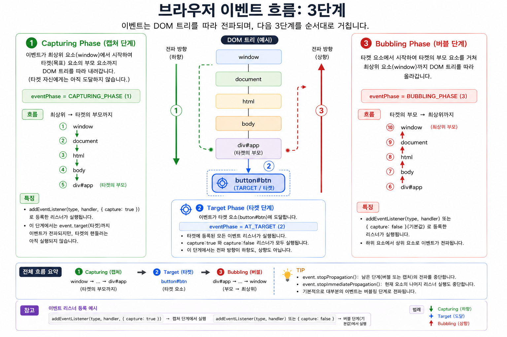

# 브라우저 이벤트 흐름: Capturing → Target → Bubbling

웹 페이지에서 사용자가 버튼을 클릭하면 단순히 해당 버튼의 이벤트 핸들러만 실행되는 것이 아닙니다.

브라우저는 DOM이 부모-자식 관계를 가지는 트리 구조라는 점을 이용해 하나의 이벤트를 일정한 경로를 따라 전달합니다.

브라우저의 이벤트 전파(Event Propagation)는 크게 다음 3단계로 이루어집니다.

1. Capturing Phase
2. Target Phase
3. Bubbling Phase



---

## 1. 왜 이벤트 전파가 필요한가?

다음과 같은 HTML이 있다고 가정해보겠습니다.

```html
<body>
  <div id="app">
    <button id="btn">로그인</button>
  </div>
</body>
```

DOM Tree는 다음과 같은 부모-자식 구조를 가집니다.

```text
window
  │
document
  │
html
  │
body
  │
div#app
  │
button#btn
```

사용자가 `button#btn`을 클릭했다고 생각해보겠습니다.

실제로 클릭된 요소는 `button#btn`이지만, 이 클릭에 관심을 가질 수 있는 요소는 버튼 하나만이 아닙니다.

```text
body
 └── div#app
      └── button#btn  ← 사용자가 클릭
```

예를 들어 다음과 같은 요구사항이 있을 수 있습니다.

* `button#btn`: 자신의 클릭 이벤트를 처리하고 싶다.
* `div#app`: 내부에서 어떤 요소가 클릭되었는지 알고 싶다.
* `body`: 페이지 영역에서 발생한 클릭을 감지하고 싶다.
* `document`: 페이지 전체의 클릭을 감시하고 싶다.

즉 하나의 클릭 이벤트를 여러 DOM 엘리먼트가 관찰하거나 처리할 필요가 있습니다.

그래서 브라우저는 이벤트를 클릭된 엘리먼트에서만 처리하지 않고 DOM Tree의 경로를 따라 전달하는 이벤트 전파 모델을 제공합니다.

---

# 2. 전체 이벤트 전파 경로

사용자가 다음 버튼을 클릭했다고 가정합니다.

```html
<button id="btn">로그인</button>
```

이벤트의 전체 흐름은 개념적으로 다음과 같습니다.

```text
                  window
                    │
                    ▼
                 document
                    │
                    ▼
                   html
                    │
                    ▼
                   body
                    │
                    ▼
                 div#app
                    │
                    ▼
              ┌─────────────┐
              │ button#btn  │
              │   TARGET    │
              └─────────────┘
                    │
                    ▲
                 div#app
                    ▲
                   body
                    ▲
                   html
                    ▲
                 document
                    ▲
                  window
```

이를 세 단계로 나누면 다음과 같습니다.

```text
Capturing
window
  ↓
document
  ↓
html
  ↓
body
  ↓
div#app

        ↓

Target
button#btn

        ↓

Bubbling
div#app
  ↑
body
  ↑
html
  ↑
document
  ↑
window
```

---

# 3. Capturing Phase

Capturing Phase는 이벤트가 최상위 영역에서 시작하여 타겟을 향해 내려오는 단계입니다.

현재 예제에서는 다음 경로를 따라 이동합니다.

```text
window
  ↓
document
  ↓
html
  ↓
body
  ↓
div#app
```

이 단계에서는 이벤트가 아직 실제 타겟인 `button#btn`의 처리 단계에 도달하지 않았습니다.

즉,

```text
window → document → html → body → div#app
```

까지가 타겟의 조상들을 통과하는 Capturing Phase입니다.

이 단계에서 이벤트를 받으려면 이벤트 리스너를 `capture: true`로 등록해야 합니다.

```js
const app = document.querySelector("#app");

app.addEventListener(
  "click",
  (event) => {
    console.log("Capturing에서 실행");
  },
  {
    capture: true
  }
);
```

축약해서 다음처럼 작성할 수도 있습니다.

```js
app.addEventListener(
  "click",
  handler,
  true
);
```

세 번째 아규먼트가 `true`이면 해당 리스너는 Capturing 단계에서 실행됩니다.

---

## eventPhase 값

이벤트 객체에는 현재 이벤트가 어느 단계에 있는지를 나타내는 `eventPhase` 프로퍼티가 있습니다.

Capturing 단계에서는 다음 값을 가집니다.

```js
event.eventPhase === Event.CAPTURING_PHASE
```

숫자 값으로는 다음과 같습니다.

```text
CAPTURING_PHASE = 1
```

---

# 4. Target Phase

이벤트가 실제로 발생한 엘리먼트에 도달하면 Target Phase가 됩니다.

현재 예제에서는 사용자가 클릭한

```html
<button id="btn">
```

이 Target입니다.

```text
div#app
   │
   ▼
┌──────────────┐
│  button#btn  │
│    TARGET    │
└──────────────┘
```

이벤트 객체에서는 실제 이벤트가 발생한 엘리먼트를 다음과 같이 확인할 수 있습니다.

```js
event.target
```

예를 들어:

```js
btn.addEventListener("click", (event) => {
  console.log(event.target);
});
```

버튼을 클릭하면:

```text
<button id="btn">...</button>
```

이 출력됩니다.

---

## Target 단계의 eventPhase

Target Phase에서는:

```js
event.eventPhase === Event.AT_TARGET
```

이며 숫자 값은:

```text
AT_TARGET = 2
```

입니다.

---

# 5. event.target의 중요한 특징

`event.target`은 이벤트가 전파되는 동안에도 변경되지 않습니다.

예를 들어 `button#btn`을 클릭했다면 Capturing, Target, Bubbling 어느 단계에서도:

```js
event.target
```

은 계속 다음 엘리먼트를 가리킵니다.

```text
button#btn
```

즉,

> `event.target`은 실제 이벤트가 발생한 원래 엘리먼트이다.

라고 이해할 수 있습니다.

---

# 6. Bubbling Phase

Target에서 이벤트 처리가 이루어진 이후에는 이벤트가 다시 부모 방향으로 올라갑니다.

이를 Bubbling Phase라고 합니다.

현재 예제에서는 다음 순서입니다.

```text
button#btn
   │
   ▼

div#app
   ↑
body
   ↑
html
   ↑
document
   ↑
window
```

좀 더 정확하게 표현하면 Target을 지나 부모부터 다음 경로를 따라 전파됩니다.

```text
div#app
  ↑
body
  ↑
html
  ↑
document
  ↑
window
```

---

## 기본 이벤트 리스너는 Bubbling 단계에서 실행된다

일반적으로 다음과 같이 이벤트 리스너를 등록합니다.

```js
element.addEventListener(
  "click",
  handler
);
```

이 코드는 사실상 다음과 같습니다.

```js
element.addEventListener(
  "click",
  handler,
  {
    capture: false
  }
);
```

즉 기본값은:

```text
capture = false
```

입니다.

따라서 일반적인 `addEventListener()`는 Bubbling 단계에서 실행됩니다.

---

# 7. Bubbling이 필요한 이유

Bubbling이 없다면 부모 엘리먼트는 자식에서 발생한 이벤트를 처리하기 어렵습니다.

예를 들어 다음 구조를 생각해보겠습니다.

```html
<ul id="menu">
  <li>Java</li>
  <li>JavaScript</li>
  <li>React</li>
</ul>
```

각각의 `li`에 이벤트 리스너를 등록할 수도 있습니다.

```js
const items = document.querySelectorAll("#menu li");

items.forEach((item) => {
  item.addEventListener("click", () => {
    console.log(item.textContent);
  });
});
```

하지만 `li`가 수십 개, 수백 개라면 각각 리스너를 등록해야 합니다.

---

# 8. Bubbling을 이용한 Event Delegation

Bubbling을 사용하면 부모 하나에만 이벤트 리스너를 등록할 수 있습니다.

```js
const menu = document.querySelector("#menu");

menu.addEventListener("click", (event) => {

  if (event.target.matches("li")) {
    console.log(event.target.textContent);
  }

});
```

사용자가 `JavaScript` 항목을 클릭했다고 해보겠습니다.

```text
ul#menu
  │
  ├── li Java
  │
  ├── li JavaScript   ← 클릭
  │
  └── li React
```

실제 타겟은:

```text
li JavaScript
```

입니다.

그리고 이벤트가 부모로 Bubbling 됩니다.

```text
li JavaScript
      │
      │ event.target = li
      ▼
   ul#menu
```

따라서 부모 `ul`에 등록한 이벤트 리스너가 자식의 이벤트를 처리할 수 있습니다.

이 방식을 Event Delegation, 즉 이벤트 위임이라고 합니다.

---

# 9. Event Delegation의 장점

이벤트 위임을 사용하면 다음과 같은 장점이 있습니다.

첫째, 많은 자식 엘리먼트마다 이벤트 리스너를 등록할 필요가 없습니다.

```text
100개의 li

기존 방식
li → listener
li → listener
li → listener
li → listener
...
```

대신:

```text
              ul
          listener 1개
         /    |    \
       li    li     li
```

처럼 부모 하나에서 관리할 수 있습니다.

둘째, 동적으로 추가되는 자식도 자동으로 처리할 수 있습니다.

```js
menu.insertAdjacentHTML(
  "beforeend",
  "<li>Spring Boot</li>"
);
```

새로운 `li`가 추가되더라도 이미 부모 `ul`에 이벤트 리스너가 존재하기 때문에 추가적인 리스너 등록이 필요하지 않습니다.

---

# 10. 그렇다면 Capturing은 왜 필요한가?

Bubbling은 자식에서 부모 방향으로 이벤트가 전달됩니다.

```text
Target
  ↓

button
  ↑
div
  ↑
body
  ↑
document
```

하지만 경우에 따라 부모가 자식보다 먼저 이벤트를 확인해야 할 수도 있습니다.

예를 들어:

```html
<div id="modal">
  <button id="closeBtn">
    닫기
  </button>
</div>
```

부모인 `modal`이 내부 요소보다 먼저 클릭을 관찰하고 싶다면 Capturing을 사용할 수 있습니다.

```js
modal.addEventListener(
  "click",
  () => {
    console.log("modal capturing");
  },
  {
    capture: true
  }
);
```

그리고 버튼에는 일반 이벤트를 등록할 수 있습니다.

```js
closeBtn.addEventListener(
  "click",
  () => {
    console.log("button click");
  }
);
```

이 경우 이벤트 흐름은 다음과 같습니다.

```text
Capturing

window
  ↓
document
  ↓
body
  ↓
modal
     console.log("modal capturing")

        ↓

Target

closeBtn
     console.log("button click")
```

따라서 Capturing은:

> 부모가 타겟보다 먼저 이벤트를 관찰할 수 있는 기회를 제공한다.

라는 의미를 가집니다.

---

# 11. 실제 이벤트 리스너 실행 순서

다음 DOM을 사용해 실제 실행 순서를 확인해보겠습니다.

```html
<div id="app">
  <button id="btn">Click</button>
</div>
```

JavaScript:

```js
const app = document.querySelector("#app");
const btn = document.querySelector("#btn");

app.addEventListener(
  "click",
  () => console.log("1. app capturing"),
  {
    capture: true
  }
);

btn.addEventListener(
  "click",
  () => console.log("2. button target")
);

app.addEventListener(
  "click",
  () => console.log("3. app bubbling")
);
```

버튼을 클릭하면:

```text
1. app capturing

2. button target

3. app bubbling
```

순서로 실행됩니다.

즉:

```text
부모
 ↓
Capturing Listener

 ↓

Target Listener

 ↓

부모
 ↑
Bubbling Listener
```

입니다.

---

# 12. event.target과 event.currentTarget

이벤트 전파를 이해할 때 반드시 구분해야 하는 프로퍼티가 있습니다.

```text
event.target
event.currentTarget
```

`event.target`은 실제 이벤트가 발생한 엘리먼트입니다.

반면 `event.currentTarget`은 현재 이벤트 리스너가 실행되고 있는 엘리먼트입니다.

예를 들어:

```html
<div id="app">
  <button id="btn">Click</button>
</div>
```

```js
app.addEventListener("click", (event) => {

  console.log(event.target);
  console.log(event.currentTarget);

});
```

버튼을 클릭하면:

```text
event.target
→ button#btn

event.currentTarget
→ div#app
```

입니다.

즉:

```text
button#btn 클릭
      │
      │
      ▼
   div#app
   listener 실행
```

이 순간에도:

```text
event.target        = button#btn
event.currentTarget = div#app
```

입니다.

---

# 13. stopPropagation()

이벤트가 부모나 자식 방향으로 더 이상 전파되지 않도록 하고 싶다면:

```js
event.stopPropagation();
```

을 사용할 수 있습니다.

예를 들어:

```js
btn.addEventListener("click", (event) => {

  event.stopPropagation();

  console.log("button");

});
```

그러면 이후 부모 방향으로의 전파를 중단할 수 있습니다.

```text
button#btn
   │
   X   ← propagation stop
   │
div#app
   │
body
```

---

# 14. stopImmediatePropagation()

같은 엘리먼트에 여러 이벤트 리스너가 등록되어 있을 수도 있습니다.

```js
btn.addEventListener("click", handlerA);
btn.addEventListener("click", handlerB);
btn.addEventListener("click", handlerC);
```

특정 리스너에서:

```js
event.stopImmediatePropagation();
```

을 실행하면 같은 엘리먼트에 등록된 뒤쪽 리스너의 실행까지 중단시킬 수 있습니다.

```text
button#btn

handlerA
   │
   ├─ stopImmediatePropagation()
   │
   X handlerB
   X handlerC
```

---

# 15. 최종 정리

브라우저의 이벤트 전파 구조는 단순히 복잡하게 만들기 위해 존재하는 것이 아닙니다.

DOM 자체가 다음과 같은 계층적 트리 구조이기 때문입니다.

```text
window
  │
document
  │
html
  │
body
  │
parent
  │
child
  │
target
```

브라우저는 이 트리 구조를 활용하여 하나의 이벤트에 여러 엘리먼트가 참여할 수 있도록 다음의 3단계 모델을 제공합니다.

```text
① Capturing
부모가 타겟보다 먼저 이벤트를 관찰할 수 있다.

          ↓

② Target
실제 이벤트가 발생한 엘리먼트에서 처리한다.

          ↓

③ Bubbling
자식에서 발생한 이벤트를 부모가 처리할 수 있다.
```

특히 Bubbling 덕분에 Event Delegation이 가능해집니다.

```text
              Parent
          Event Listener
          /     |     \
         /      |      \
      Child   Child   Child
```

따라서 브라우저의 이벤트 전파 모델을 한 문장으로 정리하면 다음과 같습니다.

> **Capturing → Target → Bubbling은 DOM의 부모-자식 트리 구조에서 하나의 이벤트를 여러 엘리먼트가 체계적으로 관찰하고 처리할 수 있도록 만든 브라우저의 이벤트 전달 모델이다.**

그리고 실무적으로 가장 중요한 연결 관계는 다음과 같습니다.

```text
DOM Tree
   │
   ▼
Event Propagation
   │
   ├── Capturing
   │
   ├── Target
   │
   └── Bubbling
          │
          ▼
    Event Delegation
          │
          ▼
적은 이벤트 리스너로
많은 자식 이벤트 처리
```
