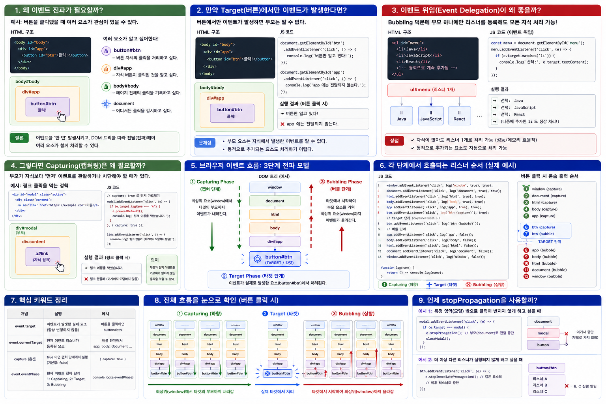

# 브라우저 이벤트 전파가 필요한 이유와 실제 활용

브라우저의 이벤트를 처음 학습하면 다음과 같은 의문이 생길 수 있습니다.

> 사용자가 버튼을 클릭했는데 왜 브라우저는 굳이 `Capturing → Target → Bubbling`이라는 복잡한 과정을 거치는가?

이 구조는 단순히 이벤트가 발생했다는 사실을 전달하기 위해 만들어진 것이 아닙니다.

HTML 문서는 DOM Tree라는 **부모-자식 계층 구조**를 가지고 있습니다. 따라서 하나의 엘리먼트에서 발생한 이벤트에 대해 그 엘리먼트뿐만 아니라 부모 엘리먼트들도 이벤트를 관찰하거나 처리해야 하는 상황이 발생합니다.

브라우저의 이벤트 전파(Event Propagation)는 바로 이러한 문제를 해결하기 위한 메커니즘입니다.



---

## 1. 왜 이벤트 전파(Event Propagation)가 필요한가?

다음 HTML을 살펴보겠습니다.

```html
<body id="body">
  <div id="app">
    <button id="btn">클릭!</button>
  </div>
</body>
```

DOM Tree는 다음과 같습니다.

```text
window
  │
document
  │
html
  │
body#body
  │
div#app
  │
button#btn
```

사용자가 `button#btn`을 클릭했다고 가정하겠습니다.

실제로 클릭한 엘리먼트는 버튼입니다.

```text
body#body
   │
   └── div#app
          │
          └── button#btn  ← 클릭!
```

그런데 버튼의 클릭에 관심이 있는 것은 버튼 자신뿐만이 아닐 수 있습니다.

```text
button#btn
→ "내가 클릭되었다."

div#app
→ "내부의 어떤 엘리먼트가 클릭되었다."

body
→ "페이지 영역에서 클릭이 발생했다."

document
→ "문서 어디선가 클릭이 발생했다."
```

즉, **하나의 사건을 DOM Tree에 존재하는 여러 엘리먼트가 함께 관찰하고 처리해야 할 필요**가 있습니다.

만약 이벤트가 클릭된 엘리먼트에서만 발생하고 끝난다면 부모 엘리먼트들은 자식에서 발생한 사건을 알 수 없습니다.

브라우저는 이를 해결하기 위해 이벤트를 DOM Tree의 경로를 따라 전달합니다.

이것이 **Event Propagation**입니다.

---

# 2. Target에서만 이벤트가 처리된다면?

만약 브라우저에 이벤트 전파가 없다고 가정해보겠습니다.

사용자가 다음 버튼을 클릭합니다.

```html
<div id="app">
  <button id="btn">클릭!</button>
</div>
```

그리고 버튼과 부모에 각각 이벤트 리스너를 등록합니다.

```javascript
const btn = document.getElementById("btn");
const app = document.getElementById("app");

btn.addEventListener("click", () => {
  console.log("버튼 클릭");
});

app.addEventListener("click", () => {
  console.log("app에서 자식의 클릭 감지");
});
```

만약 이벤트가 Target에서만 처리되고 부모에게 전달되지 않는 모델이었다면 결과는 다음과 같을 것입니다.

```text
button#btn 클릭

        ↓

button의 이벤트 리스너 실행

        ↓

종료
```

그러면 부모인 `div#app`은 자식에서 발생한 클릭을 알 방법이 없습니다.

이것은 동적으로 생성되는 많은 자식 엘리먼트를 처리해야 하는 웹 애플리케이션에서 큰 문제가 됩니다.

---

# 3. Bubbling이 해결하는 문제

브라우저는 Target에서 이벤트가 처리된 이후 이벤트를 부모 방향으로 전달할 수 있습니다.

이를 **Bubbling**이라고 합니다.

```text
button#btn
    │
    │ 클릭 발생
    ▼

   TARGET

    │
    ↑
 div#app
    ↑
   body
    ↑
   html
    ↑
 document
    ↑
  window
```

따라서 `button#btn`을 클릭했더라도 부모인 `div#app`에 등록된 이벤트 리스너가 이벤트를 받을 수 있습니다.

```javascript
app.addEventListener("click", (event) => {
  console.log("app에서 클릭 감지");
  console.log(event.target);
});
```

여기서 중요한 점은 부모에서 이벤트 리스너가 실행되어도:

```javascript
event.target
```

은 실제 클릭된 `button#btn`을 가리킨다는 것입니다.

```text
실제 클릭된 엘리먼트
        │
        ▼
   button#btn
        │
        │ Bubbling
        ▼
     div#app
        │
        └── listener 실행

event.target        → button#btn
event.currentTarget → div#app
```

이 특성 때문에 부모는 **어떤 자식에서 이벤트가 시작되었는지 알 수 있습니다.**

---

# 4. Bubbling의 대표적인 활용: Event Delegation

Bubbling이 중요한 가장 대표적인 이유가 **Event Delegation(이벤트 위임)**입니다.

다음과 같은 메뉴가 있다고 하겠습니다.

```html
<ul id="menu">
  <li>Java</li>
  <li>JavaScript</li>
  <li>React</li>
</ul>
```

일반적으로 생각하면 각 `li`마다 이벤트 리스너를 등록할 수 있습니다.

```javascript
const items = document.querySelectorAll("#menu li");

items.forEach((item) => {
  item.addEventListener("click", () => {
    console.log(item.textContent);
  });
});
```

구조적으로 보면 다음과 같습니다.

```text
ul#menu
   │
   ├── li Java
   │      └── listener
   │
   ├── li JavaScript
   │      └── listener
   │
   └── li React
          └── listener
```

자식이 100개라면 많은 리스너를 관리해야 합니다.

하지만 Bubbling을 이용하면 부모 하나에만 리스너를 등록할 수 있습니다.

```javascript
const menu = document.getElementById("menu");

menu.addEventListener("click", (event) => {

  if (event.target.matches("li")) {
    console.log("선택:", event.target.textContent);
  }

});
```

구조가 완전히 달라집니다.

```text
               ul#menu
            listener 1개
          /      |       \
         /       |        \
       li       li        li
      Java  JavaScript   React
```

사용자가 `JavaScript`를 클릭하면:

```text
li JavaScript
      │
      │ event.target = li
      │
      ↑ Bubbling
      │
   ul#menu
      │
      ▼
부모 listener 실행
```

부모는 `event.target`을 확인하여 실제 클릭된 자식을 알아낼 수 있습니다.

이것이 **Event Delegation**입니다.

---

# 5. 동적으로 추가되는 엘리먼트에도 유리하다

Event Delegation의 장점은 단순히 리스너의 개수를 줄이는 것만이 아닙니다.

나중에 새로운 자식이 추가되는 경우를 생각해보겠습니다.

```javascript
menu.insertAdjacentHTML(
  "beforeend",
  "<li>Spring Boot</li>"
);
```

DOM Tree는 이제 다음과 같습니다.

```text
ul#menu
   │
   ├── li Java
   ├── li JavaScript
   ├── li React
   └── li Spring Boot   ← 나중에 추가
```

하지만 부모 `ul#menu`에는 이미 이벤트 리스너가 있습니다.

따라서 새로운 `Spring Boot` 항목을 클릭해도:

```text
li Spring Boot
      │
      ↑ Bubbling
      │
   ul#menu
      │
      ▼
기존 listener 실행
```

별도의 이벤트 리스너를 추가할 필요가 없습니다.

이것이 현대적인 웹 UI에서 Event Delegation이 유용한 중요한 이유입니다.

---

# 6. 그렇다면 Capturing은 왜 필요한가?

Bubbling은 Target에서 부모 방향으로 올라갑니다.

하지만 반대 요구도 있을 수 있습니다.

> 부모가 자식보다 먼저 이벤트를 관찰해야 한다면 어떻게 할까?

브라우저는 이를 위해 **Capturing Phase**를 제공합니다.

```text
window
  │
  ▼
document
  │
  ▼
html
  │
  ▼
body
  │
  ▼
parent
  │
  ▼
TARGET
```

부모가 Capturing 단계에서 이벤트를 받으려면:

```javascript
parent.addEventListener(
  "click",
  handler,
  { capture: true }
);
```

처럼 등록합니다.

---

# 7. Capturing의 실제 예

다음과 같은 구조가 있다고 하겠습니다.

```html
<div id="modal">
  <div class="content">
    <a id="link" href="/payment">
      결제 페이지 이동
    </a>
  </div>
</div>
```

DOM Tree는:

```text
div#modal
   │
   └── div.content
          │
          └── a#link
```

입니다.

부모가 자식보다 먼저 클릭을 관찰해야 하는 요구사항이 있다고 가정해보겠습니다.

```javascript
const modal = document.getElementById("modal");

modal.addEventListener(
  "click",
  (event) => {
    console.log("modal이 먼저 클릭을 관찰");
  },
  { capture: true }
);
```

그리고 링크에도 일반적인 이벤트 리스너가 있다고 하겠습니다.

```javascript
const link = document.getElementById("link");

link.addEventListener("click", () => {
  console.log("link click");
});
```

링크를 클릭하면 개념적인 순서는:

```text
window
  ↓
document
  ↓
html
  ↓
body
  ↓
modal
  │
  │ capture listener
  │ 실행
  ↓
content
  ↓
link
  │
  │ Target
  ▼
```

가 됩니다.

즉 Capturing은 부모에게 **Target에 도달하기 전에 이벤트를 관찰할 기회**를 제공합니다.

---

# 8. 그래서 브라우저는 3단계 모델을 사용한다

앞에서 살펴본 두 요구사항을 합쳐보겠습니다.

부모에게는 다음 두 가지 요구가 존재할 수 있습니다.

```text
① 자식보다 먼저 이벤트를 관찰하고 싶다.

② 자식에서 처리된 이벤트를 나중에 전달받고 싶다.
```

브라우저는 이를 하나의 일관된 이벤트 모델로 해결합니다.

```text
               window
                 │
                 │
        ① Capturing Phase
                 │
                 ▼
              document
                 ↓
                html
                 ↓
                body
                 ↓
              div#app
                 ↓

        ② Target Phase

          ┌───────────────┐
          │  button#btn   │
          │    TARGET     │
          └───────────────┘

                 │
                 │
        ③ Bubbling Phase
                 │
                 ▼

              div#app
                 ↑
                body
                 ↑
                html
                 ↑
              document
                 ↑
               window
```

따라서 세 단계의 역할은 명확하게 구분할 수 있습니다.

| 단계        | 목적                               |
| --------- | -------------------------------- |
| Capturing | 부모가 Target보다 먼저 이벤트를 관찰할 기회 제공   |
| Target    | 실제 이벤트가 발생한 엘리먼트에서 이벤트 처리        |
| Bubbling  | Target에서 발생한 이벤트를 부모들이 처리할 기회 제공 |

---

# 9. 실제 리스너 실행 순서를 확인해보자

다음 DOM을 사용하겠습니다.

```html
<body>
  <div id="app">
    <button id="btn">Click</button>
  </div>
</body>
```

여러 계층에 Capturing과 Bubbling 리스너를 등록해보겠습니다.

```javascript
window.addEventListener(
  "click",
  () => console.log("window capture"),
  true
);

document.addEventListener(
  "click",
  () => console.log("document capture"),
  true
);

document.body.addEventListener(
  "click",
  () => console.log("body capture"),
  true
);

const app = document.getElementById("app");
const btn = document.getElementById("btn");

app.addEventListener(
  "click",
  () => console.log("app capture"),
  true
);

btn.addEventListener(
  "click",
  () => console.log("button target")
);

app.addEventListener(
  "click",
  () => console.log("app bubble")
);

document.body.addEventListener(
  "click",
  () => console.log("body bubble")
);

document.addEventListener(
  "click",
  () => console.log("document bubble")
);

window.addEventListener(
  "click",
  () => console.log("window bubble")
);
```

`button#btn`을 클릭하면 전체적인 실행 순서는 다음과 같습니다.

```text
window capture
       ↓
document capture
       ↓
body capture
       ↓
app capture
       ↓

button target

       ↓
app bubble
       ↓
body bubble
       ↓
document bubble
       ↓
window bubble
```

이제 Capturing → Target → Bubbling이라는 세 단계가 실제 이벤트 리스너의 호출 순서와 연결됩니다.

---

# 10. event.target과 event.currentTarget

이벤트 전파를 제대로 이해하려면 두 프로퍼티를 반드시 구분해야 합니다.

### event.target

실제로 이벤트가 시작된 엘리먼트입니다.

```javascript
event.target
```

버튼을 클릭했다면 이벤트가 부모까지 Bubbling 되더라도 계속:

```text
button#btn
```

을 가리킵니다.

### event.currentTarget

현재 실행되고 있는 이벤트 리스너가 등록된 엘리먼트입니다.

예를 들어 `div#app`의 리스너가 실행되는 순간:

```text
event.target
        ↓
   button#btn

event.currentTarget
        ↓
     div#app
```

이 됩니다.

따라서 Event Delegation에서는 보통:

```javascript
parent.addEventListener("click", (event) => {
  console.log(event.target);
});
```

처럼 `event.target`을 이용하여 어떤 자식에서 이벤트가 시작되었는지 판단합니다.

---

# 11. eventPhase로 현재 단계를 확인할 수 있다

이벤트 객체의 `eventPhase` 프로퍼티를 사용하면 현재 이벤트 전파 단계를 확인할 수 있습니다.

```javascript
console.log(event.eventPhase);
```

값은 다음과 같습니다.

|   값 | 상수                      | 의미           |
| --: | ----------------------- | ------------ |
| `1` | `Event.CAPTURING_PHASE` | Capturing 단계 |
| `2` | `Event.AT_TARGET`       | Target 단계    |
| `3` | `Event.BUBBLING_PHASE`  | Bubbling 단계  |

따라서 이벤트가 이동하면서 개념적으로:

```text
Capturing
eventPhase = 1

       ↓

Target
eventPhase = 2

       ↓

Bubbling
eventPhase = 3
```

으로 변합니다.

반면 `event.target`은 계속 원래 이벤트가 발생한 엘리먼트를 가리킵니다.

---

# 12. 이벤트 전파를 중단해야 하는 경우

이벤트가 항상 끝까지 전파되어야 하는 것은 아닙니다.

특정 UI에서는 부모가 이벤트를 받지 못하게 해야 할 수도 있습니다.

이때 사용할 수 있는 메서드가:

```javascript
event.stopPropagation();
```

입니다.

예를 들어:

```javascript
button.addEventListener("click", (event) => {
  event.stopPropagation();

  console.log("button click");
});
```

그러면 이후 전파가 중단됩니다.

```text
button
  │
  │ stopPropagation()
  │
  X
modal
  │
document
```

즉 이벤트가 이후 경로로 계속 전파되는 것을 막을 수 있습니다.

---

# 13. stopImmediatePropagation()

같은 엘리먼트에 여러 이벤트 리스너가 존재할 수도 있습니다.

```javascript
button.addEventListener("click", handlerA);
button.addEventListener("click", handlerB);
button.addEventListener("click", handlerC);
```

`handlerA`에서:

```javascript
event.stopImmediatePropagation();
```

을 호출하면 같은 엘리먼트의 뒤쪽 리스너 실행까지 중단시킬 수 있습니다.

```text
button#btn

handlerA
   │
   └── stopImmediatePropagation()
             │
             ├── X handlerB
             └── X handlerC
```

따라서 두 메서드는 목적이 다릅니다.

```text
stopPropagation()
    ↓
이벤트의 이후 전파 중단

stopImmediatePropagation()
    ↓
이벤트 전파 중단
+
같은 엘리먼트의 이후 리스너 실행도 중단
```

---

# 14. 브라우저가 이런 구조를 만든 이유

결국 핵심은 DOM의 구조에 있습니다.

DOM은 단순한 엘리먼트 목록이 아니라:

```text
               document
                   │
                  html
                   │
                  body
                   │
                div#app
               /       \
          button       ul
                      / | \
                    li  li  li
```

와 같은 **계층적인 Tree 구조**입니다.

따라서 브라우저의 이벤트 시스템도 이 Tree 구조를 활용하도록 설계되어 있습니다.

이벤트가 Target 하나에서만 끝나는 것이 아니라 DOM Tree를 따라 이동하기 때문에:

* 부모가 자식의 이벤트를 관찰할 수 있고
* 부모가 Target보다 먼저 이벤트를 관찰할 수도 있고
* Event Delegation을 사용할 수 있고
* 동적으로 추가되는 자식의 이벤트를 부모에서 처리할 수 있고
* 필요한 경우 이벤트 전파를 중간에서 제어할 수도 있습니다.

결국:

> **Capturing → Target → Bubbling은 DOM의 부모-자식 Tree 구조에서 하나의 이벤트를 여러 엘리먼트가 체계적으로 관찰하고 처리할 수 있도록 만든 브라우저의 이벤트 전파 모델입니다.**

특히 실무에서는 다음 연결 관계를 이해하는 것이 중요합니다.

```text
DOM Tree
   │
   ▼
Event 발생
   │
   ▼
Capturing
   │
   ▼
Target
   │
   ▼
Bubbling
   │
   ▼
부모에서도 자식 이벤트 처리 가능
   │
   ▼
Event Delegation
   │
   ▼
효율적인 UI 이벤트 관리
```

따라서 `Capturing`, `Target`, `Bubbling`을 단순히 암기하기보다는 **“DOM이 Tree 구조이기 때문에 이벤트도 그 Tree의 경로를 이용한다”**라는 관점에서 이해하는 것이 핵심입니다.
