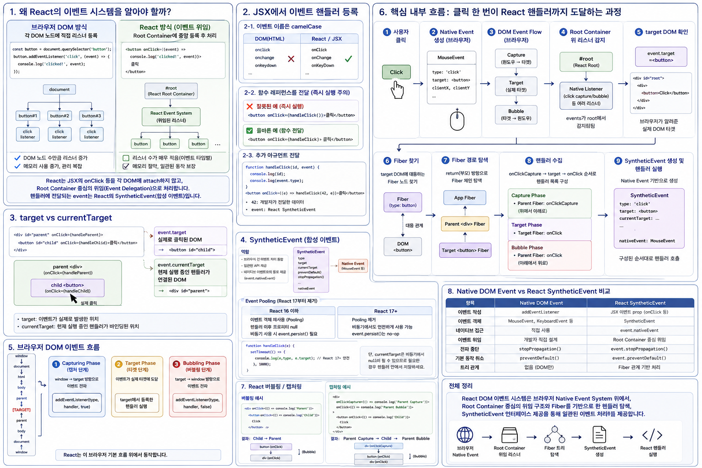

# React DOM 이벤트 시스템




## 1. 왜 React의 이벤트 시스템을 따로 알아야 하는가?

브라우저에서는 일반적으로 다음과 같이 DOM 노드에 이벤트 리스너를 직접 등록합니다.

```js
const button = document.querySelector('button');

button.addEventListener('click', (event) => {
  console.log('clicked!', event);
});
```

React에서는 다음처럼 작성합니다.

```jsx
function App() {
  const handleClick = (event) => {
    console.log('clicked!', event);
  };

  return <button onClick={handleClick}>클릭</button>;
}
```

겉으로 보면 단순히 문법만 달라 보이지만 내부 구조는 상당히 다릅니다.

브라우저 DOM 방식에서는 개발자가 특정 DOM 노드에 직접 `addEventListener()`를 등록합니다.

반면 React에서는 JSX의

```jsx
<button onClick={handleClick}>
```

를 처리하기 위해 매번 해당 `<button>` DOM 노드에

```js
button.addEventListener('click', handleClick);
```

를 실행하는 방식이 아닙니다.

React는 **대부분의 지원 이벤트에 대해 Root Container를 중심으로 Native Event Listener를 중앙 등록**하고, 브라우저에서 발생한 이벤트를 받아 React의 Fiber 트리를 이용해 적절한 이벤트 핸들러를 찾아 실행합니다.

또한 React 이벤트 핸들러에 전달되는 `event`는 브라우저의 Native Event를 그대로 전달하는 것이 아니라 React가 제공하는 `SyntheticEvent` 인터페이스입니다.

따라서 React 이벤트 시스템을 제대로 이해하려면 다음 관계를 이해해야 합니다.

```text
Browser Native Event
        ↓
DOM Event Flow
        ↓
React Root Container
        ↓
React Event System
        ↓
target DOM
        ↓
Fiber
        ↓
React Event Handler
        ↓
SyntheticEvent
```

---

# 2. JSX에서 이벤트 핸들러 등록

## 2-1. 이벤트 이름은 camelCase

DOM 방식:

```html
<button onclick="handleClick(event)">클릭</button>
```

React JSX:

```jsx
<button onClick={handleClick}>클릭</button>
```

React에서는 이벤트 prop을 camelCase로 작성합니다.

```text
onclick   X
onClick   O

onchange  X
onChange  O

onkeydown X
onKeyDown O
```

그리고 문자열이 아니라 **함수 레퍼런스**를 전달합니다.

```jsx
onClick="handleClick()"   // X

onClick={handleClick}     // O
```

---

## 2-2. 함수 전달과 함수 호출은 다르다

다음 코드는 잘못된 코드입니다.

```jsx
<button onClick={handleClick()}>
```

`handleClick()`을 호출했기 때문에 렌더링 과정에서 함수가 즉시 실행됩니다.

React에게 필요한 것은 함수의 실행 결과가 아니라 **나중에 이벤트가 발생했을 때 실행할 함수**입니다.

따라서 다음처럼 작성합니다.

```jsx
<button onClick={handleClick}>
```

---

## 2-3. 추가 아규먼트를 전달하려면

```jsx
function handleClick(id, event) {
  console.log(id);
  console.log(event.type);
}

<button onClick={(event) => handleClick(42, event)}>
  클릭
</button>
```

여기서

```text
42
```

는 개발자가 전달한 데이터이고,

```text
event
```

는 React가 이벤트 핸들러 호출 시 전달하는 `SyntheticEvent`입니다.

---

# 3. `event.target`과 `event.currentTarget`

React 이벤트를 이해할 때 반드시 구분해야 하는 두 프로퍼티입니다.

다음 코드가 있다고 가정합니다.

```jsx
function App() {
  const handleClick = (event) => {
    console.log(event.target);
    console.log(event.currentTarget);
  };

  return (
    <div onClick={handleClick}>
      <button>클릭</button>
    </div>
  );
}
```

사용자가 `<button>`을 클릭하면:

```text
<div onClick={handleClick}>
        │
        └── <button>클릭</button>
                 ↑
              실제 클릭
```

따라서:

```text
event.target
    ↓
<button>
```

`target`은 **실제로 이벤트가 발생한 DOM 노드**입니다.

반면:

```text
event.currentTarget
    ↓
<div>
```

`currentTarget`은 **현재 실행 중인 이벤트 핸들러가 연결되어 있다고 React가 표현하는 DOM 노드**입니다.

즉:

| 프로퍼티            | 의미                     |
| --------------- | ---------------------- |
| `target`        | 실제 이벤트가 발생한 DOM        |
| `currentTarget` | 현재 실행 중인 핸들러에 대응하는 DOM |

---

# 4. SyntheticEvent

React 이벤트 핸들러가 받는 이벤트 객체는 React의 `SyntheticEvent`입니다.

```jsx
function handleClick(event) {
  console.log(event.type);
  console.log(event.target);
  console.log(event.currentTarget);
}
```

개념적으로:

```text
Browser
   │
   │ Native MouseEvent
   ▼
React Event System
   │
   │ 감싸서 인터페이스 제공
   ▼
SyntheticEvent
   │
   ▼
handleClick(event)
```

`SyntheticEvent`는 브라우저 이벤트와 유사한 API를 제공합니다.

```js
event.type
event.target
event.currentTarget

event.preventDefault()
event.stopPropagation()
```

---

## 4-1. 원본 Native Event

필요한 경우:

```js
event.nativeEvent
```

를 통해 원본 브라우저 이벤트에 접근할 수 있습니다.

```jsx
function handleClick(event) {
  console.log(event.nativeEvent);
}
```

예를 들어 클릭 이벤트라면 원본은 일반적으로 브라우저의 `MouseEvent` 계열 객체입니다.

---

## 4-2. Event Pooling은 React 17부터 제거

과거 React에서는 SyntheticEvent 객체를 재사용하는 Event Pooling이 존재했습니다.

하지만 React 17부터 웹 환경에서 Event Pooling이 제거되었습니다.

따라서 현대 React에서는 일반적으로:

```jsx
function handleClick(event) {
  setTimeout(() => {
    console.log(event.type);
    console.log(event.target);
  }, 1000);
}
```

처럼 비동기 코드에서도 이벤트 객체의 프로퍼티를 읽을 수 있습니다.

`event.persist()`도 현대 React DOM에서는 실질적으로 필요하지 않습니다.

단, `event.currentTarget`은 이벤트 핸들러 실행 컨텍스트와 관련된 값이므로 비동기 코드에서 필요하다면 핸들러 실행 중 미리 저장하는 것이 안전합니다.

---

# 5. 브라우저의 DOM Event Flow

React 이벤트 시스템도 결국 브라우저의 Native Event System 위에서 동작합니다.

따라서 먼저 브라우저 이벤트 흐름을 이해해야 합니다.

브라우저 이벤트는 크게 세 단계를 거칩니다.

```text
          window
             │
          document
             │
            html
             │
            body
             │
           parent
             │
             ▼
          [target]
             │
             ▲
           parent
             │
            body
             │
          document
             │
           window
```

위에서 아래로 내려가는 과정이:

```text
Capturing Phase
```

실제 이벤트 대상이:

```text
Target Phase
```

다시 위로 올라가는 과정이:

```text
Bubbling Phase
```

입니다.

---

# 6. React Event Delegation

React 이벤트 시스템에서 가장 중요한 개념 중 하나가 **Event Delegation**입니다.

일반적인 DOM 코드를 생각해 보겠습니다.

```js
button1.addEventListener('click', handler1);
button2.addEventListener('click', handler2);
button3.addEventListener('click', handler3);
```

각 DOM 노드에 직접 리스너를 등록합니다.

React의 대부분의 이벤트는 이 방식과 다릅니다.

React는 `createRoot()`로 관리하는 Root Container를 중심으로 이벤트 리스너를 등록합니다.

예:

```jsx
const root = createRoot(
  document.getElementById('root')
);

root.render(<App />);
```

DOM 구조가 다음과 같다면:

```html
<div id="root">
  ...
</div>
```

`#root`가 React의 Root Container입니다.

React 17 이후에는 대부분의 이벤트 위임이 `document`가 아니라 이 Root Container를 중심으로 이루어집니다.

---

# 7. "Root에 이벤트 리스너 하나"라는 의미는 아니다

여기서 매우 중요한 오해가 있습니다.

React가:

```text
Root Container에
이벤트 리스너 하나만 등록한다
```

는 의미가 아닙니다.

React는 여러 지원 이벤트 타입을 처리해야 합니다.

개념적으로:

```text
#root
 │
 ├── click capture listener
 ├── click bubble listener
 │
 ├── keydown capture listener
 ├── keydown bubble listener
 │
 ├── input ...
 ├── change ...
 │
 └── ...
```

와 같은 구조입니다.

따라서 정확한 표현은:

> React는 각 JSX 엘리먼트마다 네이티브 이벤트 리스너를 직접 등록하는 대신, 대부분의 지원 이벤트를 Root Container를 중심으로 중앙 등록하여 Event Delegation 방식으로 처리한다.

입니다.

모든 이벤트가 동일하게 위임되는 것은 아닙니다. 이벤트 특성에 따라 별도로 처리되는 예외도 존재합니다.

---

# 8. 핵심: 클릭 한 번이 React 핸들러까지 도달하는 과정

다음 코드가 있다고 가정합니다.

```jsx
function App() {
  const handleParent = () => {
    console.log('Parent');
  };

  const handleButton = () => {
    console.log('Button');
  };

  return (
    <div onClick={handleParent}>
      <button onClick={handleButton}>
        Click
      </button>
    </div>
  );
}
```

사용자가 `<button>`을 클릭합니다.

전체 흐름을 단계별로 보면 다음과 같습니다.

---

## Step 1. 사용자가 실제 DOM `<button>` 클릭

```text
User
 ↓
<button>
```

이 순간 React가 이벤트를 만드는 것이 아닙니다.

**브라우저가 먼저 Native Event를 생성합니다.**

---

## Step 2. 브라우저가 Native Event 생성

클릭이므로 브라우저는 `MouseEvent` 계열의 Native Event를 생성합니다.

```text
Browser

MouseEvent
 ├─ target
 ├─ type
 ├─ clientX
 ├─ clientY
 └─ ...
```

---

## Step 3. 브라우저의 DOM Event Flow 진행

생성된 이벤트는 브라우저의 DOM 이벤트 전파 규칙에 따라 움직입니다.

```text
Capture
   ↓
Target
   ↓
Bubble
```

React는 이 브라우저 이벤트 시스템을 제거하거나 대체하지 않습니다.

**React Event System은 Native Event System 위에서 동작합니다.**

---

## Step 4. React Root의 Native Listener가 이벤트를 감지

이벤트가 React Root Container의 리스너가 관찰할 수 있는 지점에 도달합니다.

```text
Browser Native Event
        ↓
      #root
        ↓
React Native Listener
```

여기서부터 React의 이벤트 처리 로직이 개입합니다.

---

# 9. target DOM에서 Fiber를 찾는다

브라우저 이벤트에는 실제 이벤트 발생 위치가 들어 있습니다.

```js
nativeEvent.target
```

예:

```html
<button>Click</button>
```

React는 이 DOM 노드와 연결된 내부 Fiber 정보를 이용하여 해당 Fiber를 찾습니다.

개념적으로:

```text
DOM

<button>
   │
   │ 대응 관계
   ▼
Fiber

HostComponent Fiber
type = "button"
```

즉 React가 단순히 "Virtual DOM 전체를 검색한다"고 이해하기보다는,

> 이벤트가 발생한 DOM 노드에 대응하는 Fiber를 찾아 React 트리상의 이벤트 처리 경로를 구성한다.

라고 이해하는 것이 더 정확합니다.

---

# 10. Fiber의 부모 방향으로 이벤트 경로 탐색

React가 target에 대응하는 Fiber를 찾았다면 해당 Fiber에서 부모 방향으로 올라갑니다.

Fiber에서는 부모 Fiber를 가리키는 연결을 일반적으로 `return`이라고 부릅니다.

```text
App Fiber
    ↑
    │ return
div Fiber
    ↑
    │ return
button Fiber  ← target
```

React는 이 경로를 이용하여 해당 Fiber들과 연결된 이벤트 관련 props를 확인합니다.

예:

```jsx
<div onClick={handleParent}>
  <button onClick={handleButton}>
```

개념적으로:

```text
button Fiber
   │
   └── onClick → handleButton
        ↑
        │ return
div Fiber
   │
   └── onClick → handleParent
```

---

# 11. React 이벤트 핸들러 수집

React는 전파 경로에 있는 핸들러를 수집합니다.

예를 들어:

```jsx
<div
  onClickCapture={handleParentCapture}
  onClick={handleParent}
>
  <button onClick={handleButton}>
    Click
  </button>
</div>
```

라면 개념적으로:

```text
Capture handlers

handleParentCapture
        ↓

Target

handleButton
        ↓

Bubble handlers

handleParent
```

와 같은 실행 경로가 만들어집니다.

---

# 12. SyntheticEvent 생성과 핸들러 실행

React는 Native Event를 기반으로 React 이벤트 인터페이스인 `SyntheticEvent`를 제공합니다.

```text
Native Event
     │
     ▼
React Event System
     │
     ▼
SyntheticEvent
     │
     ├── type
     ├── target
     ├── currentTarget
     ├── preventDefault()
     ├── stopPropagation()
     │
     └── nativeEvent
```

그리고 수집된 React 핸들러를 적절한 순서로 호출합니다.

결국:

```text
사용자 클릭
   ↓
Native Event
   ↓
DOM Event Flow
   ↓
React Root Listener
   ↓
target DOM
   ↓
target Fiber
   ↓
Fiber 경로 탐색
   ↓
React Handler 수집
   ↓
SyntheticEvent
   ↓
Handler 실행
```

이라는 흐름이 완성됩니다.

---

# 13. React의 버블링

다음 코드에서:

```jsx
function Parent() {
  return (
    <div onClick={() => console.log('Parent')}>
      <button onClick={() => console.log('Child')}>
        Click
      </button>
    </div>
  );
}
```

버튼을 클릭하면:

```text
Child
Parent
```

순서로 실행됩니다.

개념적으로:

```text
button Fiber
 onClick → Child
      │
      │ return
      ▼
div Fiber
 onClick → Parent
```

React는 Fiber 관계를 따라 React 이벤트 핸들러의 전파를 처리합니다.

---

# 14. React의 캡처링

React에서는 이벤트 이름 뒤에 `Capture`를 붙입니다.

```jsx
<div
  onClickCapture={() => console.log('Parent Capture')}
  onClick={() => console.log('Parent Bubble')}
>
  <button onClick={() => console.log('Child')}>
    Click
  </button>
</div>
```

실행 순서는:

```text
Parent Capture
      ↓
Child
      ↓
Parent Bubble
```

입니다.

즉:

```text
onClickCapture
      ↓
    target
      ↓
  onClick
```

으로 이해할 수 있습니다.

---

# 15. `stopPropagation()`

React 이벤트에서도:

```jsx
event.stopPropagation();
```

을 사용할 수 있습니다.

```jsx
function Parent() {
  const handleParent = () => {
    console.log('Parent');
  };

  const handleChild = (event) => {
    event.stopPropagation();
    console.log('Child');
  };

  return (
    <div onClick={handleParent}>
      <button onClick={handleChild}>
        Click
      </button>
    </div>
  );
}
```

결과:

```text
Child
```

상위 React 이벤트 핸들러로의 전파가 중단됩니다.

다만 React 이벤트와 `addEventListener()`로 직접 등록한 Native Event Listener를 함께 사용할 경우에는 실행 순서와 전파 관계가 복잡해질 수 있습니다.

따라서 Native Event와 SyntheticEvent를 혼합할 때는 별도로 분석해야 합니다.

---

# 16. `preventDefault()`

`stopPropagation()`과 `preventDefault()`는 목적이 다릅니다.

```text
stopPropagation()
    ↓
이벤트 전파 중단

preventDefault()
    ↓
브라우저 기본 동작 취소
```

예를 들어:

```jsx
function Link() {
  const handleClick = (event) => {
    event.preventDefault();

    console.log('페이지 이동 취소');
  };

  return (
    <a
      href="https://example.com"
      onClick={handleClick}
    >
      링크
    </a>
  );
}
```

React에서는:

```jsx
return false;
```

로 기본 동작을 취소하지 않습니다.

명시적으로:

```js
event.preventDefault();
```

를 사용합니다.

---

# 17. React `onChange`

React의 `onChange`는 Native DOM의 `change` 이벤트와 완전히 같은 의미로 생각하면 안 됩니다.

```jsx
<input
  value={value}
  onChange={(event) => {
    setValue(event.target.value);
  }}
/>
```

텍스트 `<input>`의 경우 React의 `onChange`는 사용자가 값을 입력하는 동안 지속적으로 호출됩니다.

따라서 교육적으로는:

```text
React onChange

≈ 사용자가 값을 변경할 때
  즉각적으로 처리하는 이벤트
```

로 이해하는 것이 좋습니다.

Native DOM의 `change` 이벤트는 요소 종류에 따라 발생 시점이 다르므로 단순히 React `onChange`와 1:1 대응한다고 생각하면 안 됩니다.

---

# 18. 일부 이벤트는 일반적인 위임 방식과 다르다

React의 모든 이벤트가 완전히 동일한 방식으로 처리되는 것은 아닙니다.

예를 들어 이벤트 특성 때문에:

```text
scroll
mouseenter / mouseleave
일부 media events
...
```

등은 일반적인 bubbling 이벤트와 처리 방식이 다를 수 있습니다.

따라서:

> "React의 모든 이벤트는 무조건 Root Container에 위임된다."

라고 외우면 안 됩니다.

더 정확하게는:

> **React의 대부분의 지원 이벤트는 Root Container 중심의 Event Delegation을 사용하지만 이벤트 특성에 따라 별도로 처리되는 예외가 존재한다.**

입니다.

---

# 19. Native DOM Event와 React Event 비교

| 항목              | Native DOM                       | React                      |
| --------------- | -------------------------------- | -------------------------- |
| 이벤트 작성          | `addEventListener()`             | JSX event prop             |
| 예               | `addEventListener('click', ...)` | `onClick={handler}`        |
| 이벤트 객체          | `MouseEvent`, `KeyboardEvent` 등  | `SyntheticEvent`           |
| Native Event 접근 | 직접 사용                            | `event.nativeEvent`        |
| 이벤트 위임          | 개발자가 직접 설계                       | React Event System이 대부분 처리 |
| 전파 중단           | `stopPropagation()`              | `event.stopPropagation()`  |
| 기본 동작 취소        | `preventDefault()`               | `event.preventDefault()`   |
| React 트리 관계     | 없음                               | Fiber 관계를 이용하여 핸들러 처리      |

---

# 20. 전체 내부 흐름

React DOM 이벤트 시스템에서 가장 중요한 흐름을 하나로 합치면 다음과 같습니다.

```text
[1] 사용자
     │
     │ Click
     ▼
[2] 실제 DOM
   <button>
     │
     ▼
[3] Browser
    Native Event 생성
    MouseEvent
     │
     ▼
[4] DOM Event Flow
    Capture
       ↓
    Target
       ↓
    Bubble
     │
     ▼
[5] React Root Container
    Native Listener가 이벤트 감지
     │
     ▼
[6] event.target 확인
     │
     ▼
[7] target DOM에 대응하는
    Fiber 찾기
     │
     ▼
[8] Fiber의 return 관계를 따라
    React 트리의 이벤트 경로 탐색
     │
     ▼
[9] onClickCapture / onClick
    핸들러 수집
     │
     ▼
[10] SyntheticEvent 인터페이스 제공
     │
     ▼
[11] React Handler 실행
```

핵심은 **브라우저와 React의 역할을 분리해서 이해하는 것**입니다.

```text
브라우저 영역
────────────────────────────

사용자 입력
   ↓
Native Event 생성
   ↓
DOM Event Propagation

────────────────────────────
React 영역

Root Listener
   ↓
target DOM 확인
   ↓
Fiber 찾기
   ↓
Fiber 경로 탐색
   ↓
React Handler 수집
   ↓
SyntheticEvent
   ↓
Handler 실행
```

---

# 21. 최종 정의

> **React DOM Event System은 브라우저의 Native Event System 위에서 동작하면서, 대부분의 지원 이벤트를 Root Container를 중심으로 위임하여 처리하고, 이벤트가 발생한 DOM과 Fiber의 연결 관계를 이용해 적절한 React 이벤트 핸들러를 찾아 SyntheticEvent 인터페이스를 통해 실행하는 React의 이벤트 처리 계층입니다.**

따라서 React의:

```jsx
<button onClick={handleClick}>
```

이라는 짧은 코드 뒤에는 실제로:

```text
Browser
   ↓
Native Event
   ↓
DOM Event Flow
   ↓
Root Container
   ↓
React Event System
   ↓
DOM ↔ Fiber
   ↓
Fiber Traversal
   ↓
SyntheticEvent
   ↓
handleClick()
```

이라는 전체 과정이 존재합니다.

이 구조까지 이해하면 `onClick`은 더 이상 단순한 JSX 문법이 아니라 **브라우저의 Native Event System과 React Fiber를 연결하는 React 이벤트 처리 시스템의 진입점**으로 보이게 됩니다.
