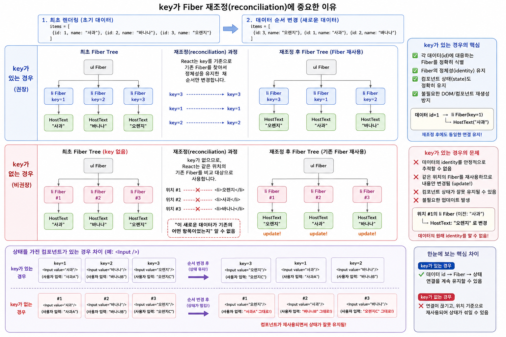

# React `key`와 Fiber 재조정(Reconciliation)



React에서 리스트를 렌더링할 때 다음과 같은 코드를 자주 사용합니다.

```jsx
<ul>
  {items.map(item => (
    <li key={item.id}>{item.name}</li>
  ))}
</ul>
```

여기서 `key`는 단순히 React의 경고 메시지를 없애기 위해 사용하는 속성이 아닙니다.

`key`의 핵심 목적은 **재조정(Reconciliation) 과정에서 이전 렌더링의 Fiber와 새로운 React Element 사이의 identity를 안정적으로 대응시키는 것**입니다.

즉 React가 다음 질문에 답할 수 있도록 도와줍니다.

> "새로운 리스트의 이 항목은 이전 렌더링에서 존재했던 어떤 항목과 같은 항목인가?"

이 개념을 Fiber 관점에서 살펴보겠습니다.

---

## 1. 먼저 React Element와 Fiber의 관계를 이해해야 한다

다음과 같은 데이터가 있다고 가정하겠습니다.

```js
const items = [
  { id: 1, name: "사과" },
  { id: 2, name: "바나나" },
  { id: 3, name: "오렌지" }
];
```

그리고 다음 JSX로 리스트를 렌더링합니다.

```jsx
<ul>
  {items.map(item => (
    <li key={item.id}>{item.name}</li>
  ))}
</ul>
```

개념적으로 React Element는 다음과 같은 정보를 갖습니다.

```text
React Element
─────────────────
type : "li"
key  : "1"
props:
  children: "사과"
```

React는 Render Phase에서 이러한 React Element들을 이용하여 Fiber Tree를 구축합니다.

개념적으로 다음과 같은 구조가 됩니다.

```text
ul Fiber
│
├── li Fiber
│   key = 1
│   │
│   └── HostText Fiber
│       "사과"
│
├── li Fiber
│   key = 2
│   │
│   └── HostText Fiber
│       "바나나"
│
└── li Fiber
    key = 3
    │
    └── HostText Fiber
        "오렌지"
```

여기서 중요한 것은 `key`가 `HostText`와 `<li>`를 연결하기 위한 것이 아니라는 점입니다.

```text
li Fiber
   │
   └── HostText Fiber
```

이 부모-자식 관계는 `key`가 없어도 Fiber Tree 구조를 통해 표현할 수 있습니다.

`key`가 필요한 이유는 **다음 렌더링에서 이전 Fiber를 어떤 새로운 Element와 대응시킬 것인가**에 있습니다.

---

# 2. 리스트의 순서가 변경된다면?

이제 데이터 순서를 변경해 보겠습니다.

### 이전 데이터

```js
[
  { id: 1, name: "사과" },
  { id: 2, name: "바나나" },
  { id: 3, name: "오렌지" }
]
```

### 새로운 데이터

```js
[
  { id: 3, name: "오렌지" },
  { id: 1, name: "사과" },
  { id: 2, name: "바나나" }
]
```

렌더링 결과의 순서는 다음처럼 바뀌어야 합니다.

```text
이전                         이후

사과                         오렌지
바나나          →            사과
오렌지                       바나나
```

React는 새로운 React Element Tree를 만든 뒤 기존 Fiber Tree와 비교합니다.

이 과정이 **재조정(Reconciliation)**입니다.

---

# 3. `key`가 있는 경우

새로운 React Element들의 `key`는 다음과 같습니다.

```text
새로운 Element

<li key=3>오렌지</li>
<li key=1>사과</li>
<li key=2>바나나</li>
```

기존 Fiber에는 다음 정보가 있습니다.

```text
기존 Fiber

li Fiber key=1
li Fiber key=2
li Fiber key=3
```

React는 `key`를 이용해 새로운 Element에 대응하는 기존 Fiber를 찾을 수 있습니다.

```text
기존 Fiber                         새로운 Element

key=1  사과   ───────────────────→  key=1  사과

key=2  바나나 ───────────────────→  key=2  바나나

key=3  오렌지 ───────────────────→  key=3  오렌지
```

새로운 리스트에서 `key=3`이 첫 번째로 이동했다고 하더라도 React는 알 수 있습니다.

```text
"새로운 객체가 생긴 것이 아니라
기존 key=3 항목이 앞으로 이동했구나."
```

따라서 개념적으로 다음과 같은 identity 관계를 유지할 수 있습니다.

```text
id=3
 │
 ▼
li Fiber(key=3)
 │
 └── HostText("오렌지")
```

순서가 바뀐 후에도:

```text
id=3
 │
 ▼
기존 항목에 대응하는 Fiber
 │
 └── HostText("오렌지")
```

라는 대응 관계를 유지할 수 있습니다.

중요한 점은 **실제 Fiber 객체가 그대로 위치만 이동한다는 식으로 단순화해서 이해하면 안 된다는 것**입니다.

React는 업데이트 과정에서 현재 Fiber와 대응되는 work-in-progress Fiber를 구성합니다. 여기서 우리가 말하는 "Fiber 재사용"은 정확히는 **이전 Fiber와 새로운 Element가 같은 identity의 항목으로 대응되어 기존 상태와 관련 정보를 이어갈 수 있다는 의미**로 이해하는 것이 좋습니다.

---

# 4. `key`가 없다면 어떻게 될까?

이번에는 `key`를 제거하겠습니다.

```jsx
<ul>
  {items.map(item => (
    <li>{item.name}</li>
  ))}
</ul>
```

최초 Fiber Tree를 단순화하면 다음과 같습니다.

```text
ul Fiber
│
├── li Fiber #1
│   └── HostText "사과"
│
├── li Fiber #2
│   └── HostText "바나나"
│
└── li Fiber #3
    └── HostText "오렌지"
```

이제 데이터 순서가 변경됩니다.

```text
이전                         새로운 결과

위치 #1 : 사과              위치 #1 : 오렌지
위치 #2 : 바나나     →      위치 #2 : 사과
위치 #3 : 오렌지            위치 #3 : 바나나
```

문제는 React에게 다음과 같은 명시적인 identity 정보가 없다는 것입니다.

```text
오렌지의 id = 3
        ↓
기존의 세 번째 Fiber
```

React Element에는 모두 같은 타입만 존재합니다.

```text
<li>...</li>
<li>...</li>
<li>...</li>
```

따라서 `key`가 없다면 React는 sibling을 재조정할 때 **위치와 타입 등을 기준으로 기존 Fiber와 새로운 Element를 대응시키게 됩니다.**

그 결과 개념적으로 다음과 같은 일이 발생할 수 있습니다.

```text
기존

li Fiber #1
└── HostText "사과"

        ↓

새로운 첫 번째 Element

<li>오렌지</li>
```

둘 다 `li`이므로 기존 Fiber가 해당 위치에서 계속 대응될 수 있고, 내부 텍스트가 변경됩니다.

```text
li Fiber #1
│
└── HostText
    "사과"
       ↓
    "오렌지"
```

마찬가지로:

```text
#1  "사과"   → "오렌지"
#2  "바나나" → "사과"
#3  "오렌지" → "바나나"
```

처럼 처리될 수 있습니다.

React가 데이터의 의미를 이해해서

```text
"오렌지가 세 번째에서 첫 번째로 이동했다."
```

라고 판단한 것이 아닙니다.

React 입장에서는 단지:

```text
첫 번째 위치의 li ↔ 새로운 첫 번째 li
두 번째 위치의 li ↔ 새로운 두 번째 li
세 번째 위치의 li ↔ 새로운 세 번째 li
```

를 대응시킨 것입니다.

---

# 5. 따라서 `key`는 children을 연결하는 장치가 아니다

여기서 흔히 발생하는 오해가 있습니다.

`key`가 없으면 React가 다음 관계를 모르는 것은 아닙니다.

```text
<li>
  사과
</li>
```

Fiber 관점에서도:

```text
li Fiber
│
└── HostText Fiber
    "사과"
```

라는 부모-자식 관계는 정상적으로 만들어집니다.

따라서 다음 설명은 정확하지 않습니다.

```text
key가 없으면
li와 문자열을 연결할 수 없다.
```

`key`의 역할은 이것이 아닙니다.

핵심은 **형제(sibling) 리스트의 재조정 과정에서 항목의 identity를 식별하는 것**입니다.

```text
이전 sibling Fibers
        │
        │ reconciliation
        ▼
새로운 sibling Elements
```

이 과정에서 `key`가 React에게 중요한 힌트를 제공합니다.

---

# 6. 단순한 문자열에서는 문제가 잘 보이지 않는다

다음 코드만 보면 `key`의 중요성이 크게 느껴지지 않을 수 있습니다.

```jsx
<li>사과</li>
<li>바나나</li>
<li>오렌지</li>
```

순서를 변경해도 결국 텍스트만 변경하면 화면 결과는 정상적으로 보일 수 있기 때문입니다.

```text
사과    → 오렌지
바나나  → 사과
오렌지  → 바나나
```

하지만 리스트 항목 내부에 **상태(state)를 가진 컴포넌트**가 들어가기 시작하면 문제가 훨씬 명확해집니다.

---

# 7. 상태를 가진 컴포넌트가 들어가면 차이가 커진다

예를 들어 다음과 같은 구조가 있다고 생각해 보겠습니다.

```jsx
{items.map(item => (
  <Item key={item.id} item={item} />
))}
```

그리고 `Item` 내부에 상태가 있다고 가정합니다.

```jsx
function Item({ item }) {
  const [memo, setMemo] = useState("");

  return (
    <div>
      <span>{item.name}</span>
      <input
        value={memo}
        onChange={e => setMemo(e.target.value)}
      />
    </div>
  );
}
```

사용자가 각각 다음 내용을 입력했다고 해보겠습니다.

```text
사과     → "사과 메모"
바나나   → "바나나 메모"
오렌지   → "오렌지 메모"
```

---

## `key`가 있는 경우

```text
key=1
사과
state = "사과 메모"

key=2
바나나
state = "바나나 메모"

key=3
오렌지
state = "오렌지 메모"
```

순서를 변경합니다.

```text
오렌지
사과
바나나
```

React는 `key`를 통해 identity를 대응시킬 수 있습니다.

```text
key=3 ──→ 오렌지 ──→ "오렌지 메모"

key=1 ──→ 사과   ──→ "사과 메모"

key=2 ──→ 바나나 ──→ "바나나 메모"
```

즉 **항목이 이동해도 해당 항목과 연결된 컴포넌트 상태를 올바르게 이어갈 수 있습니다.**

---

# 8. `key`가 없으면 상태가 위치에 따라 이어질 수 있다

`key`가 없다면 React는 리스트 항목의 데이터 identity를 직접 알 수 없습니다.

기존 상태가 다음과 같다고 생각해 보겠습니다.

```text
위치 #1
사과
state = "사과 메모"

위치 #2
바나나
state = "바나나 메모"

위치 #3
오렌지
state = "오렌지 메모"
```

순서가 바뀝니다.

```text
위치 #1 → 오렌지
위치 #2 → 사과
위치 #3 → 바나나
```

같은 위치의 같은 컴포넌트 타입이 계속 대응되면 상태 역시 그 Fiber identity를 따라 유지될 수 있습니다.

따라서 개념적으로:

```text
위치 #1

이전
사과
state = "사과 메모"

        ↓

이후
오렌지
state = "사과 메모"
```

와 같은 상황이 발생할 수 있습니다.

화면의 데이터는 `오렌지`인데 컴포넌트가 보존한 상태는 이전 `사과` 항목의 상태가 되는 것입니다.

바로 이 지점에서 `key`의 중요성이 명확하게 드러납니다.

---

# 9. `key`는 데이터 자체를 Fiber에 저장하는 ID가 아니다

여기서 한 가지 더 정확하게 구분해야 합니다.

다음 관계는 개념을 이해하기에는 좋습니다.

```text
데이터 id=1
    ↓
key=1
    ↓
li Fiber
```

하지만 React가 `id=1`이라는 비즈니스 데이터의 의미를 알고 있는 것은 아닙니다.

React가 보는 것은 React Element의 `key`입니다.

```jsx
<li key={item.id}>
```

개발자가:

```text
item.id
   ↓
key
```

로 전달했기 때문에 React가 그것을 reconciliation identity의 힌트로 사용하는 것입니다.

따라서 더 정확한 흐름은 다음과 같습니다.

```text
Application Data
id = 1
   │
   │ 개발자가 key로 사용
   ▼
React Element
key = "1"
   │
   │ reconciliation
   ▼
기존 Fiber와 대응
```

React에게 중요한 것은 **리스트의 sibling들 사이에서 `key`가 안정적이고 고유하게 유지되는가**입니다.

---

# 10. `key`가 있다고 그것만 비교하는 것은 아니다

`key`를 설명할 때 또 하나 주의해야 할 부분이 있습니다.

React가 단순히:

```text
key만 같음
    ↓
무조건 같은 Fiber
```

라고 판단하는 것은 아닙니다.

Element의 **`key`와 `type`**이 identity 판단에서 중요합니다.

예를 들어:

```jsx
<Item key="1" />
```

이 다음 렌더링에서:

```jsx
<Item key="1" />
```

이라면 같은 identity로 대응될 수 있습니다.

반면:

```jsx
<Item key="1" />
```

에서:

```jsx
<OtherItem key="1" />
```

으로 타입 자체가 변경되면 단순히 같은 `key`라는 이유만으로 같은 컴포넌트로 취급할 수 없습니다.

따라서 입문 단계에서는 다음처럼 이해하면 좋습니다.

```text
같은 sibling 목록에서

key + element type
        ↓
이전 Fiber와 새로운 Element의
identity 판단에 사용
```

---

# 11. 전체 흐름

이제 전체 과정을 연결해 보겠습니다.

```text
State 변경
   │
   ▼
컴포넌트 다시 실행
   │
   ▼
새로운 React Elements 생성
   │
   ▼
Render Phase
   │
   ▼
Reconciliation
   │
   ├── 이전 Fiber Tree
   │
   └── 새로운 React Elements
            │
            ▼
      key + type 등을 이용하여
      어떤 기존 Fiber와
      대응할지 결정
            │
            ▼
      Work-in-Progress Fiber 구성
            │
            ▼
       변경 사항 결정
            │
            ▼
       Commit Phase
            │
            ▼
       실제 DOM 반영
```

따라서 `key`는 DOM을 직접 제어하는 속성이 아닙니다.

`key`는 **Render Phase의 reconciliation 과정에서 React가 sibling Element들의 identity를 판단하기 위해 사용하는 특별한 정보**입니다.

---

# 12. 이미지로 전체 개념 정리

아래 그림은 동일한 리스트의 순서를 변경했을 때 `key`가 있는 경우와 없는 경우 Fiber 재조정이 어떻게 달라지는지를 보여줍니다.


그림의 핵심은 다음 두 흐름의 차이입니다.

```text
[key 있음]

데이터
  ↓
안정적인 key
  ↓
새로운 Element
  ↓
기존 항목에 대응하는 Fiber identity
  ↓
상태 유지
```

반면:

```text
[key 없음]

새로운 Element
  ↓
명시적인 identity 정보 없음
  ↓
위치와 type 등을 기준으로 대응
  ↓
다른 데이터가 같은 위치의
기존 Fiber와 대응될 수 있음
  ↓
상태가 데이터가 아니라
위치에 따라 이어지는 문제 발생 가능
```

---

# 13. `key`에 대한 가장 중요한 결론

`key`를 다음처럼 이해하면 안 됩니다.

```text
key = li와 children을 연결하는 값
```

또는:

```text
key = React가 DOM Element를 찾기 위한 ID
```

둘 다 `key`의 핵심 역할을 제대로 설명하지 못합니다.

보다 정확한 설명은 다음과 같습니다.

> **`key`는 React가 sibling 리스트를 재조정할 때 새로운 React Element가 이전 렌더링의 어떤 항목과 동일한 identity를 가지는지를 판단하도록 도와주는 식별 정보이다.**

Fiber 관점에서 표현하면:

```text
이전 렌더링

key=1
  │
  ▼
Fiber
  │
  └── State
```

새로운 렌더링에서도:

```text
key=1
  │
  ▼
이전 항목과 대응되는 Fiber identity
  │
  └── 기존 State를 이어감
```

이 관계를 유지하는 것이 핵심입니다.

따라서 `key`의 본질을 한 문장으로 압축하면 다음과 같습니다.

> **`key`는 "이 Element가 리스트의 몇 번째인가?"가 아니라 "이 Element가 이전 렌더링의 어떤 항목과 같은 항목인가?"를 React가 판단할 수 있게 해준다.**
