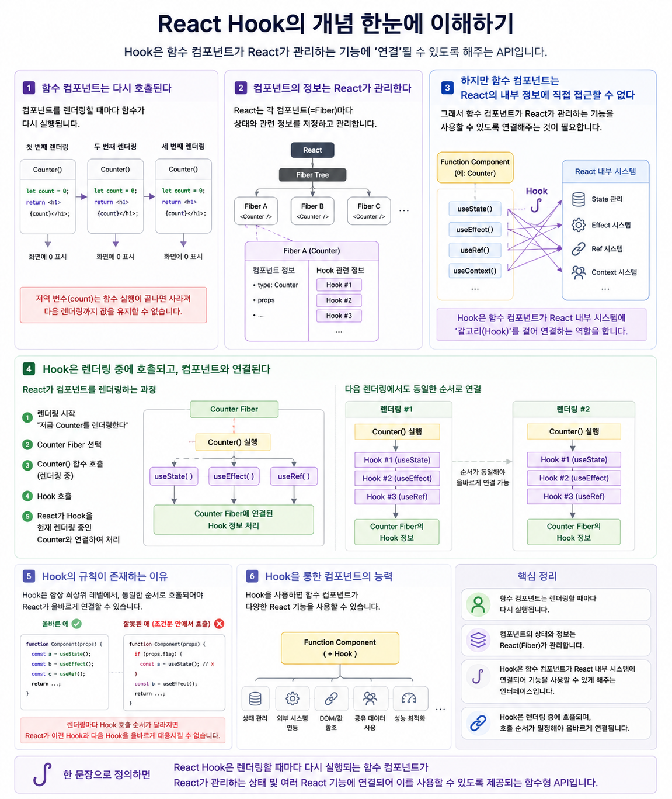

# React Hook이란 무엇인가?




## 1. 먼저 함수 컴포넌트의 본질부터 이해해야 한다

React의 함수 컴포넌트는 기본적으로 **JavaScript 함수**입니다.

```jsx
function Counter() {
  let count = 0;

  return <h1>{count}</h1>;
}
```

React가 이 컴포넌트를 렌더링한다는 것은 본질적으로 `Counter()` 함수를 실행하여 **React Element를 얻는 것**입니다.

```text
React
  │
  │ Counter() 호출
  ▼
function Counter() {
    let count = 0;

    return <h1>{count}</h1>;
}
  │
  ▼
React Element
```

그리고 컴포넌트를 다시 렌더링해야 하면 React는 이 함수를 **다시 호출합니다.**

```text
첫 번째 렌더링

Counter()
 ├─ count = 0
 └─ React Element 반환


두 번째 렌더링

Counter()
 ├─ count = 0    ← 새로운 함수 실행
 └─ React Element 반환


세 번째 렌더링

Counter()
 ├─ count = 0    ← 또 새로운 함수 실행
 └─ React Element 반환
```

여기서 Hook이 필요한 근본적인 이유가 등장합니다.

---

# 2. 함수는 실행이 끝나면 자신의 실행 상태를 유지하지 않는다

일반적인 지역 변수는 해당 함수 호출에 속합니다.

```javascript
function Counter() {
  let count = 0;
}
```

`Counter()`가 다시 호출되면 새로운 실행 컨텍스트가 만들어지고 `count` 역시 다시 만들어집니다.

```text
Counter() 호출 #1

Execution Context
└── count = 0

       종료
        ↓

Counter() 호출 #2

새로운 Execution Context
└── count = 0
```

그런데 UI 컴포넌트는 일반적인 함수와 달리 **이전 렌더링의 정보를 다음 렌더링에서도 기억해야 하는 경우가 많습니다.**

예를 들어:

```text
현재 입력값
버튼 클릭 횟수
선택된 메뉴
로그인 정보
DOM 참조
외부 시스템과의 연결 정보
```

등입니다.

여기서 문제가 생깁니다.

> 함수 컴포넌트는 다시 실행되는데, 컴포넌트에 필요한 정보는 계속 유지되어야 한다.

---

# 3. 그렇다면 정보를 함수 밖에 저장하면 되지 않을까?

예를 들어:

```javascript
let count = 0;

function Counter() {
  count++;
  return <h1>{count}</h1>;
}
```

이렇게 하면 값 자체는 유지할 수 있습니다.

하지만 새로운 문제가 발생합니다.

컴포넌트를 여러 개 사용한다고 생각해보겠습니다.

```jsx
<Counter />
<Counter />
<Counter />
```

우리가 원하는 것은:

```text
Counter A → 자신의 상태
Counter B → 자신의 상태
Counter C → 자신의 상태
```

입니다.

즉 단순히 값을 어딘가에 저장하는 것만으로는 부족합니다.

React는 다음을 알아야 합니다.

```text
"이 값은 어떤 컴포넌트 인스턴스의 값인가?"

"이 값은 그 컴포넌트의 어떤 상태인가?"

"다음 렌더링에서도 같은 값인가?"

"값이 변경되었을 때 다시 렌더링해야 하는가?"
```

따라서 **React 자체가 컴포넌트와 관련된 정보를 관리할 필요가 있습니다.**

---

# 4. React가 컴포넌트의 정보를 관리한다

여기서 React의 Fiber 구조와 연결됩니다.

개념적으로 보면:

```text
              React
                │
                ▼
           Fiber Tree
                │
       ┌────────┼────────┐
       ▼        ▼        ▼
    Fiber A   Fiber B   Fiber C
       │
       │
       └── 이 컴포넌트와 관련된
           상태와 Hook 정보 관리
```

예를 들어:

```jsx
<Counter />
```

가 있다고 하면 React는 해당 컴포넌트를 나타내는 Fiber와 렌더링 정보를 관리합니다.

개념적으로:

```text
Counter Component
        │
        ▼
   Counter Fiber
        │
        ├── 컴포넌트 정보
        ├── props
        ├── 렌더링 관련 정보
        │
        └── Hook 관련 상태
```

따라서 중요한 관점은 이것입니다.

> 컴포넌트가 기억하는 것이 아니라 React가 컴포넌트를 대신해서 기억한다.

---

# 5. 그런데 함수 컴포넌트가 React의 내부 정보에 어떻게 접근할까?

여기서 **Hook**이 등장합니다.

함수 컴포넌트는 그냥 JavaScript 함수입니다.

따라서 React 내부에서 관리되는 컴포넌트의 상태나 다른 기능을 직접 사용할 방법이 필요합니다.

그 역할을 하는 API가 **Hook**입니다.

```text
        Function Component
                │
                │
             Hook 호출
                │
                ▼
        React 내부 시스템
                │
        ┌───────┼────────┐
        │       │        │
        ▼       ▼        ▼
      State   Effect    Ref
        │
        └───────┬────────┘
                │
                ▼
             Fiber
```

그래서 Hook을 다음과 같이 정의할 수 있습니다.

> **React Hook은 함수 컴포넌트가 React가 관리하는 상태와 여러 React 기능에 연결되어 사용할 수 있도록 제공되는 함수형 API이다.**

여기서 **연결**이라는 개념이 중요합니다.

---

# 6. 왜 이름이 Hook인가?

`Hook`의 원래 의미는 **갈고리**입니다.

React가 이 이름을 사용한 이유를 개념적으로 생각하면 이해하기 쉽습니다.

함수 컴포넌트가 React 내부 시스템에 갈고리를 걸어서 필요한 기능을 가져오는 것입니다.

```text
Function Component
       │
       │
       ├──── Hook ────▶ React State
       │
       ├──── Hook ────▶ React Effect System
       │
       ├──── Hook ────▶ React Ref System
       │
       └──── Hook ────▶ React Context
```

즉,

```text
일반 JavaScript 함수
        +
      Hook
        ↓
React가 관리하는 기능을 사용할 수 있는
Function Component
```

가 됩니다.

물론 실제 React 내부에서 물리적인 "갈고리" 구조가 존재한다는 의미는 아닙니다.

**React 내부 기능에 연결한다는 개념적 표현**입니다.

---

# 7. Hook의 핵심은 "기억"만이 아니다

Hook을 처음 설명할 때 흔히

> "함수 컴포넌트가 상태를 기억하게 해주는 기능"

이라고 설명합니다.

입문 단계에서는 도움이 되지만 정확한 정의로는 부족합니다.

Hook은 상태만 다루는 것이 아니기 때문입니다.

Hook을 통해 함수 컴포넌트는 React의 여러 시스템에 접근합니다.

```text
                   React Hook
                       │
          ┌────────────┼─────────────┐
          │            │             │
          ▼            ▼             ▼
        State        Effect         Ref
          │            │             │
     상태 관리      외부 시스템      값/DOM
                    동기화           참조
                       │
               ┌───────┴───────┐
               ▼               ▼
            Context        최적화 기능
```

따라서 Hook의 본질은

**"상태 저장 함수"**

가 아니라

**"함수 컴포넌트를 React의 기능에 연결하는 인터페이스"**

에 가깝습니다.

---

# 8. Hook이 호출되는 순간에는 React가 컴포넌트를 렌더링하고 있다

이것도 Hook을 이해하는 데 매우 중요합니다.

다음과 같은 코드가 있다고 하겠습니다.

```jsx
function Counter() {
  const [count, setCount] = useState(0);

  return <h1>{count}</h1>;
}
```

React가 아무 때나 `useState()`를 실행하는 것이 아닙니다.

먼저 React가 현재 어떤 컴포넌트를 렌더링하는지 알고 있는 상태에서 컴포넌트 함수를 실행합니다.

개념적으로:

```text
React Render Phase

      React
        │
        │ "지금 Counter를 렌더링한다"
        ▼
   Counter Fiber
        │
        ▼
   Counter() 호출
        │
        ▼
   Hook 호출
        │
        ▼
React:
"현재 렌더링 중인
 Counter의 Hook이구나"
        │
        ▼
Counter Fiber와 연결된
Hook 정보 처리
```

이것이 Hook을 일반 JavaScript 함수처럼 아무 곳에서나 호출할 수 없는 근본적인 이유와도 연결됩니다.

---

# 9. React는 Hook 호출을 컴포넌트와 연결한다

예를 들어 하나의 컴포넌트가 여러 Hook을 사용한다고 생각해보겠습니다.

```jsx
function MyComponent() {
  const hook1 = ...
  const hook2 = ...
  const hook3 = ...

  return ...
}
```

개념적으로 React 내부에서는:

```text
MyComponent
     │
     ▼
   Fiber
     │
     ▼
Hook 관련 정보
     │
     ├── Hook #1
     │
     ├── Hook #2
     │
     └── Hook #3
```

처럼 해당 컴포넌트와 Hook 정보를 연결해서 관리합니다.

그래서 다음 렌더링에서도 React는 동일한 컴포넌트의 Hook들을 다시 연결해서 처리할 수 있습니다.

```text
렌더링 #1

MyComponent()
     │
     ├── Hook #1
     ├── Hook #2
     └── Hook #3


        ↓ 다시 렌더링


렌더링 #2

MyComponent()
     │
     ├── Hook #1
     ├── Hook #2
     └── Hook #3
```

이 때문에 **Hook의 호출 순서가 렌더링마다 안정적으로 유지되어야 합니다.**

---

# 10. 그래서 Hook에는 호출 규칙이 존재한다

Hook을 조건문 안에서 호출하면 문제가 될 수 있습니다.

```jsx
function Component({ login }) {

  if (login) {
    // Hook 호출
  }

  // 다른 Hook 호출
}
```

첫 번째 렌더링:

```text
login = true

Hook #1
Hook #2
Hook #3
```

두 번째 렌더링:

```text
login = false

Hook #1 생략

Hook #2
Hook #3
```

호출 구조가 달라집니다.

React가 렌더링 사이에서 Hook들을 올바르게 대응시키기 어려워집니다.

그래서 Hook은 기본적으로 컴포넌트의 **최상위 레벨에서 일관된 순서로 호출**해야 합니다.

이 규칙은 단순한 코딩 스타일이 아니라 **React가 Hook 상태를 렌더링 사이에서 올바르게 연결하기 위해 필요한 규칙**입니다.

---

# 핵심 개념을 하나의 흐름으로 정리하면

```text
┌───────────────────────────────────────────────┐
│          Function Component의 특징            │
│                                               │
│   렌더링할 때마다 함수가 다시 호출된다        │
└──────────────────────┬────────────────────────┘
                       │
                       ▼
┌───────────────────────────────────────────────┐
│                 문제 발생                     │
│                                               │
│ 함수의 지역 변수만으로는 렌더링 사이에         │
│ 컴포넌트 정보를 안정적으로 유지할 수 없다      │
└──────────────────────┬────────────────────────┘
                       │
                       ▼
┌───────────────────────────────────────────────┐
│                    React                      │
│                                               │
│ 컴포넌트별 상태와 관련 정보를 관리한다         │
│                 Fiber                         │
└──────────────────────┬────────────────────────┘
                       │
                       │ 어떻게 접근하지?
                       ▼
┌───────────────────────────────────────────────┐
│                    HOOK                       │
│                                               │
│ 함수 컴포넌트가 React가 관리하는 기능에        │
│ 연결되어 사용할 수 있도록 하는 함수형 API     │
└──────────────────────┬────────────────────────┘
                       │
          ┌────────────┼────────────┐
          ▼            ▼            ▼
        State        Effect        Ref
          │            │            │
          └────────────┼────────────┘
                       ▼
                React 내부 시스템
```

### 한 문장으로 정의하면

> **React Hook은 렌더링할 때마다 다시 실행되는 함수 컴포넌트가 React가 관리하는 상태 및 여러 React 기능에 연결되어 이를 사용할 수 있도록 제공되는 함수형 API입니다.**

강의에서는 특히 **“Hook = 상태를 저장하는 함수”가 아니라 “함수 컴포넌트와 React 내부 시스템을 연결하는 API”**라는 관점을 먼저 잡아주는 것이 좋습니다. 이후에 `useState`, `useEffect`, `useRef`를 배우면 각각이 **무엇에 Hook을 거는 것인지** 자연스럽게 연결됩니다.
