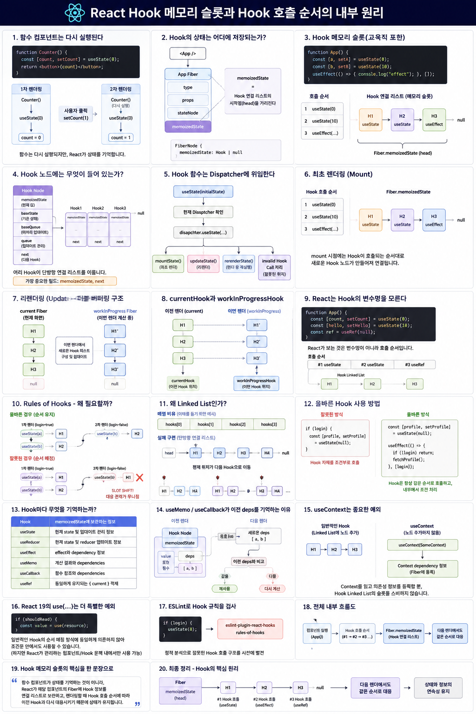

# React Hook 메모리 슬롯과 Hook 호출 순서의 내부 원리




React의 `useState`, `useEffect`, `useRef` 같은 Hook은 함수 컴포넌트 안에서 호출됩니다.

그런데 여기에는 한 가지 근본적인 문제가 있습니다.

```jsx
function Counter() {
  const [count, setCount] = useState(0);

  return <button>{count}</button>;
}
```

함수 컴포넌트는 리렌더링될 때마다 **함수가 처음부터 다시 실행**됩니다.

그렇다면 이전 렌더링의 `count` 값은 어디에 저장되어 있을까요?

```text
1차 렌더링

Counter()
   │
   └── useState(0)
          │
          ▼
        count = 0

사용자 클릭
setCount(1)

2차 렌더링

Counter()       ← 함수가 다시 실행된다.
   │
   └── useState(0)
          │
          ▼
        count = ?
```

일반적인 지역 변수라면 함수 실행이 끝난 뒤 다음 호출에서 이전 값을 그대로 사용할 수 없습니다.

하지만 React의 `count`는 `0`으로 초기화되는 것이 아니라 이전 상태를 이어받아 `1`이 됩니다.

그 이유는 **Hook의 상태가 함수의 지역 변수에 저장되어 있는 것이 아니기 때문입니다.**

---

# 1. Hook의 상태는 어디에 저장되는가?

React는 렌더링되는 각 컴포넌트를 내부적으로 **Fiber 노드**로 관리합니다.

함수 컴포넌트가 사용하는 Hook 정보 역시 해당 컴포넌트의 Fiber에 연결되어 보관됩니다.

개념적으로 보면 다음과 같습니다.

```text
<App />
   │
   ▼
App Fiber
   │
   ├── type
   ├── props
   ├── stateNode
   │
   └── memoizedState
          │
          ▼
       Hook
```

Fiber에는 다음과 같은 필드가 있습니다.

```js
FiberNode {
  memoizedState: Hook | null
}
```

여기서 중요한 점은:

> `Fiber.memoizedState`가 Hook 하나의 값을 직접 저장하는 것이 아니라
> **해당 함수 컴포넌트가 사용하는 Hook 연결 리스트의 시작점(head)을 가리킨다**는 것입니다.

---

# 2. Hook 메모리 슬롯이란?

먼저 용어를 정확하게 구분할 필요가 있습니다.

**Hook 메모리 슬롯(Hook Memory Slot)**은 React 공식 API 용어라기보다는 Hook의 내부 저장 방식을 이해하기 위한 **교육적 표현**입니다.

이 자료에서는 다음과 같이 정의하겠습니다.

> Hook 메모리 슬롯이란
> 함수 컴포넌트가 사용하는 각각의 Hook 정보를 저장하는 **Hook 노드**를 이해하기 쉽게 표현한 용어입니다.

예를 들어:

```jsx
function App() {
  const [a, setA] = useState(0);
  const [b, setB] = useState(10);

  useEffect(() => {
    console.log("effect");
  }, []);
}
```

이 컴포넌트에는 Hook 호출이 세 번 있습니다.

```text
useState(0)
useState(10)
useEffect(...)
```

React 내부에서는 개념적으로 다음과 같이 연결됩니다.

```text
App Fiber
   │
   └── memoizedState
          │
          ▼
       Hook 1
       useState
          │
          │ next
          ▼
       Hook 2
       useState
          │
          │ next
          ▼
       Hook 3
       useEffect
          │
          │ next
          ▼
         null
```

즉,

```text
Fiber.memoizedState
        │
        ▼
      Hook1 → Hook2 → Hook3 → null
```

형태의 **단방향 연결 리스트(Linked List)**입니다.

이 자료에서는 각각의 `Hook1`, `Hook2`, `Hook3`를 이해하기 쉽게 **Hook 메모리 슬롯**이라고 부르겠습니다.

---

# 3. Hook 노드에는 무엇이 들어 있는가?

React 내부의 Hook 노드는 개념적으로 다음과 같은 정보를 가집니다.

```js
Hook {
  memoizedState,
  baseState,
  baseQueue,
  queue,
  next
}
```

각 필드의 역할을 단순화하면 다음과 같습니다.

| 필드              | 역할                               |
| --------------- | -------------------------------- |
| `memoizedState` | 현재 Hook이 기억해야 하는 값               |
| `baseState`     | 아직 모든 업데이트를 반영하지 못했을 때 기준이 되는 상태 |
| `baseQueue`     | 우선순위 등의 이유로 이번 렌더에서 처리되지 않은 업데이트 |
| `queue`         | state/reducer 업데이트 관리 정보         |
| `next`          | 다음 Hook 노드                       |

가장 중요한 필드는 다음 두 가지입니다.

```text
memoizedState
next
```

`memoizedState`는 해당 Hook이 기억해야 하는 데이터를 가지고 있고,

`next`는 다음 Hook을 가리킵니다.

따라서 여러 Hook이 다음처럼 하나의 사슬을 만듭니다.

```text
Hook1
 ├─ memoizedState
 └─ next ──────────────┐
                       ▼
                     Hook2
                      ├─ memoizedState
                      └─ next ──────────┐
                                        ▼
                                      Hook3
                                       ├─ memoizedState
                                       └─ next → null
```

---

# 4. 왜 이런 저장 공간이 필요한가?

함수 컴포넌트는 리렌더링될 때 다시 실행됩니다.

```jsx
function Counter() {
  const [count, setCount] = useState(0);

  return (
    <button onClick={() => setCount(count + 1)}>
      {count}
    </button>
  );
}
```

버튼을 클릭하면:

```text
setCount(1)
     │
     ▼
React에 상태 업데이트 요청
     │
     ▼
Counter() 다시 실행
```

됩니다.

하지만 `Counter()` 함수가 다시 실행된다고 해서 React가 상태를 새로 만드는 것은 아닙니다.

React는 해당 컴포넌트의 Fiber에 연결된 Hook 정보를 이용합니다.

```text
Counter 함수
      │
      │ 렌더링
      ▼
Counter Fiber
      │
      └── memoizedState
             │
             ▼
           Hook
             │
             └── 이전 state와 update queue
```

따라서 중요한 관점은 다음과 같습니다.

```text
함수 컴포넌트
    │
    │ 다시 실행됨
    ▼
일시적인 실행 코드

        VS

Fiber
    │
    └── Hook Linked List
              │
              ▼
       렌더 사이에 유지되는 정보
```

즉,

> 함수가 상태를 기억하는 것이 아니라 **React가 Fiber를 통해 상태를 기억합니다.**

---

# 5. Hook 함수는 실제 구현을 직접 수행하지 않는다

우리가 호출하는:

```js
useState(0);
```

의 `useState`는 mount와 update 로직을 모두 직접 구현하는 함수가 아닙니다.

개념적으로 현재 활성화된 **Dispatcher**에게 작업을 위임합니다.

```text
useState(...)
    │
    ▼
현재 Dispatcher 확인
    │
    ▼
dispatcher.useState(...)
```

React는 컴포넌트를 렌더링하는 상황에 따라 적절한 Hook 구현을 선택합니다.

대표적으로 다음과 같은 경로가 있습니다.

| 상황           | 처리 경로                |
| ------------ | -------------------- |
| 최초 렌더링       | Mount용 Hook 구현       |
| 일반적인 리렌더링    | Update용 Hook 구현      |
| 렌더 도중 다시 렌더링 | Re-render용 Hook 구현   |
| 허용되지 않는 위치   | Invalid Hook Call 처리 |

따라서 개념적으로:

```text
첫 렌더

useState()
   │
   ▼
mountState()
```

다음 렌더에서는:

```text
리렌더

useState()
   │
   ▼
updateState()
```

와 같은 서로 다른 내부 경로를 사용합니다.

---

# 6. 최초 렌더링: Mount

다음 컴포넌트를 처음 렌더링한다고 해봅시다.

```jsx
function App() {
  const [a, setA] = useState(0);
  const [b, setB] = useState(10);

  useEffect(() => {
    console.log("effect");
  }, []);

  return <div>{a + b}</div>;
}
```

React가 `App()`을 실행합니다.

첫 번째 Hook:

```js
useState(0);
```

React는 새로운 Hook 노드를 생성합니다.

```text
App Fiber

memoizedState
     │
     ▼
   Hook1
```

두 번째 Hook:

```js
useState(10);
```

새로운 Hook을 뒤에 연결합니다.

```text
memoizedState
     │
     ▼
   Hook1
     │
     ▼
   Hook2
```

세 번째 Hook:

```js
useEffect(...);
```

다시 새로운 Hook을 연결합니다.

```text
memoizedState
     │
     ▼
   Hook1
     │
     ▼
   Hook2
     │
     ▼
   Hook3
     │
     ▼
    null
```

즉, **mount 시점에는 Hook이 호출되는 순서대로 Hook 노드가 만들어지고 연결됩니다.**

---

# 7. 리렌더링: Update

이제 `setA()`가 호출되어 `App`이 다시 렌더링된다고 해보겠습니다.

여기서 React의 **Fiber 더블 버퍼링(double buffering)** 구조가 중요합니다.

React는 개념적으로 두 Fiber 트리를 사용합니다.

```text
current

현재 화면에 반영된 Fiber
```

그리고:

```text
workInProgress

이번 렌더 결과를 계산하고 있는 Fiber
```

가 존재합니다.

Hook 역시 두 Fiber에 대응하는 리스트가 존재할 수 있습니다.

```text
current Fiber
    │
    └── memoizedState
            │
            ▼
           H1
            │
            ▼
           H2
            │
            ▼
           H3


workInProgress Fiber
    │
    └── memoizedState
            │
            ▼
           H1'
            │
            ▼
           H2'
            │
            ▼
           H3'
```

React는 update 렌더에서 이전 Hook 리스트를 순서대로 따라가면서 이번 렌더에 사용할 Hook 리스트를 구성합니다.

---

# 8. currentHook과 workInProgressHook

이 부분이 Hook 동작의 핵심입니다.

React는 개념적으로 두 개의 위치 정보를 이용합니다.

```text
currentHook
```

이전 렌더링의 Hook을 따라가기 위한 위치,

그리고

```text
workInProgressHook
```

이번 렌더링의 Hook 리스트를 구성하기 위한 위치입니다.

전체 흐름을 단순화하면:

```text
이전 렌더                        이번 렌더

current Fiber                   workInProgress Fiber
     │                                  │
     ▼                                  ▼

    H1 ─────────────────────────────→   H1'
     │
     ▼
    H2 ─────────────────────────────→   H2'
     │
     ▼
    H3 ─────────────────────────────→   H3'
```

첫 번째 Hook 호출은 이전 렌더의 첫 번째 Hook과 대응합니다.

```text
1번째 호출

currentHook
    │
    ▼
   H1 ─────────→ H1'
```

두 번째 호출:

```text
2번째 호출

currentHook
    │
    ▼
   H2 ─────────→ H2'
```

세 번째 호출:

```text
3번째 호출

currentHook
    │
    ▼
   H3 ─────────→ H3'
```

여기에서 매우 중요한 사실이 나옵니다.

> React는 Hook을 변수 이름으로 찾는 것이 아니라 **호출 순서에 따라 이전 Hook과 대응시킵니다.**

---

# 9. React는 Hook의 변수명을 모른다

다음 코드를 봅시다.

```jsx
const [count, setCount] = useState(0);
```

React 입장에서 `count`라는 JavaScript 변수명은 Hook을 식별하는 ID가 아닙니다.

다음 코드도 마찬가지입니다.

```jsx
const [hello, setHello] = useState(0);
```

React가 중요하게 보는 것은:

```text
"이번 컴포넌트 렌더에서 몇 번째 Hook 호출인가?"
```

입니다.

따라서:

```jsx
function App() {
  const [a] = useState(0);
  const [b] = useState(10);
  const ref = useRef(null);
}
```

은 개념적으로:

```text
호출 순서

#1 useState
#2 useState
#3 useRef

       │
       ▼

Hook Linked List

H1 → H2 → H3
```

로 대응됩니다.

---

# 10. 이것이 Rules of Hooks의 핵심 이유다

React에는 유명한 규칙이 있습니다.

> Hook을 조건문이나 반복문 안에서 임의로 호출하지 않는다.

이 규칙은 단순한 코딩 스타일이 아닙니다.

**Hook의 내부 저장 구조가 호출 순서에 의존하기 때문에 필요한 규칙입니다.**

잘못된 예:

```jsx
function App({ login }) {
  if (login) {
    const [a, setA] = useState(0);
  }

  const [b, setB] = useState(10);
}
```

첫 렌더에서:

```text
login = true

useState(a)
    │
    ▼
   H1

useState(b)
    │
    ▼
   H2
```

따라서:

```text
H1(a) → H2(b)
```

입니다.

그런데 다음 렌더에서:

```text
login = false
```

가 되면 첫 번째 `useState`가 호출되지 않습니다.

```text
useState(a)   ← 호출 안 됨

useState(b)
    │
    ▼
이번 렌더의 첫 번째 Hook 호출
```

React의 순서 관점에서는:

```text
이전 렌더

#1 a → H1
#2 b → H2


이번 렌더

#1 b
```

가 됩니다.

따라서 React가 순서대로 Hook을 진행하면:

```text
b
│
▼
H1
```

과 대응하려는 상황이 발생합니다.

원래 `H1`은 `a`의 Hook이었습니다.

즉, Hook 호출 하나가 사라지면서 이후 대응 관계가 무너집니다.

```text
1차 렌더

a          b
│          │
▼          ▼
H1 ──────→ H2


2차 렌더

[없음]     b
            │
            ▼
           H1
            X

         SLOT SHIFT
```

이것이 조건부 Hook 호출이 금지되는 근본적인 이유입니다.

---

# 11. 왜 배열이 아니라 Linked List라고 설명해야 하는가?

Hook 동작을 쉽게 설명하기 위해 다음과 같은 배열 비유를 자주 사용합니다.

```js
hooks[0]
hooks[1]
hooks[2]
```

교육적으로는 도움이 됩니다.

하지만 실제 구현을 이해하려면 다음과 같이 보는 것이 더 정확합니다.

```text
Fiber.memoizedState
        │
        ▼
       H1
        │ next
        ▼
       H2
        │ next
        ▼
       H3
        │
        ▼
       null
```

즉, Hook들은 **단방향 연결 리스트**입니다.

React는 현재 Hook 위치를 추적하면서 Hook 호출이 발생할 때마다 다음 노드로 이동합니다.

개념적으로:

```text
현재 위치
   │
   ▼
  H1 → H2 → H3 → H4
```

첫 번째 Hook 호출 후:

```text
       현재 위치
           │
           ▼
  H1 → H2 → H3 → H4
```

두 번째 Hook 호출 후:

```text
             현재 위치
                 │
                 ▼
  H1 → H2 → H3 → H4
```

이처럼 Hook 호출이 진행될수록 연결 리스트를 순차적으로 따라갑니다.

따라서 중간의 Hook 호출이 사라지면 이후 Hook들의 대응 관계가 틀어집니다.

---

# 12. 올바른 Hook 사용 방법

잘못된 방법:

```jsx
if (login) {
  const [profile, setProfile] = useState(null);
}
```

Hook 자체를 조건부로 호출하고 있습니다.

대신 Hook은 항상 같은 순서로 호출해야 합니다.

```jsx
const [profile, setProfile] = useState(null);

useEffect(() => {
  if (!login) {
    return;
  }

  fetchProfile();
}, [login]);
```

즉:

```text
잘못된 방식

조건
 │
 ▼
Hook 호출 여부 결정


올바른 방식

Hook은 항상 호출
 │
 ▼
Hook 내부 동작에 조건 적용
```

조건에 따라 완전히 다른 Hook 구성이 필요하다면 컴포넌트를 분리하는 것이 좋습니다.

```jsx
function App({ login }) {
  return login ? <LoggedIn /> : <LoggedOut />;
}
```

그러면:

```text
App
 │
 ├─ login=true  → LoggedIn Fiber
 │                  └─ 자신의 Hook List
 │
 └─ login=false → LoggedOut Fiber
                    └─ 자신의 Hook List
```

처럼 각 컴포넌트가 자신의 Hook 구조를 가질 수 있습니다.

---

# 13. Hook마다 무엇을 기억하는가?

Hook 종류에 따라 `memoizedState`에 보관되는 데이터의 의미가 달라집니다.

| Hook          | Hook 노드가 기억하는 핵심 정보             |
| ------------- | ------------------------------- |
| `useState`    | 현재 state 및 state update 처리 정보   |
| `useReducer`  | 현재 state 및 reducer update 처리 정보 |
| `useEffect`   | effect와 dependency 관련 정보        |
| `useMemo`     | 계산 결과와 dependencies             |
| `useCallback` | 함수 참조와 dependencies             |
| `useRef`      | 동일하게 유지되는 `{ current }` 객체      |

예를 들어:

```jsx
const ref = useRef(null);
```

에서 React는 최초 렌더에서 ref 객체를 만들고 이후 렌더에서 해당 Hook에 저장된 동일한 객체를 반환합니다.

그래서:

```js
ref.current
```

를 렌더 사이에서도 계속 사용할 수 있습니다.

---

# 14. useMemo와 useCallback이 이전 deps를 기억하는 이유

예를 들어:

```jsx
const value = useMemo(() => calculate(a), [a]);
```

React가 다음 렌더에서:

```text
이전 deps
[a]
```

와

```text
새로운 deps
[a]
```

를 비교할 수 있는 이유 역시 이전 Hook 정보가 보관되어 있기 때문입니다.

개념적으로:

```text
Hook
 │
 └── memoizedState
        │
        ├── 이전 계산 결과
        └── 이전 dependencies
```

따라서 다음 렌더에서:

```text
새로운 deps
     │
     ▼
이전 deps와 비교
     │
 ┌───┴────┐
 │        │
같음     다름
 │        │
 ▼        ▼
재사용    다시 계산
```

할 수 있습니다.

---

# 15. useContext는 중요한 예외다

모든 React API가 Hook linked list의 한 칸을 소비하는 것은 아닙니다.

대표적인 예가:

```js
useContext(SomeContext);
```

입니다.

`useContext`는 일반적인 stateful Hook처럼 Hook linked list에 Hook 노드를 추가하여 상태를 보관하는 방식이 아닙니다.

대신 렌더링 과정에서 Context를 읽고 Fiber의 Context dependency 정보를 등록합니다.

따라서:

```text
useState
useEffect
useRef
useMemo
```

등의 Hook 저장 방식과:

```text
useContext
```

의 내부 처리는 구분해서 이해해야 합니다.

---

# 16. React 19의 use(...)는 더 특별한 예외다

React의 `use(...)` API는 일반적인 Hook 호출 규칙과 다른 특성을 가집니다.

예를 들어 조건문 안에서도 사용할 수 있습니다.

```jsx
if (shouldRead) {
  const value = use(resource);
}
```

일반적인 Hook처럼:

```text
첫 번째 호출 → H1
두 번째 호출 → H2
세 번째 호출 → H3
```

이라는 Hook linked list의 순서 매칭 방식에 동일하게 의존하지 않기 때문입니다.

하지만 `use`도 아무 곳에서나 호출할 수 있다는 의미는 아닙니다.

React가 렌더링을 관리하는 컴포넌트나 Hook의 실행 문맥 안에서 사용해야 합니다.

---

# 17. Hook 규칙은 ESLint도 검사한다

Hook 호출 순서 문제를 런타임까지 기다렸다가 발견하는 것은 위험합니다.

그래서 React 생태계에서는 Hook 규칙을 정적으로 검사합니다.

대표적인 규칙이:

```text
eslint-plugin-react-hooks
        │
        └── rules-of-hooks
```

입니다.

다음과 같은 코드를 작성하면:

```jsx
if (login) {
  useState(0);
}
```

정적 분석을 통해 잘못된 Hook 호출 구조를 발견할 수 있습니다.

React Compiler 역시 React의 Hook 및 컴포넌트 규칙을 전제로 코드를 분석하고 최적화합니다.

---

# 18. 전체 내부 흐름

지금까지의 내용을 하나의 흐름으로 연결하면 다음과 같습니다.

```text
              함수 컴포넌트
                    │
                    ▼
                 App()
                    │
                    ▼
             Hook #1 호출
                    │
                    ▼
              Hook Node 1
                    │
                    ▼
             Hook #2 호출
                    │
                    ▼
              Hook Node 2
                    │
                    ▼
             Hook #3 호출
                    │
                    ▼
              Hook Node 3


결과

App Fiber
   │
   └── memoizedState
           │
           ▼
          H1
           │
           ▼
          H2
           │
           ▼
          H3
           │
           ▼
          null
```

리렌더링에서는 이전 리스트와 새로운 리스트가 순서대로 대응합니다.

```text
CURRENT                         WORK IN PROGRESS

App Fiber                       App Fiber
   │                               │
   ▼                               ▼

  H1 ───────────────────────────→ H1'
   │
   ▼
  H2 ───────────────────────────→ H2'
   │
   ▼
  H3 ───────────────────────────→ H3'
```

따라서:

```text
이번 렌더의 1번째 Hook
            ↕
이전 렌더의 1번째 Hook

이번 렌더의 2번째 Hook
            ↕
이전 렌더의 2번째 Hook

이번 렌더의 3번째 Hook
            ↕
이전 렌더의 3번째 Hook
```

이라는 대응 관계가 유지되어야 합니다.

---

# 19. Hook 메모리 슬롯의 핵심을 한 문장으로

> **함수 컴포넌트가 상태를 기억하는 것이 아니라, React가 해당 컴포넌트의 Fiber에 Hook 정보를 연결 리스트로 보관하고, 렌더링할 때 Hook 호출 순서에 따라 이전 Hook과 다시 대응시키기 때문에 상태가 유지됩니다.**

이를 더 짧게 표현하면:

```text
Component 실행
      │
      ▼
Hook 호출 순서
      │
      ▼
Fiber.memoizedState
      │
      ▼
H1 → H2 → H3 → null
      │
      ▼
다음 렌더에서도
같은 순서로 대응
```

---

# 20. 최종 정리

## Hook 메모리 슬롯

`Hook 메모리 슬롯`은 Hook 내부 구조를 설명하기 위한 교육적 표현입니다.

실제 구현 관점에서는:

```text
Fiber.memoizedState
        │
        ▼
Hook → Hook → Hook → null
```

형태의 Hook 연결 리스트로 이해하는 것이 정확합니다.

## Fiber.memoizedState

함수 컴포넌트가 사용하는 **Hook linked list의 시작점(head)** 을 가리킵니다.

```text
Fiber
 └── memoizedState
        │
        ▼
       H1 → H2 → H3
```

## Hook Node

각 Hook의 렌더 간 유지 정보와 다음 Hook을 가리키는 `next` 등을 가지고 있습니다.

## Mount

Hook이 호출되는 순서대로 새로운 Hook 노드가 만들어져 연결됩니다.

```text
H1 → H2 → H3
```

## Update

이전 렌더의 Hook 리스트를 순서대로 따라가면서 이번 렌더의 Hook 리스트를 구성하고 업데이트를 처리합니다.

```text
H1  → H1'
H2  → H2'
H3  → H3'
```

## 가장 중요한 원리

React는 Hook을:

```text
변수명
Hook에 붙인 이름
```

으로 식별하는 것이 아니라 **렌더링 중 Hook 호출 순서**를 기반으로 대응시킵니다.

그래서 Hook은 매 렌더마다 일관된 순서로 호출되어야 합니다.

```text
             Hook의 핵심 원리

                    Fiber
                      │
                memoizedState
                      │
                      ▼
              H1 → H2 → H3
              ↑     ↑     ↑
              │     │     │
             #1    #2    #3
              Hook 호출 순서

                      │
                      ▼

        다음 렌더에서도 같은 순서 유지

                      │
                      ▼

             상태와 정보의 연속성 유지
```

결국 **Rules of Hooks는 임의로 만들어진 문법 규칙이 아니라 React의 Hook 저장 및 재사용 메커니즘에서 직접 파생되는 규칙**입니다.
