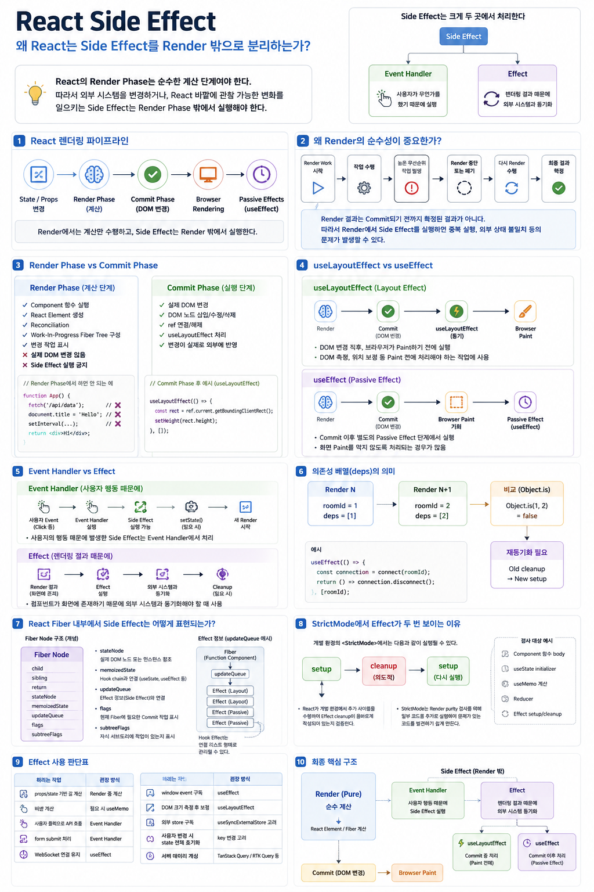

# React Side Effect

> React의 **Side Effect**란, 컴포넌트가 `props`와 `state`를 바탕으로 UI를 계산하는 **순수한 Render 작업 이외에**, 네트워크 요청, DOM 조작, 타이머·이벤트 리스너 등록, 외부 저장소 변경처럼 **React 외부의 시스템이나 상태를 읽거나 변경하여 관찰 가능한 영향을 발생시키는 작업**을 의미하며, Render의 순수성을 유지하기 위해 이러한 작업은 **Render Phase 밖의 이벤트 핸들러나 Effect에서 처리해야 합니다.**

## “왜 React는 Side Effect를 Render 밖으로 분리하려 하는가?”를 내부 구조부터 이해한다 

React에서 **Side Effect**는 단순히 “네트워크 요청”만을 의미하지 않습니다.

핵심은 다음입니다.

> **React의 Render Phase는 순수한 계산 단계여야 한다.**
>
> 따라서 외부 시스템을 변경하거나, React 바깥에 관찰 가능한 변화를 일으키는 Side Effect는 **Render Phase 밖에서 실행해야 한다.**

그리고 Side Effect는 발생 원인에 따라 주로 두 위치에서 처리합니다.

```text
Side Effect
    │
    ├─ Event Handler
    │    └─ 사용자가 무언가를 했기 때문에 실행
    │
    └─ Effect
         └─ 렌더링 결과 때문에 외부 시스템과 동기화
```

즉, 중요한 문장은 이것입니다.

> **Side Effect는 Commit Phase에서만 실행해야 하는 것이 아니라, Render Phase에서는 실행하면 안 된다.**




---

# 1. React에서 Side Effect가 특별한 이유

## — React는 Render의 순수성(Purity)을 전제로 동작한다

React는 함수 컴포넌트를 개념적으로 다음과 같은 순수 함수처럼 취급합니다.

```tsx
function Component(props, state) {
  return ReactElementTree;
}
```

같은 `props`, `state`, `context`가 주어진다면 렌더링 과정에서는 외부 환경을 변경하지 않고 React Element를 계산해야 합니다.

즉 Render Phase에서 다음과 같은 작업을 하면 안 됩니다.

```text
Render Phase

props / state
     ↓
Component()
     ↓
React Elements 계산
     ↓
다음 UI 구조 계산
```

여기서는 **계산만 수행**해야 합니다.

---

## 왜 React는 Render의 순수성을 요구할까?

React의 Fiber 기반 렌더링에서는 렌더링 작업이 반드시 한 번에 끝까지 실행된다고 보장할 수 없습니다.

React는 상황에 따라 렌더링 작업을:

* 여러 번 실행할 수 있고
* 중간 결과를 폐기할 수 있고
* 더 높은 우선순위 작업 때문에 중단할 수 있고
* 나중에 다시 계산할 수 있습니다.

개념적으로 보면 다음과 같습니다.

```text
Render Work 시작
      ↓
Fiber 작업 수행
      ↓
높은 우선순위 작업 발생
      ↓
현재 Render Work 중단 또는 폐기
      ↓
다시 Render Work 수행
      ↓
최종 결과 확정
      ↓
Commit
```

중요한 것은 다음입니다.

> **Render 결과는 Commit되기 전까지 확정된 결과가 아니다.**

따라서 Render 중 외부 세계를 변경하면 문제가 발생합니다.

---

## Render에서 Side Effect를 실행하면 생기는 문제

예를 들어:

```jsx
function App() {
  fetch("/api/data");
  document.title = "Hello";

  return <div>Hello</div>;
}
```

React가 이 컴포넌트를 다시 렌더링하면:

```text
App() 실행
 ├─ fetch 실행
 └─ title 변경

Render 폐기

App() 다시 실행
 ├─ fetch 또 실행
 └─ title 또 변경
```

다음 문제가 발생할 수 있습니다.

* 네트워크 요청 중복
* 타이머 중복 등록
* 이벤트 리스너 중복 등록
* DOM 직접 조작 반복
* 스크롤 위치 이상
* focus 이동 오류
* 외부 상태 불일치

그래서 React가 요구하는 원칙은 간단합니다.

> **Render는 계산만 하라.**
>
> **Side Effect는 Render 밖에서 실행하라.**

---

# 2. React 렌더링 파이프라인

React 업데이트 과정을 크게 나누면 다음처럼 볼 수 있습니다.

```text
State / Props 변경
       ↓
Render Phase
       ↓
Commit Phase
       ↓
Browser Rendering
       ↓
Passive Effects
```

각 단계의 역할은 다릅니다.

---

# 3. Render Phase

Render Phase는 **다음 UI가 어떤 모습이어야 하는지를 계산하는 단계**입니다.

주요 작업은 다음과 같습니다.

```text
Render Phase

Component 함수 실행
       ↓
React Element 생성
       ↓
기존 Fiber와 비교
       ↓
Reconciliation
       ↓
Work-In-Progress Fiber Tree 구성
       ↓
필요한 변경 작업 표시
```

이 단계에서는 실제 DOM을 변경하지 않습니다.

따라서 Render Phase에서는 다음 작업을 피해야 합니다.

```jsx
function Component() {
  localStorage.setItem("theme", "dark"); // X
  fetch("/api/data");                    // X
  setInterval(...);                      // X
  document.title = "Hello";             // X

  return <div />;
}
```

반면 다음과 같은 계산은 괜찮습니다.

```jsx
function Profile({ firstName, lastName }) {
  const fullName = firstName + " " + lastName;

  return <h1>{fullName}</h1>;
}
```

이것은 외부 세계를 변경하지 않는 **순수 계산**입니다.

---

# 4. Commit Phase

Render Phase에서 계산이 완료되면 React는 Commit Phase에 들어갑니다.

Commit은 실제 화면에 변경을 반영하는 단계입니다.

개념적으로는 다음과 같이 이해할 수 있습니다.

```text
Commit Phase

Before Mutation
      ↓
Mutation
      ↓
Layout
```

React는 이 과정에서:

* 실제 DOM 변경
* DOM 노드 삽입
* DOM 속성 변경
* DOM 노드 제거
* ref 연결 및 해제
* Layout Effect 처리

등을 수행합니다.

중요한 점은:

> **Commit Phase는 Render처럼 자유롭게 폐기하거나 반복할 수 있는 계산 단계가 아니다.**

실제 DOM을 변경하기 때문에 결과가 외부 세계에 나타납니다.

---

# 5. React Commit과 브라우저 Layout은 다른 개념이다

여기서 자주 발생하는 오해가 있습니다.

React의 **Layout Effect**와 브라우저의 **Layout 계산**은 같은 개념이 아닙니다.

React Commit은 대략:

```text
React Commit

DOM Mutation
     ↓
ref 처리
     ↓
useLayoutEffect
```

브라우저 렌더링은 별도로:

```text
Browser Rendering

Style
  ↓
Layout
  ↓
Paint
  ↓
Composite
```

과정을 수행합니다.

React가 직접 브라우저 Layout을 계산하는 것이 아닙니다.

다만 `useLayoutEffect`에서:

```js
element.getBoundingClientRect();
```

같은 코드를 실행하면 브라우저가 최신 layout 정보를 계산해야 할 수 있습니다.

---

# 6. useLayoutEffect는 언제 실행되는가?

`useLayoutEffect`는 React가 DOM 변경을 Commit한 뒤, 브라우저가 화면을 repaint하기 전에 실행됩니다.

```text
Render
  ↓
Commit
  ↓
DOM Mutation
  ↓
ref 처리
  ↓
useLayoutEffect
  ↓
Browser Paint
```

따라서 DOM 크기나 위치를 측정해야 할 때 사용할 수 있습니다.

예:

```jsx
useLayoutEffect(() => {
  const rect = elementRef.current.getBoundingClientRect();

  setHeight(rect.height);
}, []);
```

대표적인 용도:

* DOM 크기 측정
* 위치 측정
* Paint 전에 UI 보정
* tooltip 위치 계산

다만 `useLayoutEffect`는 브라우저 paint를 지연시킬 수 있기 때문에 꼭 필요한 경우에만 사용하는 것이 좋습니다.

---

# 7. useEffect는 언제 실행되는가?

`useEffect`는 **Passive Effect**입니다.

핵심은 다음입니다.

> **useEffect는 Render Phase에서 실행되지 않는다.**
>
> Commit이 완료된 이후 별도의 Passive Effect 처리 과정에서 실행된다.

일반적으로는 브라우저가 화면을 그릴 기회를 가진 이후 실행되는 경우가 많습니다.

```text
Render
  ↓
Commit
  ↓
Browser Paint 기회
  ↓
Passive Effect
  ↓
useEffect
```

하지만 이것을:

> "`useEffect`는 항상 반드시 Paint 이후 실행된다."

라고 이해하면 정확하지 않습니다.

상황에 따라 React는 paint 전에 Effect를 실행할 수도 있습니다.

따라서 가장 안전한 설명은:

> **useEffect는 Commit 이후 처리되는 Passive Effect이며, 일반적으로 화면 paint를 막지 않도록 처리된다.**

입니다.

---

# 8. Side Effect와 Effect는 같은 말이 아니다

여기서 매우 중요한 구분이 있습니다.

```text
Side Effect
      │
      ├─ Event Handler
      │
      └─ React Effect
```

즉:

> **모든 Effect는 Side Effect를 처리할 수 있지만, 모든 Side Effect가 Effect에서 실행되어야 하는 것은 아닙니다.**

예를 들어:

```jsx
<button
  onClick={() => {
    localStorage.setItem("theme", "dark");
  }}
>
  Dark Mode
</button>
```

`localStorage.setItem()`은 분명 Side Effect입니다.

그러나 `useEffect`가 필요하지 않습니다.

왜냐하면 이 작업은:

> **사용자가 버튼을 클릭했기 때문에 발생한 작업**

이기 때문입니다.

---

# 9. 이벤트 핸들러에서 Side Effect가 가능한 이유

이벤트 핸들러는 Render Phase에서 실행되는 코드가 아닙니다.

```jsx
function App() {
  function handleClick() {
    localStorage.setItem("x", "1");
    fetch("/api/save");
  }

  return <button onClick={handleClick}>Save</button>;
}
```

흐름은 다음과 같습니다.

```text
사용자 Click
     ↓
Event Handler 실행
     ↓
Side Effect 실행 가능
     ↓
필요하면 setState()
     ↓
React Update Scheduling
     ↓
새 Render Phase 시작
```

따라서 이벤트 핸들러 내부에서는 다음과 같은 작업이 가능합니다.

* 네트워크 요청
* localStorage 변경
* 로그 기록
* 사용자 알림
* 서버 저장
* state update

핵심은:

> 이벤트 핸들러는 Render Phase의 순수성을 깨뜨리지 않습니다.

---

# 10. Effect는 언제 필요한가?

React Effect의 가장 중요한 목적은:

> **렌더링 결과와 React 외부 시스템을 동기화하는 것**

입니다.

예를 들어:

```jsx
function ChatRoom({ roomId }) {
  useEffect(() => {
    const connection = connect(roomId);

    connection.open();

    return () => {
      connection.close();
    };
  }, [roomId]);

  return <div>Room: {roomId}</div>;
}
```

여기서 연결은:

> 사용자가 방금 어떤 버튼을 눌렀기 때문

이 아니라:

> **현재 ChatRoom이 특정 roomId로 화면에 존재하기 때문**

유지되어야 합니다.

이런 경우 Effect가 적합합니다.

---

# 11. Effect가 적합한 대표적인 작업

## 외부 시스템과 동기화

```jsx
useEffect(() => {
  document.title = title;
}, [title]);
```

---

## 이벤트 리스너 등록

```jsx
useEffect(() => {
  function handleResize() {
    console.log(window.innerWidth);
  }

  window.addEventListener("resize", handleResize);

  return () => {
    window.removeEventListener("resize", handleResize);
  };
}, []);
```

---

## 구독

```jsx
useEffect(() => {
  const subscription = store.subscribe(handleChange);

  return () => {
    subscription.unsubscribe();
  };
}, []);
```

---

## 타이머

```jsx
useEffect(() => {
  const timerId = setInterval(() => {
    console.log("tick");
  }, 1000);

  return () => {
    clearInterval(timerId);
  };
}, []);
```

---

## 외부 연결

```jsx
useEffect(() => {
  const socket = connect(roomId);

  return () => socket.disconnect();
}, [roomId]);
```

---

# 12. 데이터 Fetching과 Effect

데이터 요청 역시 외부 시스템과의 동기화이기 때문에 Effect에서 수행할 수 있습니다.

```jsx
useEffect(() => {
  fetch(`/api/users/${userId}`)
    .then(response => response.json())
    .then(data => setUser(data));
}, [userId]);
```

하지만 현대 React 애플리케이션에서는 데이터 fetching을 반드시 직접 `useEffect`로 작성해야 하는 것은 아닙니다.

다음과 같은 방법이 더 적합한 경우가 많습니다.

```text
Framework Data Loader
React Server Components
TanStack Query
RTK Query
SWR
```

즉:

> `useEffect`는 데이터 fetching이 가능한 도구이지, 모든 데이터 fetching의 최선의 위치는 아닙니다.

---

# 13. 의존성 배열(deps)의 정확한 의미

다음 코드를 봅시다.

```jsx
useEffect(() => {
  const connection = connect(roomId);

  return () => {
    connection.disconnect();
  };
}, [roomId]);
```

`[roomId]`는 단순한 “실행 조건”이라기보다:

> **Effect가 사용하는 reactive value의 종속성 목록**

입니다.

React는 이전 렌더와 현재 렌더의 dependency를 비교합니다.

개념적으로:

```text
Render N

roomId = 1
deps = [1]

      ↓

Render N + 1

roomId = 2
deps = [2]

      ↓

Object.is(1, 2)
      ↓
false
      ↓
재동기화 필요
      ↓
기존 cleanup
      ↓
새 Effect setup
```

Effect에서 사용하는 reactive value가 바뀌면 Effect도 새로운 값에 맞춰 다시 동기화되어야 합니다.

---

# 14. 잘못된 dependency가 만드는 stale closure

예를 들어:

```jsx
useEffect(() => {
  console.log(count);
}, []);
```

Effect 내부에서는 `count`를 사용하지만 dependency에는 포함되어 있지 않습니다.

그러면 Effect는 처음 생성된 렌더의 값을 계속 참조할 수 있습니다.

```text
Render 1
count = 0
Effect closure → count 0 기억

Render 2
count = 1

Render 3
count = 2

하지만 Effect는
처음 closure의 count = 0을 참조
```

이것이 흔히 말하는 **stale closure** 문제입니다.

---

# 15. Effect의 cleanup

Effect는 단순히 setup만 수행하는 것이 아닙니다.

외부 시스템과 연결했다면 연결을 해제해야 할 수 있습니다.

```jsx
useEffect(() => {
  const socket = connect(roomId);

  return () => {
    socket.disconnect();
  };
}, [roomId]);
```

Effect 구조는 사실상 다음과 같습니다.

```text
Effect

setup()
  ↓
외부 시스템 연결

cleanup()
  ↓
외부 시스템 연결 해제
```

---

# 16. dependency가 변경되면 어떻게 되는가?

기존 Effect가:

```text
roomId = 1
```

을 기준으로 실행되고 있었다고 합시다.

이후:

```text
roomId = 2
```

로 변경됩니다.

React는 다음 순서로 처리합니다.

```text
기존 Effect

connect(1)

      ↓

roomId 변경

      ↓

cleanup

disconnect(1)

      ↓

새 Effect

connect(2)
```

즉:

```text
Old cleanup
     ↓
New setup
```

이라는 구조가 됩니다.

---

# 17. StrictMode에서 Effect가 두 번 보이는 이유

개발 환경에서 `<StrictMode>`를 사용하면 Effect가 다음처럼 보일 수 있습니다.

```text
setup
  ↓
cleanup
  ↓
setup
```

예:

```jsx
useEffect(() => {
  const socket = connect(roomId);

  return () => {
    socket.disconnect();
  };
}, [roomId]);
```

React가 개발 환경에서 이런 추가 사이클을 수행하는 이유는:

> **Effect cleanup이 올바르게 작성되어 있는지 검증하기 위해서입니다.**

잘못된 코드:

```jsx
useEffect(() => {
  connect();

  // cleanup 없음
}, []);
```

StrictMode에서는 이런 문제가 더 쉽게 드러납니다.

---

# 18. StrictMode는 Render purity도 검사한다

StrictMode는 Effect만 확인하는 것이 아닙니다.

개발 환경에서 pure해야 하는 일부 코드를 추가로 실행하여 문제가 있는 코드를 발견하도록 돕습니다.

예를 들면:

```text
Component function body
useState initializer
useMemo calculation
Reducer
Effect setup / cleanup
```

등입니다.

예를 들어 Render에서:

```jsx
function Component() {
  externalArray.push("item");

  return <div />;
}
```

같은 코드를 작성했다면 재실행될 때 외부 배열이 계속 변경됩니다.

StrictMode는 이런 impurity를 발견하기 쉽게 만듭니다.

---

# 19. 잘못된 Side Effect 예시

## 19.1 Render 안에서 Side Effect 실행

```jsx
function App() {
  localStorage.setItem("theme", "dark");

  return <div />;
}
```

문제:

```text
Render
 ↓
localStorage 변경

Render 재실행
 ↓
또 변경
```

---

## 19.2 Render 안에서 fetch

```jsx
function App() {
  fetch("/api/data");

  return <div />;
}
```

Render가 다시 실행되면 요청이 반복될 수 있습니다.

---

## 19.3 Render 안에서 timer 생성

```jsx
function App() {
  setInterval(() => {
    console.log("tick");
  }, 1000);

  return <div />;
}
```

Render가 여러 번 실행될수록 timer가 계속 추가될 수 있습니다.

---

# 20. Effect가 필요 없는 경우

React를 배우기 시작하면 흔히:

> “Side Effect면 무조건 useEffect”

라고 생각하기 쉽습니다.

하지만 React에서 Effect는 훨씬 좁은 목적을 가집니다.

> **Effect는 React 외부 시스템과 렌더링 결과를 동기화하기 위한 escape hatch입니다.**

외부 시스템이 없다면 Effect가 필요하지 않은 경우가 많습니다.

---

# 21. 파생 상태를 Effect로 만들지 말자

다음 코드는 불필요합니다.

```jsx
const [fullName, setFullName] = useState("");

useEffect(() => {
  setFullName(firstName + " " + lastName);
}, [firstName, lastName]);
```

흐름:

```text
Render
 ↓
옛 fullName 표시
 ↓
Effect 실행
 ↓
setFullName
 ↓
Render 한 번 더
```

하지만 `fullName`은 props/state에서 바로 계산할 수 있습니다.

```jsx
const fullName = firstName + " " + lastName;
```

이것이면 충분합니다.

```text
firstName
    +
lastName
    ↓
Render 중 계산
    ↓
fullName
```

---

# 22. 계산 비용이 크다면 useMemo

계산이 비싸다면:

```jsx
const result = useMemo(() => {
  return expensiveCalculation(data);
}, [data]);
```

을 고려할 수 있습니다.

하지만 `useMemo` 역시 Effect가 아닙니다.

```text
Render
  ↓
Memoized Calculation
  ↓
Result
```

즉 여전히 Render의 계산 영역에 있습니다.

---

# 23. props를 state로 복사하는 Effect도 주의

다음 코드는 흔한 안티패턴입니다.

```jsx
const [value, setValue] = useState(props.value);

useEffect(() => {
  setValue(props.value);
}, [props.value]);
```

props는 이미 부모의 최신 렌더 결과로 전달됩니다.

따라서 단순히 props를 state에 복사할 필요가 없는 경우가 많습니다.

---

# 24. props가 바뀔 때 state 전체를 초기화하고 싶다면

예를 들어 사용자별 Profile 컴포넌트의 모든 내부 state를 초기화하고 싶다면 `key`를 활용할 수 있습니다.

```jsx
<Profile
  key={userId}
  userId={userId}
/>
```

`userId`가 달라지면 React는 다른 컴포넌트 identity로 판단할 수 있고 기존 state를 유지하지 않습니다.

```text
Profile key=1
      ↓
userId 변경
      ↓
Profile key=2
      ↓
새 Component Instance
      ↓
내부 state 초기화
```

---

# 25. 사용자 행동으로 발생한 일은 이벤트 핸들러에서

판별 기준으로 매우 유용한 질문이 있습니다.

> **이 코드는 왜 실행되어야 하는가?**

---

## 사용자가 무언가를 했기 때문에

```text
Button Click
Form Submit
Drag
Keyboard Input
```

이면:

```text
Event Handler
```

가 적합합니다.

예:

```jsx
function handleBuy() {
  postOrder(cart);
  showToast("주문 완료");
}
```

---

## 컴포넌트가 화면에 존재하기 때문에

```text
ChatRoom이 화면에 있음
      ↓
서버 연결 유지 필요
```

이면 Effect가 적합합니다.

```jsx
useEffect(() => {
  const connection = connect(roomId);

  return () => connection.disconnect();
}, [roomId]);
```

---

# 26. 잘못된 Event → Effect 변환

다음 코드는 좋지 않습니다.

```jsx
useEffect(() => {
  if (isSubmitted) {
    postOrder(cart);
    showToast("주문 완료");
  }
}, [isSubmitted]);
```

주문은:

> 컴포넌트가 화면에 있기 때문에 실행되는 것이 아닙니다.

사용자가 구매를 요청했기 때문에 발생합니다.

따라서:

```jsx
function handleBuy() {
  postOrder(cart);
  showToast("주문 완료");
}
```

가 더 적절합니다.

---

# 27. Effect 사용 판단표

| 하려는 작업                | 권장 방식                           |
| --------------------- | ------------------------------- |
| props/state 기반 값 계산   | Render 중 계산                     |
| 비싼 계산                 | 필요 시 `useMemo`                  |
| 사용자 클릭으로 API 호출       | Event Handler                   |
| form submit 처리        | Event Handler                   |
| WebSocket 연결 유지       | `useEffect`                     |
| window event 구독       | `useEffect`                     |
| DOM 크기 측정 후 즉시 보정     | `useLayoutEffect`               |
| 외부 store 구독           | `useSyncExternalStore` 고려       |
| 사용자 변경 시 state 전체 초기화 | `key` 변경 고려                     |
| 서버 데이터 캐싱             | TanStack Query / RTK Query 등 고려 |

---

# 28. React Fiber 내부에서 Side Effect는 어떻게 표현되는가?

React는 렌더링 작업 단위를 **Fiber Node**로 표현합니다.

개념적으로 Fiber는 다음과 같은 정보를 가집니다.

```text
Fiber Node
│
├─ child
├─ sibling
├─ return
│
├─ stateNode
├─ memoizedState
├─ updateQueue
│
├─ flags
└─ subtreeFlags
```

---

# 29. 주요 Fiber 필드

## `stateNode`

실제 host DOM node 또는 클래스 인스턴스 등의 참조를 가질 수 있습니다.

```text
HostComponent Fiber
        │
        └─ stateNode
             ↓
        HTMLDivElement
```

---

## `memoizedState`

함수형 컴포넌트에서는 Hook chain과 연결됩니다.

```text
Fiber.memoizedState
       ↓
Hook
 ↓
Hook
 ↓
Hook
```

예:

```jsx
useState(...)
useEffect(...)
useState(...)
```

호출 순서와 대응되는 Hook 구조가 Fiber에 연결됩니다.

---

## `updateQueue`

Fiber의 종류에 따라 업데이트 관련 정보가 저장됩니다.

함수 컴포넌트의 경우 Effect 관련 구조도 `updateQueue`와 연결되어 관리됩니다.

개념적으로:

```text
FunctionComponent Fiber
        │
        └─ updateQueue
               │
               └─ Effect structures
                    ├─ Layout Effect
                    └─ Passive Effect
```

---

## `flags`

현재 Fiber 자체에 필요한 Commit 작업을 비트 플래그로 표현합니다.

예:

```text
Placement
Update
ChildDeletion
Passive
Ref
Layout 관련 flags
```

정확한 내부 flag 이름과 구조는 React 버전에 따라 달라질 수 있습니다.

---

## `subtreeFlags`

자식 Fiber 서브트리에 처리해야 할 Commit 작업이 있는지를 나타냅니다.

```text
Parent Fiber
subtreeFlags = Passive | Update
       │
       ↓
"아래 서브트리에 처리할 일이 있음"
```

이를 이용하면 React는 작업이 없는 서브트리를 건너뛸 수 있습니다.

---

# 30. 예전 Effect List와 현재 Commit Traversal

React 16~17 시기의 내부 설명에서는 Commit할 Fiber들을 `nextEffect` 같은 연결 구조로 평평하게 연결한 **effect list**가 자주 등장했습니다.

개념적으로:

```text
Fiber A
  ↓
Fiber D
  ↓
Fiber F
  ↓
Fiber G
```

하지만 최신 React에서는 이런 옛 `nextEffect` 기반 flat effect list 설명을 그대로 적용하면 안 됩니다.

현재는 `flags`와 `subtreeFlags`를 이용하여 Fiber tree를 순회하면서 필요한 작업을 처리하는 방식으로 이해하는 것이 더 적절합니다.

```text
Fiber Tree

Parent
├─ Child A
│   └─ flags 있음
│
├─ Child B
│   └─ 작업 없음
│
└─ Child C
    └─ subtreeFlags 있음
```

React는 작업이 없는 서브트리를 건너뛰면서 필요한 Commit 작업을 수행할 수 있습니다.

---

# 31. Hook Effect의 연결 구조와 Commit Effect List를 혼동하면 안 된다

여기서 두 개념을 구분해야 합니다.

## 과거 Commit용 Effect List

```text
nextEffect
```

를 이용하여 Commit 대상 Fiber를 연결하던 구조입니다.

---

## Hook Effect Structure

`useEffect`, `useLayoutEffect` 자체를 나타내는 Effect 정보는 함수 컴포넌트 Fiber의 update queue 등에 연결되어 관리될 수 있습니다.

```text
Fiber
  │
  └─ updateQueue
         ↓
      Effect
         ↓
      Effect
         ↓
      Effect
```

따라서:

> “React 18에서 Effect List가 완전히 사라졌다”

라고 단순화하면 안 됩니다.

사라진 것은 **옛 Commit traversal용 flat effect list 구조**이고, Hook Effect를 표현하는 내부 연결 구조와는 다른 이야기입니다.

---

# 32. Layout Effect와 Passive Effect를 처리하는 방식

React는 Hook Effect 정보를 기록하고 Effect 종류에 따라 다른 시점에 처리합니다.

개념적으로:

```text
Render Phase

Fiber 생성 / 갱신
      ↓
Effect 정보 기록
      ↓
flags 설정

=====================

Commit

DOM Mutation
      ↓
Layout Effect 처리

=====================

Commit 이후

Passive Effect 처리
```

따라서:

> “React 내부에 Layout Queue와 Passive Queue라는 독립적인 두 배열이 존재한다.”

라고 단정하기보다는:

> **React가 Effect의 종류를 구분하여 서로 다른 시점에 처리한다.**

라고 이해하는 것이 안전합니다.

---

# 33. 전체 실행 흐름

이제 전체 구조를 하나로 연결해 봅시다.

```text
State / Props 변경
        ↓
┌─────────────────────────┐
│      Render Phase       │
│                         │
│ Component 함수 실행     │
│ React Element 계산      │
│ Reconciliation          │
│ Fiber 작업              │
│ flags 기록              │
│                         │
│ Side Effect 실행 X      │
└────────────┬────────────┘
             ↓
┌─────────────────────────┐
│      Commit Phase       │
│                         │
│ DOM Mutation            │
│ ref 처리                │
│ Layout Effect 처리      │
└────────────┬────────────┘
             ↓
      Browser Rendering
             ↓
        Paint 기회
             ↓
┌─────────────────────────┐
│    Passive Effects      │
│                         │
│ useEffect 처리          │
└─────────────────────────┘
```

그리고 사용자의 interaction에서 발생하는 Side Effect는 별도로:

```text
사용자 Event
    ↓
Event Handler
    ↓
Side Effect 가능
    ↓
필요 시 setState
    ↓
새 Render 시작
```

흐름을 가집니다.

---

# 34. 가장 중요한 사고방식

React에서 Side Effect를 이해할 때 다음 세 가지를 구분하면 대부분의 문제가 정리됩니다.

```text
1. 계산인가?
        ↓
Render

2. 사용자가 무언가를 했기 때문인가?
        ↓
Event Handler

3. 렌더링 결과 때문에 외부 시스템과
   동기화해야 하는가?
        ↓
Effect
```

예:

```text
fullName 계산
→ Render

구매 버튼 클릭 후 주문 전송
→ Event Handler

ChatRoom이 화면에 있는 동안 WebSocket 유지
→ Effect
```

---

# 35. Effect는 “반응 도구”가 아니다

`useEffect`를 처음 배우면 다음처럼 이해하기 쉽습니다.

```text
"값이 바뀌면 뭔가 실행하는 Hook"
```

하지만 이것은 Effect의 본질을 제대로 설명하지 못합니다.

Effect는:

> **React의 렌더링 결과를 외부 시스템과 동기화하는 메커니즘**

입니다.

dependency는 그 동기화를 언제 다시 해야 하는지를 결정하는 데 사용됩니다.

따라서:

```text
state 변경 감지 도구
```

라고 이해하기보다:

```text
외부 시스템 synchronization
```

이라고 이해해야 합니다.

---

# 36. 한 문장 정리

> **React는 Render Phase를 순수한 계산 단계로 유지합니다.**
>
> 따라서 외부 시스템을 변경하거나 관찰 가능한 변화를 만드는 Side Effect는 Render Phase 밖에서 실행해야 합니다.
>
> 사용자의 interaction 때문에 발생한 Side Effect는 주로 **Event Handler**에서 처리하고, 렌더링 결과 때문에 외부 시스템과 동기화해야 하는 작업은 **Effect**에서 처리합니다.
>
> `useLayoutEffect`는 Commit 과정에서 DOM 변경 이후 browser paint 전에 처리되고, `useEffect`는 Commit 이후 Passive Effect로 처리됩니다.
>
> 이러한 **Render와 Side Effect의 분리**가 React의 재실행 가능한 렌더링 모델과 Fiber 기반 스케줄링을 가능하게 하는 핵심 조건입니다.

---

# 최종 핵심 구조

```text
                         React
                           │
            ┌──────────────┴──────────────┐
            │                             │
       Render Logic                  Side Effect
            │                             │
          Pure                        Render 밖
            │                             │
            │                ┌────────────┴────────────┐
            │                │                         │
            │          Event Handler                 Effect
            │                │                         │
            │        사용자 행동 때문에        렌더링 결과 때문에
            │             실행                  외부 시스템 동기화
            │                                          │
            │                               ┌──────────┴──────────┐
            │                               │                     │
            │                        useLayoutEffect          useEffect
            │                               │                     │
            │                       Commit 중 처리          Commit 이후
            │                       Paint 전에 실행       Passive Effect
            │
            ↓
    React Element / Fiber 계산
            ↓
         Commit
            ↓
      실제 DOM 반영
```

이 구조를 기억하면 `useEffect`를 단순히 “렌더링 후 실행되는 Hook”으로 외우는 것이 아니라, **왜 존재하며 언제 사용해야 하는지**까지 이해할 수 있습니다.
