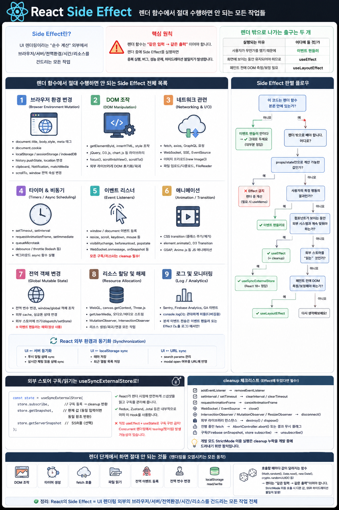

# React Side Effect List




## 렌더 함수에서 실행하면 안 되는 작업들은 무엇인가?

React에서 Side Effect를 이해할 때 가장 먼저 구분해야 할 것이 있습니다.

> **Side Effect가 나쁜 것이 아니라, Side Effect를 Render Phase에서 실행하는 것이 문제입니다.**

실제 애플리케이션은 서버에 요청을 보내고, 브라우저 API를 사용하고, 이벤트를 등록하고, DOM을 제어해야 합니다.

이러한 작업은 모두 필요합니다.

React가 요구하는 것은 단 하나입니다.

> **컴포넌트의 렌더링 계산은 순수하게 유지하고, 외부 세계를 변경하는 작업은 렌더 밖에서 실행하라.**

React 공식 문서에서도 컴포넌트와 Hook은 같은 입력에 대해 같은 결과를 만들어야 하며, Side Effect는 렌더링과 분리되어야 한다고 설명합니다.

---

# 1. 먼저 이해해야 할 핵심

React 컴포넌트는 개념적으로 다음과 같은 계산 함수입니다.

```text
UI = f(props, state, context)
```

예를 들어:

```jsx
function Greeting({ name }) {
  return <h1>Hello {name}</h1>;
}
```

같은 `name`이 들어오면 같은 JSX가 계산됩니다.

```text
name = "Kim"

       ↓

Greeting("Kim")

       ↓

<h1>Hello Kim</h1>
```

이러한 성질 덕분에 React는 렌더링을 필요에 따라

```text
시작
 ↓
중단
 ↓
다시 시작
 ↓
폐기
 ↓
재실행
```

할 수 있습니다.

따라서 Render Phase에서 실행되는 코드는 **여러 번 실행되어도 외부 환경에 영향을 주어서는 안 됩니다.**

---

# 2. Side Effect란 무엇인가?

Side Effect는 단순히 `fetch()` 같은 네트워크 요청만을 의미하지 않습니다.

보다 넓게 보면 다음과 같습니다.

> **Side Effect란 함수의 반환값을 계산하는 것 이외에 프로그램 외부의 상태를 읽거나 변경하여 관찰 가능한 영향을 만드는 작업이다.**

React의 관점에서는 특히 다음 작업들이 중요합니다.

```text
Render
  │
  ├── props 읽기
  ├── state 읽기
  ├── JSX 계산
  └── 값 계산
       │
       └── Pure Rendering


Render 밖
  │
  ├── 서버 요청
  ├── DOM 변경
  ├── 브라우저 API
  ├── 이벤트 등록
  ├── 타이머
  ├── 외부 Store 변경
  └── 외부 시스템 연결
       │
       └── Side Effects
```

React가 금지하는 것은 **Side Effect 자체가 아니라 Render Phase 안에서 Side Effect를 발생시키는 것**입니다.

---

# 3. Side Effect는 어디에 두어야 하는가?

Side Effect라고 해서 모두 `useEffect`에 넣으면 안 됩니다.

React에서는 먼저 다음 질문을 해야 합니다.

> **왜 이 코드가 실행되어야 하는가?**

| 실행 이유                              | 적절한 위치                 |
| ---------------------------------- | ---------------------- |
| props/state로 값을 계산하기 위해            | Render                 |
| 사용자가 클릭·입력·제출했기 때문에                | Event Handler          |
| 컴포넌트가 화면에 존재하는 동안 외부 시스템과 동기화해야 해서 | `useEffect`            |
| Paint 전에 DOM 크기/위치를 측정하거나 보정해야 해서  | `useLayoutEffect`      |
| 외부 Store의 변경 가능한 값을 구독해서 읽기 위해     | `useSyncExternalStore` |

가장 중요한 기준은 다음입니다.

```text
사용자의 특정 행동 때문에 발생한다
        ↓
Event Handler


컴포넌트가 화면에 존재하기 때문에
외부 시스템과 연결되어야 한다
        ↓
useEffect
```

React 공식 문서도 **사용자 이벤트로 인한 작업은 Event Handler에서 처리하고**, Effect는 외부 시스템과의 동기화를 위한 escape hatch로 사용할 것을 권장합니다.

---

# 4. 브라우저 환경 변경

브라우저의 전역 상태를 변경하면 React의 렌더 결과 외부에 영향을 줍니다.

따라서 Render Phase에서 실행하면 안 됩니다.

## 문서 상태 변경

```js
document.title = 'Dashboard';

document.body.style.backgroundColor = 'black';

document.cookie = 'theme=dark';
```

또한 DOM을 통해 `<meta>` 태그 등을 직접 변경하는 작업도 여기에 해당합니다.

잘못된 예:

```jsx
function Page({ title }) {
  document.title = title; // X Render 중 외부 환경 변경

  return <h1>{title}</h1>;
}
```

외부 시스템과 동기화해야 한다면:

```jsx
function Page({ title }) {
  useEffect(() => {
    document.title = title;
  }, [title]);

  return <h1>{title}</h1>;
}
```

---

# 5. Storage 접근

브라우저 Storage 역시 React 외부의 변경 가능한 상태입니다.

```js
localStorage.setItem('theme', 'dark');

sessionStorage.setItem('token', token);
```

이러한 쓰기 작업을 Render Phase에서 수행하면 안 됩니다.

```jsx
function App({ theme }) {
  localStorage.setItem('theme', theme); // X

  return <Main />;
}
```

여기서 중요한 것은 **왜 저장하는가**입니다.

사용자가 저장 버튼을 눌렀기 때문이라면:

```jsx
function handleSave() {
  localStorage.setItem('theme', theme);
}
```

이벤트 핸들러가 적절합니다.

반면 React state와 브라우저 저장소를 지속적으로 동기화하려는 목적이라면:

```jsx
useEffect(() => {
  localStorage.setItem('theme', theme);
}, [theme]);
```

Effect가 적절할 수 있습니다.

### Storage 읽기는?

```js
localStorage.getItem('theme');
```

읽기 자체는 외부 상태를 변경하지 않지만, `localStorage`는 React 밖에서 변경될 수 있는 **mutable external source**입니다.

따라서 렌더링 결과가 매번 외부 저장소를 직접 읽는 구조는 피하는 것이 좋습니다.

초깃값이 필요한 경우 다음과 같은 패턴을 사용할 수 있습니다.

```jsx
const [theme, setTheme] = useState(() => {
  return localStorage.getItem('theme') ?? 'light';
});
```

단, SSR 환경에서는 `window`와 `localStorage`가 존재하지 않으므로 별도의 처리가 필요합니다.

---

# 6. URL과 History 변경

다음 작업들은 브라우저의 현재 URL 또는 History Stack을 변경합니다.

```js
history.pushState(...);

history.replaceState(...);

window.location.href = '/login';

window.location.hash = '#section';
```

따라서 렌더 함수에서 실행해서는 안 됩니다.

```jsx
function Login({ authenticated }) {
  if (authenticated) {
    window.location.href = '/'; // X
  }

  return <LoginForm />;
}
```

사용자 행동에 따른 이동이라면 이벤트 핸들러 또는 사용하는 Router의 navigation API를 사용하는 것이 일반적입니다.

---

# 7. 브라우저 API 호출

다음과 같은 브라우저 API 역시 렌더 중 실행하면 안 됩니다.

```js
navigator.clipboard.writeText(...);

Notification.requestPermission();

window.scrollTo(...);

element.scrollIntoView();
```

예를 들어:

```jsx
function CopyButton() {
  function handleClick() {
    navigator.clipboard.writeText('Hello');
  }

  return <button onClick={handleClick}>Copy</button>;
}
```

사용자의 클릭 때문에 Clipboard에 쓰는 것이므로 `useEffect`가 아니라 **Event Handler**가 올바른 위치입니다.

---

# 8. DOM 직접 조작

React는 JSX를 이용해 DOM 변경을 선언적으로 관리합니다.

따라서 Render Phase에서 실제 DOM을 직접 변경하면 안 됩니다.

## 직접 DOM 변경

```js
element.innerHTML = 'Hello';

element.style.color = 'red';

element.classList.add('active');

element.appendChild(...);

element.remove();
```

예를 들어:

```jsx
function Component() {
  const element = document.getElementById('box');

  element.style.color = 'red'; // X

  return <div id="box">Hello</div>;
}
```

여기서 `document.getElementById()`처럼 단순히 DOM을 조회하는 것 자체와 DOM을 변경하는 작업은 구분할 필요가 있습니다.

하지만 렌더 중 DOM을 조회하거나 측정하는 구조 역시 React 렌더링과 Commit 순서를 깨뜨리기 쉬우므로 DOM 접근은 일반적으로 `ref`와 Effect 계열 Hook을 이용합니다.

---

# 9. DOM 측정과 useLayoutEffect

다음과 같이 실제 DOM의 크기나 위치를 읽어야 하는 경우가 있습니다.

```js
element.getBoundingClientRect();

element.offsetWidth;

element.offsetHeight;
```

특히 **측정 결과를 이용해 Paint 전에 레이아웃을 보정해야 한다면** `useLayoutEffect`를 사용합니다.

```jsx
useLayoutEffect(() => {
  const rect = ref.current.getBoundingClientRect();

  setHeight(rect.height);
}, []);
```

흐름은 개념적으로 다음과 같습니다.

```text
Render
   ↓
DOM Commit
   ↓
useLayoutEffect
   ↓
DOM 측정 / 보정
   ↓
Browser Paint
```

일반적인 외부 시스템 동기화에는 `useEffect`를 사용하고, Paint 이전 DOM 측정이 꼭 필요한 경우에만 `useLayoutEffect`를 사용하는 것이 좋습니다.

---

# 10. 서드파티 UI 라이브러리

React 밖에서 DOM이나 Canvas를 관리하는 라이브러리 역시 대표적인 Side Effect입니다.

예:

```text
Chart.js
D3.js
Swiper
ApexCharts
Three.js
GSAP
지도 SDK
외부 Editor
```

예를 들어 Chart.js 객체를 생성하면:

```js
new Chart(canvas, options);
```

React 밖에 새로운 UI 리소스가 생성됩니다.

따라서 일반적으로:

```jsx
useEffect(() => {
  const chart = new Chart(canvasRef.current, options);

  return () => {
    chart.destroy();
  };
}, []);
```

처럼 setup과 cleanup을 함께 관리합니다.

---

# 11. 네트워크 요청

네트워크 통신은 대표적인 Side Effect입니다.

```js
fetch('/api/users');

axios.get('/api/users');

axios.post('/api/orders');

Apollo Client request;

Relay request;
```

하지만 여기서도 중요한 질문은 다음입니다.

> **왜 요청하는가?**

사용자가 구매 버튼을 눌렀기 때문이라면:

```jsx
async function handleBuy() {
  await fetch('/api/buy', {
    method: 'POST'
  });
}
```

Event Handler가 맞습니다.

반면 어떤 검색 조건이 화면에 나타날 때마다 서버 데이터와 동기화해야 하는 구조라면 Effect를 사용할 수도 있습니다.

```jsx
useEffect(() => {
  fetch(`/api/search?q=${query}`);
}, [query]);
```

단, 현대 React 애플리케이션에서는 framework data fetching, React Query, SWR 등의 데이터 계층을 사용하는 경우도 많기 때문에 **모든 fetch를 무조건 `useEffect`에 넣어야 하는 것은 아닙니다.**

---

# 12. WebSocket / SSE / Streaming

연결을 생성하고 유지하는 작업은 외부 시스템과의 synchronization입니다.

예:

```js
new WebSocket(url);

new EventSource(url);
```

이러한 작업은 대표적인 Effect 사용 사례입니다.

```jsx
useEffect(() => {
  const socket = new WebSocket(url);

  socket.onmessage = handleMessage;

  return () => {
    socket.close();
  };
}, [url]);
```

컴포넌트가 존재하는 동안 연결을 유지하고, 컴포넌트가 사라지면 연결을 해제하는 구조입니다.

```text
Mount
  ↓
WebSocket connect

Component visible
  ↓
connection 유지

Unmount
  ↓
WebSocket close
```

---

# 13. 타이머와 스케줄링

다음 작업도 Render Phase에서 실행해서는 안 됩니다.

```js
setTimeout(...);

setInterval(...);

requestAnimationFrame(...);

queueMicrotask(...);
```

잘못된 예:

```jsx
function Clock() {
  setInterval(() => {
    console.log('tick');
  }, 1000);

  return <div>Clock</div>;
}
```

렌더가 다시 발생할 때마다 새로운 타이머가 추가될 수 있습니다.

Effect를 사용하는 경우:

```jsx
useEffect(() => {
  const timer = setInterval(() => {
    setTime(Date.now());
  }, 1000);

  return () => {
    clearInterval(timer);
  };
}, []);
```

---

# 14. 이벤트 리스너

React JSX 이벤트가 아니라 `window`, `document` 또는 외부 시스템에 직접 등록하는 listener는 Side Effect입니다.

예:

```js
window.addEventListener('resize', handler);

window.addEventListener('scroll', handler);

document.addEventListener('keydown', handler);
```

또는:

```text
visibilitychange
beforeunload
popstate
online
offline
```

이러한 이벤트를 컴포넌트 생명주기와 연결한다면 Effect가 적절합니다.

```jsx
useEffect(() => {
  window.addEventListener('resize', handleResize);

  return () => {
    window.removeEventListener('resize', handleResize);
  };
}, []);
```

---

# 15. 외부 구독

다음과 같은 구독 시스템 역시 Side Effect를 발생시킵니다.

```text
Firebase onSnapshot
WebSocket listener
EventEmitter.on()
custom store.subscribe()
```

구독은 일반적으로 해제 작업이 필요합니다.

```js
subscribe()
   ↓
listener 등록
   ↓
외부 시스템이 listener 보관
   ↓
unsubscribe()
```

---

# 16. 외부 Store는 조금 특별하다

Redux, Zustand 같은 외부 Store 역시 React 외부에 존재하는 mutable state입니다.

## Store 변경

렌더 중 다음과 같은 작업을 해서는 안 됩니다.

```js
store.dispatch(...);

store.setState(...);
```

예:

```jsx
function Component() {
  store.dispatch(loadData()); // X Render 중 dispatch

  return <div />;
}
```

React가 렌더를 다시 실행하면 dispatch 역시 다시 발생할 수 있기 때문입니다.

하지만:

```jsx
function handleClick() {
  store.dispatch(addItem(item));
}
```

이것은 정상적인 사용법입니다.

정확히 말하면 `dispatch()` 자체는 여전히 **Side Effect**입니다.

다만 **Render Phase가 아니라 올바른 Event Handler에서 실행되는 Side Effect**입니다.

---

# 17. 외부 Store 읽기 — useSyncExternalStore

직접 다음과 같은 구조를 만드는 것은 주의해야 합니다.

```js
store.subscribe(...);

store.getState();
```

React 외부 Store가 렌더링 도중 변경될 수 있기 때문입니다.

React는 이를 위해 `useSyncExternalStore`를 제공합니다.

```jsx
const state = useSyncExternalStore(
  store.subscribe,
  store.getSnapshot,
  store.getServerSnapshot
);
```

역할은 다음과 같습니다.

```text
External Store
      │
      ├── subscribe()
      │
      └── getSnapshot()
             │
             ▼
     useSyncExternalStore
             │
             ▼
          React
```

React는 외부 Store의 현재 snapshot과 변경 notification을 React 렌더링 모델에 맞게 연결합니다.

Redux 등의 상태 관리 라이브러리는 이러한 동기화 메커니즘을 라이브러리 내부에서 처리하므로 일반 애플리케이션 코드에서 직접 `useSyncExternalStore`를 작성할 일은 많지 않습니다.

---

# 18. 리소스 생성과 해제

다음 작업도 React 외부 리소스를 생성하므로 Side Effect가 될 수 있습니다.

```text
WebGL Context
WebSocket
MediaStream
Audio Context
Observer
Third-party widget
```

예:

```js
canvas.getContext('webgl');

navigator.mediaDevices.getUserMedia(...);

new IntersectionObserver(...);

new MutationObserver(...);

new ResizeObserver(...);
```

이러한 리소스는 컴포넌트 수명과 연결되는 경우 setup과 cleanup을 함께 설계해야 합니다.

---

# 19. 애니메이션

다음과 같은 imperative animation도 외부 시스템을 변경합니다.

```js
element.animate(...);

element.classList.add('visible');

gsap.to(...);

d3.transition(...);
```

따라서 Render Phase에서 직접 실행하지 않습니다.

컴포넌트가 표시되면서 애니메이션을 시작해야 한다면 Effect가 사용될 수 있고, 사용자 클릭으로 시작한다면 Event Handler가 더 적절합니다.

---

# 20. Logging과 Analytics

렌더는 여러 번 실행될 수 있습니다.

따라서 다음과 같은 분석 이벤트를 렌더 중 전송하면 안 됩니다.

```js
analytics.track(...);

gtag(...);

firebase.analytics(...);

Sentry.captureMessage(...);
```

예를 들어:

```jsx
function Product() {
  analytics.track('product_view'); // X

  return <ProductView />;
}
```

렌더 횟수와 실제 페이지 노출 횟수는 동일하지 않기 때문입니다.

## 사용자 행동을 기록한다면

```jsx
function handleBuy() {
  analytics.track('buy_button_click');
}
```

Event Handler가 적절합니다.

## 컴포넌트 노출 자체를 기록한다면

```jsx
useEffect(() => {
  analytics.track('product_page_view');
}, []);
```

Effect가 더 적절할 수 있습니다.

---

# 21. console.log는?

```js
console.log(value);
```

엄밀한 함수형 프로그래밍 관점에서는 외부 출력이므로 순수 연산은 아닙니다.

하지만 개발 과정에서 렌더 흐름을 확인하기 위해 사용하는 `console.log()`까지 실무적으로 금지하지는 않습니다.

```jsx
function App() {
  console.log('render');

  return <Main />;
}
```

다만 개발 환경의 Strict Mode에서는 렌더 함수가 추가로 호출될 수 있으므로 로그가 예상보다 여러 번 출력될 수 있습니다.

따라서:

```text
console.log 횟수
≠
실제 화면 Commit 횟수
```

라는 점을 기억해야 합니다.

---

# 22. 호출할 때마다 값이 달라지는 함수

Side Effect와 함께 반드시 알아야 하는 개념이 **non-idempotent calculation**입니다.

다음 함수들은 호출할 때마다 결과가 달라질 수 있습니다.

```js
Math.random();

Date.now();

new Date();

crypto.randomUUID();

performance.now();
```

예:

```jsx
function Component() {
  const id = Math.random();

  return <div>{id}</div>;
}
```

같은 props와 state인데도 렌더할 때마다 JSX가 달라집니다.

```text
Render #1
Math.random()
→ 0.1324


Render #2
Math.random()
→ 0.9182
```

즉:

```text
same input
   ↓
different output
```

React가 요구하는 idempotency를 깨뜨립니다.

React의 현재 purity lint 문서 역시 `Math.random()`, `Date.now()`, `new Date()`, `crypto.randomUUID()` 등을 렌더 중 사용하는 대표적인 purity violation으로 설명합니다.

---

# 23. 고유 ID가 필요한 경우

DOM의 `id`, `aria-describedby`, `aria-labelledby` 등을 연결하기 위한 ID라면:

```jsx
const id = useId();
```

를 사용합니다.

```jsx
function Input() {
  const id = useId();

  return (
    <>
      <label htmlFor={id}>Name</label>
      <input id={id} />
    </>
  );
}
```

렌더 중:

```js
Math.random()
crypto.randomUUID()
```

로 DOM ID를 생성하는 것보다 React가 제공하는 `useId()`를 사용하는 것이 적절합니다.

---

# 24. 파생 값은 Effect가 아니다

다음과 같이 props나 state만 이용하여 계산할 수 있는 값은 Side Effect가 아닙니다.

```jsx
const fullName = firstName + ' ' + lastName;
```

따라서 다음과 같이 작성할 필요가 없습니다.

```jsx
useEffect(() => {
  setFullName(firstName + ' ' + lastName);
}, [firstName, lastName]);
```

그냥 렌더 중 계산합니다.

```jsx
const fullName = `${firstName} ${lastName}`;
```

비싼 계산이라면 필요에 따라:

```jsx
const result = useMemo(() => {
  return expensiveCalculation(data);
}, [data]);
```

처럼 최적화할 수 있습니다.

`useMemo`는 Side Effect를 실행하기 위한 도구가 아니라 **렌더 계산 결과를 캐시하기 위한 최적화 도구**입니다.

---

# 25. 중요한 구분: Side Effect와 Effect는 다르다

이 두 용어를 반드시 구분해야 합니다.

```text
Side Effect
   │
   ├── Event Handler에서 실행할 수도 있음
   │
   ├── useEffect에서 실행할 수도 있음
   │
   ├── useLayoutEffect에서 실행할 수도 있음
   │
   └── 다른 프레임워크/라이브러리가 관리할 수도 있음
```

반면:

```text
Effect
=
React의 useEffect 계열로
렌더링 결과와 외부 시스템을 동기화하는 메커니즘
```

즉:

> **모든 Effect는 Side Effect를 다루지만, 모든 Side Effect가 `useEffect`에 들어가는 것은 아닙니다.**

이 구분이 React Side Effect를 이해하는 가장 중요한 포인트 중 하나입니다.

---

# 26. Render Phase에서 피해야 할 대표적인 코드

다음 작업들은 컴포넌트 함수 본문에서 직접 실행하지 않는 것이 원칙입니다.

```text
1. 실제 DOM 변경
2. 네트워크 요청 시작
3. 타이머 생성
4. 전역 이벤트 등록
5. 브라우저 History 변경
6. Clipboard 쓰기
7. 외부 Store dispatch/setState
8. 외부 mutable 객체 변경
9. WebSocket/SSE 연결 생성
10. 외부 라이브러리 인스턴스 생성
11. Analytics 이벤트 전송
12. Media/Observer 등의 외부 리소스 생성
13. Math.random(), Date.now() 등 비결정적 값을 UI 계산에 직접 사용
```

핵심은 이것입니다.

```text
Render
   │
   ▼
"다음 UI는 무엇인가?"
만 계산해야 한다.
```

---

# 27. 최종 판별 Flow

어떤 코드의 위치가 애매하다면 다음 순서로 판단하면 됩니다.

```text
이 코드가 왜 실행되는가?
        │
        ├─ props/state로 결과를 계산하기 위해서인가?
        │
        │       ↓
        │    Render에서 계산
        │
        │    필요하면 useMemo
        │
        ├─ 사용자가 클릭/입력/제출했기 때문인가?
        │
        │       ↓
        │    Event Handler
        │
        ├─ 컴포넌트가 화면에 존재하는 동안
        │  외부 시스템과 동기화해야 하는가?
        │
        │       ↓
        │    useEffect
        │
        ├─ 외부 Store의 mutable 값을 구독해야 하는가?
        │
        │       ↓
        │    useSyncExternalStore
        │
        └─ Paint 전에 DOM을 측정하거나
           레이아웃을 보정해야 하는가?
                ↓
             useLayoutEffect
```

더 단순하게 줄이면:

```text
                  왜 실행되는가?
                        │
           ┌────────────┴────────────┐
           │                         │
      사용자 행동 때문          화면에 존재하기 때문
           │                         │
           ▼                         ▼
    Event Handler               useEffect
```

그리고 이 둘보다 먼저 확인해야 합니다.

```text
외부 시스템이 정말 존재하는가?
          │
      ┌───┴───┐
      │       │
     NO      YES
      │       │
      ▼       ▼
 Render 계산   Handler / Effect
```

---

# 28. Effect Cleanup

Effect에서 외부 리소스를 만들거나 구독했다면 그 리소스의 수명을 반드시 고려해야 합니다.

대표적인 대응 관계는 다음과 같습니다.

| Setup                     | Cleanup                                           |
| ------------------------- | ------------------------------------------------- |
| `addEventListener()`      | `removeEventListener()`                           |
| `setInterval()`           | `clearInterval()`                                 |
| `setTimeout()`            | 필요 시 `clearTimeout()`                             |
| `requestAnimationFrame()` | `cancelAnimationFrame()`                          |
| `new WebSocket()`         | `close()`                                         |
| `new EventSource()`       | `close()`                                         |
| `IntersectionObserver`    | `disconnect()`                                    |
| `MutationObserver`        | `disconnect()`                                    |
| `ResizeObserver`          | `disconnect()`                                    |
| Firebase `onSnapshot()`   | unsubscribe                                       |
| Store `subscribe()`       | unsubscribe                                       |
| Chart / Map / Editor      | `destroy()` / `dispose()`                         |
| 진행 중인 fetch               | 필요 시 `AbortController.abort()` 또는 stale result 무시 |

중요한 것은 단순히:

```text
Effect = cleanup 필수
```

라고 외우는 것이 아닙니다.

정확한 원칙은:

> **Effect가 외부 시스템에 setup한 것이 있다면 cleanup은 그 setup을 되돌릴 수 있어야 한다.**

---

# 29. Strict Mode와 Cleanup

개발 환경에서 Strict Mode가 활성화되어 있으면 React는 Effect에 대해 추가적인 setup → cleanup cycle을 실행하여 cleanup 로직이 setup을 제대로 되돌리는지 검사합니다.

개념적으로:

```text
Development + StrictMode

setup
  ↓
cleanup
  ↓
setup
```

이 과정은 실제 production에서 컴포넌트가 항상 두 번 mount된다는 의미가 아닙니다.

React가 개발 단계에서 다음을 검사하는 것입니다.

```text
"이 Effect를 한번 연결했다가
바로 해제하고 다시 연결해도
문제가 없는가?"
```

따라서 Strict Mode에서 Effect가 이상하게 동작한다면 다음을 확인해야 합니다.

```text
cleanup 누락?
       │
       ├─ 이벤트 중복 등록?
       ├─ WebSocket 중복 연결?
       ├─ 타이머 중복 생성?
       └─ 외부 library instance 미해제?
```

또한 단발성 사용자 행동을 Effect에 잘못 넣은 경우에도 Strict Mode에서 문제가 더 쉽게 드러날 수 있습니다.

즉 Strict Mode는 단순히 cleanup만 검사하는 것이 아니라 **Side Effect 설계 자체의 잘못을 발견하는 데 도움을 줍니다.**

---

# 30. React Side Effect를 한 문장으로 정의하면

> **React에서 Side Effect란 UI를 계산하는 순수한 렌더링 외부에서 브라우저, 서버, DOM, 시간, 전역 상태, 외부 Store 또는 각종 리소스와 상호작용하여 관찰 가능한 변화를 만드는 모든 작업을 의미한다.**

그리고 React가 요구하는 원칙은 다음 한 문장으로 압축할 수 있습니다.

> **Side Effect를 없애는 것이 아니라, Render Phase에서 분리하라.**

---

# 최종 정리

React 컴포넌트의 역할은:

```text
props
state
context
   │
   ▼
Render Phase
   │
   │ Pure Calculation
   ▼
Next UI
```

입니다.

반대로 다음은 React 외부 세계입니다.

```text
Browser API
DOM
Network
Timer
Storage
WebSocket
External Store
Analytics
Third-party Library
Media
Observer
```

이들과 상호작용하는 것은 Side Effect입니다.

따라서 전체 구조는 다음처럼 이해하면 됩니다.

```text
                    React Component
                          │
          ┌───────────────┴───────────────┐
          │                               │
      Render Phase                    Render 밖
          │                               │
     Pure Calculation                 Side Effects
          │                               │
  props/state → JSX             ┌─────────┼─────────┐
                                │         │         │
                           Event Handler Effect  Layout Effect
                                │         │         │
                         사용자 행동   외부 동기화   DOM 측정
```

결국 React Side Effect의 핵심은 `useEffect` 자체가 아닙니다.

**React가 정말 지키려고 하는 것은 Render Phase의 순수성입니다.**

Render Phase가 순수해야 React는 렌더링을 중단하거나 다시 시작하거나 폐기하거나 여러 번 실행해도 외부 세계에 잘못된 변화가 발생하지 않습니다.

그리고 바로 이 원칙 위에서 React의 Concurrent Rendering과 여러 최적화 전략이 안전하게 동작할 수 있습니다.
