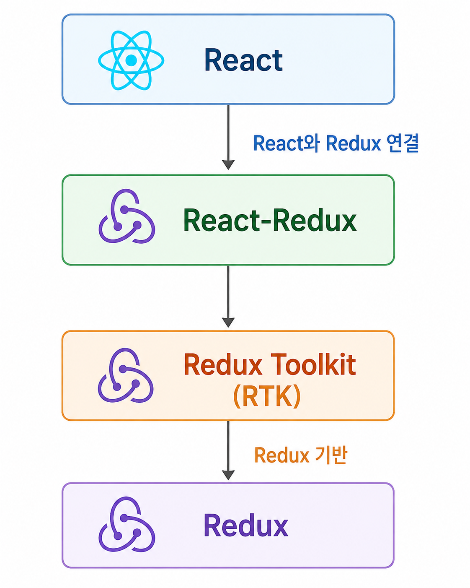
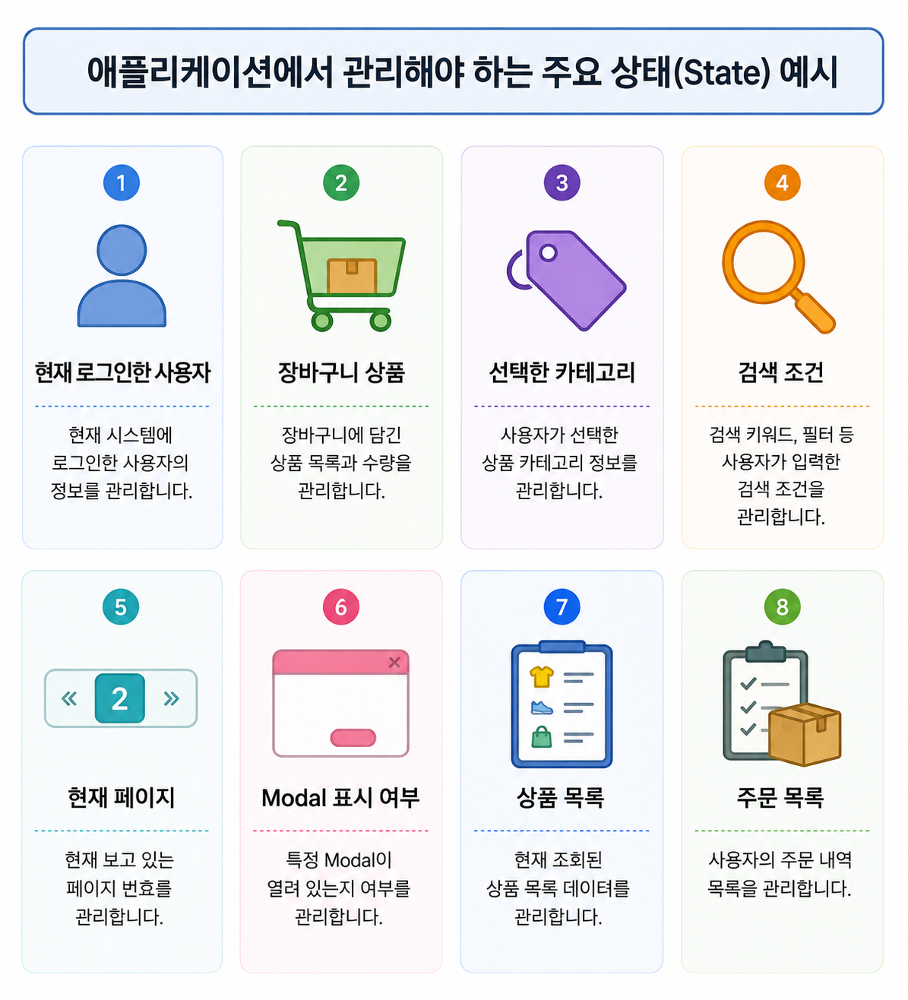

# PART 1. Redux & Redux Toolkit Introduction

React 애플리케이션을 개발하다 보면 매우 자주 등장하는 단어가 있습니다.

```text
Redux

Redux Toolkit

RTK

React-Redux

RTK Query
```

이 이름들은 서로 관련되어 있지만 **같은 것을 의미하지 않습니다.**

Redux를 처음 배우는 단계에서 가장 먼저 해야 할 일은 `createSlice()`나 `configureStore()`의 사용법을 외우는 것이 아닙니다.

먼저 다음 질문에 답할 수 있어야 합니다.

```text
Redux란 무엇인가?

Redux Toolkit은 무엇인가?

RTK는 무엇의 약자인가?

Redux와 Redux Toolkit은 다른 것인가?

React-Redux는 무엇인가?

React에서 Redux Toolkit을 사용하려면 왜
@reduxjs/toolkit과 react-redux를 모두 설치하는가?

RTK Query는 Redux Toolkit과 어떤 관계인가?
```

이 관계부터 정확하게 이해해보겠습니다.

---

# 1. 먼저 전체 관계부터 보자

React 애플리케이션에서 Redux를 사용할 때 전체 기술 관계는 다음과 같습니다.



조금 더 정확하게 표현하면:


이 그림이 이번 과정 전체에서 가장 먼저 이해해야 할 구조입니다.

---

# 2. Redux란?

Redux는 JavaScript 애플리케이션에서 **애플리케이션의 상태(State)를 예측 가능한 방식으로 관리하기 위한 상태 관리 라이브러리**입니다.

핵심 단어는 두 개입니다.

```text
State Management

Predictable
```

즉 Redux의 목적은 단순히 데이터를 저장하는 것이 아닙니다.

Redux는:

> 애플리케이션의 State가 어디에 있고, 어떤 요청에 의해, 어떤 과정을 거쳐 변경되는지를 일정한 규칙으로 관리한다.

는 것이 핵심입니다.

---

# 3. State Management란?

웹 애플리케이션에는 수많은 State가 존재합니다.

예를 들어 쇼핑몰을 생각해봅시다.



이 값들은 사용자의 행동이나 서버 응답에 따라 계속 변경됩니다.

예를 들어:

```text
로그인 버튼 클릭
      ↓
로그인 성공
      ↓
사용자 State 변경
      ↓
Header 변경


상품 담기
      ↓
Cart State 변경
      ↓
장바구니 개수 변경


로그아웃
      ↓
User State 제거
      ↓
화면 변경
```


따라서 애플리케이션 개발에서는 단순히 데이터를 가지는 것뿐 아니라, 반드시 관리해야 하는 데이터, **state** 가 있습니다. 이러한 state를 관리하는 것이 **State Management**입니다.


---

# 4. React에도 State가 있는데 왜 Redux가 필요한가?

React에는 이미 `useState()`가 있습니다.

```javascript
const [count, setCount] = useState(0);
```

따라서 Redux가 없다고 React 애플리케이션을 만들 수 없는 것이 아닙니다.

오히려 대부분의 작은 State는 React 자체 기능으로 관리할 수 있습니다.

예:

```text
Input 값

Modal Open 여부

현재 선택된 Tab

특정 Component만 사용하는 값
```

이런 State는:

```javascript
useState()
```

로 충분합니다.

문제는 여러 Component가 같은 State를 공유하기 시작할 때 발생할 수 있습니다.

---

# 5. Component가 많아진다면?

다음과 같은 쇼핑몰이 있다고 생각해봅시다.
그리고 장바구니 State를 다음 Component들이 사용한다고 해봅시다.


이때 State를 어디에 둘 것인가라는 문제가 생깁니다.

---

# 6. React에서 State를 위로 올릴 수도 있다

React에서는 Shared State를 공통 부모 Component로 올릴 수 있습니다.

이를 흔히:

```text
Lifting State Up
```

이라고 합니다.


그리고 Props를 통해 전달할 수 있습니다.

하지만 Component Tree가 커지면

중간 Component가 State를 사용하지 않더라도 Props를 전달해야 하는 상황이 발생할 수 있습니다.


이를 **Props Drilling**이라고 합니다.

---

# 7. 그렇다고 Props Drilling 때문에 무조건 Redux를 쓰는 것은 아니다

여기서 중요한 점이 있습니다.

```text
Props Drilling 발생
        ↓
Redux 사용
```

이라는 공식은 없습니다.

React에는:

```text
Composition

Context API

useReducer
```

등의 방법도 있습니다.

Redux는 애플리케이션의 **공유 상태와 상태 변경 흐름이 충분히 복잡해졌을 때** 강력한 장점을 제공합니다.

---

# 8. Redux의 핵심 아이디어

Redux는 애플리케이션의 공유 State를 중앙의 **Store**를 중심으로 관리합니다.

하지만 Redux를:

> 전역 변수를 만들어주는 라이브러리

라고 이해하면 안 됩니다.

Redux의 진짜 특징은 **State 변경 절차에 규칙이 있다는 것**입니다.


---

# 9. 일반 전역 변수와 Redux의 차이

JavaScript 전역 객체가 있다고 해봅시다.


상태가 언제, 어디서, 어떤 이유로 변경되었는지 추적하기 어려워질 수 있습니다.

Redux는 State 변경 흐름을 다음처럼 제한합니다.


이러한 **단방향 데이터 흐름(Unidirectional Data Flow)** 이 Redux의 핵심입니다.

---

# 10. Redux의 주요 구성 요소

Redux에는 다음 핵심 개념이 존재합니다.


이 구조는 Redux Toolkit을 사용해도 없어지지 않습니다.

---

# 11. 그런데 Redux를 직접 작성하면 문제가 있었다

Redux 자체의 원리는 단순합니다.

하지만 과거 방식으로 Redux 코드를 직접 작성하면 반복 코드가 많았습니다.


관련 코드가 계속 늘어났습니다.

---

# 12. Redux Toolkit이 등장한다

이 문제를 해결하기 위해 Redux 팀에서는 **Redux Toolkit**을 제공합니다.

정식 이름:

```text
Redux Toolkit
```

약어:

```text
RTK
```

따라서:

```text
RTK = Redux Toolkit
```


입니다.

---

# 13. Redux Toolkit(RTK)이란?

Redux Toolkit은 **Redux 애플리케이션을 현대적인 방식으로 더 간단하고 안전하게 작성할 수 있도록 제공되는 공식 도구 모음**입니다.

가장 중요한 점은:

```text
Redux Toolkit
≠
Redux를 대체한 전혀 다른 상태 관리 라이브러리
```

입니다.

정확한 관계는:

```text
Redux
      ↓
Redux의 핵심 상태 관리 원리

Redux Toolkit
      ↓
그 Redux를 쉽게 사용하기 위한 공식 도구
```

입니다.

즉:

```text
Redux Toolkit
=
Redux
+
편리한 API
+
좋은 기본 설정
+
반복 코드 감소
```

라고 이해할 수 있습니다.

---

# 14. Redux와 Redux Toolkit의 관계

Redux Toolkit을 사용해도 다음 Redux 개념은 그대로 존재합니다.

```text
Redux

State
Store
Action
dispatch
Reducer
```

Redux Toolkit은 이것을 없애는 것이 아니라 쉽게 만들어줍니다.

예:

```text
Vanilla Redux

Action Type 직접 작성
Action Creator 직접 작성
Reducer 직접 작성
Store 직접 설정

             ↓

Redux Toolkit

createSlice()
configureStore()
```

입니다.

---

# 15. Vanilla Redux와 Redux Toolkit 비교

기존 Redux:

```javascript
const INCREMENT =
    "counter/increment";

function increment() {

    return {
        type: INCREMENT
    };
}

function counterReducer(
    state = { value: 0 },
    action
) {

    switch (action.type) {

        case INCREMENT:

            return {
                ...state,
                value: state.value + 1
            };

        default:

            return state;
    }
}
```

Redux Toolkit:

```javascript
const counterSlice =
    createSlice({

        name: "counter",

        initialState: {
            value: 0
        },

        reducers: {

            increment(state) {
                state.value++;
            }

        }

    });
```

코드는 크게 줄어들었습니다.

하지만 내부 Redux 구조는 여전히:

```text
Action
 ↓
dispatch
 ↓
Reducer
 ↓
State
```

입니다.

---

# 16. Redux Toolkit이 제공하는 대표 기능

Redux Toolkit 패키지에는 여러 API가 있습니다.

```text
@reduxjs/toolkit
│
├── configureStore()
│
├── createSlice()
│
├── createReducer()
│
├── createAction()
│
├── createAsyncThunk()
│
└── RTK Query
     │
     ├── createApi()
     └── fetchBaseQuery()
```

이번 과정에서 중요한 것은:

```text
configureStore()

createSlice()

createAsyncThunk()

RTK Query
```

입니다.

---

# 17. 그런데 React에서 Redux Toolkit만 설치하면 되는가?

아닙니다.

React 프로젝트에서 Redux를 사용할 때 일반적으로 다음 두 패키지를 설치합니다.

```bash
npm install @reduxjs/toolkit react-redux
```

여기서 두 라이브러리의 역할을 반드시 구분해야 합니다.

---

# 18. `@reduxjs/toolkit`

`@reduxjs/toolkit`은 Redux 애플리케이션을 구성하기 위한 도구입니다.

예:

```text
configureStore()

createSlice()

createAsyncThunk()

createApi()
```

즉:

```text
@reduxjs/toolkit
      ↓
Redux State Management
```

입니다.

---

# 19. `react-redux`

`react-redux`는 **React와 Redux를 연결하기 위한 공식 바인딩 라이브러리**입니다.

대표적으로:

```text
Provider

useSelector()

useDispatch()
```

를 제공합니다.

즉:

```text
React
  ↕
React-Redux
  ↕
Redux Store
```

입니다.

---

# 20. 왜 Redux Toolkit에 useSelector가 없는가?

이제 이유를 이해할 수 있습니다.

```text
createSlice
configureStore
        ↓
Redux 자체의 상태 관리 문제
        ↓
@reduxjs/toolkit
```

반면:

```text
React Component가
Redux State를 어떻게 읽을까?

React Component가
Action을 어떻게 dispatch할까?
        ↓
React와 Redux 연결 문제
        ↓
react-redux
```

이기 때문입니다.

따라서:

```javascript
import {
    createSlice,
    configureStore
} from "@reduxjs/toolkit";
```

이고:

```javascript
import {
    Provider,
    useSelector,
    useDispatch
} from "react-redux";
```

입니다.

---

# 21. Redux / Redux Toolkit / React-Redux 관계

이제 세 가지를 정확히 구분할 수 있습니다.

```text
Redux
│
│ 상태 관리의 핵심 시스템
│
├── Store
├── Action
├── dispatch
└── Reducer


Redux Toolkit (RTK)
│
│ Redux를 쉽게 작성하기 위한 공식 도구
│
├── configureStore
├── createSlice
├── createAsyncThunk
└── RTK Query


React-Redux
│
│ React와 Redux를 연결
│
├── Provider
├── useSelector
└── useDispatch
```

이를 하나의 구조로 합치면:

```text
┌──────────────────────────────┐
│            React             │
│                              │
│       React Components       │
└──────────────┬───────────────┘
               │
               ↓
┌──────────────────────────────┐
│         React-Redux          │
│                              │
│ Provider                     │
│ useSelector                  │
│ useDispatch                  │
└──────────────┬───────────────┘
               │
               ↓
┌──────────────────────────────┐
│     Redux Toolkit (RTK)      │
│                              │
│ configureStore               │
│ createSlice                  │
│ createAsyncThunk             │
│ RTK Query                    │
└──────────────┬───────────────┘
               │
               ↓
┌──────────────────────────────┐
│            Redux             │
│                              │
│ Store                        │
│ State                        │
│ Action                       │
│ dispatch                     │
│ Reducer                      │
└──────────────────────────────┘
```

---

# 22. RTK Query는 또 무엇인가?

RTK Query라는 이름도 처음에는 혼동하기 쉽습니다.

```text
RTK Query
```

에서 RTK는:

```text
Redux Toolkit
```

입니다.

즉 RTK Query는 **Redux Toolkit에 포함된 Server State Data Fetching & Caching 도구**입니다.

전체 관계는:

```text
Redux Toolkit
│
├── createSlice
│
├── configureStore
│
├── createAsyncThunk
│
└── RTK Query
     │
     ├── createApi
     ├── Query
     ├── Mutation
     ├── Cache
     └── Invalidation
```

입니다.

RTK Query는 나중에 자세히 학습합니다.

---

# 23. Redux Toolkit은 React 전용인가?

아닙니다.

Redux와 Redux Toolkit 자체는 React에 종속된 기술이 아닙니다.

Redux Toolkit은 JavaScript 상태 관리 도구입니다.

```text
Redux Toolkit

       ↓

JavaScript Application
```

React에서 사용하려면:

```text
React
   +
React-Redux
   +
Redux Toolkit
```

구조가 되는 것입니다.

즉:

```text
Redux Toolkit
≠
React 기능
```

입니다.

React와의 연결을 담당하는 것이:

```text
React-Redux
```

입니다.

---

# 24. 전체 학습 과정에서 각 기술의 역할

앞으로 다음 순서로 학습하게 됩니다.

```text
1. Redux

State는 어떻게 관리되는가?

        ↓

2. Redux Toolkit

Redux 코드를 어떻게
간단하게 작성하는가?

        ↓

3. React-Redux

React Component는
Redux를 어떻게 사용하는가?

        ↓

4. Async Redux

서버 통신과 같은
비동기 작업은 어떻게 처리하는가?

        ↓

5. RTK Query

Server State의
Fetching과 Cache는
어떻게 관리하는가?
```

---

# 25. 앞으로 배우게 될 전체 Architecture

최종적으로 만들어질 애플리케이션은 다음 구조가 됩니다.

```text
┌─────────────────────────────────────┐
│              React                  │
│                                     │
│ Component                           │
│                                     │
│ useSelector                         │
│ useDispatch                         │
│ RTK Query Hooks                     │
└────────────────┬────────────────────┘
                 │
                 ↓
┌─────────────────────────────────────┐
│            React-Redux              │
└────────────────┬────────────────────┘
                 │
                 ↓
┌─────────────────────────────────────┐
│          Redux Toolkit              │
│                                     │
│ createSlice                         │
│ configureStore                      │
│ createAsyncThunk                    │
│ RTK Query                           │
└────────────────┬────────────────────┘
                 │
                 ↓
┌─────────────────────────────────────┐
│            Redux Store              │
│                                     │
│ Client State                        │
│ Server State Cache                  │
└────────────────┬────────────────────┘
                 │
                 │ HTTP
                 ↓
┌─────────────────────────────────────┐
│          Spring Boot API            │
└─────────────────────────────────────┘
```

이제 각 API를 배우기 전에 **우리가 무엇을 배우고 있으며 각각의 기술이 왜 존재하는지** 알 수 있습니다.

---

# 26. 이번 과정의 핵심 용어

수업을 시작하기 전에 다음 용어를 반드시 구분합니다.

| 용어                 | 의미                                                  |
| ------------------ | --------------------------------------------------- |
| Redux              | JavaScript 애플리케이션의 예측 가능한 State 관리 라이브러리            |
| State              | 애플리케이션의 현재 상태를 나타내는 데이터                             |
| Store              | Redux State와 상태 변경 흐름을 관리하는 객체                      |
| Redux Toolkit      | Redux를 현대적인 방식으로 작성하기 위한 공식 도구 모음                   |
| RTK                | Redux Toolkit의 약어                                   |
| React-Redux        | React와 Redux를 연결하는 공식 라이브러리                         |
| RTK Query          | Redux Toolkit에 포함된 Server State fetching/caching 도구 |
| `createSlice()`    | Redux Slice를 구성하는 Redux Toolkit API                 |
| `configureStore()` | Redux Store를 구성하는 Redux Toolkit API                 |
| `useSelector()`    | React에서 Redux State를 읽는 React-Redux Hook            |
| `useDispatch()`    | React에서 Action을 dispatch하기 위한 React-Redux Hook      |

---

# 27. 가장 중요한 구분

다음 관계는 수업 전체에서 계속 등장합니다.

```text
Redux
=
상태 관리의 핵심 원리와 시스템


Redux Toolkit
=
Redux를 편리하게 작성하기 위한 공식 도구


React-Redux
=
React와 Redux를 연결하는 도구


RTK Query
=
Redux Toolkit의 Server State 관리 도구
```

---

# 28. 한 문장으로 각각 설명할 수 있어야 한다

## Redux

> 애플리케이션의 State와 State 변경 흐름을 예측 가능한 방식으로 관리하기 위한 JavaScript 상태 관리 라이브러리.

## Redux Toolkit

> Redux 애플리케이션을 더 간단하고 안전하게 작성할 수 있도록 Redux 팀이 제공하는 공식 도구 모음.

## React-Redux

> React Component가 Redux Store와 상호작용할 수 있도록 연결해주는 공식 React 바인딩 라이브러리.

## RTK Query

> Redux Toolkit에 포함된 Server State Data Fetching 및 Caching 도구.

---


# PART 1 핵심 정리

Redux Toolkit을 배우기 전에 다음 그림이 머릿속에 있어야 합니다.

```text
                        React
                          │
                          ↓
                    React-Redux
                          │
                          ↓
              Redux Toolkit (RTK)
                          │
                          ↓
                        Redux
```

그리고 Redux Toolkit 내부에는:

```text
Redux Toolkit
│
├── configureStore
├── createSlice
├── createAsyncThunk
└── RTK Query
```

가 있습니다.

따라서 우리가 앞으로 배우는 것은 단순히 몇 개의 React Hook이나 API 사용법이 아닙니다.

```text
Redux의 State Management Architecture
                 +
Redux Toolkit의 현대적인 Redux 작성 방법
                 +
React-Redux를 통한 React Integration
                 +
RTK Query를 통한 Server State Management
```

전체를 배우는 것입니다.

이렇게 **PART 1 자체를 “Redux Fundamentals”가 아니라 “Redux & Redux Toolkit Introduction”으로 완전히 바꾸는 게 맞습니다.**

그리고 기존에 만든 자료는 버릴 필요는 없고 다음처럼 한 칸씩 뒤로 밀면 됩니다.

```text
새 PART 1
Redux & Redux Toolkit Introduction

기존 PART 1
→ PART 2 Redux Fundamentals

기존 PART 2
→ PART 3 Redux Toolkit

기존 PART 3
→ PART 4 Asynchronous Redux

기존 PART 4
→ PART 5 RTK Query
```

이렇게 해야 처음 접하는 훈련생도 **“내가 지금 뭘 배우는지”를 알고 들어갑니다.** 기존 자료는 Redux 자체의 State·Store·Action·dispatch·Reducer 설명은 이미 상당히 자세하게 들어가 있으므로,  문제는 세부 설명의 양보다 **도입부와 전체 개념 지도가 빠졌던 것**에 가깝습니다.

그리고 다음 수정에서는 이 기준으로 **기존 PART 2~4도 지금보다 훨씬 깊게 다시 작성하는 게 좋겠습니다.** 특히 `createSlice()` 하나를 설명하더라도 단순 API 문법이 아니라 **“Vanilla Redux의 어떤 코드를 createSlice가 대신 생성하는가”를 내부 구조까지 대응시켜서** 설명해야 교육자료 수준이 제대로 올라갑니다.
