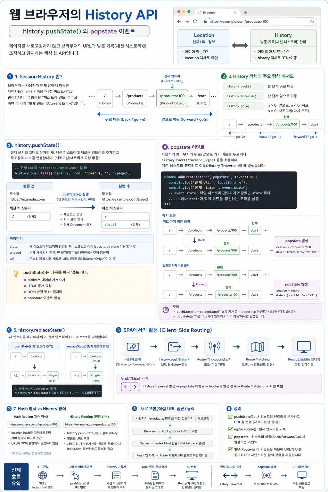

# `history.pushState()`와 `popstate` - SPA 라우팅의 브라우저 기반

`history.pushState()`와 `popstate`는 브라우저의 **Session History(세션 히스토리)** 를 JavaScript에서 다루기 위한 핵심 기능입니다.

특히 두 기능은 React Router 같은 SPA Router가 다음과 같은 동작을 구현할 수 있게 해주는 브라우저 기반 기술입니다.

```text
URL은 변경
     +
History 기록도 유지
     +
현재 Document는 유지
     +
브라우저의 뒤로/앞으로 가기도 지원
```

즉, SPA에서도 일반 웹사이트처럼 **URL, 뒤로가기, 앞으로가기, 북마크, 링크 공유**를 사용할 수 있도록 만드는 기반입니다.




---

# 1. 먼저 Session History를 이해하자

브라우저는 현재 탭에서 발생한 탐색 기록을 **Session History**로 관리합니다.

예를 들어 사용자가 다음 순서로 이동했다고 생각해봅시다.

```text
/
    ↓
/products
    ↓
/products/100
    ↓
/cart
```

브라우저는 개념적으로 다음과 같은 탐색 기록을 가지고 있습니다.

```text
Session History

┌───────────────────┐
│ /                 │
├───────────────────┤
│ /products         │
├───────────────────┤
│ /products/100     │
├───────────────────┤
│ /cart             │ ← Current Entry
└───────────────────┘
```

각각의 기록을 **History Entry(히스토리 엔트리)** 라고 합니다.

따라서 Session History를 단순히 URL 문자열의 배열로 생각하기보다는:

> **브라우저가 현재 탭의 탐색 과정에서 만들어진 History Entry들을 관리하는 구조**

라고 이해하는 것이 좋습니다.

---

# 2. Current Entry

Session History에는 현재 사용자가 위치하고 있는 **Current Entry**가 존재합니다.

예를 들어:

```text
/             /products        /products/100        /cart
                                   ▲
                                   │
                             Current Entry
```

현재 URL도 이 Entry와 연결됩니다.

```javascript
console.log(location.pathname);

// "/products/100"
```

사용자가 뒤로가기를 누르면:

```text
Before

/             /products        /products/100        /cart
                                   ▲
                                Current


                    Back 수행


After

/             /products        /products/100        /cart
                   ▲
                Current
```

Current Entry가 이전 History Entry로 이동합니다.

그리고 현재 `location`도 그에 맞게 변경됩니다.

```text
History Entry 이동
        ↓
Current Entry 변경
        ↓
Location 변경
        ↓
주소창 URL 변경
```

---

# 3. History Entry 사이를 이동하는 방법

JavaScript에서는 `window.history`를 통해 Session History를 탐색할 수 있습니다.

## 뒤로 이동

```javascript
history.back();
```

개념적으로:

```javascript
history.go(-1);
```

과 비슷합니다.

---

## 앞으로 이동

```javascript
history.forward();
```

개념적으로:

```javascript
history.go(1);
```

과 비슷합니다.

---

## 상대적인 위치로 이동

```javascript
history.go(-2);
```

두 단계 뒤로 이동합니다.

```javascript
history.go(2);
```

두 단계 앞으로 이동합니다.

따라서:

```text
             -2             -1             현재

             /          /products      /products/100
             ▲              ▲               ▲
             │              │               │
          go(-2)         go(-1)           Current
```

처럼 이해할 수 있습니다.

이러한 기존 History Entry 사이의 이동을 **History Traversal**이라고 생각하면 이후 `popstate`를 이해하기 쉬워집니다.

---

# 4. 그런데 SPA에는 특별한 문제가 있다

전통적인 웹사이트에서:

```html
<a href="/products">Products</a>
```

를 클릭하면 브라우저는 일반적으로 새로운 URL로 탐색합니다.

```text
사용자 Click

      ↓

/products로 Navigation

      ↓

HTTP Request

GET /products

      ↓

Server

      ↓

HTML Response

      ↓

새 Document 로드
```

즉 페이지 이동은 단순히 URL 문자열을 바꾸는 작업이 아닙니다.

일반적인 문서 탐색에서는 새로운 Document가 로드될 수 있습니다.

---

# 5. SPA는 Document를 유지하면서 화면을 바꾸고 싶다

SPA(Single Page Application)는 애플리케이션을 처음 로드한 이후에는 가능한 한 현재 Document와 JavaScript 실행 환경을 유지하면서 UI를 변경합니다.

예를 들어 React 애플리케이션이라면:

```text
하나의 Document
──────────────────────────────

URL: /
UI : <Home />

          ↓

URL: /products
UI : <Products />

          ↓

URL: /products/100
UI : <ProductDetail />

          ↓

URL: /cart
UI : <Cart />

──────────────────────────────

Document는 계속 유지
React Application도 계속 실행
```

이런 방식으로 동작하고 싶습니다.

하지만 문제가 있습니다.

React state만 변경해서 화면을 바꾸면 **브라우저의 URL과 History가 화면 상태를 알 수 없습니다.**

---

# 6. JavaScript로 UI만 변경했을 때의 문제

예를 들어 다음처럼 화면만 변경한다고 생각해봅시다.

```javascript
showPage("products");
```

UI는:

```text
<Home />
    ↓
<Products />
```

로 변경될 수 있습니다.

하지만 주소창이 계속:

```text
https://example.com/
```

이라면 브라우저 입장에서는 새로운 탐색 상태가 만들어진 것이 아닙니다.

그러면 다음과 같은 문제가 발생합니다.

```text
UI 변경

<Home />
   ↓
<Products />
   ↓
<ProductDetail />

하지만 URL

https://example.com/
```

이 상태에서는 화면과 URL이 동기화되지 않습니다.

따라서:

* 특정 화면의 URL을 복사해서 공유하기 어렵고
* 특정 화면을 북마크하기 어렵고
* 브라우저의 뒤로/앞으로 가기가 SPA 내부 화면 이동과 맞지 않고
* 특정 화면으로 직접 접근하는 Deep Linking을 구현하기 어렵습니다.

SPA에서도 **UI 상태와 URL을 연결할 방법**이 필요합니다.

여기서 등장하는 핵심 기능이 `history.pushState()`입니다.

---

# 7. `history.pushState()`

`history.pushState()`는 **현재 Document를 새로 로드하지 않으면서 Session History에 새로운 History Entry를 추가하고 주소창의 URL을 변경합니다.**

문법은 다음과 같습니다.

```javascript
history.pushState(state, unused, url);
```

예를 들어 현재 URL이:

```text
https://example.com/
```

이라고 하겠습니다.

다음을 실행합니다.

```javascript
history.pushState(
    { page: 2 },
    "",
    "/page2"
);
```

그러면 주소창은:

```text
https://example.com/page2
```

로 변경됩니다.

Session History에도 새로운 Entry가 추가됩니다.

```text
Before

┌─────────────────┐
│ /               │ ← Current
└─────────────────┘


          pushState()


After

┌─────────────────┐
│ /               │
├─────────────────┤
│ /page2          │ ← Current
└─────────────────┘
```

하지만 중요한 점이 있습니다.

**새로운 Document를 가져오기 위한 일반적인 페이지 탐색은 발생하지 않습니다.**

---

# 8. `location.href`와 `pushState()`의 결정적인 차이

이 차이는 SPA를 이해하는 데 매우 중요합니다.

다음 코드를 실행하면:

```javascript
location.href = "/products";
```

일반적으로 브라우저 navigation이 발생합니다.

```text
location.href = "/products"

            ↓

     Browser Navigation

            ↓

      GET /products

            ↓

          Server

            ↓

       HTML Response

            ↓

      새 Document 로드
```

반면:

```javascript
history.pushState(
    null,
    "",
    "/products"
);
```

를 실행하면:

```text
history.pushState()

        ↓

History Entry 추가

        ↓

URL 변경

/ → /products

        ↓

현재 Document 유지

        ↓

새 Document 요청 없음
```

입니다.

이 차이가 **Client-Side Routing을 가능하게 하는 핵심**입니다.

---

# 9. `pushState()`의 첫 번째 파라미터 — `state`

문법을 다시 보면:

```javascript
history.pushState(state, unused, url);
```

첫 번째 파라미터는 새로운 History Entry와 연결할 **state 데이터**입니다.

예를 들어:

```javascript
history.pushState(
    {
        productId: 100,
        from: "list"
    },
    "",
    "/products/100"
);
```

개념적으로 다음과 같은 History Entry가 만들어집니다.

```text
History Entry
│
├── URL
│    └── /products/100
│
└── state
     │
     ├── productId: 100
     └── from: "list"
```

현재 Entry에 연결된 state는:

```javascript
history.state
```

를 통해 확인할 수 있습니다.

```javascript
console.log(history.state);
```

결과:

```javascript
{
    productId: 100,
    from: "list"
}
```

`state`는 브라우저가 복제하여 저장할 수 있도록 **structured clone 가능한 값**이어야 합니다.

---

# 10. 두 번째 파라미터 — `unused`

두 번째 파라미터는 현재 실질적으로 사용되지 않습니다.

```javascript
history.pushState(
    state,
    "",
    url
);
```

따라서 일반적으로 빈 문자열을 전달합니다.

```javascript
history.pushState(
    { page: 2 },
    "",
    "/page2"
);
```

---

# 11. 세 번째 파라미터 — `url`

세 번째 파라미터는 새로운 History Entry에 사용할 URL입니다.

```javascript
history.pushState(
    null,
    "",
    "/products/100"
);
```

그러면 현재 주소가:

```text
https://example.com/
```

이었다면:

```text
https://example.com/products/100
```

처럼 변경될 수 있습니다.

다만 새로운 URL은 현재 Document와 **Same-Origin**이어야 합니다.

예를 들어 현재 Origin이:

```text
https://example.com
```

인데:

```javascript
history.pushState(
    null,
    "",
    "https://other-domain.com/products"
);
```

처럼 다른 Origin으로 변경하려고 하면 허용되지 않습니다.

---

# 12. `pushState()`가 하지 않는 일

여기서 매우 중요한 오해를 제거해야 합니다.

`pushState()`가 하는 일은 기본적으로:

```text
pushState()

✓ 새로운 History Entry 추가
✓ URL 변경
✓ state 연결
✓ 현재 Document 유지
```

입니다.

하지만 다음 작업을 자동으로 수행하지는 않습니다.

```text
✗ 서버 데이터 요청
✗ HTML 요청
✗ DOM 변경
✗ React 컴포넌트 선택
✗ React 렌더링
```

즉:

```javascript
history.pushState(
    null,
    "",
    "/products"
);
```

를 실행했다고 해서 브라우저가 자동으로:

```jsx
<Products />
```

를 렌더링하는 것이 아닙니다.

브라우저는:

```text
/products → <Products />
```

라는 관계를 모르기 때문입니다.

이 관계를 관리하는 것이 **Router**입니다.

---

# 13. `history.replaceState()`

`pushState()`와 함께 반드시 알아야 하는 메서드가 있습니다.

```javascript
history.replaceState(state, unused, url);
```

`pushState()`는 새로운 History Entry를 **추가**합니다.

```text
Before

/ → /products
        ▲
      Current


pushState("/cart")


After

/ → /products → /cart
                   ▲
                 Current
```

반면 `replaceState()`는 현재 History Entry를 **교체**합니다.

```text
Before

/ → /products
        ▲
      Current


replaceState("/cart")


After

/ → /cart
      ▲
    Current
```

즉:

```text
pushState()
    ↓
새 Entry 추가


replaceState()
    ↓
현재 Entry 교체
```

입니다.

React Router의:

```javascript
navigate("/dashboard", {
    replace: true
});
```

를 이해할 때 이 개념이 그대로 연결됩니다.

---

# 14. 이제 또 다른 문제가 생긴다

현재 SPA에서 다음과 같이 이동했다고 생각해봅시다.

```text
/
 ↓
/products
 ↓
/products/100
```

각 이동마다 `pushState()`를 사용했다면:

```text
Session History

/ → /products → /products/100
                         ▲
                       Current
```

가 됩니다.

이제 사용자가 브라우저의 **뒤로가기 버튼**을 누릅니다.

브라우저는 이전 History Entry로 이동합니다.

```text
Before

/ → /products → /products/100
                         ▲


              Back


After

/ → /products → /products/100
        ▲
```

따라서 주소창도:

```text
/products/100
       ↓
/products
```

로 변경됩니다.

그런데 SPA도 이 변화를 알아야 합니다.

---

# 15. URL만 바뀌고 UI가 그대로라면?

만약 애플리케이션이 History 이동을 감지하지 못한다면:

```text
주소창

/products


화면

<ProductDetail />
```

처럼 URL과 화면이 서로 다른 상태가 될 수 있습니다.

SPA Router는 다음 사실을 알아야 합니다.

> **사용자가 브라우저 History의 다른 Entry로 이동했다.**

이를 감지하는 데 중요한 이벤트가 바로 **`popstate`**입니다.

---

# 16. `popstate` 이벤트

`popstate`는 Session History의 기존 Entry 사이를 이동하는 **History Traversal**이 발생했을 때 애플리케이션이 그 변화를 감지하는 데 사용되는 `window` 이벤트입니다.

대표적인 경우가:

```text
브라우저 Back 버튼

브라우저 Forward 버튼

history.back()

history.forward()

history.go(...)
```

입니다.

이벤트 리스너를 등록할 수 있습니다.

```javascript
window.addEventListener(
    "popstate",
    (event) => {

        console.log(
            "현재 URL:",
            location.href
        );

        console.log(
            "현재 state:",
            event.state
        );
    }
);
```

---

# 17. `event.state`

앞에서 다음과 같은 Entry를 만들었다고 생각해봅시다.

```javascript
history.pushState(
    {
        page: 2
    },
    "",
    "/page2"
);
```

개념적으로:

```text
History Entry

URL
/page2

state
{ page: 2 }
```

입니다.

이후 History Traversal을 통해 해당 Entry로 이동하면 `popstate` 이벤트에서:

```javascript
event.state
```

를 통해 해당 Entry와 연결된 state를 확인할 수 있습니다.

```text
History Traversal

        ↓

   /page2 Entry

        ↓

    popstate

        ↓

event.state

        ↓

{ page: 2 }
```

---

# 18. 가장 중요한 주의점 — `pushState()`는 `popstate`를 발생시키지 않는다

이 부분은 반드시 기억해야 합니다.

다음을 실행했다고 합시다.

```javascript
history.pushState(
    null,
    "",
    "/products"
);
```

새로운 History Entry가 추가되고 URL도 변경됩니다.

하지만 **이 호출 자체로 `popstate` 이벤트가 발생하지는 않습니다.**

```text
pushState()

    ↓

새 History Entry 추가

    ↓

URL 변경

    ↓

popstate 발생 X
```

마찬가지로:

```javascript
history.replaceState(...)
```

호출 자체도 `popstate`를 발생시키지 않습니다.

반면:

```text
Back

Forward

history.go()
```

등을 통해 기존 History Entry 사이의 **History Traversal**이 발생하면 `popstate`가 중요해집니다.

```text
History Traversal

        ↓

Current Entry 변경

        ↓

Location 변경

        ↓

popstate

        ↓

Application이 변화 감지
```

---

# 19. `pushState`와 `popstate`는 짝처럼 보이지만 push/pop 자료구조가 아니다

이름 때문에 다음과 같이 생각하기 쉽습니다.

```text
pushState()
    ↕
popstate
```

즉 Stack의:

```text
push()
pop()
```

처럼 생각할 수 있습니다.

하지만 둘은 그런 관계가 아닙니다.

`pushState()`는 **History 객체의 메서드**입니다.

```javascript
history.pushState(...)
```

반면 `popstate`는 **Window에서 발생하는 이벤트의 이름**입니다.

```javascript
window.addEventListener(
    "popstate",
    handler
);
```

따라서:

```text
pushState()
────────────────────
History API 메서드

새 History Entry 추가
URL 변경


popstate
────────────────────
Window 이벤트

History Traversal에 따른
Entry 변화를 감지
```

라고 구분해야 합니다.

---

# 20. SPA에서는 어떻게 사용되는가?

이제 두 기능을 연결하면 Client-Side Routing의 기본 구조가 보입니다.

사용자가 SPA 내부 링크를 클릭했다고 생각해봅시다.

```text
사용자 Click

      ↓

Router

      ↓

history.pushState()

      ↓

┌───────────────┬────────────────┐
│               │                │
▼               ▼                ▼

URL 변경    History Entry 추가   Document 유지

      └──────────┬───────────────┘
                 ↓

          Route Matching

                 ↓

             UI 변경
```

이후 사용자가 브라우저의 뒤로가기를 누릅니다.

```text
사용자 Back

      ↓

History Traversal

      ↓

Current Entry 변경

      ↓

Location 변경

      ↓

popstate

      ↓

Router가 변화 감지

      ↓

Route Matching

      ↓

UI 변경
```

이 두 흐름이 SPA Routing을 이해하는 핵심입니다.

---

# 21. Fetch와 `pushState()`는 별개의 기능이다

SPA에서는 흔히 데이터도 비동기로 가져오기 때문에 둘을 혼동하기 쉽습니다.

하지만:

```javascript
history.pushState(...)
```

와:

```javascript
fetch(...)
```

는 서로 다른 역할을 담당합니다.

```text
┌─────────────────────┐
│    History API      │
│                     │
│ URL / History 관리 │
└──────────┬──────────┘
           │
           │
┌──────────▼──────────┐
│       Router        │
│                     │
│ URL → UI 결정      │
└──────────┬──────────┘
           │
           │
┌──────────▼──────────┐
│       React         │
│                     │
│ UI Rendering        │
└─────────────────────┘


필요하다면 별도로


┌─────────────────────┐
│        Fetch        │
│                     │
│ 서버 데이터 요청   │
└─────────────────────┘
```

따라서:

> **`pushState()`가 데이터를 가져오는 것이 아니라 SPA가 History API, Router, Fetch, React Rendering 등을 필요에 따라 조합하는 것입니다.**

---

# 22. Deep Linking과 URL 공유

History API를 사용하면 SPA에서도 화면마다 의미 있는 URL을 가질 수 있습니다.

예를 들어:

```text
Home

https://example.com/
```

```text
Products

https://example.com/products
```

```text
Product Detail

https://example.com/products/100
```

```text
Cart

https://example.com/cart
```

따라서 사용자는:

```text
/products/100
```

이라는 URL을 복사해서 다른 사람에게 전달할 수 있습니다.

이를 통해:

* URL 공유
* 북마크
* Deep Linking
* 브라우저 History navigation

같은 웹의 기본적인 navigation 경험을 SPA에서도 유지할 수 있습니다.

---

# 23. 과거의 Hash Routing

History API가 널리 사용되기 전에는 URL의 fragment를 이용한 routing 방식이 많이 사용되었습니다.

예:

```text
https://example.com/#/products/100
                    └──────┬──────┘
                         hash
```

JavaScript에서는:

```javascript
location.hash
```

를 통해 확인할 수 있습니다.

Hash Routing은 fragment를 이용하기 때문에 서버에 별도의 `/products/100` 문서가 존재하지 않아도 클라이언트에서 routing을 처리하기 편했습니다.

반면 History API를 사용하면:

```text
https://example.com/products/100
```

처럼 일반적인 path 형태의 URL로 Client-Side Routing을 구성할 수 있습니다.

다만 이 방식은 **직접 URL 접근이나 새로고침 시 서버 설정이 필요할 수 있습니다.**

---

# 24. 새로고침하면 어떻게 되는가?

이것도 React Router를 이해할 때 매우 중요합니다.

SPA 내부에서:

```text
/products/100
```

으로 이동한 상태에서는 현재 Document가 그대로 유지되고 Router가 화면을 관리할 수 있습니다.

하지만 여기서 사용자가 새로고침하면:

```text
/products/100

      ↓

Browser Reload

      ↓

GET /products/100

      ↓

Server
```

가 됩니다.

즉 이제는 `pushState()`에 의한 Client-Side Navigation이 아니라 실제 서버 요청입니다.

서버가 `/products/100` 요청을 처리하지 못하면:

```text
404 Not Found
```

가 발생할 수 있습니다.

그래서 `BrowserRouter` 기반 SPA를 배포할 때는 보통 서버가 적절한 요청에 대해 SPA의 진입 문서인 `index.html`을 반환하도록 설정합니다.

```text
GET /products/100

        ↓

Server

        ↓

index.html

        ↓

React Application 시작

        ↓

React Router

        ↓

현재 URL 확인

/products/100

        ↓

<ProductDetail />
```

---

# 25. React Router와 연결하기

이제 React Router가 브라우저 위에서 어떤 역할을 하는지 이해할 수 있습니다.

```text
┌─────────────────────────────────────┐
│              Browser                │
│                                     │
│  Location          History          │
│  현재 URL          Session History │
│                       │             │
│                pushState()          │
│                replaceState()       │
│                back()/forward()     │
│                popstate             │
└──────────────────┬──────────────────┘
                   │
                   ▼
          ┌──────────────────┐
          │   React Router   │
          │                  │
          │ URL과 React UI를 │
          │ 연결             │
          └────────┬─────────┘
                   │
          ┌────────┴────────┐
          ▼                 ▼

       Navigation       Route Matching

      Link                 Routes
      navigate()           Route
          │                  │
          └────────┬─────────┘
                   ▼
            React Component
                   │
                   ▼
               Re-render
                   │
                   ▼
                  DOM
```

---

# 핵심 정리

`history.pushState()`와 `popstate`의 역할을 한 문장씩 정리하면 다음과 같습니다.

> **`history.pushState()`는 현재 Document를 새로 로드하지 않으면서 새로운 History Entry를 추가하고 URL을 변경하는 History API 메서드입니다.**

그리고:

> **`popstate`는 사용자가 뒤로/앞으로 이동하는 등 History Traversal이 발생하여 현재 History Entry가 변경되었을 때 애플리케이션이 그 변화를 감지하는 데 사용되는 이벤트입니다.**

둘을 SPA 관점에서 연결하면:

```text
              앞으로 이동할 때

사용자 Navigation
        ↓
    pushState()
        ↓
 URL + History 변경
        ↓
   Router가 UI 변경


────────────────────────────


              과거 기록으로 이동할 때

사용자 Back / Forward
        ↓
 History Traversal
        ↓
     popstate
        ↓
 Router가 변화 감지
        ↓
     UI 변경
```

결국 **History API는 SPA가 웹 브라우저의 URL과 뒤로/앞으로 가기라는 기존 Navigation 모델을 포기하지 않으면서도, 현재 Document를 유지한 채 Client-Side Routing을 구현할 수 있게 해주는 브라우저 기반 기능**입니다.

이 개념을 잡고 나면 React Router의 **`<Link>` → `useNavigate()` → `useLocation()` → `<Routes>` / `<Route>` → `BrowserRouter`**가 왜 존재하는지를 훨씬 자연스럽게 이해할 수 있습니다.
